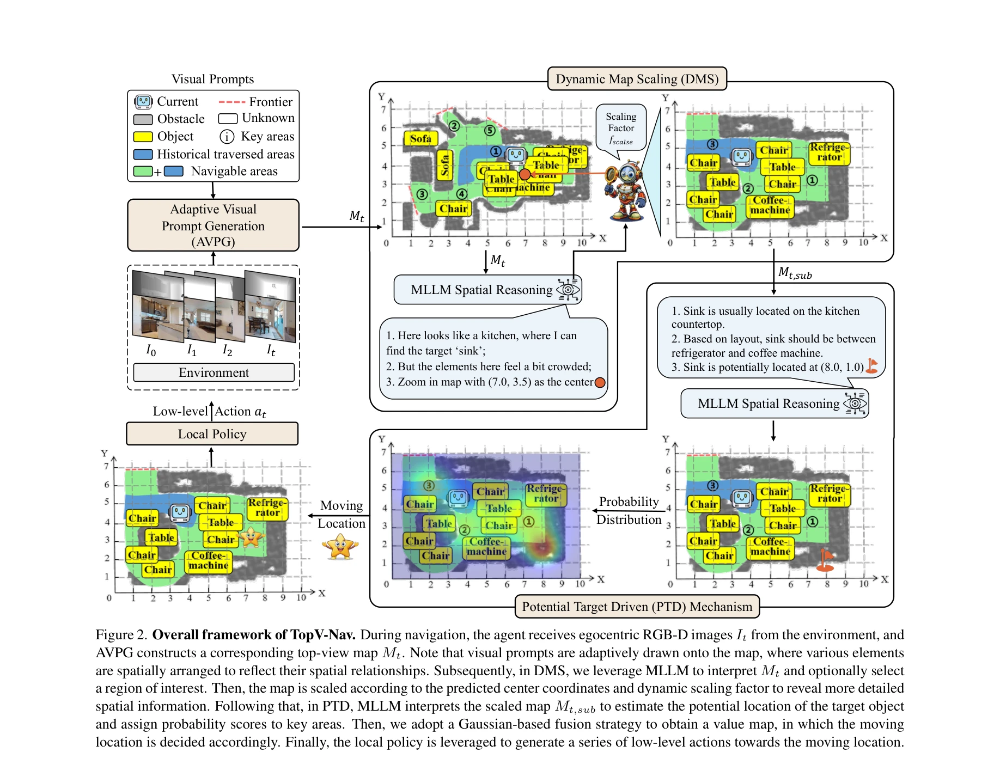
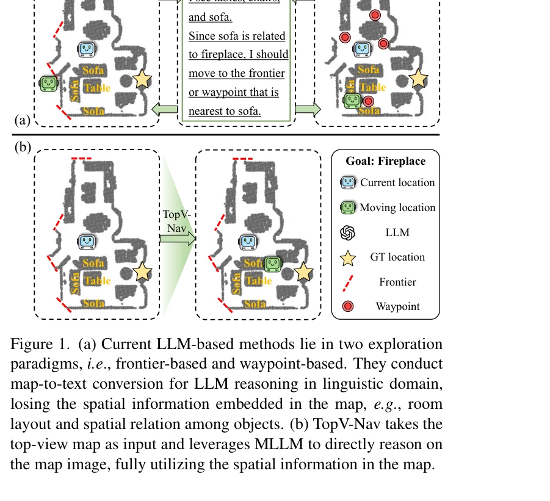

# TopV-Nav: Unlocking the Top-View Spatial Reasoning Potential of MLLM for Zero-shot Object Navigation

> **저자**: Linqing Zhong, Chen Gao, Zihan Ding, Yue Liao, Huimin Ma, Shifeng Zhang, Xu Zhou, Si Liu | **날짜**: 2024-11-25 | **URL**: [https://arxiv.org/abs/2411.16425](https://arxiv.org/abs/2411.16425)

---

## Essence

*Figure 2. Overall framework of TopV-Nav. During navigation, the agent receives egocentric RGB-D images It from the envir*

TopV-Nav는 MLLM을 활용하여 top-view 지도 위에서 직접 공간 추론을 수행함으로써 Zero-Shot Object Navigation 작업을 개선하는 방법론이다. Adaptive Visual Prompt Generation, Dynamic Map Scaling, Potential Target Driven 메커니즘을 통해 공간 정보 손실을 방지하고 의미론적 탐색 공간을 확대한다.

## Motivation

- **Known**: 기존 LLM 기반 네비게이션 방법들은 top-view 지도를 자연어로 변환하여 언어 공간에서 추론하므로 공간 정보 손실이 발생한다. Frontier-based와 waypoint-based 탐색 방식은 제한된 행동 공간과 의미론적 약함을 보인다.
- **Gap**: 현존 LLM 기반 방법들은 map-to-text 변환 과정에서 방 배치, 객체 간 공간 관계 등 중요한 공간 정보를 손실하며, 탐색 공간이 현재 관찰된 영역으로 제한되어 인간처럼 미래 가능성을 예측하지 못한다.
- **Why**: 공간 정보는 네비게이션에서 필수적이며, MLLM은 이미지에서 공간 관계를 파악할 수 있으므로 top-view 지도 이미지에서 직접 추론하면 ZSON 작업의 성능을 크게 개선할 수 있다.
- **Approach**: TopV-Nav는 top-view 지도 이미지를 MLLM의 입력으로 직접 사용하여 map-to-text 과정을 제거하고, AVPG로 의미론적으로 풍부한 시각 프롬프트를 생성하며, DMS와 PTD 메커니즘으로 세밀한 추론과 인간처럼의 탐색을 가능하게 한다.

## Achievement

*Figure 1. (a) Current LLM-based methods lie in two exploration*

- **Map-to-text 제거**: 기존 언어 변환 방식을 버리고 MLLM이 top-view 지도 이미지에서 직접 공간 추론을 수행하도록 변경하여 공간 정보 손실 해결
- **Adaptive Visual Prompt Generation (AVPG)**: 지도 위에 적응적으로 시각 프롬프트를 생성하여 MLLM의 객체 위치와 공간 관계 이해 향상
- **Dynamic Map Scaling (DMS)**: 특정 영역을 동적으로 확대하여 복잡한 환경에서 세밀한 지역 추론 능력 강화
- **Potential Target Driven (PTD)**: 미탐색 영역까지 포함한 목표 객체의 가능성 있는 위치를 예측하여 전역적이고 인간 같은 탐색 유도
- **의미론적 행동 공간**: 기존의 frontier나 미리 정의된 waypoint로 제한되지 않고 전역적이며 의미론적으로 풍부한 행동 선택 가능

## How

*Figure 2. Overall framework of TopV-Nav. During navigation, the agent receives egocentric RGB-D images It from the envir*

- 환경으로부터 egocentric RGB-D 이미지를 수신하여 top-view 지도 Mt 구성
- AVPG가 지도 위에 객체, 장애물, 탐색 가능 영역 등을 시각적 프롬프트로 적응적으로 배치
- DMS에서 MLLM이 지도를 해석하고 관심 영역 선택 후 동적 스케일링 요소로 지도 확대
- PTD에서 스케일링된 지도를 해석하여 목표 객체의 잠재적 위치 추정 및 주요 영역에 확률 점수 할당
- 가우시안 기반 퓨전 전략으로 가치 맵 생성 후 이동 위치 결정
- 로컬 정책(Local Policy)이 결정된 이동 위치에 도달하기 위한 저수준 액션 시퀀스 생성

## Originality

- LLM 기반 네비게이션에서 최초로 map-to-text 변환 제거하고 MLLM이 top-view 이미지를 직접 입력으로 받는 패러다임 제시
- AVPG로 지도 위의 시각 요소들을 의미론적 관계를 반영하도록 적응적으로 배치하는 혁신적 접근
- DMS와 PTD 메커니즘을 조합하여 세밀한 지역 추론과 전역적 미래 예측을 동시에 구현
- Gaussian 기반 퓨전 전략으로 목표 위치 예측과 현재 관찰을 통합하는 방식

## Limitation & Further Study

- top-view 지도 생성이 정확한 depth 정보에 의존하므로 depth 센서 오류 시 성능 저하 가능성
- MLLM의 공간 추론 능력이 복잡하고 혼잡한 환경에서 제한될 수 있음
- DMS의 동적 스케일링 선택이 MLLM의 판단에 의존하므로 부정확한 지역 선택 시 문제 발생 가능
- PTD 메커니즘의 목표 위치 예측 정확도가 환경의 시맨틱 규칙성에 크게 의존
- MP3D와 HM3D 데이터셋의 특성이 제한적이므로 다양한 실제 환경에서의 성능 검증 필요

## Evaluation

- Novelty: 4/5
- Technical Soundness: 3/5
- Significance: 4/5
- Clarity: 4/5
- Overall: 4/5

**총평**: TopV-Nav는 MLLM의 공간 추론 능력을 체계적으로 활용하여 ZSON 작업의 근본적인 한계를 해결하는 창의적이고 실질적인 방법론이다. Map-to-text 제거와 적응적 시각 프롬프트 생성 등 여러 혁신 기법이 효과적으로 통합되었으며, MP3D와 HM3D에서 우수한 성능을 달성했다.

## Related Papers

- 🏛 기반 연구: [[papers/1568_Search-TTA_A_Multimodal_Test-Time_Adaptation_Framework_for_V/review]] — MLLM의 공간 추론 능력을 top-view 네비게이션으로 특화하여 멀티모달 테스트타임 적응의 기반을 제공한다.
- 🔗 후속 연구: [[papers/1612_Visual_Language_Maps_for_Robot_Navigation/review]] — 로봇 네비게이션을 위한 시각 언어 맵의 top-view 공간 표현을 MLLM 기반 추론으로 발전시킨다.
- 🧪 응용 사례: [[papers/1464_Magma_A_Foundation_Model_for_Multimodal_AI_Agents/review]] — 멀티모달 AI 에이전트의 공간 추론 능력을 Zero-Shot 객체 네비게이션에 구체적으로 적용한다.
- 🏛 기반 연구: [[papers/1499_OmniVLA_An_Omni-Modal_Vision-Language-Action_Model_for_Robot/review]] — top-view 공간 추론 능력이 OmniVLA의 다중 플랫폼 로봇 네비게이션에서 상위 시점 경로 계획에 필수적이다
- 🧪 응용 사례: [[papers/1568_Search-TTA_A_Multimodal_Test-Time_Adaptation_Framework_for_V/review]] — MLLM의 공간 추론 능력을 활용한 네비게이션에서 멀티모달 테스트타임 적응 기법이 성능 향상에 기여한다.
- 🧪 응용 사례: [[papers/1342_CorrectNav_Self-Correction_Flywheel_Empowers_Vision-Language/review]] — TopV-Nav의 top-view spatial reasoning이 CorrectNav의 self-correction mechanism을 공간적 추론 관점에서 보완할 수 있다.
