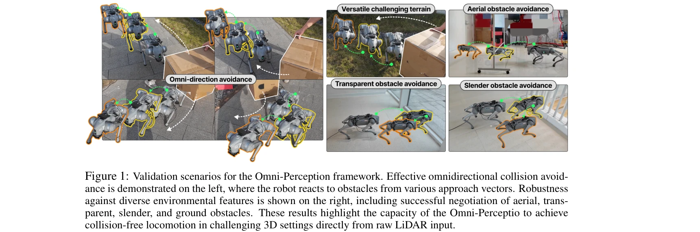
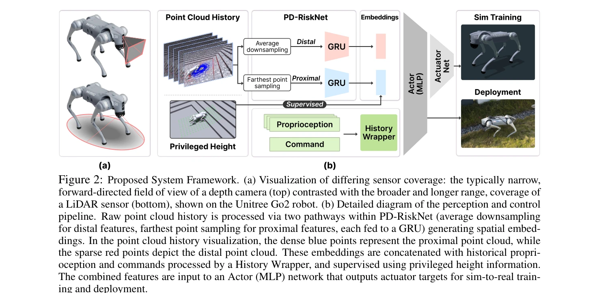

# Omni-Perception: Omnidirectional Collision Avoidance for Legged Locomotion in Dynamic Environments

> **저자**: Zifan Wang, Teli Ma, Yufei Jia, Xun Yang, Jiaming Zhou, Wenlong Ouyang, Qiang Zhang, Junwei Liang | **날짜**: 2025-05-25 | **URL**: [https://arxiv.org/abs/2505.19214](https://arxiv.org/abs/2505.19214)

---

## Essence

*Figure 1: Validation scenarios for the Omni-Perception framework. Effective omnidirectional collision avoid-*

Omni-Perception은 raw LiDAR point cloud를 직접 처리하는 end-to-end RL 기반 locomotion policy로, 다양한 3D 장애물에서의 omnidirectional collision avoidance를 달성한다.

## Motivation

- **Known**: Legged robot의 agile locomotion을 위해서는 robust spatial awareness가 필요하며, RL 기반 locomotion control이 성능을 입증했다. 하지만 depth camera 기반 perception은 lighting variability와 intermediate representation(elevation map) 계산 오버헤드의 문제가 있다.
- **Gap**: LiDAR는 autonomous driving과 manipulation에서 성공했지만, raw point cloud를 직접 처리하는 end-to-end learning 기반 legged locomotion은 아직 충분히 탐색되지 않았다. 실시간 point cloud processing과 정확한 LiDAR physics 시뮬레이션이 주요 장벽이다.
- **Why**: Legged robot이 unstructured 3D 환경에서 안전하고 민첩하게 움직이려면 시각적으로 다양한 장애물(aerial clutter, dynamic agents 등)을 인식하고 반응해야 한다. LiDAR는 lighting-invariant 3D measurements를 제공하므로 이 문제의 자연스러운 해결책이다.
- **Approach**: Raw spatio-temporal LiDAR point cloud를 직접 처리하는 PD-RiskNet 인식 모듈을 개발하고, 고충실도 LiDAR 시뮬레이션 toolkit으로 end-to-end RL 정책을 학습한다. 이를 통해 intermediate representation 없이 3D spatial awareness를 달성한다.

## Achievement

*Figure 1: Validation scenarios for the Omni-Perception framework. Effective omnidirectional collision avoid-*

- **End-to-End LiDAR-Driven Framework**: Raw LiDAR point cloud를 directly process하는 최초의 legged robot locomotion framework 제시
- **PD-RiskNet Architecture**: Spatio-temporal LiDAR 데이터를 효율적으로 처리하여 multi-level environmental risk assessment를 수행하는 novel perception module 개발
- **High-Fidelity LiDAR Simulation Toolkit**: Realistic noise modeling과 fast parallel raycasting을 지원하며 Isaac Gym, Genesis, MuJoCo 등 multiple physics engines와 호환되는 cross-platform toolkit 구현
- **Robust Omnidirectional Avoidance**: Static/dynamic obstacles가 있는 복잡한 3D 환경에서 velocity tracking과 collision avoidance를 동시에 달성한 real-world validation

## How

*Figure 2: Proposed System Framework. (a) Visualization of differing sensor coverage: the typically narrow,*

- Proprioceptive state(joint positions/velocities, base motion, orientation)와 exteroceptive state(raw 3D point cloud history)를 통합하는 observation space 설계
- PD-RiskNet에서 proximal(근처) 및 distal(먼 거리) risk를 hierarchically 평가하여 point cloud를 효율적으로 인코딩
- Realistic LiDAR physics를 모델링한 고충실도 시뮬레이션 환경에서 end-to-end RL(PPO 등) 학습
- Sim-to-real transfer를 위해 domain randomization과 realistic sensor noise(dropout, jitter) 적용
- Multiple benchmark scenarios(aerial obstacles, transparent obstacles, ground traps, dynamic agents)에서 policy 검증

## Originality

- Raw spatio-temporal point cloud를 직접 legged locomotion policy의 input으로 사용한 최초의 end-to-end 접근법
- Hierarchical risk assessment 개념(PD-RiskNet)을 통한 efficient point cloud processing 및 actionable feature extraction
- Multiple physics engines(Isaac Gym, Genesis, MuJoCo) 호환 고성능 LiDAR 시뮬레이션 toolkit 개발로 reproducibility 향상
- Elevation map과 같은 intermediate representation 제거하여 non-planar obstacles(overhangs, aerial clutter) 처리 개선

## Limitation & Further Study

- 현재 결과가 주로 simulation 및 제한된 real-world scenario에 국한되어 있으므로, 더 다양한 실제 환경(악천후, extreme terrain)에서의 검증 필요
- Point cloud 처리의 computational cost가 명확히 분석되지 않았으며, 다양한 LiDAR 센서 사양에 대한 일반화 능력 미검증
- Dynamic obstacle avoidance에서 예측(prediction) 능력이 없어 급격한 움직임을 보이는 agents에 대한 robustness 불명확
- Sim-to-real gap을 완전히 해결했는지 검증하기 위해 더 많은 zero-shot transfer 실험 필요
- 후속 연구: (1) LiDAR 센서 종류 및 해상도 변화에 대한 robustness 분석, (2) Point cloud prediction 모듈 통합으로 dynamic obstacle 대응 강화, (3) 다양한 극한 환경에서의 실제 배포 및 검증

## Evaluation

- Novelty: 4/5
- Technical Soundness: 3/5
- Significance: 4/5
- Clarity: 4/5
- Overall: 4/5

**총평**: 본 논문은 legged robot locomotion에서 raw LiDAR point cloud를 직접 활용하는 첫 end-to-end framework를 제시하며, PD-RiskNet과 고충실도 시뮬레이션 toolkit이라는 실질적 기여를 통해 omnidirectional collision avoidance 문제를 효과적으로 해결한다. 다만 실세계 적용 범위 확대와 더 광범위한 transferability 검증이 필요하다.

## Related Papers

- 🏛 기반 연구: [[papers/1273_ARMOR_Egocentric_Perception_for_Humanoid_Robot_Collision_Avo/review]] — 다방향 충돌 회피에서 자기중심 ToF 라이다 인지 시스템이 기반이 된다
- 🔗 후속 연구: [[papers/1445_Large_Model_Empowered_Embodied_AI_A_Survey_on_Decision-Makin/review]] — 범용 로봇을 위한 foundation model의 포괄적 서베이와 embodied AI의 의사결정 관점이 상호 보완적이다.
- 🔗 후속 연구: [[papers/1485_Multimodal_Fusion_and_Vision-Language_Models_A_Survey_for_Ro/review]] — 범용 로봇을 위한 기초 모델 서베이를 멀티모달 융합과 VLM의 구체적 적용으로 심화 발전시킨 형태입니다.
- 🧪 응용 사례: [[papers/1490_NavigateDiff_Visual_Predictors_are_Zero-Shot_Navigation_Assi/review]] — 범용 로봇을 위한 기초 모델 개념이 제로샷 네비게이션 어시스턴트의 실제 구현에 적용됩니다.
- 🧪 응용 사례: [[papers/1287_BeyondMimic_From_Motion_Tracking_to_Versatile_Humanoid_Contr/review]] — 범용 로봇 기반 모델에서 motion tracking을 통한 다양한 동작 제어가 적용된다
