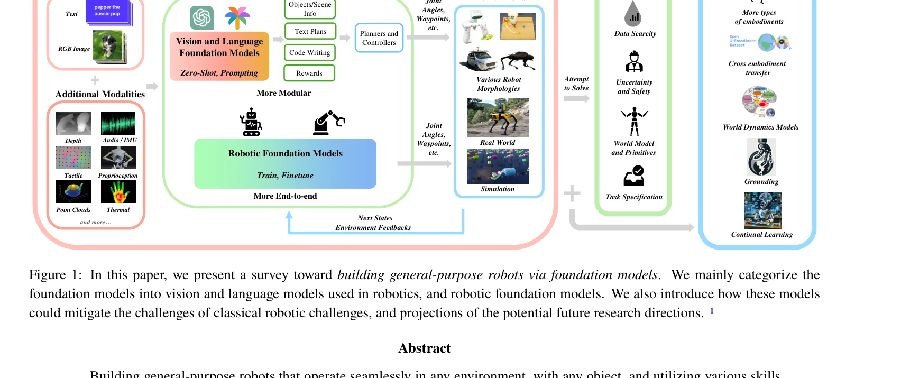
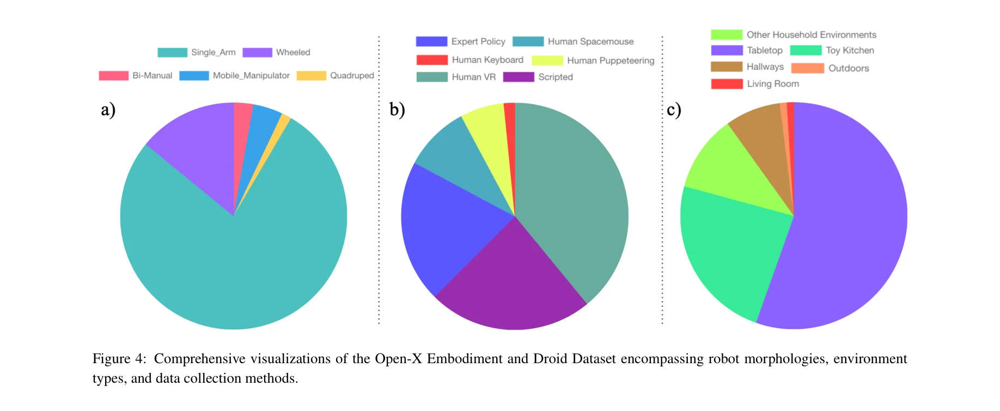

# Toward General-Purpose Robots via Foundation Models: A Survey and Meta-Analysis

> **저자**: Yafei Hu, Quanting Xie, Vidhi Jain, Jonathan Francis, Jay Patrikar, Nikhil Keetha, Seungchan Kim, Yaqi Xie, Tianyi Zhang, Hao-Shu Fang, Shibo Zhao, Shayegan Omidshafiei, Dong-Ki Kim, Ali-akbar Agha-mohammadi, Katia Sycara, Matthew Johnson-Roberson, Dhruv Batra, Xiaolong Wang, Sebastian Scherer, Chen Wang, Zsolt Kira, Fei Xia, Yonatan Bisk | **날짜**: 2023-12-14 | **URL**: [https://arxiv.org/abs/2312.08782](https://arxiv.org/abs/2312.08782)

---

## Essence

*Figure 1: In this paper, we present a survey toward building general-purpose robots via foundation models. We mainly cat*

이 논문은 NLP와 CV 분야의 foundation models를 로봇 공학에 적용하여 범용 로봇 시스템 개발을 가능하게 하는 방법을 탐구하는 종합 설문조사이며, 기존 vision/language foundation models의 활용과 robotics-specific foundation models의 설계를 다룬다.

## Motivation

- **Known**: 기존 로봇 시스템은 특정 작업, 데이터셋, 환경에 맞춰 설계되며 광범위한 레이블 데이터와 작업 특화 모델이 필요하다. NLP와 CV 분야의 foundation models는 우수한 zero-shot 성능과 콘텐츠 생성 능력을 보여주고 있다.
- **Gap**: 기존 로봇 시스템은 distribution shift에 취약하고 일반화 능력이 제한적이며, foundation models이 로봇 공학에 어떻게 적용될 수 있는지, 그리고 로봇 공학 특화 foundation models이 어떤 형태여야 하는지에 대한 체계적 정리가 부족하다.
- **Why**: Foundation models는 데이터 부족, 일반화 문제, 안전성 불확실성 등 로봇 공학의 핵심 문제들을 해결할 수 있는 잠재력을 가지고 있으며, 이를 체계적으로 탐구하면 범용 로봇 개발의 실현 가능성을 높일 수 있다.
- **Approach**: 본 논문은 generalized formulation을 통해 foundation models의 로봇 적용 방식을 정의하고, 로봇 공학의 주요 과제들(generalization, data scarcity, uncertainty, task specification 등)을 분석한 후, 기존 vision/language models의 활용과 robotics-specific foundation models의 분류를 제시한다.

## Achievement

*Figure 1: In this paper, we present a survey toward building general-purpose robots via foundation models. We mainly cat*

- **체계적 택소노미 제시**: Vision Foundation Models (VFM), Vision Language Models (VLM), Large Language Models (LLM), Vision Language Action models (VLA) 등 다양한 foundation model 유형과 그 로봇 적용 방식을 포괄적으로 분류
- **도전 과제 분석**: Generalization, data scarcity, world model과 primitives 설계, task specification, uncertainty and safety 등 5개의 핵심 로봇 공학 문제를 식별하고 foundation models의 해결 가능성 논의
- **현황 조사**: Robot perception, task planning, action generation, action grounding, data generation, planning/control 강화 등 foundation models의 구체적 활용 영역을 상세히 검토
- **미래 방향 제시**: Cross-embodiment transfer, continual learning, world dynamics models, grounding 등 유망한 연구 방향과 과제를 제안
- **리소스 제공**: 설문 논문 및 관련 프로젝트를 포함한 living GitHub repository 제공으로 커뮤니티 지원

## How

*Figure 4: Comprehensive visualizations of the Open-X Embodiment and Droid Dataset encompassing robot morphologies, envir*

- VFM과 VLM을 로봇 perception에 적용하여 object detection, scene understanding, open-world visual recognition 능력 확보
- LLM과 VLM을 task planning에 활용하여 자연어 명령을 구조화된 계획으로 변환
- VLA models를 통한 end-to-end action generation으로 vision과 language input으로부터 직접 로봇 제어 신호 생성
- Action grounding 기법으로 추상적 동작을 구체적 로봇 제어(joint angles, waypoints 등)로 변환
- LLM과 VGM (Vision Generative Models)을 활용한 합성 데이터 생성으로 데이터 부족 문제 완화
- Prompting 기법을 통해 foundation models의 계획 및 제어 능력 강화
- 로봇 특화 foundation models 개발을 통한 다양한 embodiment과 작업에 대한 transfer learning 실현

## Originality

- 로봇 공학을 위한 foundation models의 개념을 처음으로 체계적으로 정의하고 분류한 종합 설문조사
- 기존 NLP/CV foundation models와 robotics-specific foundation models을 구분하여 각각의 역할과 한계를 명확히 함
- 로봇 공학의 전통적 도전 과제들(generalization, data scarcity, uncertainty, safety)을 foundation models 관점에서 재조명
- Vision Language Action (VLA) models와 같은 새로운 로봇 공학 모델 카테고리를 식별 및 분석
- living repository 형태의 동적 설문조사 제공으로 빠르게 변화하는 분야의 최신 동향 반영

## Limitation & Further Study

- **평가의 불균형**: 많은 robotics foundation models이 아직 초기 단계이며 일관된 벤치마크 부족으로 정량적 비교 어려움
- **실제 배포의 한계**: 대부분의 연구가 시뮬레이션 또는 제한된 실세계 환경에서 수행되어 일반화 능력의 실제 검증 부족
- **데이터 불균형**: 로봇 공학 데이터의 다양성이 NLP/CV 대비 현저히 낮으며, cross-embodiment transfer의 실제 효과가 제한적
- **안전성과 불확실성**: Foundation models의 hallucination 및 예측 불확실성에 대한 해결책이 여전히 미흡
- **Sim-to-real gap**: 시뮬레이션 환경에서의 성과가 실제 로봇에 완벽하게 전이되지 않는 문제 미해결
- **후속 연구 방향**: 더 대규모의 로봇 데이터셋 수집, 표준화된 평가 벤치마크 개발, 실시간 안전 검증 메커니즘 구축, 여러 embodiment 간의 지식 전이 강화 필요

## Evaluation

- Novelty: 4/5
- Technical Soundness: 3/5
- Significance: 4/5
- Clarity: 4/5
- Overall: 4/5

**총평**: 이 논문은 로봇 공학에 foundation models를 적용하는 현황을 최초로 포괄적으로 정리한 중요한 설문조사로, 체계적인 택소노미와 명확한 도전 과제 분석을 제공하며, 향후 범용 로봇 개발을 위한 연구 로드맵을 제시한다.

## Related Papers

- 🔄 다른 접근: [[papers/1585_Now_You_See_That_Learning_End-to-End_Humanoid_Locomotion_fro/review]] — 휴머노이드 충돌 회피의 다른 접근법으로 LiDAR 기반과 원본 픽셀 기반 인식을 비교할 수 있다.
- 🏛 기반 연구: [[papers/1273_ARMOR_Egocentric_Perception_for_Humanoid_Robot_Collision_Avo/review]] — 휴머노이드 충돌 회피를 위한 이고센트릭 인식의 기반이 되는 충돌 감지 시스템을 제공한다.
- 🔗 후속 연구: [[papers/1449_Hiking_in_the_Wild_A_Scalable_Perceptive_Parkour_Framework_f/review]] — 지각적 파쿠르 프레임워크를 omnidirectional 충돌 회피로 특화하여 발전시킨다.
- 🔗 후속 연구: [[papers/1268_An_Empirical_Evaluation_of_Four_Off-the-Shelf_Proprietary_Vi/review]] — Omni-Perception의 omnidirectional 충돌 회피 시스템이 VIO 평가 결과를 바탕으로 더 robust한 perception을 구현한다.
- 🔗 후속 연구: [[papers/1569_Segment_Anything/review]] — 범용 로봇 시스템의 기반 모델로서 SAM이 다양한 로봇 응용에서 시각 인식 기반을 제공한다.
- 🔗 후속 연구: [[papers/1585_Now_You_See_That_Learning_End-to-End_Humanoid_Locomotion_fro/review]] — 옴니 방향 충돌 회피에서 end-to-end 시각 기반 보행이 LiDAR 기반 방법을 보완한다.
