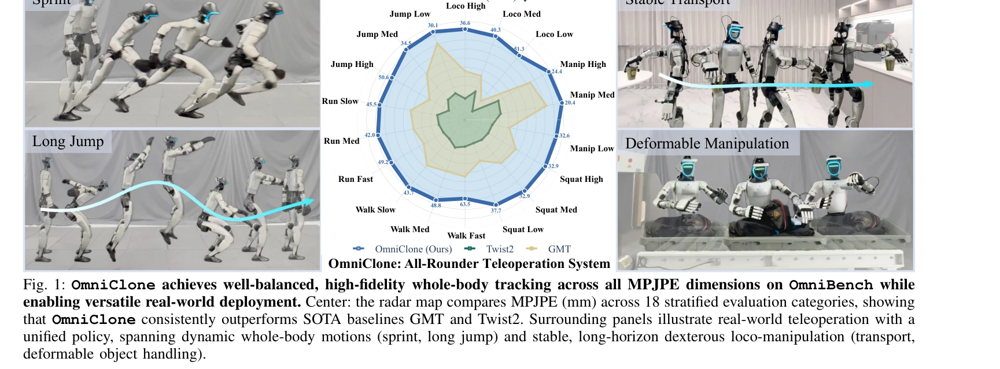

# OmniClone: Engineering a Robust, All-Rounder Whole-Body Humanoid Teleoperation System

> **저자**: Yixuan Li, Le Ma, Yutang Lin, Yushi Du, Mengya Liu, Kaizhe Hu, Jieming Cui, Yixin Zhu, Wei Liang, Baoxiong Jia, Siyuan Huang | **날짜**: 2026-03-15 | **URL**: [https://arxiv.org/abs/2603.14327](https://arxiv.org/abs/2603.14327)

---

## Essence

*Fig. 1: OmniClone achieves well-balanced, high-fidelity whole-body tracking across all MPJPE dimensions on OmniBench whi*

OmniClone은 단일 소비자 GPU에서 고충실도 전신 휴머노이드 텔레오퍼레이션을 실현하는 시스템으로, 동작 범주별 성능을 진단하는 OmniBench 벤치마크를 통해 기존 시스템의 한계를 규명하고 통합 정책으로 실시간 텔레오퍼레이션, 모션 재생, VLA 모델을 모두 지원한다.

## Motivation

- **Known**: 최근 휴머노이드 텔레오퍼레이션 연구들이 고도화되었으나, 기존 평가는 집계된 메트릭만 보고하여 동작별 성능 격차를 가리고 있으며, 시스템 구성은 특정 방법에 밀접하게 결합되어 실제 배포에 어려움을 겪고 있다.
- **Gap**: 현존하는 평가 프레임워크는 동작 범주별 세밀한 성능 분석이 부족하고, 실제 배포 환경에서 다양한 연산자와 MoCap 설정에 대한 강건성이 검증되지 않아 확장 가능한 텔레오퍼레이션 시스템 구축이 제한된다.
- **Why**: 휴머노이드 로봇의 전신 텔레오퍼레이션은 실시간 원격 제어와 자율 학습을 위한 시연 수집 엔진으로서 중요하며, 실제 배포 가능하고 재현 가능한 저비용 시스템이 필요하다.
- **Approach**: OmniBench 진단 벤치마크를 개발하여 동작 범주와 난이도별로 정책 성능을 계층적으로 평가하고, 이를 통해 얻은 인사이트를 바탕으로 데이터 균형 조정, transformer 기반 추적 정책, subject-agnostic retargeting, robust communication 메커니즘을 통합한 OmniClone 시스템을 구축한다.

## Achievement

*Fig. 1: OmniClone achieves well-balanced, high-fidelity whole-body tracking across all MPJPE dimensions on OmniBench whi*

- **OmniBench 벤치마크**: 18개 계층화된 평가 범주에서 동작별·난이도별 성능을 진단하는 최초의 포괄적 벤치마크 제시
- **성능 향상**: MPJPE를 66% 이상 감소시키며 기존 SOTA 방법 GMT, Twist2를 모든 차원에서 능가
- **시스템 효율성**: 30시간의 모션 데이터와 단일 소비자 GPU만으로 고충실도 제어 달성 (비교 방법 대비 수십 배 적은 자원)
- **Control-source-agnostic 통합 정책**: 실시간 텔레오퍼레이션, 생성된 모션 재생, VLA 모델을 단일 정책으로 지원하며 1.47~1.94m 범위의 다양한 신체 비율 연산자에 일반화
- **VLA 학습 검증**: OmniClone 수집 데이터로 학습한 VLA 정책이 'Pick-and-Place' 85.71%, 'Squat to Pick-and-Place' 80.00% 성공률 달성

## How

*Fig. 3: Overview of the OmniClone framework, comprising model training (top) and system infrastructure (bottom). Top: a *

- OmniBench 설계: locomotion (walk, run, jump, squat)과 manipulation (dexterous handling, deformable object)을 포함한 18개 범주의 unseen 모션으로 High/Med/Low 난이도별 평가
- 데이터 레시피 최적화: OmniBench 진단 결과를 바탕으로 동작 범주 간 데이터 균형 조정으로 특정 동작에 대한 과도한 특화 제거
- Transformer 기반 tracking policy: 전신 coordination을 학습하기 위한 고용량 모델 아키텍처 도입
- Subject-agnostic retargeting: 연산자의 신체 치수 변동성에 대한 강건성 확보로 MoCap 시스템별·연산자별 재보정 필요 제거
- Robust communication: 네트워크 지연과 변동성으로 인한 데이터 손상 완화 메커니즘 탑재
- Real-world deployment 검증: 안정적 운송, 변형 물체 조작, sprint, long jump 등 다양한 실제 작업에서 시스템 검증

## Originality

- **OmniBench의 진단 평가 철학**: 기존의 집계 메트릭 중심 평가에서 벗어나 동작 범주·난이도별 세밀한 성능 분석으로 실제 실패 모드 노출
- **Control-source-agnostic 설계**: 단일 정책으로 다양한 제어 입력(실시간 MoCap, 생성 모션, VLA 모델 출력)을 처리하는 통합적 접근
- **System-level 관점의 문제 해결**: 모델 개선뿐 아니라 retargeting, communication 등 배포 인프라를 함께 고려한 실용적 시스템 엔지니어링
- **데이터 효율성 달성**: 최소한의 데이터(30시간)와 자원(단일 소비자 GPU)으로 고성능 달성하는 데이터 레시피 설계

## Limitation & Further Study

- OmniBench는 제안된 데이터셋에 한정될 수 있으며, 더 다양한 로봇 형태나 극단적인 환경 조건에 대한 일반화 능력 검증 필요
- Real-world 배포는 특정 휴머노이드 플랫폼(Boston Dynamics의 Atlas, Tesla의 Optimus 등)에서의 검증이 부족하므로 다양한 로봇에서의 재현성 확인 필요
- VLA 모델 통합의 성능 한계: VLA 정책의 성공률이 85.71%와 80.00%로 비교적 낮으므로 더 복잡한 작업에 대한 성능 향상 필요
- 네트워크 지연(latency)의 구체적인 임계값이 명시되지 않아, 극단적인 통신 환경에서의 시스템 안정성 검증 필요
- 후속 연구: 다양한 로봇 플랫폼으로의 이전(transfer), 더 장시간의 작업 수행 능력, 다중 연산자 협업 시나리오 지원

## Evaluation

- Novelty: 4/5
- Technical Soundness: 3/5
- Significance: 4/5
- Clarity: 4/5
- Overall: 4/5

**총평**: OmniClone은 진단적 벤치마킹과 실무적 시스템 엔지니어링을 결합하여 휴머노이드 텔레오퍼레이션의 실제 배포 가능성을 크게 향상시킨 중요한 기여이며, 특히 OmniBench는 향후 평가 표준으로서 영향력이 높을 것으로 예상된다.

## Related Papers

- 🔗 후속 연구: [[papers/1526_Learning_Human-to-Humanoid_Real-Time_Whole-Body_Teleoperatio/review]] — 소비자 GPU에서 고충실도 텔레오퍼레이션을 실현하는 OmniClone이 H2O의 RGB 카메라 기반 전신 제어를 확장한 통합 시스템이다.
- 🏛 기반 연구: [[papers/1627_What_Matters_in_Building_Vision-Language-Action_Models_for_G/review]] — OmniClone의 통합 정책 프레임워크가 범용 비전-언어-액션 모델 구축에서 중요한 요소들을 다루는 연구의 기반이 된다.
- 🧪 응용 사례: [[papers/1306_CLONE_Closed-Loop_Whole-Body_Humanoid_Teleoperation_for_Long/review]] — OmniClone의 견고한 전신 휴머노이드 제어 기술이 CLONE의 장기 텔레오퍼레이션 시스템에서 실제 적용될 수 있다.
- 🔗 후속 연구: [[papers/1294_A_Generalist_Agent/review]] — 모방 학습의 다양한 행동을 위한 벤치마크로 Gato의 다중 작업 성능 평가에 필요한 기준을 제공한다
- 🔄 다른 접근: [[papers/1593_OmniH2O_Universal_and_Dexterous_Human-to-Humanoid_Whole-Body/review]] — 다양한 입력 방식을 통합한 OmniH2O와 견고한 통합 정책의 OmniClone이 모두 범용 휴머노이드 텔레오퍼레이션을 다룬다.
- 🔗 후속 연구: [[papers/1500_OmniVLA_Physically-Grounded_Multimodal_VLA_with_Unified_Mult/review]] — 전신 휴머노이드 제어 시스템을 OmniVLA의 물리적 정보 기반 조작 정책에 통합하여 실제 배포 성능을 향상시킬 수 있다
