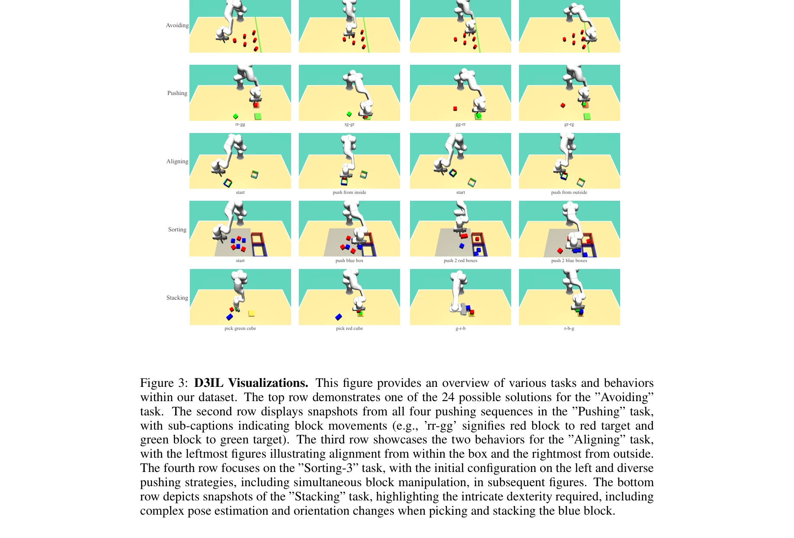
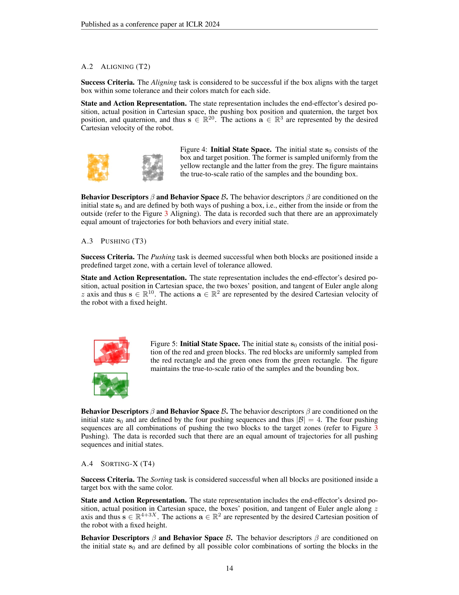

# Towards Diverse Behaviors: A Benchmark for Imitation Learning with Human Demonstrations

> **저자**: Xiaogang Jia, Denis Blessing, Xinkai Jiang, Moritz Reuss, Atalay Donat, Rudolf Lioutikov, Gerhard Neumann | **날짜**: 2024-02-22 | **URL**: [https://arxiv.org/abs/2402.14606](https://arxiv.org/abs/2402.14606)

---

## Essence

*Figure 3: D3IL Visualizations. This figure provides an overview of various tasks and behaviors*

이 논문은 인간의 행동 다양성을 학습할 수 있는 imitation learning 알고리즘을 평가하기 위해 D3IL이라는 벤치마크 데이터셋과 환경을 제안하고, 다중 모드 행동의 다양성을 정량화하는 메트릭을 도입한다.

## Motivation

- **Known**: Imitation learning은 인간 전문가 데이터로부터 로봇에게 복잡한 작업을 학습시키는 강력한 방법이지만, 최근 다양한 행동을 캡처하려는 노력들이 합성 데이터셋이나 제한된 다양성의 데이터에서만 테스트되어 왔다.
- **Gap**: 기존 벤치마크들(D4RL, Robomimic, Block-Push 등)은 다양한 인간 행동을 포함하면서도 closed-loop feedback을 요구하는 복합적인 환경이 부족하며, 행동 다양성을 정량적으로 측정하는 메트릭이 없다.
- **Why**: 로봇이 인간의 다양한 문제해결 방식을 학습할 수 있도록 평가하는 것은 실제 응용에서의 적응성과 강건성을 높이기 위해 중요하며, 미래의 imitation learning 알고리즘 설계에 필수적인 기준을 제공한다.
- **Approach**: 다중 서브태스크, 다중 객체 조작, closed-loop feedback이 필요한 시뮬레이션 환경들을 설계하고, behavior entropy 메트릭으로 행동 다양성을 정량화한 후 최신 imitation learning 방법들을 체계적으로 평가한다.

## Achievement

*Figure 3: D3IL Visualizations. This figure provides an overview of various tasks and behaviors*

- **D3IL 벤치마크 제안**: 인간의 다양한 행동 시연을 포함하며 multiple sub-tasks, multiple objects, closed-loop feedback 요구사항을 모두 만족하는 시뮬레이션 환경 및 데이터셋 구축
- **행동 다양성 정량화 메트릭**: behavior entropy를 통해 학습된 정책이 다중 모드 행동 분포를 얼마나 잘 캡처했는지 객관적으로 측정할 수 있는 방법 제시
- **포괄적 벤치마킹**: MLPs, transformers, clustering, VAEs, IBC, diffusion 등 다양한 아키텍처와 방법론을 D3IL에서 평가하여 각 방법의 강점과 약점 분석
- **실증적 인사이트**: state vs. image observations, 작은 데이터셋에서의 성능, 하이퍼파라미터 효과 등 실무적으로 중요한 결과 제시

## How

*Figure 4: Initial State Space. The initial state s0 consists of the*

- Behavior descriptor β를 task-specific하게 정의하여 discrete behavior level에서의 multimodality 평가
- Behavior entropy H(π(β)) = -Σ π(β) log|B| π(β) 메트릭으로 정책의 행동 다양성 정량화
- 각 behavior descriptor마다 대략 동등한 수의 인간 시연 데이터 수집
- 시뮬레이션 환경에서 학습된 정책을 실행하여 달성한 행동 분포 π(β) 계산
- 여러 backbone 구조(MLP, Transformer variants)와 multimodality 캡처 방식(clustering, VAE, IBC, diffusion) 조합 평가
- Proprioceptive state와 image observations 양쪽 입력에 대한 성능 비교 분석

## Originality

- 기존 벤치마크의 한계를 명확히 식별하고 이를 모두 해결하는 통합적인 벤치마크 환경 설계 (Table 1의 비교 분석)
- State-level multimodality를 직접 측정할 수 없는 현실적 제약을 극복하기 위해 behavior-level descriptor 기반의 새로운 정량화 접근법 제시
- 다양한 SOTA 방법들에 대한 광범위한 ablation study로 architecture, 알고리즘, 입력 표현의 영향을 체계적으로 분석

## Limitation & Further Study

- Behavior descriptor β의 정의가 task-specific하므로 새로운 환경마다 수동으로 정의해야 하는 확장성 제약
- 시뮬레이션 환경만 제공되므로 실제 로봇에서의 성능 검증 부재 (sim-to-real gap 미다룸)
- 다양성 메트릭이 behavior entropy에만 초점을 맞추고 있어 다른 형태의 다양성(예: 궤적 다양성)은 미포함
- 후속 연구로 self-supervised learning을 통한 자동 behavior descriptor 학습, 실제 로봇 플랫폼으로의 검증, 더 정교한 다양성 메트릭 개발 필요

## Evaluation

- Novelty: 4/5
- Technical Soundness: 3/5
- Significance: 4/5
- Clarity: 4/5
- Overall: 4/5

**총평**: 이 논문은 imitation learning의 중요한 과제인 다양한 인간 행동 학습을 평가하기 위한 포괄적이고 잘 설계된 벤치마크를 제시하며, 실용적인 정량화 메트릭과 광범위한 실증 평가를 통해 향후 알고리즘 개발에 명확한 기준을 제공한다.

## Related Papers

- 🔄 다른 접근: [[papers/1558_RVT-2_Learning_Precise_Manipulation_from_Few_Demonstrations/review]] — imitation learning에서 적은 데이터로부터의 정밀 조작과 인간 행동 다양성 학습이라는 서로 다른 과제를 다룬다.
- 🏛 기반 연구: [[papers/1348_Data_Scaling_Laws_in_Imitation_Learning_for_Robotic_Manipula/review]] — data scaling laws 연구의 원리를 인간 행동의 다양성을 정량화하고 평가하는 벤치마크로 적용한다.
- 🧪 응용 사례: [[papers/1476_Humanoid_World_Models_Open_World_Foundation_Models_for_Human/review]] — 대규모 human video 데이터의 다양성을 imitation learning 알고리즘이 학습할 수 있는 벤치마크 환경으로 구현한다.
- 🧪 응용 사례: [[papers/1558_RVT-2_Learning_Precise_Manipulation_from_Few_Demonstrations/review]] — 적은 시연으로부터의 학습이라는 공통 과제를 3D 조작과 행동 다양성이라는 서로 다른 관점에서 해결한다.
- 🔄 다른 접근: [[papers/1609_Vision-Language-Action_Models_for_Robotics_A_Review_Towards/review]] — OmniClone의 whole-body control이 VLA와 다른 접근으로 범용적 로봇 제어를 달성하는 대안적 솔루션
