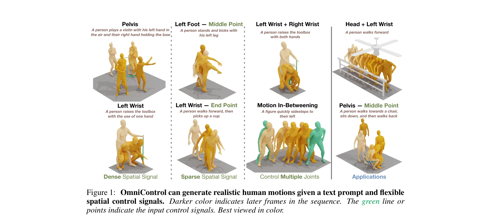
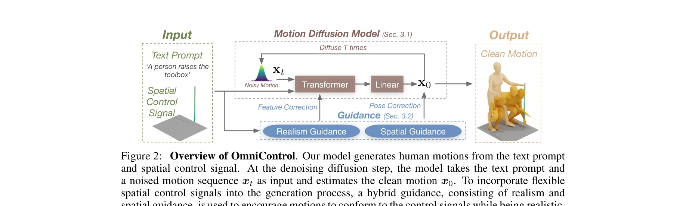

# OmniControl: Control Any Joint at Any Time for Human Motion Generation

> **저자**: Yiming Xie, Varun Jampani, Lei Zhong, Deqing Sun, Huaizu Jiang | **날짜**: 2023-10-12 | **URL**: [https://arxiv.org/abs/2310.08580](https://arxiv.org/abs/2310.08580)

---

## Essence

*Figure 1: OmniControl can generate realistic human motions given a text prompt and flexible*

OmniControl은 diffusion 기반 text-conditioned 인간 모션 생성 모델에 유연한 공간 제어 신호를 통합하는 방법으로, 임의의 관절을 임의의 시간에 제어할 수 있는 첫 번째 접근법이다.

## Motivation

- **Known**: 최근 diffusion 기반 방법들은 다양하고 현실적인 인간 모션을 생성할 수 있지만, 기존 inpainting 기반 방법들은 골반 궤적만 제어할 수 있고 상대 포즈 표현의 한계로 인해 다른 관절의 공간 제어가 어렵다.
- **Gap**: 기존 방법들은 pelvis만 제어 가능하며, 상대 포즈 표현으로 인해 다른 관절의 전역 공간 제어 신호를 통합하기 어렵고, 희소 제어 신호에 대해서도 효과적으로 처리하지 못한다.
- **Why**: 인간 모션 생성에서 물체 상호작용(컵 집기), 환경 회피(저천장) 등 많은 응용에서 특정 관절의 정확한 공간 제어가 필수적이며, 이를 통해 생성 모션과 주변 객체/장면의 연결을 가능하게 한다.
- **Approach**: OmniControl은 spatial guidance와 realism guidance를 결합한 제어 모듈을 제안하며, spatial guidance는 생성된 모션을 전역 좌표로 변환하여 제어 신호와 비교하고 gradient를 통해 반복적으로 정제하고, realism guidance는 attention layer의 특성 잔차를 이용하여 전체 신체 모션을 밀집하게 정제한다.

## Achievement

*Figure 1: OmniControl can generate realistic human motions given a text prompt and flexible*

- **첫 번째 범용 제어 방법**: 임의의 관절을 임의의 시간에 제어할 수 있는 첫 번째 diffusion 기반 인간 모션 생성 방법
- **단일 모델로 다중 관절 제어**: 각 관절마다 별도 모델 없이 하나의 모델으로 여러 관절을 동시에 제어 가능
- **우수한 성능**: HumanML3D와 KIT-ML 데이터셋에서 pelvis 제어 측면에서 기존 방법 대비 큰 폭의 개선과 다른 관절 제어에서도 유망한 결과 달성
- **이중 guidance의 보완성**: spatial guidance로 제어 정확성을, realism guidance로 모션 현실성을 확보하며 두 guidance가 상호 보완적으로 작동

## How

*Figure 2: Overview of OmniControl. Our model generates human motions from the text prompt*

- MDM을 기반으로 spatial guidance와 realism guidance를 추가
- Spatial guidance: 생성된 모션을 전역 좌표로 변환하여 제어 신호와의 오차 계산 및 gradient 기반 반복 정제
- Relative pose 표현을 모델 입출력으로 유지하면서 spatial guidance에서만 전역 좌표로 변환하여 ambiguity 제거
- Realism guidance: 각 attention layer의 특성 잔차를 이용하여 제어 신호 위반 없이 전체 신체 모션의 현실성 개선
- 두 guidance를 결합하여 제어 정확성과 모션 현실성 간의 균형 달성

## Originality

- 전역 좌표 변환을 통한 상대 포즈 표현의 ambiguity 해결이 혁신적
- Spatial guidance와 realism guidance의 조합으로 기존 inpainting 기반 방법의 한계 극복
- 단일 모델로 임의의 관절 조합을 제어 가능한 유연한 아키텍처 설계
- Image generation의 controllable diffusion 기법을 human motion generation에 적응시킨 창의적 응용

## Limitation & Further Study

- 논문에서 명시된 한계가 충분히 논의되지 않음. 제어 신호의 정확도가 모션 품질에 미치는 영향 분석 필요
- 복잡한 multi-joint 제어 시 guidance 간의 충돌(conflict) 가능성과 이에 대한 해결 방안 미흡
- 계산 복잡도와 실시간 적용 가능성에 대한 분석 부재
- 후속 연구로 더 긴 모션 시퀀스, 동적 제어 신호 업데이트, 3D 장면과의 완전한 통합 필요

## Evaluation

- Novelty: 4/5
- Technical Soundness: 3/5
- Significance: 4/5
- Clarity: 4/5
- Overall: 4/5

**총평**: OmniControl은 인간 모션 생성에서 임의의 관절을 임의의 시간에 제어할 수 있는 첫 번째 방법으로, spatial과 realism guidance의 상호 보완적 결합을 통해 제어 정확성과 모션 현실성의 균형을 효과적으로 달성했다. ICLR 2024 게재 논문으로 높은 학술적 가치와 실무적 응용 가능성을 입증한다.

## Related Papers

- 🔄 다른 접근: [[papers/1431_Guided_Motion_Diffusion_for_Controllable_Human_Motion_Synthe/review]] — 둘 다 diffusion 기반 text-conditioned 모션 생성을 다루지만 1592는 임의 관절 제어에, 1431은 공간 제약 처리에 특화됨
- 🏛 기반 연구: [[papers/1507_Kimodo_Scaling_Controllable_Human_Motion_Generation/review]] — Kimodo의 대규모 kinematic diffusion이 임의 관절 제어의 확장된 기반을 제공함
- 🧪 응용 사례: [[papers/1611_PhysDiff_Physics-Guided_Human_Motion_Diffusion_Model/review]] — PhysDiff의 물리 기반 diffusion이 OmniControl의 유연한 관절 제어와 결합하여 실제 적용 사례를 보여줌
- 🔗 후속 연구: [[papers/1593_TrackVLA_Unleashing_Reasoning_and_Memory_Capabilities_in_VLA/review]] — TrackVLA++의 target identification이 TraceVLA의 visual trace prompting과 함께 사용되어 더 정확한 공간-시간 추론을 달성할 수 있음
- 🔄 다른 접근: [[papers/1431_Guided_Motion_Diffusion_for_Controllable_Human_Motion_Synthe/review]] — 둘 다 diffusion 기반 텍스트 조건부 인간 모션 생성을 다루지만 1431은 공간 제약 처리에, 1592는 관절별 시간별 제어에 특화됨
- 🔄 다른 접근: [[papers/1507_Kimodo_Scaling_Controllable_Human_Motion_Generation/review]] — 둘 다 kinematic constraint 기반 모션 생성을 다루지만 1507은 대규모 학습에, 1592는 유연한 관절 제어에 특화됨
