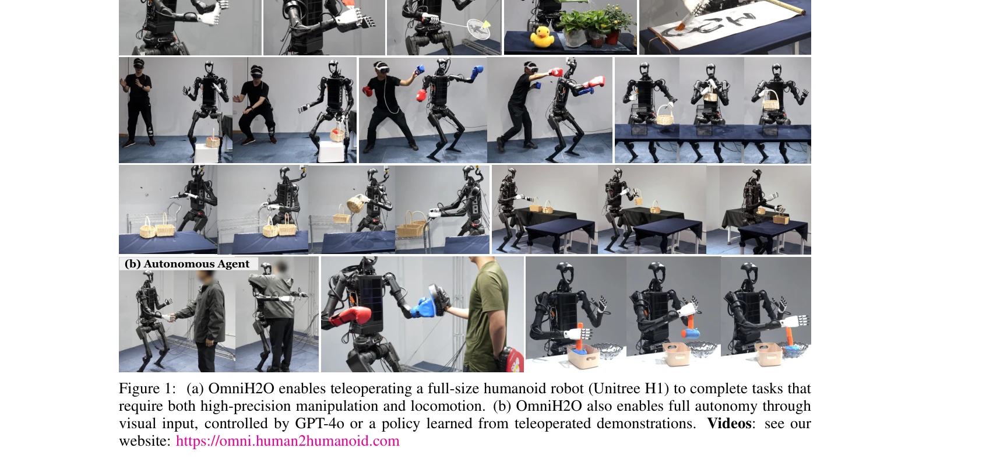
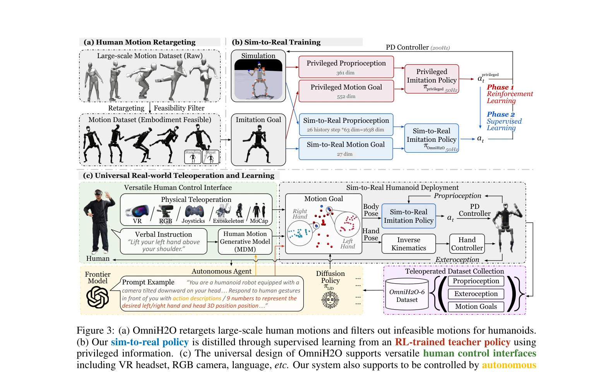

# OmniH2O: Universal and Dexterous Human-to-Humanoid Whole-Body Teleoperation and Learning

> **저자**: Tairan He, Zhengyi Luo, Xialin He, Wenli Xiao, Chong Zhang, Weinan Zhang, Kris Kitani, Changliu Liu, Guanya Shi | **날짜**: 2024-06-13 | **URL**: [https://arxiv.org/abs/2406.08858](https://arxiv.org/abs/2406.08858)

---

## Essence

*Figure 1: (a) OmniH2O enables teleoperating a full-size humanoid robot (Unitree H1) to complete tasks that*

OmniH2O는 kinematic pose를 통일된 인터페이스로 사용하여 VR, RGB 카메라, 음성 명령 등 다양한 입력 방식으로 전신 humanoid를 조종하고, RL 기반 sim-to-real 파이프라인으로 자율 제어도 가능하게 하는 학습 기반 시스템이다.

## Motivation

- **Known**: Humanoid 제어는 높은 자유도와 자가 안정화 부족으로 도전적이며, 대부분의 기존 연구는 하반신 제어에만 집중하거나 상하반신을 분리하여 제어한다. H2O는 전신 조종을 시도했으나 RGB 기반 pose 추정의 지연과 부정확성, MoCap 요구로 인해 정밀한 조작 작업을 지원하지 못한다.
- **Gap**: 기존 humanoid 조종 시스템들은 정밀한 dexterous 조작과 로봇 안정성을 동시에 보장하기 어렵고, 대규모 데이터 수집을 위한 accessible한 조종 인터페이스가 부족하며, 전신 loco-manipulation 데이터셋이 존재하지 않는다.
- **Why**: Humanoid는 일반 지능의 가장 유망한 물리적 구현체이며, 인간과의 구현체 정렬(embodiment alignment)을 활용한 대규모 인간 시연 데이터 수집으로 확장 가능한 skill 학습이 가능하기 때문에 중요하다.
- **Approach**: Motion imitation을 목표로 한 goal-conditioned RL(PPO)을 통해 teacher-student 증류 프레임워크로 학습하며, AMASS 데이터셋을 retargeting하고 standing/squatting 바이어스를 추가하여 데이터 분포를 조정한다. 이를 통해 sparse sensor input으로도 작동하는 실제 배포 가능 policy를 학습한다.

## Achievement

*Figure 1: (a) OmniH2O enables teleoperating a full-size humanoid robot (Unitree H1) to complete tasks that*

- **전신 dexterous loco-manipulation 제어**: 스포츠 플레이, 물체 조작, 인간 상호작용 등 다양한 실제 전신 작업을 VR 조종 또는 자율 제어로 수행
- **통일된 제어 인터페이스**: Kinematic pose 기반 인터페이스로 VR, RGB 카메라, GPT-4o 통합 등 다양한 입력 소스 호환
- **첫 humanoid 전신 제어 데이터셋 공개**: 6개 일상 작업을 포함한 OmniH2O-6 데이터셋 공개로 imitation learning 벤치마크 제시
- **안정적 제어 정책 달성**: 데이터 분포 편향, reward 설계, 상태 공간 설계 등 핵심 요소 식별으로 MoCap 없이도 안정적 조종 가능

## How

*Figure 3: (a) OmniH2O retargets large-scale human motions and filters out infeasible motions for humanoids.*

- AMASS 데이터셋에서 대규모 human motion을 humanoid 기하학에 맞게 retargeting 및 embodiment feasibility 필터링
- 데이터 augmentation으로 고정된 하반신 동작을 포함한 standing/squatting 바이어스 추가로 안정성 강화
- Simulation에서 privileged teacher policy(전체 proprioception 접근)를 학습한 후, sparse sensor input만으로 작동하는 student policy로 증류(supervised learning phase)
- PPO 알고리즘으로 motion imitation reward와 regularization reward를 curriculum 방식으로 적용
- PD controller(200Hz)로 목표 관절각을 로봇에 실제 구동, VR/RGB/GPT-4o 등에서 kinematic pose 목표 생성
- Sim-to-real gap을 위해 randomization, domain adaptation 등 적용하여 실제 로봇 배포

## Originality

- 기존 H2O의 MoCap 의존성을 제거하고 input history로 global linear velocity 정보를 대체하는 novel한 접근
- Motion imitation 문제 설정으로 kinematic pose를 통일된 제어 인터페이스로 활용하여 다양한 입력 소스(VR, RGB, LLM) 통합
- Data distribution bias(standing/squatting 강조)와 curriculum-based reward 설계를 통한 안정적 전신 제어 핵심 요소 식별 및 공유
- Full-sized humanoid(Unitree H1)의 첫 공개 전신 loco-manipulation 데이터셋 기여

## Limitation & Further Study

- 현재 시스템은 motion imitation 기반이므로 완전히 novel한 task에 대한 zero-shot 적응 능력 미제시
- OmniH2O-6 데이터셋은 6개 작업으로 제한적이며, 더 다양한 실제 환경에서의 일반화 성능 미평가
- VR 조종 시 사용자 숙련도에 따른 조종 품질 편차에 대한 분석 부족
- 실제 환경의 동적 장애물이나 예측 불가능한 상황에 대한 robustness 평가 제한적
- **후속 연구**: 더 큰 규모의 humanoid 데이터셋 수집, LLM과의 더 깊은 통합을 통한 language-grounded task 학습, 여러 humanoid 플랫폼으로의 일반화

## Evaluation

- Novelty: 4/5
- Technical Soundness: 3/5
- Significance: 4/5
- Clarity: 4/5
- Overall: 4/5

**총평**: OmniH2O는 통일된 kinematic pose 인터페이스와 강건한 sim-to-real 파이프라인을 통해 humanoid 전신 제어의 실질적 발전을 이루었으며, 첫 공개 전신 loco-manipulation 데이터셋과 함께 다양한 실제 작업 데모를 제시하여 humanoid 로봇 분야에 높은 기여 가치를 가진다.

## Related Papers

- 🔄 다른 접근: [[papers/1591_OmniClone_Engineering_a_Robust_All-Rounder_Whole-Body_Humano/review]] — 다양한 입력 방식을 통합한 OmniH2O와 견고한 통합 정책의 OmniClone이 모두 범용 휴머노이드 텔레오퍼레이션을 다룬다.
- 🔗 후속 연구: [[papers/1498_OmniH2O_Universal_and_Dexterous_Human-to-Humanoid_Whole-Body/review]] — OmniH2O의 통합 휴머노이드 제어 프레임워크가 범용적이고 정교한 OmniH2O 시스템으로 더욱 확장되었다.
- 🏛 기반 연구: [[papers/1404_From_Experts_to_a_Generalist_Toward_General_Whole-Body_Contr/review]] — 다양한 입력을 통합하는 OmniH2O의 일반화된 접근법이 전신 제어를 위한 전문가-일반가 프레임워크의 기반이 된다.
- 🔗 후속 연구: [[papers/1498_OmniH2O_Universal_and_Dexterous_Human-to-Humanoid_Whole-Body/review]] — OmniH2O의 unified control interface를 다른 텔레오퍼레이션 시스템들이 확장했다
- 🔗 후속 연구: [[papers/1526_Learning_Human-to-Humanoid_Real-Time_Whole-Body_Teleoperatio/review]] — RGB 카메라 기반 전신 텔레오퍼레이션 H2O 프레임워크가 다양한 입력 방식을 통합한 OmniH2O로 확장되었다.
