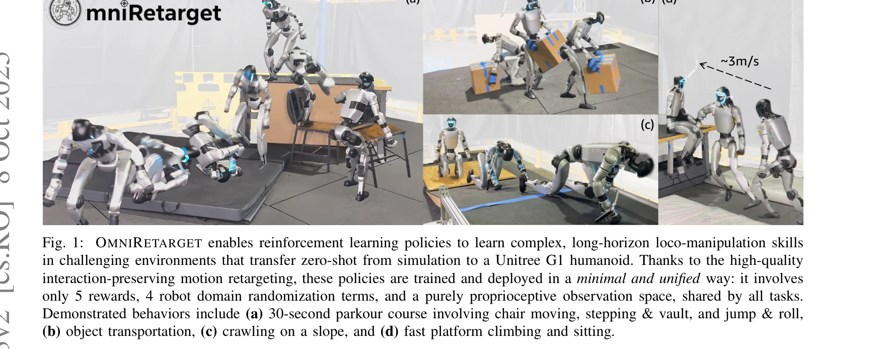

# OmniRetarget: Interaction-Preserving Data Generation for Humanoid Whole-Body Loco-Manipulation and Scene Interaction

> **저자**: Lujie Yang, Xiaoyu Huang, Zhen Wu, Angjoo Kanazawa, Pieter Abbeel, Carmelo Sferrazza, C. Karen Liu, Rocky Duan, Guanya Shi | **날짜**: 2025-10-08 | **DOI**: [10.48550/arXiv.2509.26633](https://doi.org/10.48550/arXiv.2509.26633)

---

## Essence

*Fig. 2: OMNIRETARGET overview. Human demonstrations are retargeted to the robot via interaction-mesh–based*

OmniRetarget은 상호작용 메시(interaction mesh)를 기반으로 한 휴머노이드 로봇의 운동 재타겟팅 시스템으로, 인간-물체-환경 상호작용을 보존하면서 고품질의 운동학적 참조 궤적을 생성한다. 단일 시연으로부터 다양한 로봇 체형, 지형, 물체 설정으로 효율적으로 데이터를 증강하여 RL 정책 학습을 가능하게 한다.

## Motivation

- **Known**: 컴퓨터 그래픽스에서는 최적화 기반 또는 데이터 기반 방법으로 다양한 캐릭터 간 운동 전이를 수행하고 있으며, 로보틱스에서는 DeepMimic과 같은 운동 모방 학습이 자연스러운 행동 학습에 효과적임이 알려져 있다. 기존 재타겟팅 방법인 PHC, GMR, VideoMimic 등은 키포인트 매칭에 주로 의존하여 foot skating, 침투(penetration) 등의 물리적 부작용을 야기한다.
- **Gap**: 기존 재타겟팅 파이프라인은 인간과 로봇의 구체적 차이(embodiment gap)를 제대로 처리하지 못하며, 더 중요하게는 인간-물체 및 인간-환경 상호작용의 공간 및 접촉 관계를 명시적으로 보존하지 않는다. 또한 각 변형마다 별도의 시연이 필요하여 대규모 데이터 생성이 비효율적이다.
- **Why**: 고품질의 운동학적으로 타당한 참조 궤적은 RL 정책 학습에 필요한 보상 엔지니어링과 커리큘럼을 최소화할 수 있으며, 이는 실제 휴머노이드 로봇에서 복잡한 loco-manipulation 작업의 성공적 수행과 실-시뮬레이션 전이를 가능하게 한다.
- **Approach**: OmniRetarget은 인간과 로봇 메시 간 Laplacian 변형을 최소화하면서 kinematic constraints (collision avoidance, joint limits, foot contact stability)를 하드 제약으로 적용하는 제약 최적화(constrained optimization)를 사용한다. 이를 통해 상호작용 메시에 의해 표현된 공간 및 접촉 관계를 보존하며, 단일 시연으로부터 지형, 물체, 로봇 체형 변형을 체계적으로 증강한다.

## Achievement

*Fig. 1:*

- **상호작용 보존 재타겟팅**: 로봇-물체-지형 상호작용을 명시적으로 모델링하고 보존하면서 하드 물리 제약을 적용하는 첫 번째 휴머노이드 재타겟팅 프레임워크
- **대규모 데이터 증강**: 단일 인간 시연으로부터 8시간 이상의 다양한 로봇 체형, 지형, 물체 구성의 고품질 운동학적 궤적 자동 생성
- **최소 보상 설계**: 5개 보상 항, 4개 domain randomization 항, 순전히 proprioceptive 관찰만으로 모든 작업에 공유되는 통일된 RL 학습 달성
- **zero-shot sim-to-real 전이**: 실제 Unitree G1 휴머노이드에서 30초 parkour, 물체 운반, 기어오르기, 구르기 등 다양한 long-horizon scene-interaction 작업 성공 수행
- **오픈소스 데이터셋**: OMOMO, LAFAN1, 자체 MoCap 데이터셋으로부터 생성된 대규모 재타겟된 loco-manipulation 궤적 데이터셋 공개

## How

*Fig. 2: OMNIRETARGET overview. Human demonstrations are retargeted to the robot via interaction-mesh–based*

- Interaction mesh를 통해 agent-terrain-object 간의 공간 및 접촉 관계를 명시적으로 정의 및 모니터링
- 제약 최적화 공식: min_q ||L_source - L_target|| subject to kinematic constraints (collision, joint limits, contact stability)
- Tetrahedra mesh matching으로 메시 대응 설정 및 변형 에너지 계산
- Spatial augmentation: 지형 높이, 물체 위치 변경 시 상호작용 관계를 보존하면서 최적화 재실행
- Shape augmentation: 다양한 로봇 체형에 대해 동일 상호작용 제약 하에서 새로운 최적화 문제 해결
- RL 정책 학습: BeyondMimic 유사의 minimal reward로 재타겟된 참조 궤적 추적
- Domain randomization: 4가지 로봇 도메인 변수만 사용하여 sim-to-real gap 완화

## Originality

- 기존 IMMA가 신체 부위 간 관계만 다루던 것에서 환경 및 물체 상호작용 관계를 명시적으로 포함하는 확장
- 운동 재타겟팅에 hard kinematic constraints를 체계적으로 통합한 첫 시도 (foot sticking, non-penetration, joint/velocity limits)
- Contact-rich manipulation 데이터 증강 개념을 humanoid whole-body loco-manipulation으로 확장
- 단일 시연으로부터 로봇 체형, 지형, 물체 구성을 독립적으로 변형할 수 있는 체계적 파이프라인
- Minimal reward design (5항만)과 proprioceptive-only 관찰로 다양한 작업 통일 학습 가능 입증

## Limitation & Further Study

- 현재 방법은 각 증강 변형마다 새로운 최적화 문제를 풀어야 하므로, 매우 큰 규모의 증강에서 계산 비용 증가 가능성
- Interaction mesh 정의가 작업별로 수동으로 설정되어야 하므로 완전 자동화 부족
- 평가가 주로 Unitree G1 한 가지 로봇에만 수행되어 다른 휴머노이드 형태에 대한 일반화 정도 미확인
- 복잡한 multi-agent 또는 multi-object 상호작용 시나리오로의 확장성 검토 필요
- 후속 연구: (1) 신경망 기반 대체로 증강 생성 가속화, (2) 자동 interaction mesh 학습, (3) 더 다양한 로봇 형태에서의 검증, (4) 복잡한 scene 시나리오로의 확장

## Evaluation

- Novelty: 4/5
- Technical Soundness: 3/5
- Significance: 4/5
- Clarity: 4/5
- Overall: 4/5

**총평**: OmniRetarget은 humanoid 재타겟팅의 오래된 문제에 명시적 상호작용 보존과 하드 제약 기반 최적화를 결합하여 실질적이고 우아한 해결책을 제시한다. 단일 시연으로부터 대규모 다양한 데이터 증강, 최소 보상 설계, zero-shot sim-to-real 전이 성공 등은 높은 실용성과 영향력을 입증하며, 오픈소스 공개로 커뮤니티 기여도 크다.

## Related Papers

- 🔗 후속 연구: [[papers/1549_Learning_Whole-Body_Human-Humanoid_Interaction_from_Human-Hu/review]] — PAIR 파이프라인의 HHI-to-HHoI 변환을 단일 시연 기반 데이터 증강으로 확장하여 효율성을 향상시킴
- 🏛 기반 연구: [[papers/1502_It_Takes_Two_Learning_Interactive_Whole-Body_Control_Between/review]] — Harmanoid의 상호작용 보존 모션 재타겟팅이 interaction mesh 기반 데이터 생성의 기반 방법론을 제공함
- 🧪 응용 사례: [[papers/1600_Opt2Skill_Imitating_Dynamically-feasible_Whole-Body_Trajecto/review]] — Opt2Skill의 RL 정책 학습이 OmniRetarget으로 생성된 고품질 참조 궤적의 실제 활용 사례를 보여줌
- 🏛 기반 연구: [[papers/1502_It_Takes_Two_Learning_Interactive_Whole-Body_Control_Between/review]] — OmniRetarget의 상호작용 보존 기술이 이중-휴머노이드 상호작용 학습의 기반 방법론을 제공함
- 🏛 기반 연구: [[papers/1549_Learning_Whole-Body_Human-Humanoid_Interaction_from_Human-Hu/review]] — OmniRetarget의 interaction-preserving 기술이 HHI를 HHoI로 변환하는 기반 방법론을 제공함
- 🔗 후속 연구: [[papers/1600_Opt2Skill_Imitating_Dynamically-feasible_Whole-Body_Trajecto/review]] — OmniRetarget의 상호작용 보존 데이터 생성과 DDP 기반 동역학적 궤적을 결합하여 loco-manipulation을 실현함
