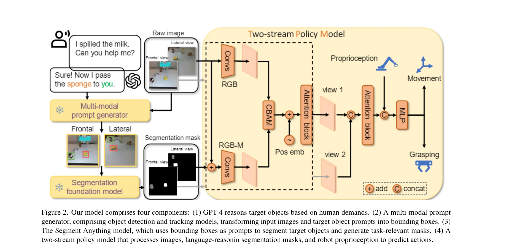
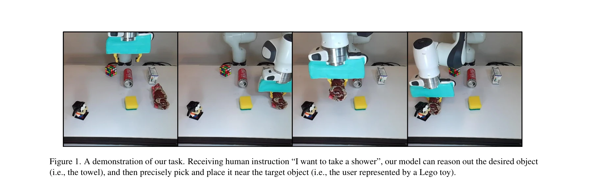

# Transferring Foundation Models for Generalizable Robotic Manipulation

> **저자**: Jiange Yang, Wenhui Tan, Chuhao Jin, Keling Yao, Bei Liu, Jianlong Fu, Ruihua Song, Gangshan Wu, Limin Wang | **날짜**: 2023-06-09 | **URL**: [https://arxiv.org/abs/2306.05716](https://arxiv.org/abs/2306.05716)

---

## Essence

*Figure 2. Our model comprises four components: (1) GPT-4 reasons target objects based on human demands. (2) A multi-moda*

인터넷 규모의 기초 모델(foundation models)에서 생성된 언어-추론 기반 분할 마스크를 활용하여 로봇 조작 작업을 조건화함으로써 샘플 효율적인 일반화를 달성하는 패러다임을 제안한다.

## Motivation

- **Known**: RT-1 같은 기존 접근법은 대규모 로봇 데이터 수집에 의존하지만 데이터 다양성 부족으로 새로운 객체와 환경에서의 일반화 능력이 제한된다.
- **Gap**: 기존 로봇 조작 방법은 비용이 많이 드는 대규모 데이터 수집이 필요하고 충분한 데이터 다양성을 갖지 못해 미지의 객체와 환경에서 성능 저하가 발생한다.
- **Why**: 실제 환경에서 작동 가능한 범용 로봇 에이전트를 개발하는 것은 로봇공학의 오랜 과제이며, 기초 모델의 지식을 활용하면 데이터 효율성을 크게 개선할 수 있다.
- **Approach**: GPT-4로 언어 명령을 해석하여 객체 프롬프트 생성, SAM을 통해 언어-추론 분할 마스크 생성, 그리고 이 마스크를 활용하는 two-stream 정책 모델(TPM)을 설계하여 로봇 행동을 예측한다.

## Achievement

*Figure 1. A demonstration of our task. Receiving human instruction “I want to take a shower”, our model can reason out t*

- **기초 모델 활용 패러다임**: 인터넷 규모 비전 기초 모델의 의미론적, 기하학적, 시간적 상관 정보를 로봇 조작에 통합하는 새로운 접근법을 제시
- **Two-stream 정책 모델**: 전역 RGB 정보를 처리하는 깊은 분지와 지역 객체 관련 RGB-M 정보를 처리하는 얕은 분지로 구성되어 robust 3D 지각을 실현
- **샘플 효율적 일반화**: 1000개 시연(40개 객체)으로 훈련하여 미지의 객체, 의미론적 카테고리, 예상하지 못한 배경에서 효과적으로 일반화
- **다중 로봇 플랫폼 검증**: Franka Emika 로봇과 저비용 이족 로봇에서 실증하여 여러 조작 기술(drawer 열기, picking-placing, stacking 등)에 확장 가능함을 입증

## How

*Figure 2. Our model comprises four components: (1) GPT-4 reasons target objects based on human demands. (2) A multi-moda*

- **언어-추론 마스크 생성**: GPT-4를 활용해 자연어 명령에서 목표 객체 프롬프트 추출
- **객체 탐지 및 추적**: open-vocabulary detection과 tracking 모델로 원하는 객체 식별 및 위치 파악
- **분할 마스크 생성**: SAM(Segment Anything Model) 기초 모델을 활용하여 목표 객체의 고정밀 분할 마스크 생성
- **Two-stream 정책 모델 아키텍처**: 깊은 분지(전역 RGB)와 얕은 분지(지역 RGB-M)로 구성하고 attention mechanism으로 multi-view 특성과 로봇 proprioception 상태 융합
- **Imitation learning 기반 훈련**: end-to-end 방식으로 마스크 조건화 정책을 학습하여 depth 캘리브레이션 불필요
- **폐루프 행동 예측**: 원시 이미지 입력으로부터 연속 로봇 행동을 동적으로 출력하는 closed-loop 방식 채택

## Originality

- **기초 모델 통합의 새로운 방식**: 기존의 prompt 기반 분할과 점구름 구성 방식 대신, 정교한 detection-tracking-segmentation 파이프라인으로 더 정밀한 객체 표현 제공
- **언어-추론 마스크 모달리티**: SAM으로 생성된 분할 마스크를 직접 정책 조건으로 활용하여 언어의 모호성을 완화하고 기하학적 정보를 명시적으로 제공
- **Local-global 이중 지각 구조**: 단순 RGB 인코딩이 아닌 전역-지역 정보를 동시에 처리하는 two-stream 아키텍처로 공간 관계 이해 강화
- **실제 환경에서의 scalable 시스템**: 깊이 정보 불필요, 완벽한 객체 마스크 불요구, 폐루프 방식으로 현실적 제약 극복

## Limitation & Further Study

- **훈련 데이터 규모**: 1000개 시연으로 훈련하여 더 복잡한 다중 객체 상호작용이나 동역학적 제약이 강한 작업의 일반화 능력 미검증
- **기초 모델 성능 의존성**: SAM, open-vocabulary detection 등 기초 모델의 오류가 누적되어 최종 성능 한계 발생 가능
- **작업 범위 제한**: pick-and-place 계열 작업에 중점으로 더 복잡한 조작(섬세한 그래스핑, 힘 제어 필요 작업) 미평가
- **비교 평가 제한**: RT-1 등 최신 baseline과의 직접 정량적 비교 부족, 주로 ablation 중심의 평가
- **후속 연구**: (1) 더 큰 규모 다양한 실제 환경 데이터로 일반화 강화, (2) 정책 모델의 생성 모델링 탐색, (3) reinforcement learning 결합으로 학습 효율성 증대

## Evaluation

- Novelty: 4/5
- Technical Soundness: 3/5
- Significance: 4/5
- Clarity: 4/5
- Overall: 4/5

**총평**: 기초 모델의 지식을 체계적으로 로봇 조작에 통합하는 실질적인 패러다임을 제시하였으며, 언어-추론 마스크라는 새로운 조건화 모달리티와 two-stream 정책 모델로 샘플 효율적 일반화를 달성한 의미 있는 기여를 했다.

## Related Papers

- 🔄 다른 접근: [[papers/1601_UniSkill_Imitating_Human_Videos_via_Cross-Embodiment_Skill_R/review]] — foundation model 기반 일반화를 위해 Transferring Foundation Models는 언어-추론 기반 분할을, UniSkill은 cross-embodiment 표현 학습을 사용하는 다른 접근법
- 🏛 기반 연구: [[papers/1504_JAEGER_Dual-Level_Humanoid_Whole-Body_Controller/review]] — Open X-Embodiment 데이터셋이 foundation model의 로봇 조작 전이를 위한 대규모 학습 데이터와 평가 기준을 제공
- 🔗 후속 연구: [[papers/1415_General_Motion_Tracking_for_Humanoid_Whole-Body_Control/review]] — foundation model 기반 분할이 General Motion Tracking의 humanoid 제어와 결합되어 더 정교한 whole-body 조작을 가능하게 함
- 🏛 기반 연구: [[papers/1480_Moto_Latent_Motion_Token_as_the_Bridging_Language_for_Learni/review]] — 일반화 가능한 로봇 조작을 위한 기초 모델 전이 방법론이 motion token 학습의 기반을 제공합니다.
- 🔄 다른 접근: [[papers/1601_UniSkill_Imitating_Human_Videos_via_Cross-Embodiment_Skill_R/review]] — cross-embodiment 기반 일반화를 위해 UniSkill은 skill representation 학습을, Transferring Foundation Models는 foundation model 전이를 사용하는 다른 접근법
