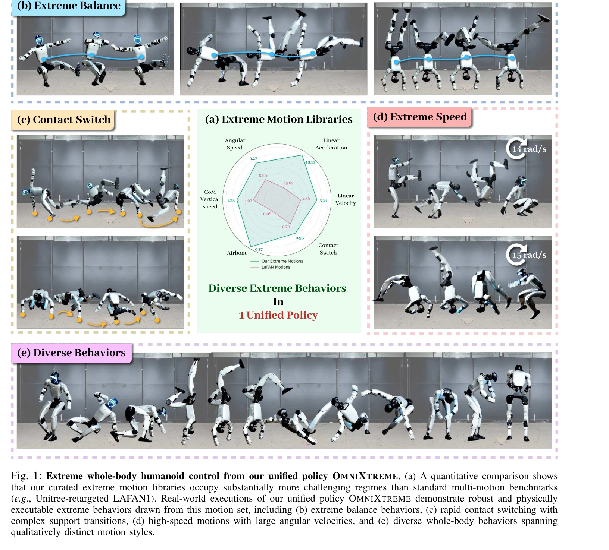
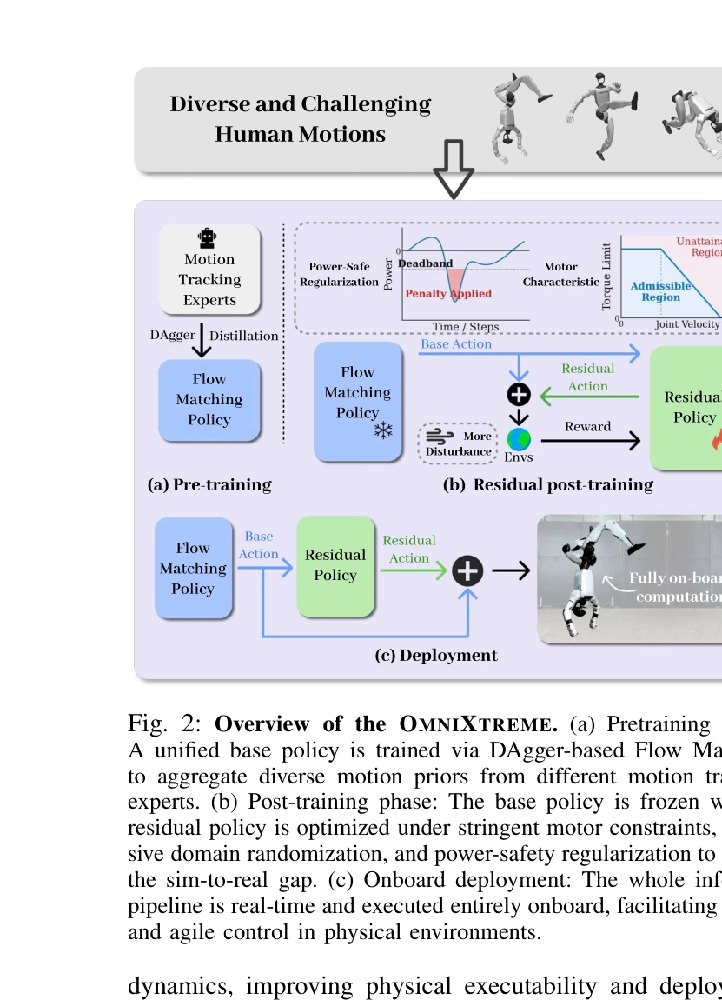

# OmniXtreme: Breaking the Generality Barrier in High-Dynamic Humanoid Control

> **저자**: Yunshen Wang, Shaohang Zhu, Peiyuan Zhi, Yuhan Li, Jiaxin Li, Yong-Lu Li, Yuchen Xiao, Xingxing Wang, Baoxiong Jia, Siyuan Huang | **날짜**: 2026-02-27 | **DOI**: [10.48550/arXiv.2602.23843](https://doi.org/10.48550/arXiv.2602.23843)

---

## Essence

*Fig. 1: Extreme whole-body humanoid control from our unified policy OMNIXTREME. (a) A quantitative comparison shows*

OmniXtreme는 flow-matching 기반 생성형 정책과 actuation-aware 잔여 강화학습을 결합하여 다양한 고동역 동작을 고충실도로 추적할 수 있는 통합 휴머노이드 제어 정책을 제시한다.

## Motivation

- **Known**: 기존 휴머노이드 동작 추적은 개별 동작에서는 높은 충실도를 달성하지만, 동작 라이브러리의 다양성이 증가할수록 추적 충실도가 저하되는 fidelity-scalability trade-off 문제가 있다.
- **Gap**: 멀티모션 최적화의 학습 병목과 실제 하드웨어의 물리적 실행 제약이라는 두 가지 근본적인 장벽이 고동역 동작의 확장성을 제한하고 있다.
- **Why**: 범용 휴머노이드 로봇의 일반화된 동작 제어 능력은 loco-manipulation, 표현적 상호작용, 다운스트림 작업의 핵심이므로, 충실도와 확장성의 균형을 동시에 달성하는 것이 중요하다.
- **Approach**: OmniXtreme은 두 단계로 구성되는데, 첫째는 flow-matching 정책과 고용량 아키텍처를 사용한 specialist-to-unified 생성형 사전훈련으로 다양한 동작 표현을 학습하고, 둘째는 실제 구동 제약을 고려한 actuation-aware 잔여 강화학습 후처리 단계로 물리적 실행 가능성을 보장한다.

## Achievement

*Fig. 1: Extreme whole-body humanoid control from our unified policy OMNIXTREME. (a) A quantitative comparison shows*

- **Flow-matching 기반 생성형 정책**: 높은 표현 용량을 통해 간섭이 많은 멀티모션 RL 최적화 없이도 확장성을 달성
- **Specialist-to-unified 사전훈련**: 개별 동작 전문가로부터의 행동 모방을 통해 다양한 고동역 동작으로의 초기화 제공
- **Actuation-aware 잔여 강화학습**: torque-speed 특성, 속도 의존 토크 손실, 재생 전력 효과 등 실제 구동기 비선형성을 명시적으로 모델링
- **극단적 동작 라이브러리 구축**: 높은 속도, 빈번한 접촉 전환, 긴 타이밍 제약을 특징으로 하는 새로운 벤치마크 제시
- **실제 로봇 검증**: Unitree G1 휴머노이드에서 flip, acrobatics, breakdancing 등 극단적 동작의 강건한 실행 달성

## How

*Fig. 2: Overview of the OMNIXTREME. (a) Pretraining phase:*

- Flow-matching 모델을 사용하여 관찰에서 다양한 동작 액션으로의 생성형 매핑 학습
- 개별 동작별로 훈련된 specialist 정책들로부터 행동 클로닝을 통해 unified 정책 초기화
- 고용량 트랜스포머 기반 아키텍처 채택으로 MLP 대비 복잡한 이질적 동작 매핑의 표현 능력 확대
- 실제 구동기의 torque-speed 특성 및 전력 관련 효과를 포함한 정밀한 actuation 모델 구성
- 도메인 랜더마이제이션과 전력 효과에 대한 명시적 페널티를 통한 robust 후처리 강화학습
- 시뮬레이션과 실제 로봇 간의 간극을 좁히기 위한 다단계 검증

## Originality

- 멀티모션 RL 최적화의 gradient interference 문제를 회피하면서도 확장성을 확보하는 generative 정책 접근법의 혁신적 도입
- Specialist-to-unified 사전훈련 패러다임으로 단순 행동 모방에서 벗어난 구조화된 전이 학습 프레임워크 제시
- 고동역 제어에서 흔히 무시되는 torque-speed nonlinearity, velocity-dependent losses, regenerative power 등의 물리적 제약을 명시적으로 모델링하는 actuation-aware 설계
- 기존 벤치마크보다 정성적으로 더 어려운 극단적 동작 라이브러리 구축 및 공개

## Limitation & Further Study

- Actuation-aware 모델의 구체적인 구성 방식과 파라미터 설정에 대한 상세한 설명 부족으로 재현 가능성 제약
- Flow-matching 정책의 추론 시간 및 계산 오버헤드에 대한 분석 미흡
- 단일 로봇(Unitree G1)에서의 검증만 제시되어 다양한 하드웨어 플랫폼으로의 일반화 가능성 미지수
- **후속 연구**: 다양한 액추에이터 타입과 로봇 형태에서의 확장 가능성 검증, 더 효율적인 flow-matching 추론 방법 개발, 정량적 ablation 분석 강화

## Evaluation

- Novelty: 4/5
- Technical Soundness: 4/5
- Significance: 4/5
- Clarity: 4/5
- Overall: 4/5

**총평**: OmniXtreme은 고동역 휴머노이드 제어에서 오랫동안 해결되지 못한 fidelity-scalability trade-off를 충실도와 확장성을 동시에 달성함으로써 극복했으며, flow-matching 기반 생성형 정책과 actuation-aware 잔여 강화학습의 조합은 로봇 제어 분야에 중요한 기술적 기여를 제시한다.

## Related Papers

- 🏛 기반 연구: [[papers/1362_ECHO_Edge-Cloud_Humanoid_Orchestration_for_Language-to-Motio/review]] — 확산 정책 기반 비주얼모터 학습이 OmniXtreme의 flow-matching 생성형 정책의 이론적 기초를 제공합니다.
- 🔄 다른 접근: [[papers/1447_HiFAR_Multi-Stage_Curriculum_Learning_for_High-Dynamics_Huma/review]] — 크로스 임바디먼트 조작을 위한 잠재 행동 확산과 actuation-aware 잔여 학습이 서로 다른 일반화 접근법을 제시합니다.
- 🔗 후속 연구: [[papers/1419_Generative_World_Modelling_for_Humanoids_1X_World_Model_Chal/review]] — 휴머노이드를 위한 생성형 월드 모델링이 OmniXtreme의 고동역 동작 생성을 위한 환경 예측 능력을 확장할 수 있습니다.
- ⚖️ 반론/비판: [[papers/1396_FastTD3_Simple_Fast_and_Capable_Reinforcement_Learning_for_H/review]] — OmniXtreme의 high-dynamic generality가 FastTD3의 단순함과 속도 중심 접근의 한계를 보완하는 대조적 관점
