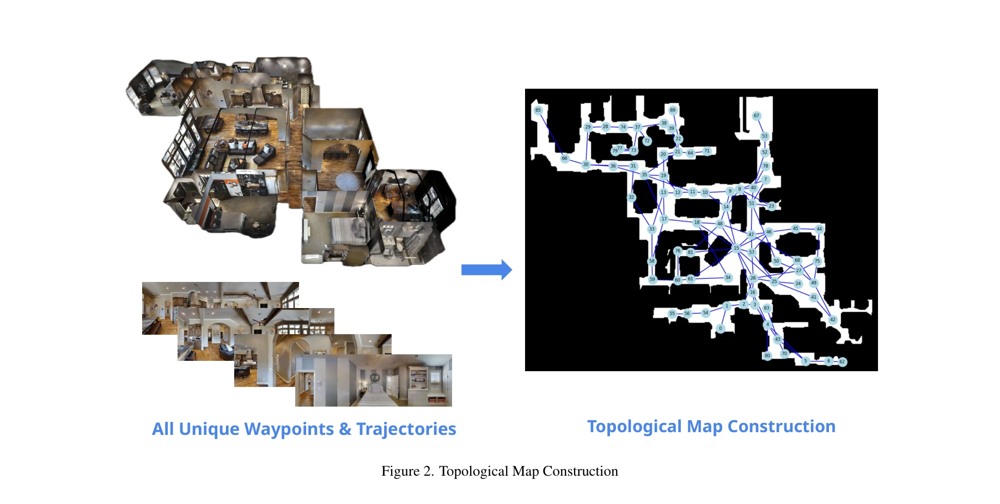
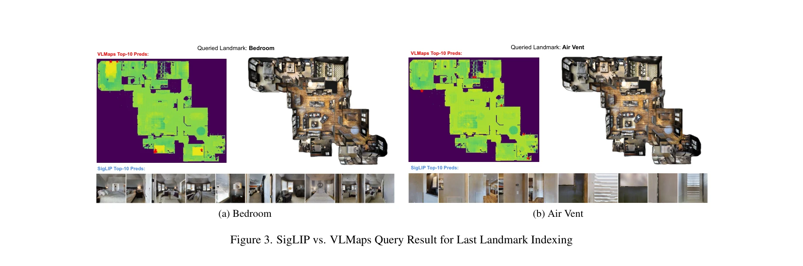
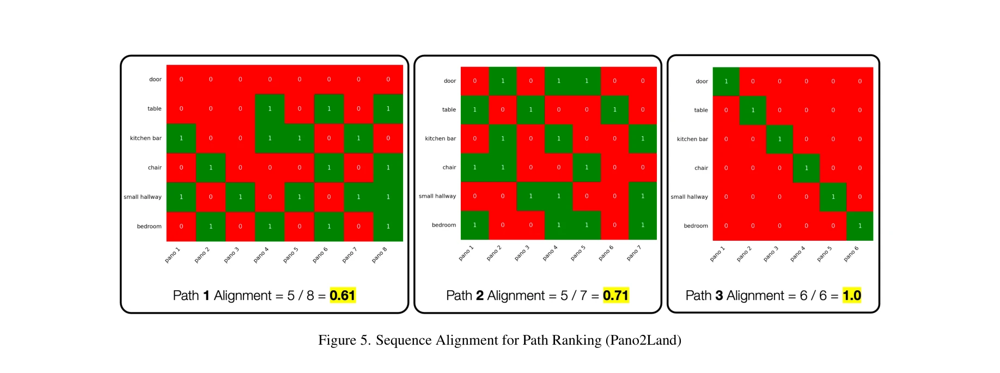

# TRAVEL: Training-Free Retrieval and Alignment for Vision-and-Language Navigation

> **저자**: Navid Rajabi, Jana Kosecka | **날짜**: 2025-02-11 | **URL**: [https://arxiv.org/abs/2502.07306](https://arxiv.org/abs/2502.07306)

---

## Essence

*Figure 2. Topological Map Construction*

Vision-Language Navigation 문제를 LLM과 VLM을 활용한 모듈식 접근으로 해결하며, 자연어 지시에서 landmark를 추출하고 topological map에서 경로를 검색하여 dynamic programming으로 정렬 점수를 계산한다.

## Motivation

- **Known**: End-to-end sequence-to-sequence 방식이 VLN에서 주로 사용되었으나 landmark grounding과 spatial relationship 이해에 한계가 있으며, 최근 CLIP-Nav와 VLMaps 등의 모듈식 접근이 제안되었다.
- **Gap**: 기존 모듈식 방법들은 단순한 지시만을 처리하거나 작은 규모 데이터셋에서만 평가되었으며, R2R-Habitat과 같은 복잡한 지시에 대한 체계적인 성능 분석이 부족하다.
- **Why**: VLN은 자율주행과 로봇 네비게이션에 필수적인 과제이며, 모듈식 접근은 학습 없이 최신 기초모델을 활용하여 확장성과 해석 가능성을 제공할 수 있다.
- **Approach**: 자연어 지시에서 LLama-3.1을 사용하여 landmark를 추출하고, SigLIP으로 최종 landmark 위치를 인식한 후, topological map에서 top-k 경로 가설을 생성하며, dynamic programming으로 panorama 시퀀스와 landmark 시퀀스 간의 정렬 점수를 계산한다.

## Achievement

*Figure 3. SigLIP vs. VLMaps Query Result for Last Landmark Indexing*

- **VLMaps 대비 성능 우위**: R2R-Habitat 데이터셋에서 occupancy map 기반 접근 대비 우수한 성능을 달성하였다.
- **Training-free 방식**: 추가 학습 없이 사전 학습된 LLM과 VLM만으로 zero-shot 성능을 확보하였다.
- **Visual grounding 영향 분석**: 시각적 groundedness가 navigation 성능에 미치는 영향을 정량적으로 분석하고 제시하였다.
- **모듈식 설계의 투명성**: 각 sub-module의 기여도를 명확하게 구분하여 weakness와 strength를 체계적으로 파악하였다.

## How

*Figure 5. Sequence Alignment for Path Ranking (Pano2Land)*

- **LLM 기반 landmark 추출**: LLama-3.1-8B-Instruct를 프롬프트하여 자연어 지시에서 landmark 시퀀스와 방문 순서를 추출한다.
- **Topological map 구성**: 데이터셋의 모든 unique waypoint와 trajectory를 사용하여 각 노드가 360° 파노라마로 표현되는 그래프를 생성한다.
- **Goal landmark 인식**: SigLIP를 사용하여 최종 landmark와 파노라마 이미지 간의 cosine similarity를 계산하여 top-k 목표 노드를 검색한다.
- **Shortest path 생성**: topological map에서 시작 위치에서 최종 landmark의 top-k 위치까지 최단 경로 알고리즘으로 k개 경로 가설을 생성한다.
- **Dynamic programming 정렬**: 각 경로 가설의 파노라마 시퀀스와 landmark 이름 시퀀스 간의 정렬 점수를 VLM의 매치 점수를 비용으로 사용하여 동적 프로그래밍으로 계산한다.
- **경로 평가**: 최고 정렬 점수를 얻은 가설에 대해 nDTW 메트릭을 계산하여 경로의 충실도를 평가한다.

## Originality

- **LLM과 VLM의 체계적 통합**: 기존의 modular approach들과 달리 LLM으로 landmark를 구조화된 형태로 추출하고 VLM으로 각 landmark를 fine-grained하게 grounding하는 통합 프레임워크를 제시하였다.
- **Dynamic programming 기반 정렬**: 단순한 similarity 계산 대신 파노라마 시퀀스와 landmark 시퀀스의 optimal alignment를 찾는 동적 프로그래밍 접근으로 복잡한 지시 처리 능력을 향상시켰다.
- **Zero-shot 성능 달성**: 학습 없이 기존의 학습 기반 방법들을 능가하는 성능을 보임으로써 대규모 모델의 zero-shot 능력을 효과적으로 활용함을 입증하였다.
- **상세한 실패 분석**: LLM과 VLM의 landmark grounding 실패 사례를 정량적으로 분석하여 현재 기초모델의 한계를 구체적으로 제시하였다.

## Limitation & Further Study

- **환경 맵의 의존성**: 알려진 topological map의 존재를 가정하므로 미지의 환경에서의 적용 가능성이 제한된다.
- **Landmark 추출의 한계**: 복잡하거나 모호한 landmark 표현에 대한 LLM의 추출 정확도 한계가 성능을 직접 제약한다.
- **Spatial clause 처리 부족**: 기존 modular approach와 마찬가지로 'before
- after' 등의 temporal/spatial constraint를 충분히 처리하지 못한다.", '**Top-k 경로의 계산 비용**: top-k 가설 생성과 alignment 계산의 computational complexity가 실시간 네비게이션에서 병목이 될 수 있다.
- **단일 최종 landmark 가정**: 여러 목표점이나 반복되는 landmark를 포함한 복잡한 지시 처리에 미적절하다.
- **후속 연구**: (1) 미지 환경에서 온라인 map 구축 및 navigation의 통합, (2) LLM의 landmark 추출 정확도 향상을 위한 few-shot prompting 기법, (3) spatial/temporal constraint를 명시적으로 modeling하는 constraint satisfaction 접근

## Evaluation

- Novelty: 4/5
- Technical Soundness: 3/5
- Significance: 4/5
- Clarity: 4/5
- Overall: 4/5

**총평**: 이 논문은 LLM과 VLM을 체계적으로 결합한 modular VLN 접근법으로 training-free 학습이 가능함을 보이며, 복잡한 R2R-Habitat 지시셋에서 기존 방법 대비 우수한 성능을 달성한다. 다만 알려진 맵의 존재 가정과 spatial constraint 처리의 한계는 실제 환경 적용에 있어 개선이 필요하다.

## Related Papers

- 🔄 다른 접근: [[papers/1600_UniGoal_Towards_Universal_Zero-shot_Goal-oriented_Navigation/review]] — TRAVEL은 modular LLM/VLM 접근법을, UniGoal은 unified graph representation을 사용하여 다양한 목표 유형의 네비게이션을 해결하는 다른 방식
- 🔗 후속 연구: [[papers/1402_GC-VLN_Instruction_as_Graph_Constraints_for_Training-free_Vi/review]] — TRAVEL의 landmark 추출과 경로 검색이 GC-VLN의 graph constraint 기반 접근법과 결합되어 더 효율적인 training-free navigation을 달성
- 🧪 응용 사례: [[papers/1329_CityNavAgent_Aerial_Vision-and-Language_Navigation_with_Hier/review]] — TRAVEL의 topological mapping 접근법이 CityNavAgent의 hierarchical planning과 함께 대규모 도시 환경 네비게이션에 적용 가능
- 🧪 응용 사례: [[papers/1465_ManiFlow_A_General_Robot_Manipulation_Policy_via_Consistency/review]] — flow-based 정책 개선 방법론이 일관성 훈련을 통한 고품질 행동 생성에 적용될 수 있습니다.
- 🔗 후속 연구: [[papers/1575_SmartWay_Enhanced_Waypoint_Prediction_and_Backtracking_for_Z/review]] — TRAVEL의 training-free retrieval이 SmartWay의 zero-shot 프레임워크를 더 효율적인 검색 기반 방법으로 확장한다.
- 🔄 다른 접근: [[papers/1600_UniGoal_Towards_Universal_Zero-shot_Goal-oriented_Navigation/review]] — UniGoal의 unified graph representation과 TRAVEL의 modular approach는 다양한 목표 유형의 네비게이션을 위한 서로 다른 통합 전략
