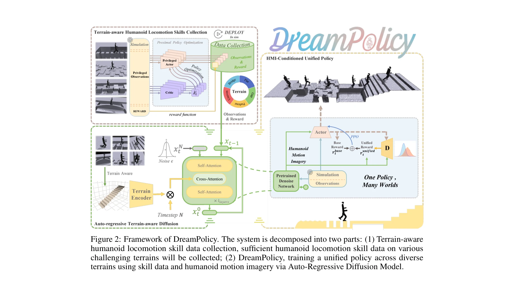
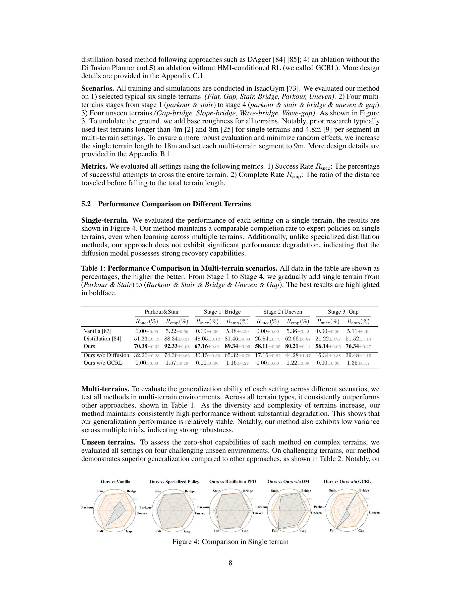

# One Policy but Many Worlds: A Scalable Unified Policy for Versatile Humanoid Locomotion

> **저자**: Yahao Fan, Tianxiang Gui, Kaiyang Ji, Shutong Ding, Chixuan Zhang, Jiayuan Gu, Jingyi Yu, Jingya Wang, Ye Shi | **날짜**: 2025-05-24 | **URL**: [https://arxiv.org/abs/2505.18780](https://arxiv.org/abs/2505.18780)

---

## Essence

*Figure 2: Framework of DreamPolicy. The system is decomposed into two parts: (1) Terrain-aware*

DreamPolicy는 Humanoid Motion Imagery (HMI)를 통해 단일 정책으로 다양한 지형에서 휴머노이드 로봇의 보행을 학습하고 미학습 지형으로 zero-shot 일반화할 수 있는 통합 프레임워크이다. Terrain-aware autoregressive diffusion planner가 생성한 예측 궤적을 동적 목표로 사용하여 수동 보상 공학을 우회하고 확장 가능한 학습을 달성한다.

## Motivation

- **Known**: 전통적인 강화학습 방법은 과제별 보상을 요구하고 증가하는 데이터셋을 활용하지 못하며, 정책 증류 방식은 전문 정책의 취약성을 상속받고 온라인 상호작용에 의존한다. 인간 모션 데이터셋을 활용한 접근법은 복잡한 retargeting을 필요로 한다.
- **Gap**: 기존 방법들은 특정 지형에 과적합되고 복잡한 보상 설계를 요구하며, 오프라인 데이터의 확장성 문제와 미학습 지형으로의 일반화 부족이 해결되지 않았다.
- **Why**: 휴머노이드 로봇의 실제 배포를 위해 다양한 지형에서 강건한 단일 정책이 필요하며, 확장 가능하고 수동 보상 공학이 불필요한 학습 프레임워크가 중요하다.
- **Approach**: 먼저 6개 지형에서 전문 RL 정책들을 학습하여 휴머노이드 운동학 데이터셋을 생성하고, autoregressive diffusion planner를 학습하여 Humanoid Motion Imagery (HMI)를 생성한 후, HMI를 조건으로 하는 물리 제약 RL 정책을 최적화한다.

## Achievement

*Figure 4: Comparison in Single terrain*

- **통합 정책 프레임워크**: 복잡한 보상 공학이나 정책 증류 없이 단일 정책으로 cross-terrain 로봇 보행을 달성
- **확장 가능한 오프라인 학습**: 데이터셋 확장에 따라 성능이 지속적으로 향상되며, 전통적 RL의 확장성 한계를 극복
- **강력한 일반화 성능**: 6개 학습 지형에서 평균 90% 성공률, 미학습 지형에서 기존 방법 대비 평균 20% 높은 성공률 달성
- **견고한 적응성**: 교란된 복합 지형에서도 기존 방법이 실패하는 상황에서 일반화 가능

## How

*Figure 2: Framework of DreamPolicy. The system is decomposed into two parts: (1) Terrain-aware*

- 6개 단일 지형 환경에서 전문 RL 정책들을 학습하여 휴머노이드 운동학 및 동역학을 직접 캡처한 dataset 생성
- Autoregressive terrain-aware diffusion planner를 오프라인 humanoid dataset에서 학습하여 cross-scenario state-action 분포 모델링
- Diffusion planner의 예측값을 동적 목표로 사용하는 HMI-conditioned RL 정책 최적화로 궤적 추적과 물리적 타당성의 균형 유지
- 오프라인 데이터 집계를 통해 지속적인 개선이 가능하도록 아키텍처 분리 설계

## Originality

- Humanoid Motion Imagery (HMI) 개념: 전문 정책들의 집계된 롤아웃으로부터 지형 인식 diffusion planner를 학습하여 암묵적 보상 신호 생성
- Retargeting 회피: 인간 모션 데이터 대신 직접 수집한 humanoid 운동학 데이터 사용으로 학습 효율 및 정확성 향상
- 분리된 아키텍처: 운동 합성과 정책 최적화의 해결을 통해 오프라인 데이터의 완전한 활용 및 scalability 달성
- Terrain-aware autoregressive diffusion: 미학습 지형에서의 zero-shot 일반화를 위한 지형 조건부 궤적 생성

## Limitation & Further Study

- 평가가 시뮬레이션 환경 (6가지 지형)에 제한되어 있으며, 실제 하드웨어에서의 sim-to-real 전이 검증 부재
- Diffusion planner의 계산 비용 및 실시간 성능 분석이 명시되지 않음
- 6개 기본 지형만으로 학습했을 때의 일반화 한계와 더 다양한 지형 조합에 대한 성능 저하 가능성 미탐색
- 전문 정책 수집 단계의 효율성 및 각 지형별 데이터 요구량에 대한 분석 부족
- 후속 연구: (1) 실제 로봇에서의 검증, (2) 더 다양하고 복합적인 지형에 대한 평가, (3) 온라인 학습과의 결합을 통한 적응 능력 강화

## Evaluation

- Novelty: 4/5
- Technical Soundness: 3/5
- Significance: 4/5
- Clarity: 4/5
- Overall: 4/5

**총평**: DreamPolicy는 diffusion 기반 운동 합성과 오프라인 RL의 혁신적 결합으로 humanoid 로봇의 확장 가능하고 일반화된 보행 제어 문제를 해결한다. 수동 보상 공학을 제거하고 데이터 확장성을 확보한 점에서 의미 있는 기여를 하나, 실제 로봇 검증과 계산 비용 분석 부재로 실용성 검증이 필요하다.

## Related Papers

- 🔄 다른 접근: [[papers/1582_Natural_Humanoid_Robot_Locomotion_with_Generative_Motion_Pri/review]] — 휴머노이드 지형 적응의 다른 접근법으로 통합 정책과 생성적 모션 프라이어를 비교할 수 있다.
- 🔗 후속 연구: [[papers/1597_One-shot_Adaptation_of_Humanoid_Whole-body_Motion_with_Walki/review]] — 보행 사전 모델을 활용한 전신 동작 적응에서 통합 정책의 지형 일반화 능력을 보완한다.
- 🏛 기반 연구: [[papers/1449_Hiking_in_the_Wild_A_Scalable_Perceptive_Parkour_Framework_f/review]] — 야생 지형에서의 지각적 파쿠르가 다양한 지형 적응 통합 정책의 기반 기술을 제공한다.
- 🔄 다른 접근: [[papers/1582_Natural_Humanoid_Robot_Locomotion_with_Generative_Motion_Pri/review]] — 휴머노이드 지형 적응 보행의 다른 접근법으로 생성적 모션 프라이어와 통합 정책을 비교할 수 있다.
- 🏛 기반 연구: [[papers/1597_One-shot_Adaptation_of_Humanoid_Whole-body_Motion_with_Walki/review]] — 다양한 지형에서의 통합 휴머노이드 정책이 one-shot 전신 동작 적응의 기반 기술을 제공한다.
