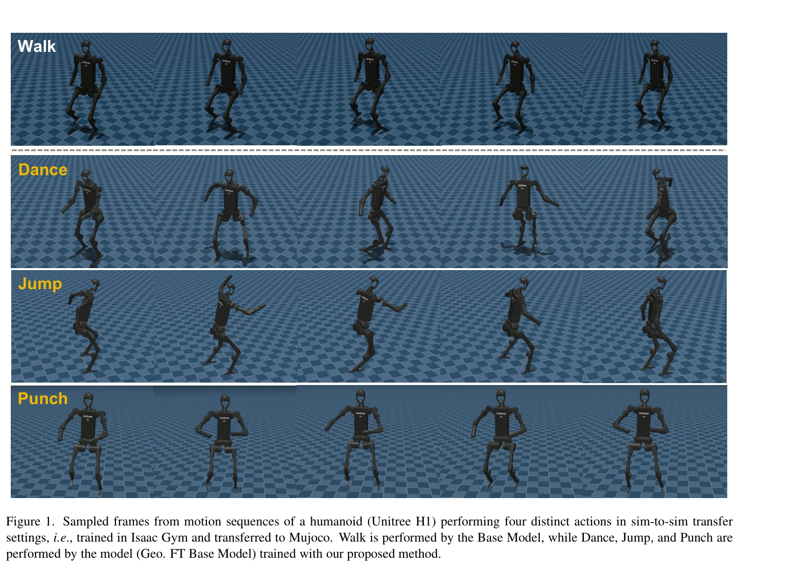

# One-shot Adaptation of Humanoid Whole-body Motion with Walking Priors

> **저자**: Hao Huang, Geeta Chandra Raju Bethala, Shuaihang Yuan, Congcong Wen, Mengyu Wang, Anthony Tzes, Yi Fang | **날짜**: 2026-04-07 | **DOI**: [10.48550/arXiv.2510.25241](https://doi.org/10.48550/arXiv.2510.25241)

---

## Essence

*Figure 2. Given a sequence of walking motion pose skeletons and a target sequence comprising non-walking motions, we emp*

보행 사전 학습 모델과 order-preserving optimal transport를 활용하여 단일 샘플로부터 휴머노이드 전신 동작을 적응시키는 데이터 효율적 방법을 제안한다.

## Motivation

- **Known**: 휴머노이드 전신 동작은 심화 강화학습을 통해 진보했으나, 대규모 고품질 모션 데이터셋 수집이 매우 노동집약적이고 비용이 많이 든다.
- **Gap**: 기존 방법들은 카테고리당 여러 학습 샘플을 필요로 하지만, 원샷 학습을 통해 단일 목표 클립만으로 휴머노이드 동작을 효과적으로 적응시키는 방법이 미흡하다.
- **Why**: 모션 캡처 데이터 수집의 높은 비용과 복잡한 전신 동작 학습의 도전성을 감안할 때, 데이터 효율적 적응 방법은 휴머노이드 로봇의 실용성을 크게 향상시킬 수 있다.
- **Approach**: 보행 모델을 기반으로 order-preserving optimal transport를 이용해 보행과 목표 동작 간의 거리를 계산하고, 지오데식 보간을 통해 중간 포즈 골격을 생성한 후 manifold 최적화와 강화학습으로 적응시킨다.

## Achievement

*Figure 1. Sampled frames from motion sequences of a humanoid (Unitree H1) performing four distinct actions in sim-to-sim*

- **데이터 효율성**: 단일 비보행 목표 샘플로부터 새로운 휴머노이드 동작을 학습 가능
- **신경망 불필요**: 기존 생성 방법과 달리 신경망 학습 없이 lightweight하게 동작
- **성능 우위**: CMU MoCap 데이터셋에서 기존 기저선들을 지속적으로 상회
- **강건성 입증**: Isaac Gym에서 MuJoCo로의 sim-to-sim 전이 성공

## How

*Figure 2. Given a sequence of walking motion pose skeletons and a target sequence comprising non-walking motions, we emp*

- 기본 모델(Base Model)을 보행 모션 클립(약 130개)으로 사전 학습
- Order-preserving optimal transport(OPOT)로 보행 수열과 목표 수열 간 Wasserstein 거리 계산
- 지오데식 경로를 따라 중간 포즈 골격 생성으로 보행과 목표 동작 간 매끄러운 보간
- Manifold 최적화를 통해 생성된 동작의 충돌 회피 및 신체 제약 보장
- 동작을 휴머노이드 조인트로 변환(retargeting)하고 정책 적응을 위해 시뮬레이션 환경에서 강화학습 실행

## Originality

- 보행 사전 학습 모델을 활용한 휴머노이드 동작의 원샷 적응이라는 새로운 문제 정의
- Order-preserving optimal transport를 동작 생성에 적용하여 시간 일관성 보존
- 신경망 학습 없이 manifold 최적화만으로 물리적 제약을 만족하는 중간 동작 생성
- 보행이라는 풍부한 보조 데이터와 사전 학습된 기하학적 구조를 활용한 창의적 접근

## Limitation & Further Study

- 보행 모션 클립 약 130개를 필요로 하므로 완전한 원샷 학습은 아님
- 방법의 성능이 초기 보행 사전 학습의 품질에 크게 의존
- 단일 목표 샘플만으로는 다양한 동작 변형을 학습하기 어려울 수 있음
- 실제 로봇 환경으로의 현실적 전이(sim-to-real) 성능에 대한 검증 부재
- 후속 연구로 더 적은 보행 데이터로 학습 가능한 방법과 실제 로봇 실험 필요

## Evaluation

- Novelty: 4/5
- Technical Soundness: 3/5
- Significance: 4/5
- Clarity: 4/5
- Overall: 4/5

**총평**: 이 논문은 휴머노이드 전신 동작의 데이터 효율적 적응 문제를 order-preserving optimal transport와 manifold 최적화로 창의적으로 해결하며, CMU MoCap에서 일관된 성능 우위를 보여주는 가치 있는 기여이다.

## Related Papers

- 🏛 기반 연구: [[papers/1596_One_Policy_but_Many_Worlds_A_Scalable_Unified_Policy_for_Ver/review]] — 다양한 지형에서의 통합 휴머노이드 정책이 one-shot 전신 동작 적응의 기반 기술을 제공한다.
- 🔄 다른 접근: [[papers/1582_Natural_Humanoid_Robot_Locomotion_with_Generative_Motion_Pri/review]] — 휴머노이드 동작 생성의 다른 접근법으로 생성적 모션 프라이어와 보행 사전 기반 적응을 비교할 수 있다.
- 🔗 후속 연구: [[papers/1549_Learning_Whole-Body_Human-Humanoid_Interaction_from_Human-Hu/review]] — 인간-휴머노이드 상호작용 학습에서 보행 사전을 활용한 전신 동작 적응이 상호작용 품질을 향상시킨다.
- 🔗 후속 연구: [[papers/1531_Learning_Humanoid_Standing-up_Control_across_Diverse_Posture/review]] — one-shot adaptation의 개념을 일어서기 제어라는 특수한 whole-body motion에 적용하여 구체화한 형태임
- 🔗 후속 연구: [[papers/1596_One_Policy_but_Many_Worlds_A_Scalable_Unified_Policy_for_Ver/review]] — 보행 사전 모델을 활용한 전신 동작 적응에서 통합 정책의 지형 일반화 능력을 보완한다.
