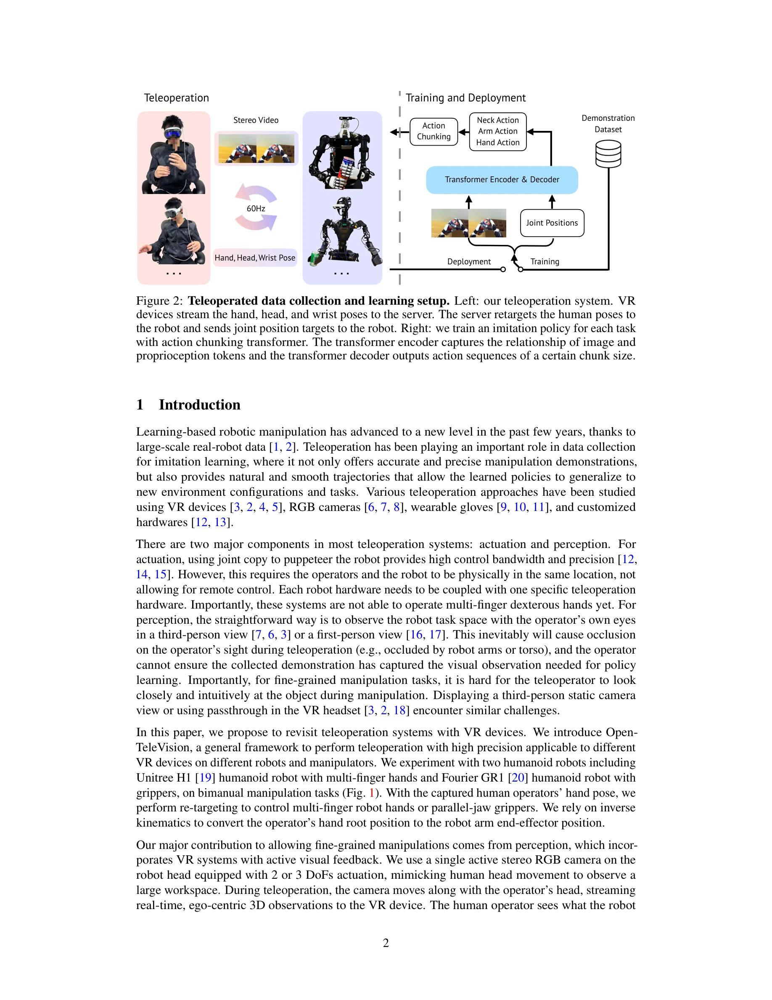
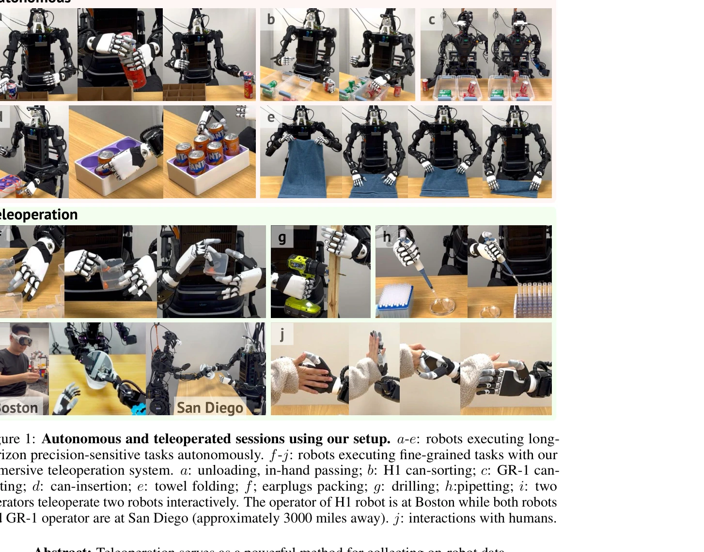

# Open-TeleVision: Teleoperation with Immersive Active Visual Feedback

> **저자**: Xuxin Cheng, Jialong Li, Shiqi Yang, Ge Yang, Xiaolong Wang | **날짜**: 2024-07-01 | **URL**: [https://arxiv.org/abs/2407.01512](https://arxiv.org/abs/2407.01512)

---

## Essence

*Figure 2: Teleoperated data collection and learning setup. Left: our teleoperation system. VR*

VR 기반 몰입형 원격 조종 시스템 Open-TeleVision을 제안하여 능동적 시각 피드백과 입체 영상을 통해 로봇 조종 및 모방 학습의 직관성을 향상시킨다.

## Motivation

- **Known**: 원격 조종은 로봇 학습을 위한 데이터 수집에 효과적이며, VR 기반 조종 시스템이 여러 형태로 연구되어 왔다. 그러나 기존 시스템은 시야 폐색 문제와 세밀한 조종의 어려움을 겪고 있다.
- **Gap**: 기존 원격 조종 시스템은 정적 카메라 뷰의 시야 제약과 직관성 부족으로 인해 정밀한 조종 작업에 어려움을 겪고 있으며, 활동적인 시각 피드백을 제공하는 시스템이 부재하다.
- **Why**: 고품질의 다양한 로봇 데이터 수집을 위해서는 직관적이고 사용하기 쉬운 원격 조종 시스템이 필수적이며, 이를 통해 모방 학습 정책의 성능을 향상시킬 수 있다.
- **Approach**: 능동적으로 움직이는 입체 카메라와 머리 추적을 통해 로봇의 일인칭 시각을 제공하고, inverse kinematics와 dex-retargeting을 활용하여 오퍼레이터의 팔과 손 움직임을 로봇에 매핑한다.

## Achievement

*Figure 1: Autonomous and teleoperated sessions using our setup. a-e: robots executing long-*

- **능동적 시각 피드백**: 로봇 머리의 2-3 DoF 짐벌 제어로 오퍼레이터의 머리 움직임을 추종하여 시야 폐색을 해결하고 직관적 공간 인식 제공
- **입체 영상 스트리밍**: 480x640 해상도의 stereo video를 60Hz로 실시간 전송하여 깊이 감지를 향상시키고 조종 성공률 및 작업 완료 시간 단축
- **다중 로봇 호환성**: Unitree H1(6 DoF 손)과 Fourier GR-1(jaw gripper)에 모두 적용 가능한 범용 프레임워크 구현
- **장거리 원격 조종**: MIT(동부)에서 UC San Diego(서부)의 로봇을 3000마일 거리에서 성공적으로 조종(coast-to-coast teleoperation)
- **실제 배포**: Can Sorting, Can Insertion, Folding, Unloading 등 4개 장기간 정밀 작업에서 transformer 기반 imitation learning 정책 학습 및 실제 배포 성공
- **오픈소스 공개**: 시스템을 공개하여 연구 커뮤니티 접근성 향상

## How

*Figure 2: Teleoperated data collection and learning setup. Left: our teleoperation system. VR*

- **VR 기기 통합**: Apple VisionPro를 사용하여 오퍼레이터의 손, 머리, 손목의 SE(3) 포즈를 캡처 및 스트리밍
- **모션 레타게팅**: 상대 위치(robot end-effector와 head 사이)는 일치시키고 절대 방향은 정렬하여 머리 움직임 시 end-effector 안정성 보장
- **역기구학 계산**: Closed-loop Inverse Kinematics(CLIK) 알고리즘과 Pinocchio 라이브러리를 사용하여 joint angle 계산 및 SE(3) group filter로 안정화
- **손 제어**: dex-retargeting 라이브러리를 활용한 vector optimizer 기반 최적화 문제로 로봇 손 keypoint 매핑
- **액티브 카메라 제어**: 2-3 DoF gimbal(yaw, pitch, roll)로 robot head 제어하여 오퍼레이터 머리 움직임 추종
- **Action Chunking Transformer**: transformer encoder로 이미지와 proprioception 토큰의 관계 학습, decoder로 chunk 단위 action sequence 생성
- **웹 서버 기반 통신**: Vuer 프레임워크 기반 서버에서 인터넷을 통한 원격 조종 및 로봇 제어 실현

## Originality

- **능동적 입체 시각 피드백의 결합**: 기존 static camera view 대신 오퍼레이터의 머리 움직임을 추종하는 gimbal 카메라와 stereo video 스트리밍의 조합으로 직관성 획기적 향상
- **세밀한 조종을 위한 시각 주의 메커니즘**: 능동적 카메라가 다음 단계 조종 관련 영역에 자연스러운 주의 메커니즘 제공하여 처리 픽셀 감소 및 실시간 제어 가능
- **다중 지수 로봇에 대한 범용 시스템**: 서로 다른 손 형태(multi-finger dexterous hand vs parallel-jaw gripper)를 dex-retargeting으로 통일 처리
- **imitation learning에서의 능동적 카메라 활용**: 정책이 로봇의 능동적 머리 움직임을 함께 학습하도록 하여 static view 기반 정책보다 성능 향상
- **인터넷 기반 장거리 원격 조종**: 실시간 stereo video 스트리밍을 통해 대륙간 원격 조종을 실현하여 데이터 수집 지역의 제약 제거

## Limitation & Further Study

- **VR 기기 의존성**: Apple VisionPro 특정 hand tracking 알고리즘에 초기화 단계 의존하며, 다른 VR 기기로의 확장성 검증 미흡
- **거리 기반 지연 시간 분석 부재**: coast-to-coast teleoperation 시 네트워크 지연에 따른 시스템 성능 변화 분석 및 최대 허용 지연 시간 정량화 필요
- **손 크기 차이 대응의 제한**: dex-retargeting의 scaling factor α(1.1로 고정)가 다양한 오퍼레이터 손 크기에 최적화되지 않을 수 있음
- **Gimbal 카메라의 기계적 제약**: H1의 2 DoF 제약으로 인한 제어 자유도 한계 및 회전 속도 제한이 빠른 조종에 미칠 영향 미검토
- **이미지 입력 기반 정책의 real-time 추론 속도**: active camera의 inference 속도 향상을 정성적으로만 언급하고, 정량적 비교(fps, latency) 부족
- **후속 연구**: (1) 다양한 VR 기기 및 로봇 플랫폼에 대한 일반화 검증, (2) 네트워크 지연에 강건한 제어 알고리즘 개발, (3) 자동화된 머리 제어 정책 학습, (4) 인터넷 기반 조종의 안정성 및 보안 검토

## Evaluation

- Novelty: 4/5
- Technical Soundness: 3/5
- Significance: 4/5
- Clarity: 4/5
- Overall: 4/5

**총평**: 능동적 입체 시각 피드백을 기반으로 한 몰입형 원격 조종 시스템을 제시하여 로봇 데이터 수집의 직관성과 확장성을 획기적으로 향상시켰으며, 실제 humanoid 로봇의 정밀한 다중 작업 수행으로 실용성을 검증한 우수한 연구이다.

## Related Papers

- 🔄 다른 접근: [[papers/1297_Bunny-VisionPro_Real-Time_Bimanual_Dexterous_Teleoperation_f/review]] — VR 기반 몰입형 원격 조종 Open-TeleVision과 실시간 양손 정교 텔레오퍼레이션 Bunny-VisionPro가 동일한 VR 텔레오퍼레이션 문제를 다룬다.
- 🏛 기반 연구: [[papers/1543_Learning_to_Look_Around_Enhancing_Teleoperation_and_Learning/review]] — VR 몰입형 시각 피드백을 통한 원격 조종 향상이 자연스러운 머리 움직임을 통한 텔레오퍼레이션 개선의 기반이 된다.
- 🔗 후속 연구: [[papers/1272_ARMADA_Augmented_Reality_for_Robot_Manipulation_and_Robot-Fr/review]] — VR 기반 원격 조종 시스템이 로봇 조작과 피드백을 위한 AR 확장 시스템 ARMADA로 발전할 수 있다.
- 🏛 기반 연구: [[papers/1306_CLONE_Closed-Loop_Whole-Body_Humanoid_Teleoperation_for_Long/review]] — 몰입형 능동 시각 텔레오퍼레이션에서 MR 헤드셋의 헤드-핸드 추적이 기초가 된다
- 🏛 기반 연구: [[papers/1297_Bunny-VisionPro_Real-Time_Bimanual_Dexterous_Teleoperation_f/review]] — 몰입형 능동 시각 텔레오퍼레이션에서 Apple Vision Pro의 손 추적이 기초가 된다
- 🔄 다른 접근: [[papers/1491_iCub3_Avatar_System_Enabling_Remote_Fully-Immersive_Embodime/review]] — 원격 humanoid 제어에서 완전 몰입형 embodiment와 immersive active visual feedback의 서로 다른 접근 방식을 보여준다.
- 🔗 후속 연구: [[papers/1543_Learning_to_Look_Around_Enhancing_Teleoperation_and_Learning/review]] — 자연스러운 머리 움직임을 통한 텔레오퍼레이션 향상이 VR 기반 몰입형 시각 피드백 시스템으로 확장되었다.
