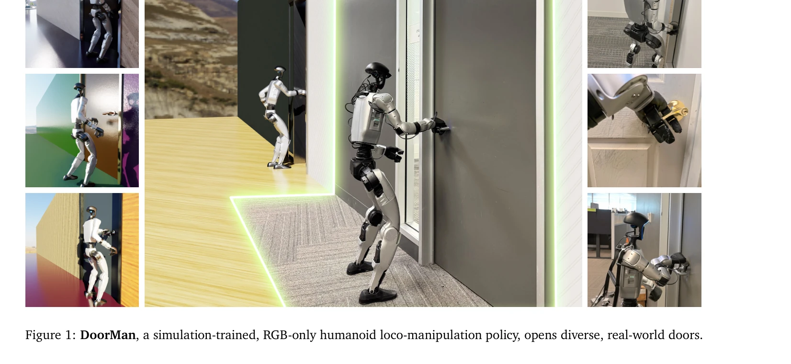
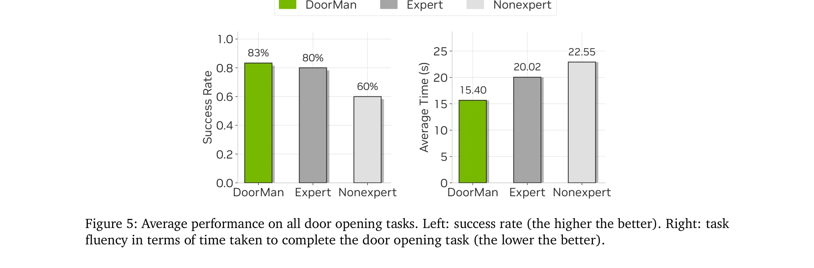

# Opening the Sim-to-Real Door for Humanoid Pixel-to-Action Policy Transfer

> **저자**: Haoru Xue, Tairan He, Zi Wang, Qingwei Ben, Wenli Xiao, Zhengyi Luo, Xingye Da, Fernando Castañeda, Guanya Shi, Shankar Sastry, Linxi "Jim" Fan, Yuke Zhu | **날짜**: 2025-11-30 | **DOI**: [10.48550/arXiv.2512.01061](https://doi.org/10.48550/arXiv.2512.01061)

---

## Essence

*Figure 1: DoorMan, a simulation-trained, RGB-only humanoid loco-manipulation policy, opens diverse, real-world doors.*

GPU 가속 포토리얼리스틱 시뮬레이션과 teacher-student-bootstrap 학습 프레임워크를 활용하여 순수 RGB 인식만으로 인휴머노이드 로봇이 다양한 문을 열 수 있는 sim-to-real 정책을 개발했다. 시뮬레이션 데이터로만 학습한 정책이 실제 환경에서 인간 텔레오퍼레이터보다 31.7% 빠르게 작업을 완료한다.

## Motivation

- **Known**: GPU 가속 시뮬레이션과 물리/시각 랜더마이제이션은 로봇 학습을 위한 확장 가능한 데이터 생성 경로를 열었으며, 로코모션과 손가락 조작 같은 개별 작업들에서는 이미 strong sim-to-real 결과들이 보고되었다.
- **Gap**: 로코모션, 균형, 접촉, 네비게이션이 상호작용하는 로코-조작 작업에서의 sim-to-real 정책 개발은 여전히 미흡하며, 부분 관측성을 다루면서 RGB 기반 시각-신체 제어 조율을 수행할 수 있는 단순하고 확장 가능한 알고리즘이 부족하다.
- **Why**: 일상적인 인휴머노이드 로보틱스의 핵심 과제인 문 열기는 에고센트릭 카메라에서 파악, 스프링 로드된 핸들 회전, 준응 원형 운동 추적, 경첩 유도 힘 하에서의 균형 유지 등을 동시에 요구하므로 일반적인 로코-조작 시스템의 성능을 평가하는 강력한 벤치마크이다.
- **Approach**: 세 단계 파이프라인을 제안한다: (1) 특권 상태 정보를 가진 teacher 정책을 PPO로 훈련하되 stage-conditioned 리워드와 staged-reset 탐색으로 안정성을 확보, (2) DAgger를 사용하여 teacher를 RGB 기반 student로 증류, (3) GRPO 기반 파인튜닝으로 부분 관측성 완화 및 폐루프 일관성 개선.

## Achievement

*Figure 5: Average performance on all door opening tasks. Left: success rate (the higher the better). Right: task*

- **첫 인휴머노이드 sim-to-real 로코-조작 정책**: 순수 RGB 인식만으로 다양한 관절 객체 상호작용을 수행할 수 있는 첫 인휴머노이드 정책 개발
- **인간 성능 초과**: 동일한 전신 제어 스택 하에서 성공률 83% (전문가 80%, 비전문가 60%), 작업 완료 시간 23.1%-31.7% 단축
- **광범위한 일반화**: 다양한 핸들 유형, 패널 시각, 공간 배치에 걸쳐 robust zero-shot 성능 달성
- **확장 가능한 합성 데이터 파이프라인**: IsaacLab에서 물리 및 시각 다양성을 포괄하는 대규모 domain randomization 파이프라인 구축

## How

*Figure 2: DoorMan training pipeline. All phases are done interactively with IsaacLab. In Phase 1, we train a*

- Teacher 정책: 로봇-문 변환(ξRD), 손-핸들 변환(ξLD, ξRD), 핸드 접촉 렌치(τH), 루트 선형 속도(vR) 등의 특권 정보에 접근 가능하며 PPO로 훈련
- Staged-reset 탐색: 시뮬레이션 recoverability를 활용하여 각 stage에서 후기 스냅샷으로부터 환경을 리셋, 탐색 효율성 향상
- Student 증류: vision encoder (ResNet), 고유수용성 특징, 이중 layer LSTM (512 units), 삼층 MLP (512, 256, 128)로 구성된 RGB 기반 student를 DAgger로 상호적 증류
- GRPO 파인튜닝: 이진 성공 신호 기반으로 student 정책을 추가 훈련하여 부분 관측성 극복 및 폐루프 일관성 개선
- Domain randomization: 문 유형, 차원, 경첩 감쇠, 래치 역학, 핸들 배치, 저항 토크의 물리적 변동 및 재료, 조명, 카메라 내부/외부 매개변수의 시각적 변동 포함
- 저수준 제어: 33차원 관절 각도 출력(29 신체 관절 + 14 손가락 관절)을 PD 제어로 추적, 50 Hz 추론 속도 유지

## Originality

- **Teacher-student-bootstrap 프레임워크**: Classical teacher-student 증류에 staged-reset 탐색과 GRPO 기반 bootstrapping을 추가하여 부분 관측성과 장기 작업 안정성을 동시에 해결
- **Staged-reset 탐색**: 시뮬레이션의 recoverability를 활용한 새로운 exploration 메커니즘으로 긴 지평의 특권 정책 훈련 안정화
- **대규모 통합 파이프라인**: IsaacLab 기반의 물리적/시각적 domain randomization을 포함한 인휴머노이드 로코-조작용 종합 합성 데이터 생성 시스템
- **RGB 순수 기반 로코-조작**: 깊이 센싱, 객체 중심 특징, 또는 하드코딩된 모션 프리미티브 없이 순수 RGB로 복잡한 로코-조작 달성

## Limitation & Further Study

- **평가 제한성**: 문 열기 작업에만 초점, 다른 로코-조작 작업(서랍 당기기, 손잡이 비틀기 등)으로의 일반화 검증 부족
- **Real-world 테스트 규모**: 실제 환경 평가가 제한적일 수 있으며, 더 다양한 실제 환경 조건에서의 강건성 검증 필요
- **Computational 요구사항**: 대규모 domain randomization과 복잡한 시뮬레이션이 필요하여 계산 자원 집약적일 수 있음
- **후속 연구**: (1) 추가 로코-조작 작업으로 프레임워크 확장, (2) 더욱 극단적인 sim-to-real 격차를 가진 환경 테스트, (3) 부분 관측 상황에서의 시각 특성 해석 연구, (4) 온라인 적응 학습 메커니즘 개발

## Evaluation

- Novelty: 4/5
- Technical Soundness: 3/5
- Significance: 4/5
- Clarity: 4/5
- Overall: 4/5

**총평**: 이 논문은 teacher-student-bootstrap 파이프라인과 staged-reset 탐색 메커니즘을 통해 인휴머노이드 로봇의 복잡한 로코-조작을 순수 RGB 기반으로 sim-to-real 전이하는 새로운 접근법을 제시하며, 인간 성능 초과라는 설득력 있는 실증적 성과로 로보틱스 분야의 중요한 진전을 이루었다.

## Related Papers

- 🔄 다른 접근: [[papers/1534_Learning_Sim-to-Real_Humanoid_Locomotion_in_15_Minutes/review]] — 같은 sim-to-real 전이 문제를 다루지만 1534는 locomotion, 1599는 manipulation에 특화된 접근
- 🔗 후속 연구: [[papers/1426_HumanPlus_Humanoid_Shadowing_and_Imitation_from_Humans/review]] — HumanPlus의 인간 shadowing 방법론을 door opening과 같은 specific task로 확장한 연구
- 🏛 기반 연구: [[papers/1498_InterMimic_Towards_Universal_Whole-Body_Control_for_Physics-/review]] — OmniH2O의 whole-body teleoperation이 1599의 teacher-student framework 구축에 필요한 기반 기술
- ⚖️ 반론/비판: [[papers/1239_A_Behavior_Architecture_for_Fast_Humanoid_Robot_Door_Travers/review]] — 전통적인 behavior architecture와 pixel-to-action 정책의 성능을 직접 비교할 수 있는 동일 task 연구
- 🔗 후속 연구: [[papers/1610_PHUMA_Physically-Grounded_Humanoid_Locomotion_Dataset/review]] — 픽셀 기반 정책에서 PHUMA의 물리적으로 검증된 동작 데이터가 sim-to-real 성능 향상에 기여할 수 있다
- 🔄 다른 접근: [[papers/1580_MOSAIC_Bridging_the_Sim-to-Real_Gap_in_Generalist_Humanoid_M/review]] — 픽셀-투-액션 정책의 심-투-리얼 적용에서 rapid residual adaptation과 다른 도메인 적응 접근법을 제시합니다.
