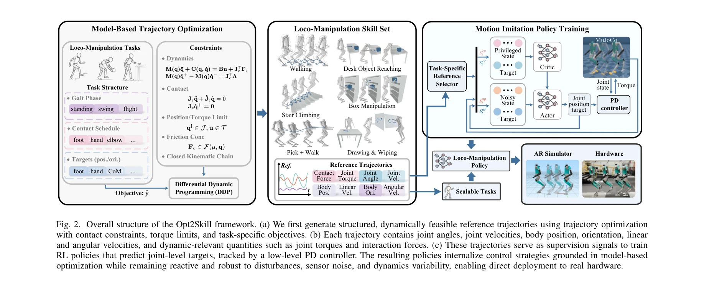

# Opt2Skill: Imitating Dynamically-feasible Whole-Body Trajectories for Versatile Humanoid Loco-Manipulation

> **저자**: Fukang Liu, Zhaoyuan Gu, Yilin Cai, Ziyi Zhou, Hyunyoung Jung, Jaehwi Jang, Shijie Zhao, Sehoon Ha, Yue Chen, Danfei Xu, Ye Zhao | **날짜**: 2024-09-30 | **URL**: [https://arxiv.org/abs/2409.20514](https://arxiv.org/abs/2409.20514)

---

## Essence

*Fig. 1. The proposed Opt2Skill framework enables a Digit humanoid robot to*

Opt2Skill은 differential dynamic programming (DDP)으로 생성한 동역학적으로 실현 가능한 참조 궤적을 강화학습으로 추적하여 휴머노이드 로봇의 다양한 로코-조작 작업을 수행하는 파이프라인이다.

## Motivation

- **Known**: 강화학습은 고차원 공간에서 강력하지만 보상 튜닝이 어렵고, 모델기반 최적제어는 정밀하지만 계산 복잡도가 높으며 접촉 감지가 필수이다.
- **Gap**: 휴머노이드의 전신 로코-조작을 위해 full-order dynamics 기반 궤적 최적화로 강화학습을 안내하는 첫 시도가 부재하며, 인간 모션 캡처 데이터의 신체 차이 문제와 동역학적 실현 불가능성 문제가 해결되지 않았다.
- **Why**: 휴머노이드는 고차원 불안정한 동역학과 복잡한 접촉 상호작용으로 인해 제어가 어려우며, 다양한 작업에서 자연스럽고 강건한 전신 제어가 필수적이기 때문이다.
- **Approach**: DDP를 이용하여 로봇 동역학과 작업 요구사항을 만족하는 전신 궤적을 생성하고, 강화학습 정책이 이 최적 궤적을 추적하도록 훈련하는 end-to-end 파이프라인을 제안한다.

## Achievement

*Fig. 1. The proposed Opt2Skill framework enables a Digit humanoid robot to*

- **Full-order dynamics 기반 궤적 최적화의 첫 적용**: 휴머노이드 로코-조작을 위해 full-order dynamics 모델을 사용한 TO가 강화학습을 안내하는 첫 성공 사례를 입증
- **향상된 모션 품질**: 인간 모션 캡처와 역기구학 기반 참조 대비 높은 품질의 동역학적으로 실현 가능한 모션 데이터 생성으로 추적 정확도 및 작업 성공률 향상
- **접촉력 추적 개선**: TO에서만 얻을 수 있는 관절 토크 정보를 활용하여 테이블 닦기 같은 접촉 관련 작업에서 접촉력 추적 성능 향상
- **다양한 작업의 성공적 실세계 이전**: 평지 보행, 계단 보행, 야외 환경, 대형 물체 운반, 문 통과, 탁상 조작 등 7개 다양한 로코-조작 작업에서 실제 Digit 로봇에 성공적 전이

## How

*Fig. 2. Overall structure of the Opt2Skill framework. (a) We first generate structured, dynamically feasible reference t*

- DDP 알고리즘을 사용하여 접촉 시퀀스와 동역학 제약을 포함한 full-order dynamics 최적 제어 문제 해결
- 생성된 최적 궤적(위치, 속도, 토크)을 강화학습 정책의 참조로 설정
- Policy distillation 기반 motion imitation을 통해 RL 정책이 참조 궤적을 추적하도록 훈련
- Sim-to-real transfer 적용: 시뮬레이션에서 훈련된 정책을 온라인 궤적 적응 없이 실제 로봇에 직접 배포
- 인간 모션 캡처 데이터 및 역기구학 기반 참조와의 비교 분석을 통해 제안 방법의 우월성 검증

## Originality

- Humanoid 로코-조작을 위한 full-order dynamics 기반 TO와 강화학습의 통합이 처음 시도되었으며, 실하드웨어에서 성공한 첫 사례
- 관절 토크 정보의 명시적 활용으로 접촉력 추적 성능 향상을 정량적으로 입증
- 주기적 보행뿐 아니라 비주기적 조작 작업도 포함한 다목적 전신 움직임 생성의 실현
- Quadruped 중심의 기존 TO-기반 모방학습 연구를 bipedal humanoid의 고차원 전신 로코-조작으로 확장

## Limitation & Further Study

- DDP 기반 궤적 최적화 계산 시간 및 확장성에 대한 분석 부재 (계산 복잡도, 작업 복잡도에 따른 수렴 시간 미제시)
- 환경 불확실성(표면 마찰, 물체 무게 변동)에 대한 강건성 평가 부족
- 다양한 humanoid 플랫폼에 대한 일반화 가능성 미검증 (Digit에만 적용)
- 실세계 접촉 감지 오류 또는 부재 상황에서의 정책 성능 저하 가능성 미다룸
- 후속 연구: (1) 접촉 상태 추정 오류 대응 강건성 강화, (2) 여러 humanoid 플랫폼 검증, (3) 온라인 궤적 적응 메커니즘 추가, (4) 계산 효율성 개선

## Evaluation

- Novelty: 4/5
- Technical Soundness: 4/5
- Significance: 4/5
- Clarity: 4/5
- Overall: 4/5

**총평**: 본 논문은 model-based 최적제어와 강화학습을 효과적으로 결합하여 휴머노이드의 복잡한 전신 로코-조작을 실현하는 강력한 파이프라인을 제시하며, 실하드웨어 검증과 정량적 비교 분석을 통해 높은 신뢰도를 확보하고 있다.

## Related Papers

- 🏛 기반 연구: [[papers/1503_Iterative_Closed-Loop_Motion_Synthesis_for_Scaling_the_Capab/review]] — CLAIMS의 자동화된 폐쇄루프 모션 데이터 생성이 DDP 기반 동역학적 궤적 생성의 확장된 활용을 보여줌
- 🔗 후속 연구: [[papers/1594_OmniRetarget_Interaction-Preserving_Data_Generation_for_Huma/review]] — OmniRetarget의 상호작용 보존 데이터 생성과 DDP 기반 동역학적 궤적을 결합하여 loco-manipulation을 실현함
- 🔄 다른 접근: [[papers/1561_Make_Tracking_Easy_Neural_Motion_Retargeting_for_Humanoid_Wh/review]] — 둘 다 동역학적으로 실현 가능한 궤적을 다루지만 1600은 DDP 최적화로, 1561은 neural retargeting으로 생성함
- 🏛 기반 연구: [[papers/1360_DynaRetarget_Dynamically-Feasible_Retargeting_using_Sampling/review]] — humanoid trajectory optimization의 기본 프레임워크를 제공한다
- 🏛 기반 연구: [[papers/1493_Implicit_Kinodynamic_Motion_Retargeting_for_Human-to-humanoi/review]] — DDP 기반 동역학적 실현 가능한 궤적 생성이 implicit kinodynamic retargeting의 이론적 기반을 제공함
- 🔗 후속 연구: [[papers/1503_Iterative_Closed-Loop_Motion_Synthesis_for_Scaling_the_Capab/review]] — Opt2Skill의 DDP 기반 궤적 생성을 자동화된 폐쇄루프 시스템으로 확장하여 스케일링을 실현함
- 🧪 응용 사례: [[papers/1561_Make_Tracking_Easy_Neural_Motion_Retargeting_for_Humanoid_Wh/review]] — Opt2Skill의 DDP 궤적 추적이 neural retargeting으로 생성된 고품질 참조 궤적의 실제 활용 사례를 보여줌
- 🧪 응용 사례: [[papers/1594_OmniRetarget_Interaction-Preserving_Data_Generation_for_Huma/review]] — Opt2Skill의 RL 정책 학습이 OmniRetarget으로 생성된 고품질 참조 궤적의 실제 활용 사례를 보여줌
