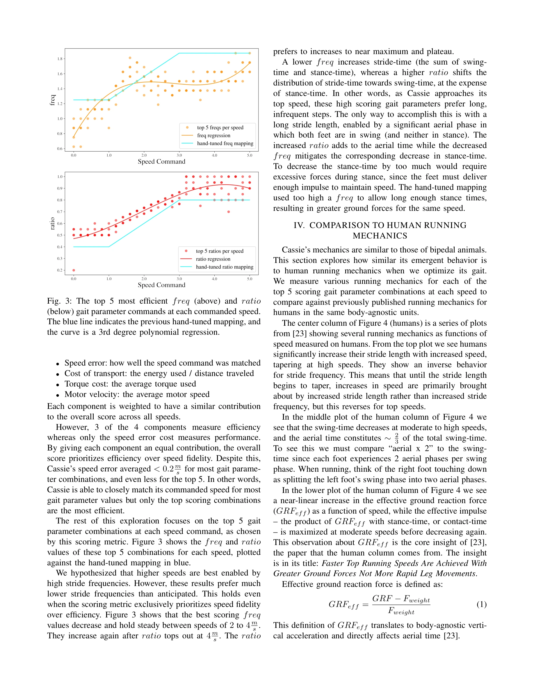

# Optimizing Bipedal Locomotion for The 100m Dash With Comparison to Human Running

> **저자**: Devin Crowley, Jeremy Dao, Helei Duan, Kevin Green, Jonathan Hurst, Alan Fern | **날짜**: 2025-08-05 | **URL**: [https://arxiv.org/abs/2508.03070](https://arxiv.org/abs/2508.03070)

---

## Essence

*Fig. 3: The top 5 most efficient freq (above) and ratio*

이 논문은 이족 로봇 Cassie의 고속 달리기 보행을 최적화하고, 최적화된 보행 특성을 인간의 달리기 역학과 비교하며, 최종적으로 100m 대시의 기네스 월드 레코드를 달성한 완전한 컨트롤러를 제시한다.

## Motivation

- **Known**: RL 기반 이족 보행 로봇의 시뮬레이션-현실 전이는 중속도(~2 m/s)까지 성공했으며, 보행 파라미터(stride frequency, swing ratio)는 속도에 따라 달라져야 한다는 것이 알려져 있다.
- **Gap**: 기존 연구는 보행 파라미터를 고정하거나 손으로 조정했지만, 실제 이족 로봇의 고속 달리기를 위해 파라미터를 체계적으로 최적화하는 방법이 부재했다. 또한 로봇 보행과 인간 보행 역학의 유사성에 대한 직접 비교가 없었다.
- **Why**: 고속 달리기 최적화는 로봇 보행의 효율성과 안정성을 동시에 달성하는 중요한 문제이며, 인간 보행과의 비교를 통해 생물학적으로 영감을 받은 로봇 설계의 타당성을 검증할 수 있다.
- **Approach**: 먼저 PPO 기반 reinforcement learning으로 다양한 gait parameter 조합(ratio, freq)과 속도에서 정책을 훈련한 후, 비용 함수(speed error, cost of transport, torque cost, motor velocity)를 통해 각 속도에서 최적의 파라미터를 선택하고, 최종적으로 이들을 100m 대시 컨트롤러에 통합한다.

## Achievement

*Fig. 3: The top 5 most efficient freq (above) and ratio*

- **보행 파라미터 최적화**: 손으로 조정한 기존 매핑과 질적으로 다른 속도별 최적 gait parameter 곡선을 도출했으며, 특히 높은 속도에서도 낮은 stride frequency가 효율적임을 발견
- **인간-로봇 보행 비교**: 형태학적 차이에도 불구하고 Cassie의 최적화된 보행이 넓은 속도 범위에서 인간 달리기의 주요 특성과 유사함을 입증
- **완전한 100m 대시 컨트롤러**: 정상 상태에서의 시작과 정지를 포함한 실제 경기 규칙을 만족하는 컨트롤러를 개발하여 기네스 월드 레코드 달성

## How

*Fig. 3: The top 5 most efficient freq (above) and ratio*

- MuJoCo 시뮬레이터에서 dynamics randomization을 적용하여 PPO 알고리즘으로 LSTM 기반 정책 훈련
- 35차원 상태(관절 위치/속도, pelvis 방향), clock signal(gait phase), gait parameter(freq, ratio), 목표 속도를 입력으로 사용
- 0-5 m/s 속도 범위와 손으로 조정한 매핑의 ±0.2(ratio), ±0.625(freq) 오프셋 범위에서 모든 파라미터 조합 훈련
- 각 속도에서 50-250 정책 스텝 후 100 스텝 동안 수집한 궤적에 대해 4가지 비용 항목(speed error, cost of transport, torque cost, motor velocity)을 동일 가중치로 평가
- 시뮬레이션에서 최적 파라미터 조합 선택 후 3차 다항식 회귀를 적용하여 매끄러운 speed-to-parameter 곡선 생성
- 최적화된 보행 특성(ground reaction force, step frequency 등)을 인간 생체역학 문헌과 비교
- 구간적 속도 명령 수열과 기동 제어를 추가하여 시작과 정지를 포함한 완전한 100m 대시 컨트롤러 구성

## Originality

- 이족 로봇의 고속 달리기를 위해 gait parameter 공간을 체계적으로 탐색하는 최초의 원칙적 접근법 제시
- 손으로 조정한 매핑보다 효율성이 우수한 새로운 freq-ratio-speed 관계식 발견(특히 중속에서 낮은 stride frequency)
- 로봇 보행 역학을 확립된 인간 생체역학 연구와 정량적으로 비교하는 novel한 관점 제공
- sim-to-real 전이 성공을 통한 실제 하드웨어 검증으로 이론과 실제의 격차 해소

## Limitation & Further Study

- 직선 달리기만 고려했으므로 회전이나 불규칙한 지형에서의 보행 최적화는 미탐색
- 최적화 비용 함수의 4개 항목 가중치를 동일하게 설정했는데, 실제 응용에 맞게 가중치를 조정할 여지 있음
- 비용 함수가 효율성(3개 항목)을 성능(1개 항목)보다 우선시하므로, 속도 정확도와 효율성의 trade-off 분석 필요
- 형태학적으로 매우 다른 로봇이나 환경에서의 이 방법론의 일반화 가능성 검증 필요
- 후속 연구로 동적 환경에서의 적응형 gait parameter 조정, 다양한 로봇 형태에 대한 일반화, 그리고 인간과 같은 수준의 유연한 보행 전환 메커니즘 개발을 제안

## Evaluation

- Novelty: 4/5
- Technical Soundness: 3/5
- Significance: 4/5
- Clarity: 4/5
- Overall: 4/5

**총평**: 이 논문은 이족 로봇의 고속 달리기 최적화에 대한 체계적이고 원칙적인 접근법을 제시하고, 인간 보행과의 비교를 통해 생물학적 타당성을 입증하며, 기네스 월드 레코드로 실제 성과를 입증한 우수한 연구다. 다만 직선 달리기에 국한되고 파라미터 일반화 측면의 심화 분석이 있으면 더욱 완성도 있을 것 같다.

## Related Papers

- 🔄 다른 접근: [[papers/1243_A_Hierarchical_Model-Based_System_for_High-Performance_Human/review]] — 달리기 최적화와 축구 로봇 시스템의 서로 다른 고성능 운동 제어 접근법을 비교 연구할 수 있습니다.
- 🧪 응용 사례: [[papers/1293_Biomechanical_Comparisons_Reveal_Divergence_of_Human_and_Hum/review]] — 달리기 보행 최적화에서 인간 역학 비교가 생물역학적 차이 분석 프레임워크로 검증됩니다.
- 🏛 기반 연구: [[papers/1461_Human-Level_Actuation_for_Humanoids/review]] — 100m 대시 달성이 Human-Level Actuation 평가 프레임워크의 실증적 검증 사례를 제공합니다.
- 🏛 기반 연구: [[papers/1293_Biomechanical_Comparisons_Reveal_Divergence_of_Human_and_Hum/review]] — 생물역학적 차이 분석 방법론이 달리기 보행 최적화에서 인간 역학과의 비교 기준을 제공합니다.
- 🔄 다른 접근: [[papers/1243_A_Hierarchical_Model-Based_System_for_High-Performance_Human/review]] — 축구 로봇의 계층적 시스템과 달리기 최적화 시스템 모두 고성능 운동 제어를 위한 서로 다른 접근법을 제시합니다.
- 🧪 응용 사례: [[papers/1326_DecARt_Leg_Design_and_Evaluation_of_a_Novel_Humanoid_Robot_L/review]] — quasi-telescopic 구조의 민첩한 보행 능력이 고속 달리기 최적화에 활용될 수 있습니다.
- 🔗 후속 연구: [[papers/1461_Human-Level_Actuation_for_Humanoids/review]] — 구동 성능 표준화가 달리기 최적화에서 인간과 로봇의 구동 능력 비교로 확장됩니다.
