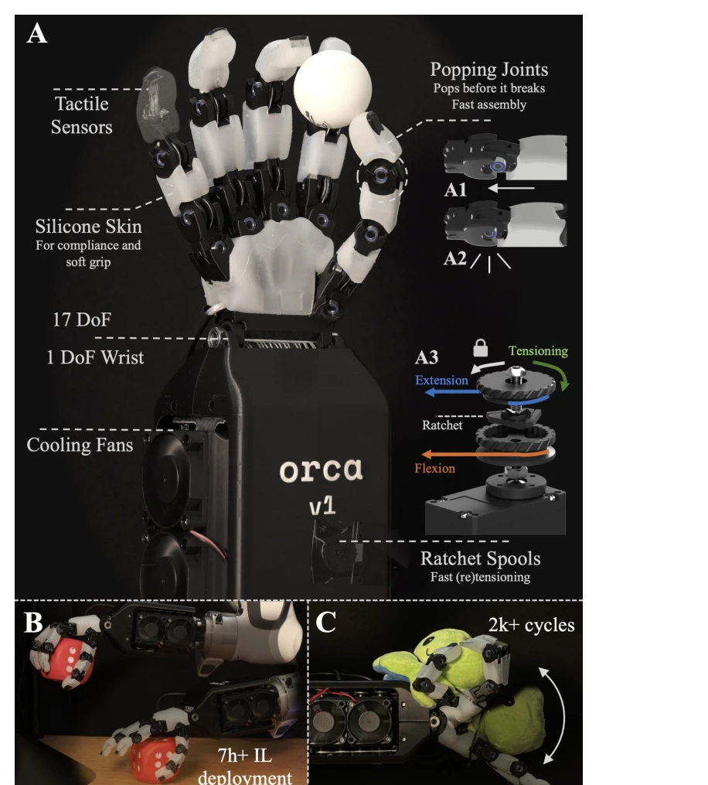
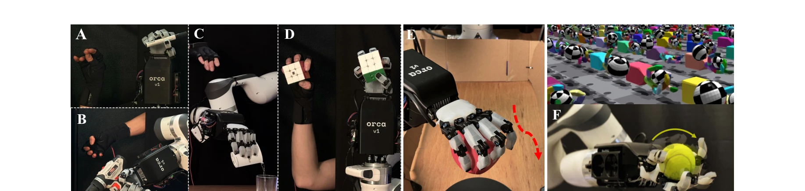
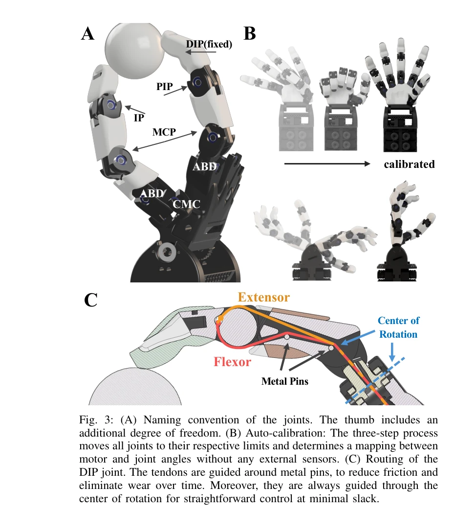

# ORCA: An Open-Source, Reliable, Cost-Effective, Anthropomorphic Robotic Hand for Uninterrupted Dexterous Task Learning

> **저자**: Clemens C. Christoph, Maximilian Eberlein, Filippos Katsimalis, Arturo Roberti, Aristotelis Sympetheros, Michel R. Vogt, Davide Liconti, Chenyu Yang, Barnabas Gavin Cangan, Ronan J. Hinchet, Robert K. Katzschmann | **날짜**: 2025-04-05 | **URL**: [https://arxiv.org/abs/2504.04259](https://arxiv.org/abs/2504.04259)

---

## Essence

*Fig. 1: (A) The ORCA hand closely mimics its human counterpart with*

ORCA는 8시간 내 조립 가능하고 2,000 CHF 이하의 비용으로 제작되는 17-DoF 힘줄 구동 로봇 손으로, 높은 신뢰성과 인간형 형태를 갖추어 접근 가능한 손재술 조작 연구를 가능하게 한다.

## Motivation

- **Known**: Shadow Hand 같은 기존 로봇 손은 매우 비싸고 유지보수가 어렵고, InMoov와 DexHand는 저비용이지만 손재술이 제한되거나 조립이 어렵다. 직접 구동 손(Allegro Hand, LEAP hand)은 비용 효율적이지만 부피가 크고 인간형 형태를 충족하지 못한다.
- **Gap**: 신뢰성 있으면서도 저비용이고 빠르게 조립 가능하며 고수준의 손재술을 수행할 수 있는 anthropomorphic 로봇 손의 부재. 기존 제품들은 비용, 조립성, 내구성, 형태 중 여러 측면을 동시에 만족하지 못한다.
- **Why**: 로봇이 인간과 같은 다재다능성을 갖춰야 하며, anthropomorphic 형태는 대규모 인간 손 상호작용 데이터셋 활용을 가능하게 하고, 접근 가능한 로봇 손은 더 넓은 연구 커뮤니티의 손재술 조작 연구를 가속화할 수 있다.
- **Approach**: tendon-driven 방식을 채택하여 인간형 형태와 민첩성을 확보하고, popping joint 설계로 3D 프린트된 부품의 내구성을 높이며, auto-calibration과 간편한 tensioning 메커니즘으로 복잡성을 줄이고 신뢰성을 확보한다.

## Achievement

*Fig. 2: Versatility of the ORCA hand: (A)-(D) Teleoperation with ROKOKO [10] gloves. (A) Holding a pen (B) Using a drill*

- **저비용 고신뢰성 설계**: 2,000 CHF 이하 비용으로 단일 사용자가 8시간 내 조립 가능한 완전히 기능하는 17-DoF anthropomorphic 로봇 손 구현
- **내구성 입증**: 10,000회 이상 연속 동작 테스트(약 20시간)에서 하드웨어 고장 없이 작동하며 관절 반복성과 정확도 증명
- **다양한 작업 수행**: teleoperation, imitation learning, zero-shot sim-to-real reinforcement learning을 포함한 광범위한 과제에서 손재술 능력 실증
- **anthropomorphic 설계의 실용적 이점**: 인간형 손 데이터셋 활용 가능 및 인간 손으로 설계된 도구와 물체 직접 사용 가능
- **혁신적 기계적 설계**: popping pin joints, auto-calibration 시스템, ratchet spool tensioning mechanism 등 신규 기술로 조립 복잡도와 유지보수 비용 획기적 감소

## How

*Fig. 3: (A) Naming convention of the joints. The thumb includes an*

- Tendon-driven 방식: 각 관절에 2개의 fishing line(flexor/extensor)을 장력 상태로 사용하여 finger inertia 최소화 및 anthropomorphic agility 달성
- Popping pin joints: 원형 호형 홈에 bearing을 배치하여 과도한 하중 시 관절이 탈구되지만 파손되지 않도록 설계
- Auto-calibration: 모터와 관절 각도 간 매핑을 external sensor 없이 결정하기 위해 tendons를 회전 중심을 통과하도록 라우팅
- Friction 감소: tendons를 metal pins/rods로 deflect하고 nonlinear routing에 Teflon tube 사용하여 마찰 및 마모 최소화
- Ratchet spool tensioning: 간단한 한 방향 로테이션으로 slack 제거 가능하며 spooling/unspooling 불필요
- Fully integrated tactile sensors: 손가락에 tactile sensor 내장 및 in-house 제작으로 모듈성과 간결성 확보
- 신뢰성 벤치마킹: 관절 응답 특성, 반복성, 내구성 테스트를 통해 연속 작동 능력 입증

## Originality

- **Popping joint 메커니즘의 신규 도입**: 3D 프린트 부품의 파손 위험을 제거하면서도 pinhole joints의 안정성 유지하는 혁신적 설계
- **Auto-calibration 아키텍처**: external sensors 없이 tendon routing을 통해 자동 보정을 구현한 새로운 접근
- **Anthropomorphic 설계와 저비용의 결합**: 기존에는 anthropomorphic 설계가 고비용이었던 반면, ORCA는 3D 프린팅과 tendon-driven 방식으로 저비용 달성
- **Integrated tactile sensor 솔루션**: fully integrated이면서 in-house 제작 가능한 modular tactile sensor 설계
- **완전 개방형 플랫폼**: design files, source code, documentation 공개로 재현성과 커뮤니티 기여 극대화

## Limitation & Further Study

- **샘플 크기**: 신뢰성 테스트가 실험 기간에 제한되어 있으며, 매우 오랜 기간의 내구성 데이터(수개월/수년) 부재
- **제한된 성능 벤치마크**: 다른 최첨단 로봇 손(Shadow Hand 등)과의 직접적 정량적 비교 부재
- **Sim-to-real transfer의 깊이**: zero-shot sim-to-real RL 결과가 제한적(rolling ball task)이며, 더 복잡한 작업에서의 성공률 미상
- **Tactile sensing 활용도**: tactile sensors가 integrated되었으나, sensor feedback을 활용한 제어 알고리즘의 상세 구현 및 성능 분석 부족
- **확장성 검토**: 다양한 재료 특성(온도, 습도 등)에서의 성능 변화 및 대규모 제조 시 품질 일관성 미검증
- **후속 연구 방향**: (1) 상용 생산 환경에서의 대량 제조 가능성 및 비용 스케일링 검증, (2) 더욱 복잡한 손재술 과제(예: 정밀 assembly)에서의 zero-shot sim-to-real 성공률 개선, (3) tactile feedback 기반 폐루프 제어 알고리즘 개발, (4) 수개월 이상의 장기 내구성 테스트 실시, (5) 다른 anthropomorphic 손들과의 체계적 비교 연구

## Evaluation

- Novelty: 4/5
- Technical Soundness: 4/5
- Significance: 4/5
- Clarity: 4/5
- Overall: 4/5

**총평**: ORCA는 popping joints, auto-calibration, 간편한 tensioning 메커니즘 등 혁신적 기계 설계를 통해 저비용, 빠른 조립, 높은 신뢰성을 동시에 달성한 breakthrough 로봇 손으로, 접근 가능하고 재현 가능한 손재술 연구 플랫폼으로서 상당한 학술적·실용적 기여를 한다.

## Related Papers

- 🔄 다른 접근: [[papers/1238_A_21-DOF_Humanoid_Dexterous_Hand_with_Hybrid_SMA-Motor_Actua/review]] — 힘줄 구동과 SMA-모터 하이브리드 시스템의 서로 다른 17-21 DOF 손재주 손 구현 방식을 비교할 수 있습니다.
- 🔗 후속 연구: [[papers/1269_Antagonistic_Bowden-Cable_Actuation_of_a_Lightweight_Robotic/review]] — ORCA의 17-DoF 설계가 경량 5지 로봇 손의 Bowden 케이블 구동 시스템으로 확장 적용됩니다.
- 🧪 응용 사례: [[papers/1332_Demonstrating_Berkeley_Humanoid_Lite_An_Open-source_Accessib/review]] — 접근 가능한 로봇 손 제작이 오픈소스 휴머노이드의 손재주 조작 능력 향상에 적용됩니다.
- 🏛 기반 연구: [[papers/1269_Antagonistic_Bowden-Cable_Actuation_of_a_Lightweight_Robotic/review]] — 원격 구동과 rolling-contact joint 설계 원리가 힘줄 구동 로봇 손의 기본 구조로 활용됩니다.
- 🔄 다른 접근: [[papers/1238_A_21-DOF_Humanoid_Dexterous_Hand_with_Hybrid_SMA-Motor_Actua/review]] — SMA-모터 하이브리드 시스템과 힘줄 구동 시스템의 손재주 조작 성능과 제작 비용을 비교 분석할 수 있습니다.
- 🏛 기반 연구: [[papers/1262_AGILOped_Agile_Open-Source_Humanoid_Robot_for_Research/review]] — 저비용 오픈소스 휴머노이드 설계 철학이 접근 가능한 로봇 손 제작에도 동일하게 적용됩니다.
- 🏛 기반 연구: [[papers/1332_Demonstrating_Berkeley_Humanoid_Lite_An_Open-source_Accessib/review]] — 오픈소스와 저비용 설계 철학이 접근 가능한 로봇 손 제작에 동일하게 적용되는 기반을 제공합니다.
- 🧪 응용 사례: [[papers/1388_Exceeding_the_Maximum_Speed_Limit_of_the_Joint_Angle_for_the/review]] — 관절 각속도 제한 극복 기술이 17-DoF 힘줄 구동 로봇 손의 고속 조작에 적용 가능합니다.
