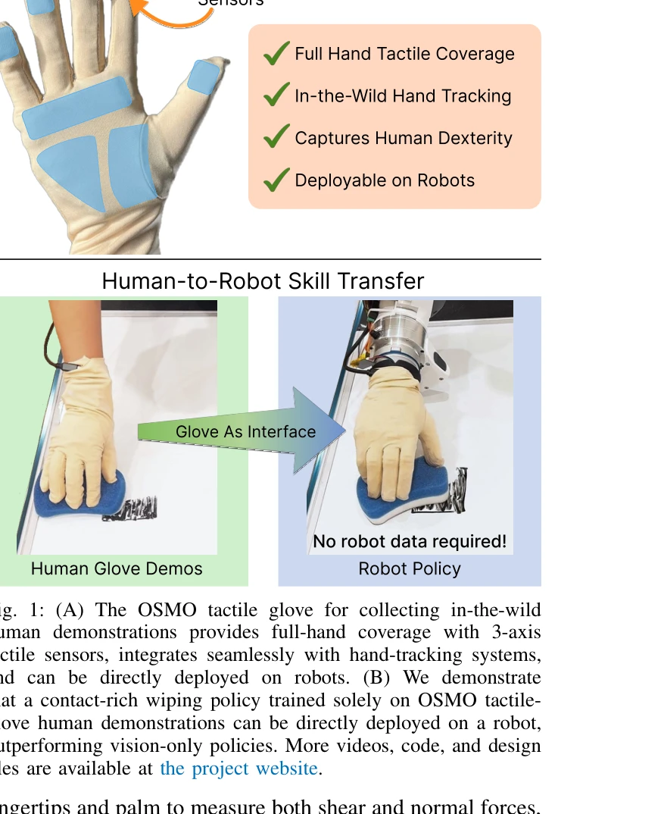
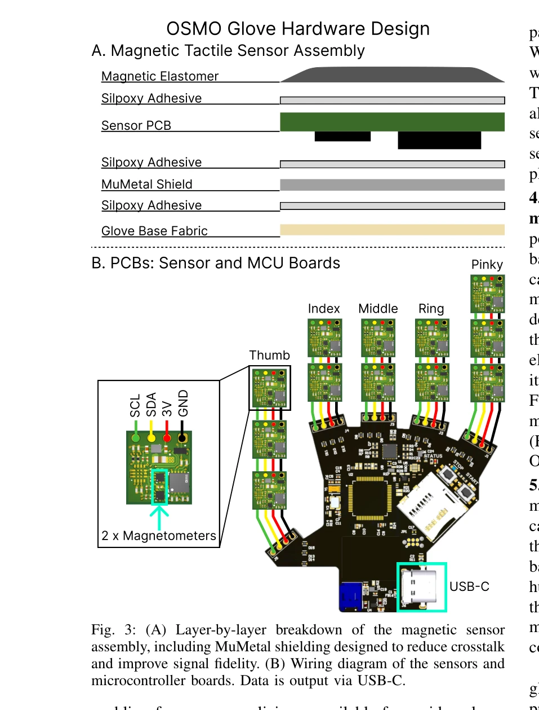

# OSMO: Open-Source Tactile Glove for Human-to-Robot Skill Transfer

> **저자**: Jessica Yin, Haozhi Qi, Youngsun Wi, Sayantan Kundu, Mike Lambeta, William Yang, Changhao Wang, Tingfan Wu, Jitendra Malik, Tess Hellebrekers | **날짜**: 2025-12-09 | **URL**: [https://arxiv.org/abs/2512.08920](https://arxiv.org/abs/2512.08920)

---

## Essence

*Fig. 1: (A) The OSMO tactile glove for collecting in-the-wild*

OSMO는 인간의 접촉 신호를 캡처하는 웨어러블 촉각 장갑으로, 인간의 시연만으로 로봇 정책을 학습하여 접촉 기반 조작 작업을 수행할 수 있게 한다.

## Motivation

- **Known**: 인간 비디오 시연은 로봇 정책 학습을 위한 풍부한 데이터를 제공하지만, 비전만으로는 조작에 필수적인 접촉 신호를 캡처할 수 없다. 기존 촉각 센서는 광학식, 저항식, 자기식 등 다양한 형태로 존재하며, 일부 웨어러블 장치는 로봇 센서를 인간 손가락에 직접 부착하거나 exoskeleton 장갑을 사용한다.
- **Gap**: 기존 유연한 장갑 기반 장치들은 운동학 정보만 제공하거나 법선력만 측정하며, 인간의 완전한 민첩성을 유지하면서 전단력과 법선력 모두를 캡처하는 경우는 없다. 또한 인간 촉각 데이터를 직접 로봇 정책으로 전이하는 파이프라인이 부족하다.
- **Why**: 접촉이 필요한 조작 작업은 시각 정보만으로는 필요한 힘 제어의 미묘한 차이를 추론할 수 없으므로, 촉각 피드백이 필수적이다. 인간과 로봇이 동일한 장갑을 사용하면 신체 차이 문제를 최소화하고 직접 전이가 가능해진다.
- **Approach**: 12개의 3축 자기식 촉각 센서를 손가락 끝과 손바닥에 분포시킨 웨어러블 장갑을 설계하고, 최신 hand-tracking 방법과 호환 가능하도록 구성하였다. 인간 시연 데이터로만 학습한 촉각 인식 정책을 로봇에 배포한다.

## Achievement

*Fig. 1: (A) The OSMO tactile glove for collecting in-the-wild*

- **개방형 하드웨어 플랫폼**: 완전한 하드웨어 설계, 펌웨어, 조립 지시사항을 공개하여 커뮤니티 채택을 지원한다.
- **풀 핸드 촉각 커버리지**: 12개의 taxel을 통해 손가락 끝과 손바닥에 전단력과 법선력(0.3~80 N 범위)을 모두 측정할 수 있다.
- **다중 hand-tracking 호환성**: Aria Gen 2, Quest 3, Apple Vision Pro, HaMeR 등 다양한 hand-tracking 방법과 호환 가능하다.
- **로봇 정책 학습**: 인간 시연만으로 학습한 촉각 인식 정책이 실제 로봇에서 닦기 작업을 72% 성공률로 수행하며, 비전 기반 baseline을 능가한다.
- **구현화 입증**: 실제 조작 작업에서 촉각 정보의 중요성을 정량적으로 입증한다.

## How

*Fig. 3: (A) Layer-by-layer breakdown of the magnetic sensor*

- 자기식 elastic material과 magnetometer로 구성된 sensor-magnet 쌍을 설계하여 3축 힘 측정
- MuMetal 차폐막으로 밀집된 센서 배열의 crosstalk를 완화
- 손가락 끝(5개)과 손바닥(3개 섹션)에 12개의 taxel을 배치하여 유연성 유지
- USB-C 인터페이스를 통한 데이터 출력
- Kinematic retargeting을 이용한 인간 시연에서 로봇 행동으로의 변환
- 촉각 신호를 로봇 정책 학습에 통합

## Originality

- 유연한 장갑 형태로 완전한 인간 민첩성을 유지하면서 전단력과 법선력 모두를 측정하는 첫 번째 플랫폼
- 밀집된 12개의 자기식 센서를 웨어러블 장갑에 통합하고 crosstalk 완화 기법 제시
- 인간과 로봇이 동일한 물리적 인터페이스(OSMO)를 공유하여 시각-촉각 embodiment gap을 최소화
- 순수 인간 시연만으로 로봇 접촉 조작 정책을 학습 가능함을 입증
- 완전 개방형 하드웨어 플랫폼으로 커뮤니티 확산성 확보

## Limitation & Further Study

- 단일 조작 작업(닦기)에서만 평가되었으며, 다양한 접촉 기반 작업에 대한 일반화 가능성 미검증
- 손의 크기 변동에 대한 센서 배치 일관성 논의 부족 (유연한 손가락 길이만으로 대응)
- Psyonic Ability Hand에만 배포되었으며, 다른 로봇 손(Inspire Hand, Sharpa Hand)에 대한 실제 적용은 미래 과제
- 인간과 로봇의 손 해부학적 차이(손가락 길이, 손바닥 크기)가 정책 전이에 미치는 영향 분석 부족
- 촉각 신호 노이즈 특성과 신뢰도에 대한 상세 분석 미흡
- 정책 학습 시 필요한 인간 시연의 수량과 질에 대한 연구 필요

## Evaluation

- Novelty: 4/5
- Technical Soundness: 3/5
- Significance: 4/5
- Clarity: 4/5
- Overall: 4/5

**총평**: OSMO는 촉각 정보를 캡처하는 웨어러블 장갑으로 인간-로봇 스킬 전이 문제를 창의적으로 해결하며, 완전 개방형 하드웨어 공개와 실제 동작 입증으로 높은 임팩트를 제공한다. 다만 단일 작업 평가와 로봇 다양성 부족이 일반화 가능성을 제한한다.

## Related Papers

- 🔄 다른 접근: [[papers/1524_Reactive_Diffusion_Policy_Slow-Fast_Visual-Tactile_Policy_Le/review]] — 인간-로봇 스킬 전이를 위한 오픈소스 촉각 장갑 OSMO와 AR 기반 촉각 피드백 TactAR이 동일한 촉각 인터페이스 문제를 다룬다.
- 🏛 기반 연구: [[papers/1335_DexCap_Scalable_and_Portable_Mocap_Data_Collection_System_fo/review]] — 촉각 장갑을 통한 인간-로봇 스킬 전이가 대규모 정교한 조작을 위한 확장 가능한 모션 캡처의 기반이 된다.
- 🧪 응용 사례: [[papers/1450_HITTER_A_HumanoId_Table_TEnnis_Robot_via_Hierarchical_Planni/review]] — OSMO의 웨어러블 촉각 스킬 전이 기술이 저비용 하드웨어로 정교한 양손 조작 학습에서 실제 활용될 수 있다.
- 🏛 기반 연구: [[papers/1244_A_Humanoid_Visual-Tactile-Action_Dataset_for_Contact-Rich_Ma/review]] — 저비용 촉각 장갑 시스템에서 visual-tactile 융합 데이터의 기초가 된다
- 🔄 다른 접근: [[papers/1251_ACE_A_Cross-Platform_Visual-Exoskeletons_System_for_Low-Cost/review]] — 저비용 정교한 조작을 위해 3D 프린팅 exoskeleton과 촉각 장갑의 다른 접근법이다
- 🔄 다른 접근: [[papers/1524_Reactive_Diffusion_Policy_Slow-Fast_Visual-Tactile_Policy_Le/review]] — AR 기반 촉각 피드백 시스템 TactAR과 웨어러블 촉각 장갑 OSMO가 모두 촉각 정보를 활용한 로봇 제어라는 동일한 문제를 다룬다.
- 🏛 기반 연구: [[papers/1441_Heavy_lifting_tasks_via_haptic_teleoperation_of_a_wheeled_hu/review]] — OSMO의 촉각 글러브 기술이 haptic teleoperation의 기반 기술로 활용된다
