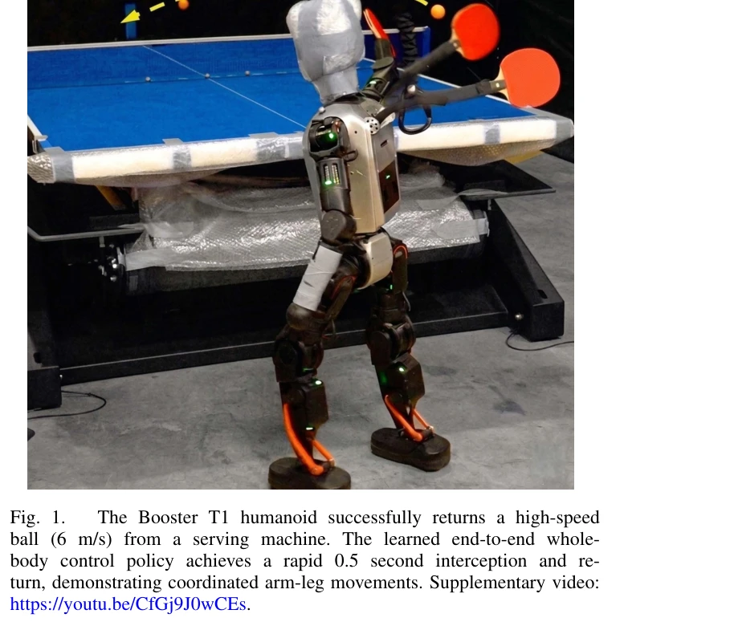

# PACE: Physics Augmentation for Coordinated End-to-end Reinforcement Learning toward Versatile Humanoid Table Tennis

> **저자**: Muqun Hu, Wenxi Chen, Wenjing Li, Falak Mandali, Zijian He, Renhong Zhang, Praveen Krisna, Katherine Christian, Leo Benaharon, Dizhi Ma, Karthik Ramani, Yan Gu | **날짜**: 2026-03-21 | **DOI**: [10.48550/arXiv.2509.21690](https://doi.org/10.48550/arXiv.2509.21690)

---

## Essence

*Fig. 2.*

본 논문은 인간형 로봇의 탁구 경기를 위해 ball-position 관찰을 직접 전신 joint 명령으로 매핑하는 end-to-end RL 프레임워크를 제안하며, learned predictor와 physics-guided dense rewards를 통해 선제적 의사결정과 효율적 탐색을 강화한다.

## Motivation

- **Known**: 인간형 로봇의 탁구는 빠른 인지, 전신 동작, 민첩한 발걸음을 요구하는 도전적 과제이며, 기존 연구는 주로 가상 hitting-plane 가정에 의존하는 모델 기반 방법이나 팔 로봇에 국한된 learning-based 방법을 다루었다.
- **Gap**: end-to-end RL을 high-DoF 인간형 로봇의 전신 움직임(팔 타격 + 다리 보행)에 적용할 때 높은 차원의 action space, 불안정한 보행 역학, sparse ball-hitting rewards로 인한 낮은 샘플 효율성 문제가 미해결되어 있다.
- **Why**: 인간형 로봇이 일반 목적의 embodied agent로 실제 동적 과제를 수행하려면 고속 인지와 coordinated whole-body control 능력이 필수적이며, 탁구는 이러한 능력의 실질적 검증 및 발전을 위한 이상적인 벤치마크이다.
- **Approach**: 본 논문은 recent ball positions로부터 미래 ball states를 추정하는 lightweight learned predictor와 physics-based predictor의 예측을 이용한 dense, informative rewards를 결합하여 proactive 의사결정과 효율적 탐색을 가능하게 한다.

## Achievement

*Fig. 1.*

- **높은 성공률**: 다양한 serve ranges에서 hit rate ≥96%, success rate ≥92%의 강력한 성능을 simulation에서 달성
- **통합 프레임워크**: 모듈식 분해나 계층적 planning 없이 locomotion과 arm striking을 통합 조정하는 unified end-to-end RL 프레임워크 제시
- **Hardware 실증**: 23개 revolute joints를 가진 Booster T1 humanoid에서 zero-shot deployment로 coordinated lateral 및 forward-backward footwork와 정확한 고속 return 생성
- **Ablation 검증**: learned predictor와 predictive reward design이 end-to-end learning에 critical함을 실증
- **공개 코드**: 재현성을 위해 RL training code를 open-source로 제공

## How

- Learned predictor: recent ball position history를 입력받아 미래 ball state를 추정하고, policy의 observation을 augment하여 proactive decision-making 지원
- Physics-based prediction: simulation 중 precise future states를 공급하여 dense, informative rewards 구성의 기초 제공
- Prediction-based reward design: hit-guidance reward(proactive interception 유도) + return-guidance reward(strike quality 평가) 조합
- POMDP formulation: partial observation과 observation history oH_t를 활용하여 temporal behavior 캡처
- PPO (Proximal Policy Optimization)를 이용한 policy optimization

## Originality

- High-dimensional humanoid whole-body TT에 첫 통합 end-to-end RL 프레임워크 적용 (hierarchical decomposition 또는 virtual hitting-plane 가정 없음)
- Learned predictor를 관찰에 augmentation하는 방식으로 proactive control을 enable하는 혁신적 접근
- Physics-based predictor의 예측을 training supervision으로 활용하여 sparse rewards 문제 해결하는 physics-augmentation 전략
- 23-DoF 실제 humanoid robot에서 coordinated arm-leg strike와 agile footwork의 동시 달성

## Limitation & Further Study

- 현재 단일 serving machine 환경에서만 테스트되었으며, 실제 경기에서의 multi-rally 상황이나 다양한 opponent strategies 대응은 미검증
- Physics-based predictor에 의존하는 reward design이 sim-to-real gap을 일부 유지할 수 있으며, hardware 환경에서의 예측 정확도 영향 미분석
- Learned predictor의 generalization 능력(예: 다른 공의 크기/무게, 테이블 높이 변화)에 대한 robustness 평가 부재
- Balance maintenance와 fall recovery 메커니즘이 상세히 기술되지 않아 극한 상황에서의 stability 확보 여부 불명확
- **후속연구**: (1) multi-agent RL 또는 hierarchical planning을 통한 competitive strategy learning, (2) meta-learning을 활용한 다양한 opponent/환경 adaptation, (3) real-time sensor feedback integration을 통한 robust closed-loop control 강화

## Evaluation

- Novelty: 4/5
- Technical Soundness: 3/5
- Significance: 4/5
- Clarity: 4/5
- Overall: 4/5

**총평**: 본 논문은 인간형 로봇의 고차원 전신 제어에 end-to-end RL을 성공적으로 적용한 중요한 기여로, learned predictor와 physics-augmented rewards 설계를 통해 sample efficiency와 exploration 효율성을 현저히 개선하였으며, 실제 hardware에서의 동작 검증으로 실용적 가치를 입증한다.

## Related Papers

- 🏛 기반 연구: [[papers/1444_Language_to_Rewards_for_Robotic_Skill_Synthesis/review]] — 계층적 계획과 제어 프레임워크가 PACE의 탁구 경기를 위한 end-to-end 학습에서 계층적 의사결정 구조의 이론적 기초를 제공합니다.
- 🔄 다른 접근: [[papers/1450_HITTER_A_HumanoId_Table_TEnnis_Robot_via_Hierarchical_Planni/review]] — 탁구 기술 학습에서 계층적 계획과 end-to-end RL 접근법이 서로 다른 학습 아키텍처를 제시합니다.
- 🔗 후속 연구: [[papers/1324_Bridging_Language_and_Action_A_Survey_of_Language-Conditione/review]] — 단안 비디오에서 접촉 가이드된 실제-시뮬레이션 변환이 PACE의 물리 가이드된 보상 설계를 위한 현실적인 데이터 확장 방법을 제공합니다.
