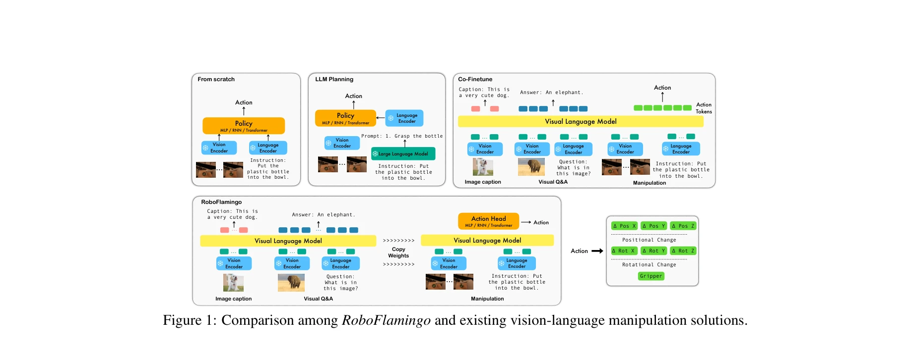
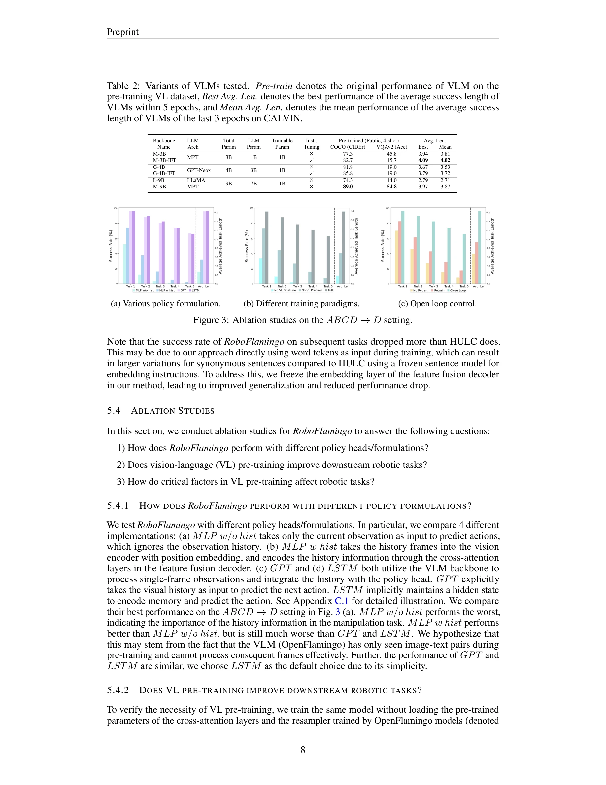
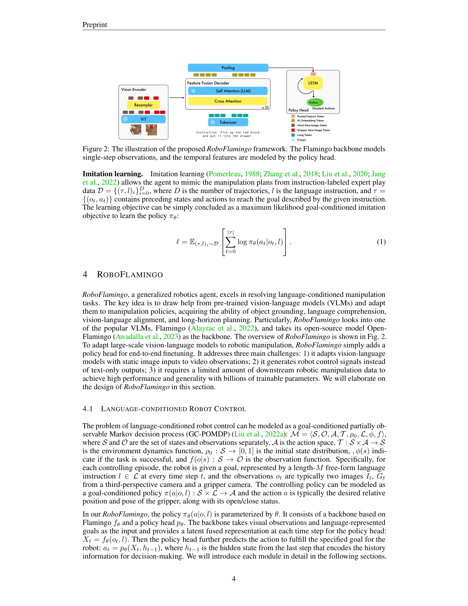

# Vision-Language Foundation Models as Effective Robot Imitators

> **저자**: Xinghang Li, Minghuan Liu, Hanbo Zhang, Cunjun Yu, Jie Xu, Hongtao Wu, Chilam Cheang, Ya Jing, Weinan Zhang, Huaping Liu, Hang Li, Tao Kong | **날짜**: 2023-11-02 | **URL**: [https://arxiv.org/abs/2311.01378](https://arxiv.org/abs/2311.01378)

---

## Essence

*Figure 1: Comparison among RoboFlamingo and existing vision-language manipulation solutions.*

RoboFlamingo는 공개 소스 VLM인 OpenFlamingo를 기반으로 하여 로봇 조작 정책을 구축하는 프레임워크로, 시각-언어 이해와 의사결정을 분리하고 최소한의 미세조정으로 높은 성능을 달성한다.

## Motivation

- **Known**: Vision-Language Foundation Model(VLM)은 멀티모달 데이터 이해에 뛰어나고, 기존 연구들은 LLM 기반 계획 또는 전체 모델의 공동 미세조정 방식으로 로봇 제어에 활용하고 있다.
- **Gap**: 기존 VLM 기반 로봇 제어 방법들은 높은 계산 비용, 비공개 모델 의존성, 대규모 데이터 필요로 인해 일반 연구자의 접근이 어렵다.
- **Why**: 저비용이면서도 높은 성능의 로봇 조작 정책을 쉽게 개발할 수 있는 솔루션이 필요하며, 이는 비전문가도 자신의 로봇 정책을 미세조정할 수 있도록 민주화한다.
- **Approach**: RoboFlamingo는 사전학습된 VLM을 단계별 시각-언어 이해에만 활용하고, 명시적 정책 헤드를 통해 순차 정보를 모델링하며, 언어 조건부 조작 데이터셋에서만 모방 학습으로 미세조정한다.

## Achievement

*Figure 3: Ablation studies on the ABCD →D setting.*

- **CALVIN 벤치마크 성과**: 이전 최첨단 방법 대비 2배의 성능 향상을 달성
- **효율성**: 단일 GPU 서버에서 훈련 및 평가 가능한 저비용 솔루션
- **유연성**: 개방 루프 제어 및 저성능 플랫폼 배포에 적합한 구조
- **일반화**: 제로샷 설정 및 새로운 환경에서의 우수한 일반화 성능
- **인사이트**: 다양한 사전학습된 VLM의 조작 작업 성능 비교 분석

## How

*Figure 2: The illustration of the proposed RoboFlamingo framework. The Flamingo backbone models*

- OpenFlamingo 기반의 사전학습된 비전 및 언어 인코더 활용
- 각 의사결정 단계에서 관찰과 지시를 독립적으로 처리
- 명시적 정책 헤드(MLP/RNN/Transformer)로 시간 시퀀스 정보 모델링
- 언어 조건부 조작 데이터셋(CALVIN)에서만 모방 학습 적용
- 액션을 위치 변화(Δ Pos X/Y/Z), 회전 변화(Δ Rot X/Y/Z), 그리퍼 상태로 분해

## Originality

- VLM의 시각-언어 이해 능력과 로봇 정책 학습을 명확히 분리하는 구조의 창안
- 기존 RT-2, PaLM-E 등과 달리 공개 소스 모델 기반으로 저비용 솔루션 제시
- 대규모 웹 데이터 공동 미세조정 없이도 최첨단 성능 달성하는 방식의 제안
- 순차 정보 모델링을 위한 명시적 정책 헤드 도입으로 개방 루프 제어 가능하게 함

## Limitation & Further Study

- CALVIN 벤치마크라는 제한된 시뮬레이션 환경에서만 검증되어 실제 로봇 하드웨어에서의 성능 확인 필요
- 긴 수평선 작업(long-horizon task) 성능의 한계와 개선 방안 부재
- 상이한 VLM 백본(MPT-3B-IFT, OpenFlamingo 등) 간 상세한 비교 분석 미흡
- 도메인 적응(domain adaptation) 및 시뮬레이션-현실 간극(sim-to-real gap) 해결 전략 제시 필요
- 향후 연구로 더 큰 규모의 데이터셋과 실제 로봇 실험, 다중 로봇 플랫폼 적용 검토 필요

## Evaluation

- Novelty: 4/5
- Technical Soundness: 3/5
- Significance: 4/5
- Clarity: 4/5
- Overall: 4/5

**총평**: RoboFlamingo는 공개 소스 VLM을 활용하여 저비용이면서도 높은 성능의 로봇 조작 정책을 구현할 수 있는 효과적인 방법을 제시하며, 시각-언어 이해와 정책 학습의 분리라는 명확한 설계 철학으로 로봇 공학의 민주화에 기여한다.

## Related Papers

- 🏛 기반 연구: [[papers/1611_Visual_Instruction_Tuning/review]] — Visual Instruction Tuning의 vision-language 연결 기법을 로봇 정책 학습에 적용한 구체적 사례다
- 🔄 다른 접근: [[papers/1510_OpenVLA_An_Open-Source_Vision-Language-Action_Model/review]] — 둘 다 VLM 기반 로봇 정책이지만 RoboFlamingo는 OpenFlamingo, OpenVLA는 처음부터 설계된 차이가 있다
- 🔗 후속 연구: [[papers/1433_In-Context_Imitation_Learning_via_Next-Token_Prediction/review]] — in-context learning을 통한 모방 학습으로 RoboFlamingo의 few-shot 학습 능력을 이론적으로 뒷받침한다
- 🧪 응용 사례: [[papers/1425_Human2Robot_Learning_Robot_Actions_from_Paired_Human-Robot_V/review]] — Human2Robot과 함께 인간-로봇 행동 전이에서 vision-language 모델의 활용 방안을 보완적으로 제시한다
- 🔄 다른 접근: [[papers/1506_Open-World_Object_Manipulation_using_Pre-trained_Vision-Lang/review]] — Pre-trained vision-language model을 로봇 모방 학습에 활용하는 서로 다른 접근 방식을 보여준다.
