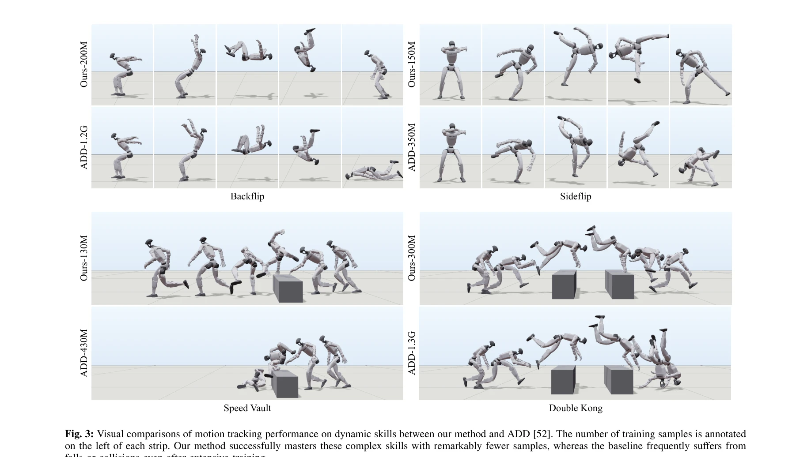
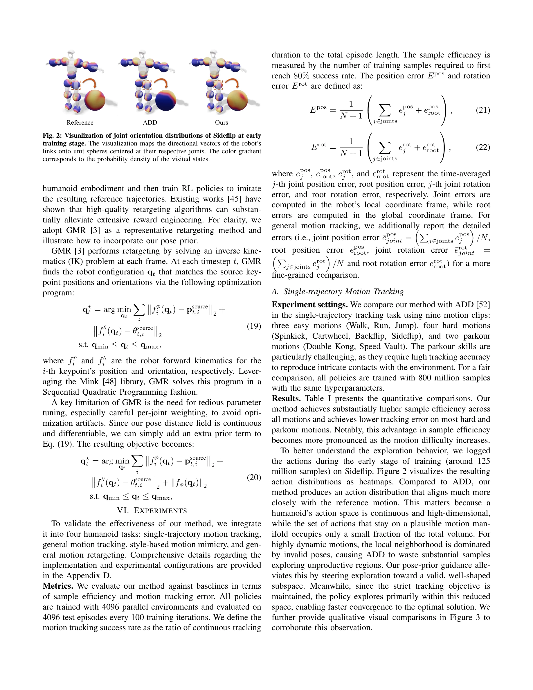

# PDF-HR: Pose Distance Fields for Humanoid Robots

> **저자**: Yi Gu, Yukang Gao, Yangchen Zhou, Xingyu Chen, Yixiao Feng, Mingle Zhao, Yunyang Mo, Zhaorui Wang, Lixin Xu, Renjing Xu | **날짜**: 2026-02-04 | **DOI**: [10.48550/arXiv.2602.04851](https://doi.org/10.48550/arXiv.2602.04851)

---

## Essence

*Fig. 1: We present PDF-HR, which learns the manifold of plausible G1 poses as a zero-level set. Left: The fϕ is trained *

humanoid robot의 pose 분포를 continuous differentiable manifold로 학습하는 lightweight prior인 PDF-HR을 제안하여, 주어진 pose가 dataset manifold로부터 얼마나 가까운지 예측함으로써 pose plausibility를 정량화한다.

## Motivation

- **Known**: human motion recovery에서 pose/motion prior가 광범위하게 연구되었으며, humanoid robotics에서도 DeepMimic, AMP 등 motion imitation이 활용되고 있다.
- **Gap**: humanoid robot에 적용 가능한 general purpose pose prior가 부족한 이유는 고품질 humanoid motion data의 scarcity와 human 형태에서 robot morphology로의 직접 transfer 어려움 때문이다.
- **Why**: humanoid robot 제어에서 joint limit, self-collision, contact feasibility, balance를 동시에 만족하면서도 자연스러운 motion을 생성해야 하므로, 이를 정규화할 수 있는 reusable pose prior가 중요하다.
- **Approach**: MLP 기반 distance-to-data function을 학습하여 임의의 pose를 retargeted robot pose corpus의 nearest neighbor까지의 distance로 매핑하고, 이를 reward shaping, regularizer, plausibility scorer로 다양하게 적용한다.

## Achievement

*Fig. 3: Visual comparisons of motion tracking performance on dynamic skills between our method and ADD [52]. The number *

- **PDF-HR 설계**: retargeted robot pose로부터 학습한 continuous differentiable pose distance field를 제안하여 pose plausibility를 smooth measure로 제공
- **plug-and-play 통합**: motion tracking, motion retargeting 등 diverse pipeline에 reward term, regularizer, standalone scorer로 적용 가능한 modular architecture
- **일관된 성능 향상**: single-trajectory tracking, general motion tracking, style-based motion mimicry, motion retargeting 4가지 task에서 baseline 대비 substantial improvement 달성
- **computational efficiency**: compact MLP 기반 모델로 기존 system에 용이하게 통합 가능하며 재학습 불필요

## How

*Fig. 2: Visualization of joint orientation distributions of Sideflip at early*

- SO(3) Lie group을 기반한 Riemannian manifold 구조를 활용하여 K-joint skeleton configuration space를 power manifold SO(3)^K로 정형화
- retargeted robot pose corpus에서 near-manifold samples를 강조하면서 pose space를 커버하는 training distribution을 설계
- cross-validation으로 reliable positive samples를 선별하여 well-behaved distance field 학습
- Riemannian gradient descent를 통해 optimization 중에도 manifold 위에 유지되는 의미 있는 gradients 생성
- motion tracking에서는 pose reward를 RL objective에 포함시켜 near-manifold 영역에서의 exploration 장려
- motion retargeting에서는 optimization 루프의 regularizer로 geometric constraints와 함께 활용

## Originality

- human motion prior에서 발전한 implicit manifold representation (Pose-NDF, NRDF, NRMF)를 humanoid robot 도메인으로 최초로 확장
- generative distribution 전체를 모델링하는 기존 방식 대신 distance-to-data function에 중점하여 간단하면서도 효과적인 대안 제시
- Riemannian geometry 기반의 엄밀한 manifold 구조화로 SO(3) power manifold 위에서 의미 있는 거리 정의
- task-agnostic reusable prior로서 data 수집 없이도 다양한 downstream task에 적용 가능한 modularity 구현

## Limitation & Further Study

- retargeted robot pose corpus의 quality와 coverage에 의존하므로, 데이터셋에 없는 extreme pose에 대해서는 제한적일 수 있음
- Riemannian gradient descent 기반 optimization의 computational overhead와 convergence 특성에 대한 자세한 분석 부족
- style-based motion mimicry와 관련하여 style representation과의 상호작용 메커니즘이 충분히 명확하지 않음
- 실시간 제어 환경에서의 responsiveness와 contact dynamics 변화에 대한 robustness 검증 필요
- 다양한 humanoid robot morphology에 대한 generalization 가능성에 대한 systematic evaluation 부재

## Evaluation

- Novelty: 4/5
- Technical Soundness: 3/5
- Significance: 4/5
- Clarity: 4/5
- Overall: 4/5

**총평**: humanoid robotics에서 long-standing challenge인 reusable pose prior 부족 문제를 distance field 패러다임으로 우아하게 해결하고, 다양한 task에서 일관되게 성능을 향상시키며 실제 배포까지 시연한 강력한 연구이다.

## Related Papers

- 🏛 기반 연구: [[papers/1293_A_Distributional_Treatment_of_Real2Sim2Real_for_Object-Centr/review]] — biomechanical 설계와 pose 분포 학습을 결합하여 humanoid 로봇의 물리적 제약을 반영한 모션 생성 기반을 제공한다
- 🔗 후속 연구: [[papers/1607_PDF-HR_Pose_Distance_Fields_for_Humanoid_Robots/review]] — PDF-HR의 pose manifold 학습을 3D 공간에서의 정책 학습으로 확장한 접근법이다
- ⚖️ 반론/비판: [[papers/1461_Human-Level_Actuation_for_Humanoids/review]] — Human-Level Actuation이 하드웨어 개선을, PDF-HR이 소프트웨어 최적화를 통한 humanoid 성능 향상의 대조적 접근을 보여준다
- 🧪 응용 사례: [[papers/1582_Natural_Humanoid_Robot_Locomotion_with_Generative_Motion_Pri/review]] — 자연스러운 humanoid 움직임 생성에서 PDF-HR의 pose plausibility와 generative motion prior의 상호 보완적 역할을 한다
- 🏛 기반 연구: [[papers/1298_A_Survey_of_Embodied_Learning_for_Object-Centric_Robotic_Man/review]] — PDF-HR의 humanoid pose distance field가 object-centric manipulation의 embodied learning에서 공간적 제약 모델링의 기반을 제공한다.
- 🏛 기반 연구: [[papers/1486_Multimodal_Perception_for_Goal-oriented_Navigation_A_Survey/review]] — Vision-Language Navigation의 체계적 분류가 goal-oriented navigation에서 multimodal perception의 이론적 기반을 제공한다.
- 🏛 기반 연구: [[papers/1567_SE3-Equivariant_Robot_Learning_and_Control_A_Tutorial_Survey/review]] — 휴머노이드 전신 제어에서 위치 거리 필드가 SE(3) 동형성을 활용한 기하학적 제어의 실제 응용을 보여준다.
