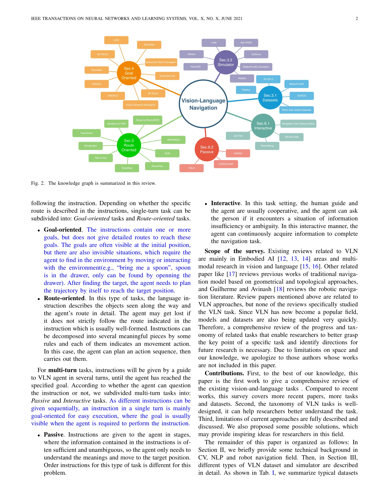

# Vision-Language Navigation: A Survey and Taxonomy

> **저자**: Wansen Wu, Tao Chang, Xinmeng Li | **날짜**: 2021-08-26 | **URL**: [https://arxiv.org/abs/2108.11544](https://arxiv.org/abs/2108.11544)

---

## Essence

*Fig. 2. The knowledge graph is summarized in this review.*

본 논문은 Vision-Language Navigation(VLN) 분야를 종합적으로 조사하고, 언어 지시의 특성에 따라 single-turn/multi-turn, goal-oriented/route-oriented, passive/interactive 등으로 체계적으로 분류한 택소노미를 제시한다.

## Motivation

- **Known**: Vision과 Language를 결합한 navigation 연구가 증가하고 있으며, 기존 조사들은 Embodied AI나 multimodal vision-language 분야에 국한되어 있다. R2R, REVERIE 등 다양한 VLN 태스크와 데이터셋이 제안되었다.
- **Gap**: 기존 조사들은 VLN 태스크 자체에 특화된 포괄적 분류 체계와 비교 분석이 부족하며, 다양한 VLN 태스크들의 본질적 차이점과 각 모델의 설계 요구사항 간 관계를 명확히 하는 연구가 필요하다.
- **Why**: VLN은 인간의 기대치에 더 부합하는 인공지능 태스크이며, 자연어 처리, 컴퓨터 비전, 로보틱스를 통합하는 복잡한 문제로 체계적인 이해와 분류가 필수적이다.
- **Approach**: 언어 지시의 제시 방식(단회/다회)과 형태(목표/경로)에 따라 VLN 태스크를 계층적으로 분류하고, 각 카테고리별 데이터셋, 시뮬레이터, 모델 설계 특성을 상세히 분석한다.

## Achievement

*Fig. 2. The knowledge graph is summarized in this review.*

- **포괄적 VLN 택소노미**: 단회/다회, 목표/경로 지향, 수동/상호작용 기반의 4단계 분류 체계 제시로 VLN 태스크의 본질적 차이를 명확히 함
- **광범위한 태스크 및 데이터셋 카탈로그**: R2R, REVERIE, ALFRED 등 40개 이상의 VLN 관련 태스크와 Matterport3D, Gibson 등 시뮬레이터를 체계적으로 정리
- **모델 설계 요구사항 분석**: 각 VLN 카테고리가 요구하는 에이전트의 서로 다른 기능(경로 계획, 상호작용, 객체 조작 등)을 명확히 구분
- **한계점 및 개선 방향 제시**: 기존 VLN 모델과 태스크 설정의 제한사항을 분석하고 지식 통합 및 실물 환경 구현의 미래 기회를 제안

## How

*Fig. 2. The knowledge graph is summarized in this review.*

- 언어 지시 제시 방식에 따른 1차 분류: single-turn vs multi-turn
- Single-turn 태스크의 2차 분류: goal-oriented(목표 위치 지정)와 route-oriented(상세 경로 지정)
- Multi-turn 태스크의 2차 분류: passive(미리 결정된 지시)와 interactive(에이전트 질의 가능)
- 각 카테고리별 주요 데이터셋, 시뮬레이터, 태스크 특성을 표(Table I)로 정렬하여 비교 분석
- Knowledge graph(Figure 2)를 통해 태스크, 데이터셋, 시뮬레이터 간 관계를 시각화

## Originality

- VLN 분야에 최초로 **언어 지시 특성 기반의 체계적 택소노미** 제시로 기존 environment 기반 분류의 한계를 극복
- Single-turn/multi-turn과 goal-oriented/route-oriented의 조합을 통한 **4단계 계층적 분류 체계** 개발
- Passive/interactive 구분을 통해 **에이전트와 환경의 상호작용 방식**을 명시적으로 모델링
- 40개 이상의 VLN 관련 태스크를 단일 프레임워크로 통합하여 **포괄적 학술 지형도** 제시

## Limitation & Further Study

- **시각적 환경의 다양성 미흡**: 실내/실외 환경만 다루며, 더 복잡한 혼합 환경(혼잡한 거리, 역동적 장애물 등)에 대한 고려 부족
- **실제 로봇 환경과의 괴리**: 대부분 시뮬레이션 환경 기반이며 RobotSlang 외 실물 환경 태스크가 극히 제한적
- **언어 지시의 복잡도 제한**: 현재 태스크들이 상대적으로 단순한 자연어 지시를 사용하며, 모호성, 다의성, 암묵적 참조 등 현실적 복잡성 부족
- **멀티모달 상호작용의 제한**: 음성, 제스처 등 추가 모달리티 통합 필요성 미제시
- **후속 연구 방향**: (1) 실물 환경에서의 VLN 모델 검증, (2) 외부 지식(상식, 의미론적 정보) 통합, (3) 동적 환경과 예측 불가능한 상황 처리, (4) 다국어 및 다문화 언어 지시 지원

## Evaluation

- Novelty: 4/5
- Technical Soundness: 3/5
- Significance: 4/5
- Clarity: 4/5
- Overall: 4/5

**총평**: 본 논문은 VLN 분야의 첫 번째 포괄적 조사로서, 언어 지시의 특성 기반 4단계 택소노미를 제시하여 산재된 VLN 태스크들을 통일된 프레임워크로 정리했다. 명확한 분류 체계와 광범위한 문헌 커버리지는 연구자들이 VLN의 전체 landscape를 이해하고 미래 연구 방향을 설정하는 데 큰 도움이 될 것으로 예상된다.

## Related Papers

- 🔗 후속 연구: [[papers/1614_VL-Nav_A_Neuro-Symbolic_Approach_for_Reasoning-based_Vision-/review]] — VLN survey의 분류 체계가 VL-Nav의 neuro-symbolic approach가 다루는 복잡한 reasoning 기반 네비게이션의 이론적 기반을 제공
- 🏛 기반 연구: [[papers/1612_Visual_Language_Maps_for_Robot_Navigation/review]] — VLN 분야 전반의 taxonomy가 Visual Language Maps의 특정 구현 방법이 전체 분야에서 차지하는 위치와 기여를 이해하는 기반
- 🧪 응용 사례: [[papers/1489_NaVid_Video-based_VLM_Plans_the_Next_Step_for_Vision-and-Lan/review]] — VLN survey에서 제시한 분류 기준이 NaVid의 video-based VLM planning 접근법의 평가와 비교 분석에 활용 가능
- 🔄 다른 접근: [[papers/1432_Improving_Vision-and-Language_Navigation_with_Image-Text_Pai/review]] — Vision-Language Navigation 서베이도 시각-언어 네비게이션의 전반적 발전을 다룬다.
- 🔗 후속 연구: [[papers/1441_JanusVLN_Decoupling_Semantics_and_Spatiality_with_Dual_Impli/review]] — 시각-언어 네비게이션의 전반적인 분류 체계에서 듀얼 메모리 접근법의 위치를 이해할 수 있습니다.
- 🔗 후속 연구: [[papers/1485_Multimodal_Fusion_and_Vision-Language_Models_A_Survey_for_Ro/review]] — 시각-언어 네비게이션 서베이를 멀티모달 융합과 VLM 관점에서 확장하여 더욱 포괄적인 분석을 제공합니다.
- 🧪 응용 사례: [[papers/1489_NaVid_Video-based_VLM_Plans_the_Next_Step_for_Vision-and-Lan/review]] — 시각-언어 네비게이션의 분류 체계에서 비디오 기반 VLM 접근법의 위치와 활용을 이해할 수 있습니다.
- 🏛 기반 연구: [[papers/1612_Visual_Language_Maps_for_Robot_Navigation/review]] — Visual Language Maps가 Vision-Language Navigation survey에서 다루는 spatial relationship navigation의 구체적인 구현 방법론을 제시
- 🔗 후속 연구: [[papers/1614_VL-Nav_A_Neuro-Symbolic_Approach_for_Reasoning-based_Vision-/review]] — VL-Nav의 neuro-symbolic reasoning이 VLN survey에서 제시한 interactive navigation 분류에서 reasoning 능력을 대폭 강화한 발전된 형태
- 🏛 기반 연구: [[papers/1326_CANVAS_Commonsense-Aware_Navigation_System_for_Intuitive_Hum/review]] — Vision-Language Navigation 조사 논문이 CANVAS의 직관적 인간-로봇 상호작용에 대한 이론적 배경을 제공한다
