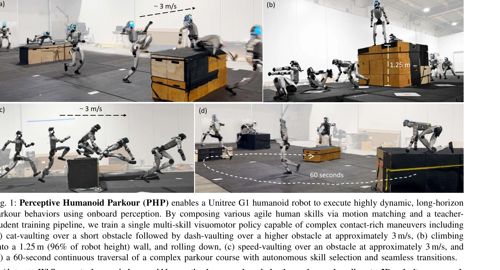

# Perceptive Humanoid Parkour: Chaining Dynamic Human Skills via Motion Matching

> **저자**: Zhen Wu, Xiaoyu Huang, Lujie Yang, Yuanhang Zhang, Koushil Sreenath, Xi Chen, Pieter Abbeel, Rocky Duan, Angjoo Kanazawa, Carmelo Sferrazza, Guanya Shi, C. Karen Liu | **날짜**: 2026-02-17 | **DOI**: [10.48550/arXiv.2602.15827](https://doi.org/10.48550/arXiv.2602.15827)

---

## Essence

*Fig. 2: Perceptive Humanoid Parkour overview. Atomic parkour skills are composed into long-horizon kinematic reference*

Motion matching을 통해 인간 동작 데이터를 합성하고, 교사-학생 강화학습 파이프라인으로 단일 깊이 기반 정책을 학습하여 휴머노이드 로봇이 복잡한 장애물 코스에서 자율적으로 파쿠르를 수행하도록 함.

## Motivation

- **Known**: 최근 휴머노이드 로봇의 보행 안정성은 향상되었으나, 인간 수준의 민첩성과 적응성을 갖춘 동적 동작 학습은 여전히 미해결 과제이며, 특히 장시간 스킬 연쇄와 지각 기반 의사결정이 필요한 복잡한 환경에서의 도전이 있다.
- **Gap**: 기존 연구는 고차원 제어 공간에서 다수의 동적 스킬을 단일 정책으로 통합하기 어렵고, 순수 DAgger 증류는 등반이나 볼팅 같은 고동적 스킬에서 누적 오류로 인해 실패하는 문제가 있다.
- **Why**: 파쿠르는 빠른 환경 인식, 스킬 선택, 스무드한 전이가 필요한 실제 휴머노이드 로봇의 민첩성을 평가하는 좋은 테스트베드이며, 이를 통해 복잡한 지형 횡단 능력을 갖춘 로봇 개발이 가능해진다.
- **Approach**: 원자적 인간 동작을 motion matching으로 합성하여 장시간 키네마틱 궤적을 생성하고, 이를 추적하는 RL 전문가를 학습 후 DAgger와 RL 목표를 결합하여 깊이 기반 학생 정책으로 증류한다.

## Achievement

*Fig. 1: Perceptive Humanoid Parkour (PHP) enables a Unitree G1 humanoid robot to execute highly dynamic, long-horizon*

- **Motion Matching 기반 스킬 합성**: 원자적 동작을 특징 공간에서 최근접 이웃 검색으로 연결하여 다양한 접근 거리와 각도에 적응하는 장시간 궤적 생성
- **하이브리드 증류 파이프라인**: 순수 모방 손실의 한계를 극복하기 위해 DAgger와 RL을 결합하여 높은 동적 스킬의 학습 안정성 향상
- **자율적 컨텍스트 기반 의사결정**: 온보드 깊이 센서와 2D 속도 명령만으로 장애물 기하학과 높이에 따라 stepping, climbing, vaulting, rolling 자동 선택 및 실행
- **실시간 폐루프 적응**: 1.25m(로봇 높이의 96%) 장애물 등반, ~3 m/s 속도의 다이나믹 볼팅, 60초 지속 복합 코스 횡단 및 장애물 교란에 대한 적응 달성

## How

*Fig. 2: Perceptive Humanoid Parkour overview. Atomic parkour skills are composed into long-horizon kinematic reference*

- OmniRetarget을 사용하여 인간 모션 데이터를 로봇 호환 동작으로 재타겟팅
- Motion matching: 설계된 특징 공간에서 가장 가까운 동작 프래그먼트를 검색 윈도우 내에서 탐색하여 연결
- 각 원자적 스킬별로 RL 기반 motion tracking 전문가 정책 π_i 학습 (privileged 상태 정보 사용)
- 다중 전문가의 정책을 단일 깊이 조건 학생 정책으로 증류하면서 DAgger (행동 복제) 손실과 RL (보상 기반) 손실을 결합
- 시뮬레이션에서 학습된 정책을 Unitree G1 휴머노이드 로봇으로 zero-shot 전이
- 온보드 깊이 이미지와 이산 2D 속도 명령을 통해 실시간 의사결정 및 스킬 전이

## Originality

- Motion matching을 humanoid parkour에 처음 적용하여 희소한 고동적 동작 데이터를 효율적으로 확장하고 자연스러운 전이 생성
- DAgger와 RL의 하이브리드 증류 방식으로 순수 모방 학습의 한계를 극복하고 고동적 스킬 체인의 실패 누적 문제 해결
- 단일 깊이 기반 정책으로 다수의 이질적 동적 스킬을 통합하면서도 자율적 컨텍스트 기반 스킬 선택 실현
- 실제 하드웨어에서 1.25m 높이 등반 등 휴머노이드 로봇의 고동적 파쿠르 기술 구현의 구체적 성공

## Limitation & Further Study

- Motion matching의 성능은 원본 동작 데이터의 품질과 다양성에 크게 의존하므로 데이터 획득의 어려움이 여전히 제약
- 깊이 센서 기반 지각에만 의존하여 색상, 텍스처 등 추가 시각 정보 활용 가능성 미탐색
- 현재 프레임워크는 Unitree G1 로봇 형태에 최적화되어 있어 다른 휴머노이드 로봇으로의 일반화 여부 불명확
- 복잡한 동적 전이(예: 달리며 등반 직후 즉시 바닥 구르기)에 대한 명시적 모듈화 부족
- **후속 연구 방향**: (1) 생성 모델을 통한 동작 데이터 확장, (2) 멀티모달 센서 융합 (LiDAR, 카메라), (3) 다양한 로봇 플랫폼으로의 전이 학습, (4) 예측 기반 스킬 선택 메커니즘 개발

## Evaluation

- Novelty: 4/5
- Technical Soundness: 3/5
- Significance: 4/5
- Clarity: 4/5
- Overall: 4/5

**총평**: Motion matching과 하이브리드 RL-DAgger 증류의 조합으로 희소한 고동적 동작 데이터를 효과적으로 확장하고, 실제 휴머노이드 로봇에서 복잡한 파쿠르 능력을 성공적으로 구현한 우수한 연구로, 지각 기반 로봇 제어와 인간 동작 활용의 모범적 사례를 제시한다.

## Related Papers

- 🏛 기반 연구: [[papers/1386_Evaluating_Real-World_Robot_Manipulation_Policies_in_Simulat/review]] — 생성형 모션 매칭 기법이 인간 동작 데이터 합성을 위한 핵심 이론적 기초를 제공합니다.
- 🔄 다른 접근: [[papers/1449_Learned_Perceptive_Forward_Dynamics_Model_for_Safe_and_Platf/review]] — 야생 환경에서의 파쿠르 프레임워크와 모션 매칭 기반 파쿠르가 서로 다른 환경 적응 접근법을 제시합니다.
- 🔗 후속 연구: [[papers/1270_APEX_Learning_Adaptive_High-Platform_Traversal_for_Humanoid/review]] — 고플랫폼 횡단 학습이 파쿠르 동작의 다양한 장애물 환경으로의 확장 가능성을 보여줍니다.
- 🔗 후속 연구: [[papers/1329_Deep_Whole-body_Parkour/review]] — depth 기반 parkour를 인간 스킬 체인으로 확장하여 더 동적인 동작을 수행한다
- 🔄 다른 접근: [[papers/1449_Learned_Perceptive_Forward_Dynamics_Model_for_Safe_and_Platf/review]] — 두 논문 모두 지각 기반 parkour를 다루지만, 하나는 단일 단계 end-to-end에, 다른 하나는 계층적 접근에 초점을 둔다.
- 🏛 기반 연구: [[papers/1485_Multimodal_Fusion_and_Vision-Language_Models_A_Survey_for_Ro/review]] — VLA 모델의 개념과 응용이 로봇 비전에서 멀티모달 융합의 이론적 토대를 제공합니다.
- 🔄 다른 접근: [[papers/1514_Learning_a_Vision-Based_Footstep_Planner_for_Hierarchical_Wa/review]] — 지각 기반 파쿠르 제어와 유사한 도전적 환경 탐색 문제를 다루지만 발걸음 계획에 특화된 접근법을 제시함
- 🔄 다른 접근: [[papers/1553_Let_Humanoids_Hike_Integrative_Skill_Development_on_Complex/review]] — 두 논문 모두 지각 기반 파쿠르를 다루지만, 하이킹 특화 vs 일반적 동적 기술 연결이라는 서로 다른 적용 범위를 제시함
