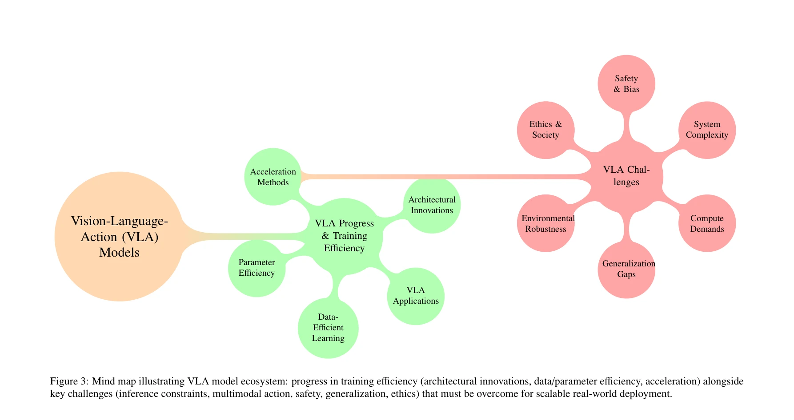
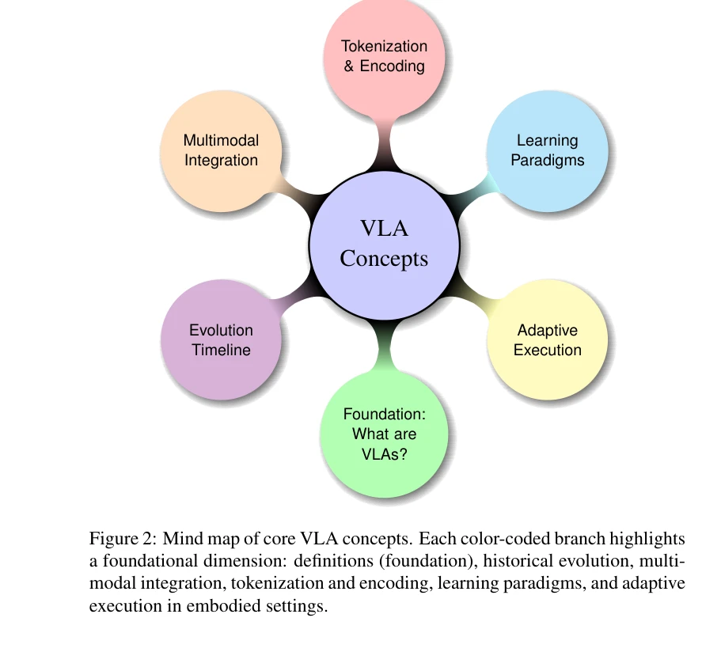

# Vision-Language-Action (VLA) Models: Concepts, Progress, Applications and Challenges

> **저자**: Ranjan Sapkota, Yang Cao, Konstantinos I. Roumeliotis, Manoj Karkee | **날짜**: 2025-05-07 | **URL**: [https://arxiv.org/abs/2505.04769](https://arxiv.org/abs/2505.04769)

---

## Essence

Vision-Language-Action (VLA) 모델은 시각 인식, 자연어 이해, 구체화된 행동을 단일 계산 프레임워크에서 통합하는 혁신적인 AI 접근법을 제시한다. 이 종합 리뷰는 지난 3년간 발표된 80개 이상의 VLA 모델을 분석하여 개념, 진전, 응용, 도전을 체계적으로 정리한다.

## Motivation

- **Known**: Vision-Language Models (VLM)는 시각과 언어를 결합하여 다중 모드 이해를 달성했으나, 이를 실제 로봇 행동으로 변환하는 능력이 부족했다. 기존 로봇 시스템은 비전, 언어, 행동이 분리되어 작동하여 일반화와 적응성이 제한적이었다.
- **Gap**: VLM과 로봇 제어 사이의 명확한 통합 격차가 존재했으며, 시각 인식, 언어 이해, 모터 제어를 동시에 수행하는 단일 통합 프레임워크가 부재했다. 기존 파이프라인은 새로운 작업이나 환경에 유연하게 적응할 수 없었다.
- **Why**: VLA 모델은 로봇이 시각적으로 인지하고, 언어 지시를 이해하고, 적절한 행동을 동적으로 실행할 수 있도록 함으로써 embodied AI의 근본적인 한계를 극복한다. 이는 자율 주행차, 의료 로봇, 농업 자동화 등 다양한 실제 응용 분야에서 지능형 자율 행동을 가능하게 한다.
- **Approach**: 이 리뷰는 체계적 문헌 검토 방법론을 채택하여 VLA 시스템의 개념적 기초, 아키텍처 혁신, 효율적 학습 전략, 실시간 추론 가속화를 다룬다. 또한 자율 주행차, 의료/산업 로봇, 정밀 농업, 휴머노이드 로봇, AR 등 다양한 응용 분야를 탐색하고 agentic adaptation과 cross-embodiment 계획을 통한 해결책을 제시한다.

## Achievement

*Figure 3: Mind map illustrating VLA model ecosystem: progress in training efficiency (architectural innovations, data/pa*

- **포괄적 VLA 모델 분석**: 지난 3년간 발표된 80개 이상의 VLA 모델을 체계적으로 분석하고 분류
- **5개 주제별 구조화**: VLA 개념, 진전, 응용, 도전을 5개 테마 기둥으로 조직
- **아키텍처 혁신 정리**: vision-language models, action planners, hierarchical controllers의 통합 방식 체계화
- **다양한 응용 분야 매핑**: 자율 주행차, 의료 로봇, 산업 로봇, 정밀 농업, 휴머노이드 로봇, AR 등에서의 VLA 응용 분석
- **해결 방안 제시**: agentic AI adaptation, cross-embodiment generalization, neuro-symbolic planning 등 구체적 해결책 제안
- **미래 로드맵 제공**: VLA, VLM, agentic AI의 수렴을 통한 socially aligned adaptive general-purpose embodied agents 달성 방향 제시

## How

*Figure 2: Mind map of core VLA concepts. Each color-coded branch highlights*

- 3년간의 문헌 검토를 통한 80개 이상 VLA 모델 수집 및 분석
- core VLA 개념 파악: VLA 정의, 진화 타임라인, 다중 모드 통합, tokenization과 encoding, 학습 패러다임, adaptive execution
- 아키텍처 혁신, 데이터 효율 학습, 파라미터 효율 모델링, 추론 가속화 기술 검토
- real-time control, multimodal action representation, system scalability, unseen task 일반화, ethical deployment 등 주요 도전과제 분석
- 각 도전과제에 대한 targeted solutions 제안 및 평가
- VLA, VLM, agentic AI의 convergence를 통한 미래 발전 방향 제시

## Originality

- VLA 모델의 개념적 기초를 cross-modal learning architectures에서 generalist agents로의 진화로 체계적으로 트레이싱
- Vision, Language, Action의 세 모달리티를 단일 프레임워크로 통합하는 RT-2 이후 발전을 종합적으로 분석
- Action tokenization을 통해 로봇 모터 명령을 수치 또는 기호 표현으로 변환하는 혁신적 접근 강조
- Agentic AI adaptation과 cross-embodiment planning을 통한 새로운 일반화 방안 제시
- Neuro-symbolic planning과 socially aligned embodied agents의 미래 방향 제안

## Limitation & Further Study

- 리뷰 범위가 지난 3년 논문으로 제한되어 초기 관련 연구의 충분한 맥락이 부족할 수 있음
- 80개 모델 분석이라는 규모에서 각 모델의 세부 기술적 비교가 심층적이지 못할 가능성
- 실제 로봇 배포 경험에 기반한 실증적 평가 데이터 부족으로 이론과 실제의 간극 존재 가능
- Safety, bias, ethical deployment 등 중요한 도전과제에 대한 구체적 해결책이 아직 미성숙 단계
- **후속 연구**: 각 응용 분야별 벤치마크 데이터셋 개발, cross-embodiment transfer learning의 구체적 기법 개발, safety-critical 환경에서의 VLA 검증 필요

## Evaluation

- Novelty: 4/5
- Technical Soundness: 3/5
- Significance: 4/5
- Clarity: 4/5
- Overall: 4/5

**총평**: 이 논문은 rapidly evolving VLA 분야에 대한 첫 번째 포괄적 종합 리뷰로서, 개념부터 응용까지 체계적으로 정리하고 실제 도전과제와 미래 방향을 명확히 제시한다. embodied AI와 로봇 공학의 발전을 위한 중요한 기초 참고 자료로서 높은 가치를 가진다.

## Related Papers

- 🏛 기반 연구: [[papers/1519_Pure_Vision_Language_Action_VLA_Models_A_Comprehensive_Surve/review]] — Pure VLA 모델들의 종합적 분석이 VLA 개념과 진전을 체계화한 1608 리뷰의 기초 자료
- 🔗 후속 연구: [[papers/1476_Humanoid_World_Models_Open_World_Foundation_Models_for_Human/review]] — Humanoid World Models가 VLA 모델의 실제 적용에서 world modeling 측면을 강화한 발전 형태
- 🧪 응용 사례: [[papers/1281_Being-H0_Vision-Language-Action_Pretraining_from_Large-Scale/review]] — Being-H0의 대규모 pretraining 접근이 VLA 모델들의 실제 구현 사례로 1608 리뷰에서 다룬 개념들을 실증
- 🔄 다른 접근: [[papers/1412_GR00T_N1_An_Open_Foundation_Model_for_Generalist_Humanoid_Ro/review]] — GR00T N1이 VLA와 다른 foundation model 접근으로 generalist humanoid 문제를 해결하는 대안적 방법론
- 🔗 후속 연구: [[papers/1446_Large_VLM-based_Vision-Language-Action_Models_for_Robotic_Ma/review]] — VLA 모델의 개념, 진전, 응용에 대한 확장된 분석과 로봇 매니퓰레이션의 구체적 적용이 연결된다.
- 🏛 기반 연구: [[papers/1519_Pure_Vision_Language_Action_VLA_Models_A_Comprehensive_Surve/review]] — VLA 모델의 개념과 응용에 대한 기본적 이해가 pure VLA 모델의 체계적 분석에 이론적 기반을 제공한다.
