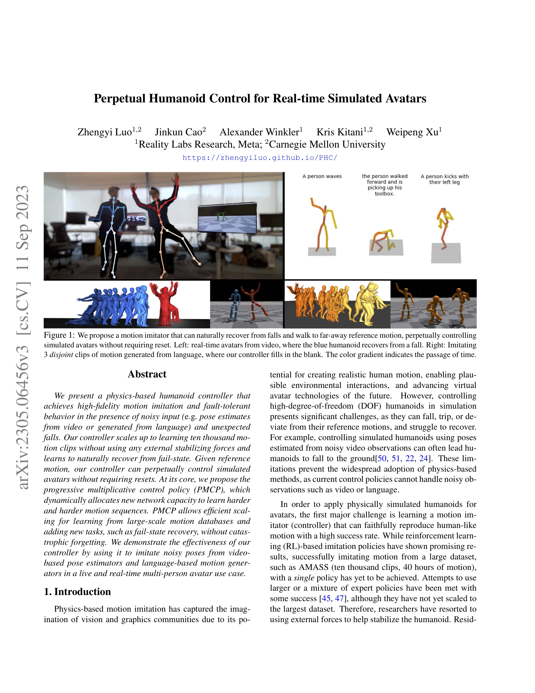
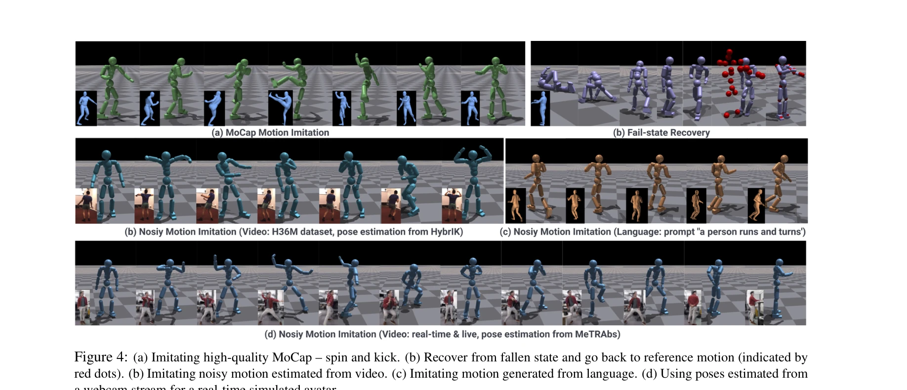
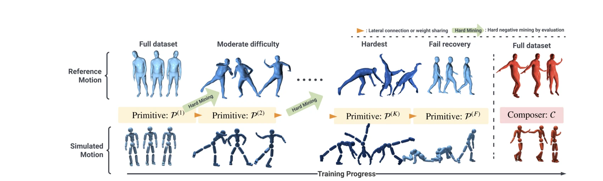

# Perpetual Humanoid Control for Real-time Simulated Avatars

> **저자**: Zhengyi Luo, Jinkun Cao, Alexander Winkler, Kris Kitani, Weipeng Xu | **날짜**: 2023-05-10 | **URL**: [https://arxiv.org/abs/2305.06456](https://arxiv.org/abs/2305.06456)

---

## Essence

*Figure 1: We propose a motion imitator that can naturally recover from falls and walk to far-away reference motion, perp*

물리 기반 인체형 컨트롤러가 노이즈가 있는 입력과 낙상 상황에서도 고충실도 모션 모방을 달성하며, Progressive Multiplicative Control Policy(PMCP)를 통해 AMASS 데이터셋의 10,000개 클립을 외부 안정화 힘 없이 학습할 수 있다.

## Motivation

- **Known**: 물리 기반 모션 모방은 현실적인 인간 모션을 생성하지만, 고자유도 인체형 로봇의 제어는 낙상, 노이즈 입력 처리, 대규모 데이터셋 학습에서 어려움을 겪는다. Residual Force Control(RFC)을 사용하는 기존 방법은 외부 힘으로 안정성을 확보하지만 물리적 사실성을 손상시킨다.
- **Gap**: 단일 정책으로 대규모 모션 데이터셋을 학습하면서 동시에 자연스러운 낙상 복구 능력을 갖추고, 외부 안정화 힘을 사용하지 않으면서 높은 성공률을 달성하는 방법이 부재하다.
- **Why**: 실시간 아바타 제어 애플리케이션에서 비디오 기반 포즈 추정이나 언어 기반 모션 생성 같은 노이즈가 있는 입력을 처리하고 예상치 못한 낙상에서 자연스럽게 회복할 수 있는 컨트롤러가 필수적이다.
- **Approach**: PMCP를 통해 점진적으로 네트워크 용량을 할당하여 난이도가 높은 모션을 순차적으로 학습하고, Adversarial Motion Prior(AMP)를 활용하여 자연스러운 낙상 복구 행동을 유도하며, 위치 정보만으로도 작동하는 위치-기반 컨트롤러를 설계한다.

## Achievement

*Figure 4: (a) Imitating high-quality MoCap – spin and kick. (b) Recover from fallen state and go back to reference motio*

- **외부 힘 없는 대규모 학습**: AMASS 데이터셋의 98.9%를 외부 안정화 힘(RFC) 없이 성공적으로 모방
- **낙상 복구 능력**: 자연스러운 일어남 동작과 낙상 후 참조 모션으로의 자동 복귀 실현
- **재앙적 망각 방지**: PMCP를 통해 새로운 작업(낙상 복구) 학습 중 기존 모션 모방 능력 유지
- **실시간 멀티 에이전트 제어**: 웹캠 비디오로부터 30fps의 실시간 다중 아바타 제어 데모 구현
- **입력 유연성**: 위치 정보만으로 작동하여 VR 컨트롤러나 비디오 기반 3D 키포인트 추정기와 호환

## How

*Figure 2: Our progressive training procedure to train primitives P(1), P(2), · · · , P(K) by gradually learning harder a*

- Progressive Multiplicative Control Policy(PMCP): 난이도별 모션 클러스터링 후 초기 기본 정책에서 시작하여 점진적으로 새로운 네트워크 용량(P^(k))을 추가하며 곱셈적 결합으로 학습
- Goal-conditioned RL 프레임워크: 참조 포즈를 목표로 설정하고 현재 상태에서 목표까지의 거리를 보상으로 정의
- Adversarial Motion Prior(AMP) 통합: 판별자를 통해 학습한 동작이 인간다운 모션 분포를 따르도록 강제
- 이중 정책 학습: 모션 모방 정책과 별도의 낙상 복구 정책을 학습한 후 실패 감지 시 정책 전환
- 위치 기반 제어: 3D 관절 회전 대신 관절 위치만 입력으로 사용하여 입력 요구 사항 단순화
- 샘플 효율성 개선: 이전 작업의 경험을 활용하여 새로운 작업 학습에 필요한 샘플 수 감소

## Originality

- PMCP의 독창적 설계: 기존 Progressive Neural Networks(PNN)과 달리 자동으로 작업을 인식하고 곱셈적 결합을 통해 외부 작업 레이블이 필요 없음
- 외부 힘 제거: RFC 사용 없이 AMASS 데이터셋의 97% 이상을 달성한 첫 단일 정책 (UHC의 98.9% 대비 물리적 사실성 향상)
- 낙상 복구의 통합적 해결: 기존 연구들과 달리 일어남, 보행, 모션 재개를 하나의 정책으로 통합하되 AMP를 통해 자연스러움 보장
- 위치 전용 컨트롤: 회전 정보 없이도 높은 성능 유지 가능함을 입증하여 실제 포즈 추정 시스템 통합 용이

## Limitation & Further Study

- 계산 비용: PMCP의 점진적 학습 프로세스 및 여러 네트워크 용량 관리로 인한 훈련 시간 증가 미상세
- 낙상 복구 한계: 매우 극단적인 낙상 상황(예: 급격한 절벽)이나 신체 일부 손실 시나리오에 대한 처리 미명시
- 포즈 입력 품질 의존성: 비디오 기반 포즈 추정의 오류 범위에 대한 정량적 한계값 분석 부족
- 후속 연구: 다양한 신체 형태와 크기에 대한 일반화 개선, 환경 상호작용(물체 처리, 계단 등)으로의 확장, 멀티모달 입력(오디오 신호) 통합

## Evaluation

- Novelty: 4/5
- Technical Soundness: 3/5
- Significance: 4/5
- Clarity: 4/5
- Overall: 4/5

**총평**: 이 논문은 물리 기반 모션 모방에서 외부 안정화 힘을 제거하면서도 대규모 데이터셋 학습과 자연스러운 낙상 복구를 달성한 중요한 진전을 보여주며, PMCP라는 새로운 학습 패러다임과 실시간 멀티 에이전트 아바타 제어의 실제 구현으로 인해 학술적, 실무적 가치가 높다.

## Related Papers

- 🏛 기반 연구: [[papers/1267_AMP_Adversarial_Motion_Priors_for_Stylized_Physics-Based_Cha/review]] — 적대적 모션 사전을 통한 물리 기반 캐릭터 제어가 PMCP의 고충실도 모션 모방의 이론적 기초를 제공합니다.
- 🔄 다른 접근: [[papers/1565_MaskedMimic_Unified_Physics-Based_Character_Control_Through/review]] — 마스크된 물리 기반 캐릭터 제어와 PMCP가 모션 모방에서 서로 다른 학습 접근법을 제시합니다.
- 🔗 후속 연구: [[papers/1422_GENMO_A_GENeralist_Model_for_Human_MOtion/review]] — 일반적인 인간 모션 생성 모델이 PMCP의 AMASS 데이터셋 활용을 더 광범위한 모션으로 확장할 수 있는 가능성을 제공합니다.
