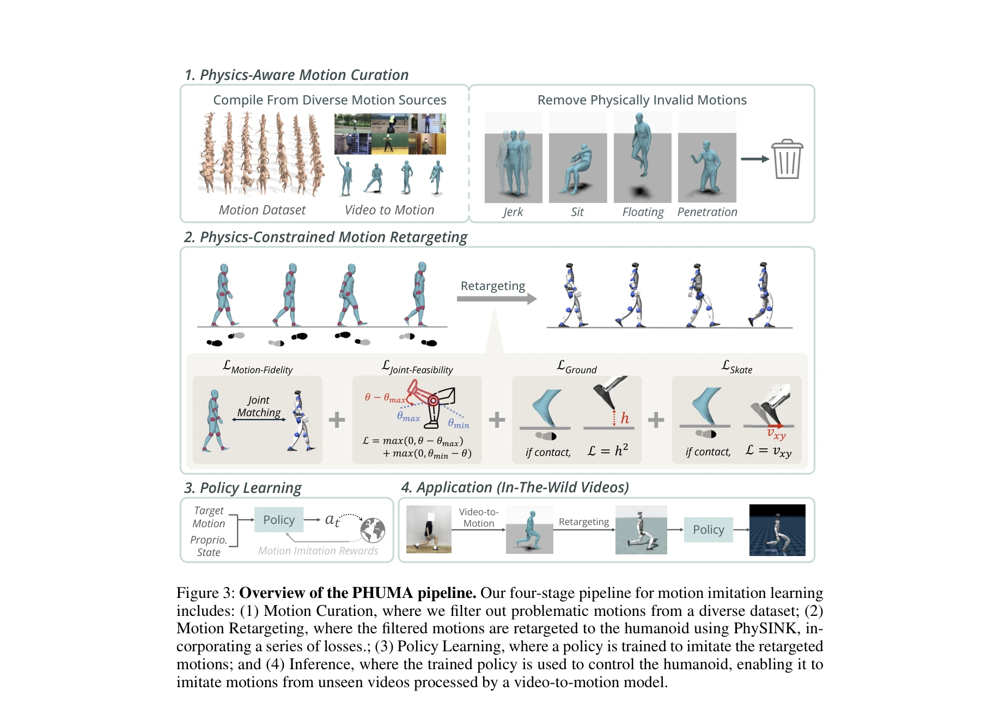

# PHUMA: Physically-Grounded Humanoid Locomotion Dataset

> **저자**: Kyungmin Lee, Sibeen Kim, Minho Park, Hyunseung Kim, Dongyoon Hwang, Hojoon Lee, Jaegul Choo | **날짜**: 2025-10-30 | **URL**: [https://arxiv.org/abs/2510.26236](https://arxiv.org/abs/2510.26236)

---

## Essence

*Figure 2: Overview of datasets and performance. PHUMA is both large-scale and physically*

PHUMA는 대규모 인터넷 비디오에서 수집한 인간 동작을 물리 기반 데이터 큐레이션과 physics-constrained retargeting을 통해 정제하여, 휴머노이드 로봇의 안정적인 동작 모방을 위한 물리적으로 신뢰성 있는 대규모 데이터셋을 제시한다.

## Motivation

- **Known**: AMASS와 LaFAN1 같은 고품질 모션 캡처 데이터셋은 물리적으로 신뢰성이 높지만 규모가 작고 다양성이 제한적이다. Humanoid-X는 대규모 인터넷 비디오를 활용하여 스케일을 확대했으나 부유(floating), 관통(penetration), 발 스케이팅(skating) 등의 물리적 아티팩트를 도입한다.
- **Gap**: 대규모이면서도 물리적으로 신뢰성 있는 휴머노이드 동작 데이터셋이 부재한다. 기존 retargeting 방법들은 joint alignment를 우선시하여 물리적 제약을 충분히 반영하지 못한다.
- **Why**: 휴머노이드 로봇의 실제 배포를 위해서는 안정적이고 인간다운 동작이 필수적이며, 이를 위해 대규모이면서도 물리적으로 신뢰성 있는 동작 데이터가 필요하다. 물리적 아티팩트는 정책 학습의 성능을 크게 저하시킨다.
- **Approach**: Humanoid-X 데이터에 physics-aware motion curation으로 부적절한 동작을 필터링하고, PhySINK (Physically-grounded Shape-adaptive Inverse Kinematics)를 통해 joint limit, ground contact, anti-skating 제약을 적용하여 물리적으로 그럴듯한 retargeted motion을 생성한다.

## Achievement

*Figure 2: Overview of datasets and performance. PHUMA is both large-scale and physically*

- **대규모 물리적으로 신뢰성 있는 데이터셋**: AMASS 대비 349.9%, Humanoid-X 대비 5.5% 더 많은 물리적으로 타당한 동작 포함
- **높은 모션 모방 성공률**: 미학습 동작 모방에서 AMASS 대비 1.2배, Humanoid-X 대비 2.1배 높은 성공률 달성
- **경로 추종 성능 개선**: AMASS 대비 1.4배 높은 전체 성공률, 수직 동작에서 1.6배, 수평 동작에서 2.1배 향상
- **공개 자원 제공**: 코드와 데이터셋 공개로 향후 휴머노이드 로봇 연구 가속화

## How

*Figure 3: Overview of the PHUMA pipeline. Our four-stage pipeline for motion imitation learning*

- **단계 1 - Physics-aware motion curation**: Humanoid-X 데이터에서 root jitter, 객체 상호작용(의자에 앉기 등) 필요한 동작 등 부적절한 모션을 필터링하여 약 70% 제거
- **단계 2 - PhySINK retargeting**: 세 가지 손실함수 결합: (1) joint-feasibility loss (joint limit 위반 방지), (2) ground contact loss (부유 및 관통 방지), (3) skating loss (발 스케이팅 제거)
- **단계 3 - Shape-adaptive IK**: 원본 인간 모델을 목표 로봇의 체형과 팔다리 비율에 맞게 적응시킨 후 동작 정렬 수행
- **단계 4 - Policy learning**: MaskedMimic 프레임워크를 사용하여 retargeted motion을 모방하는 정책 학습

## Originality

- 기존 SINK 방법의 물리적 제약 부족 문제를 직접 해결하는 PhySINK 제시로 joint feasibility, ground contact, anti-skating을 동시에 고려
- 대규모 비디오 데이터의 스케일과 고품질 motion capture 데이터의 물리적 신뢰성을 동시에 달성하는 두 단계 파이프라인
- 물리적 아티팩트 분류 및 그에 따른 체계적인 필터링 및 보정 방법 제안

## Limitation & Further Study

- 필터링 과정에서 약 70%의 데이터가 제거되어 데이터 효율성 개선 여지 존재
- PhySINK의 최적화 과정에서 계산 비용이 추가로 발생하며, 대규모 데이터 처리 시 확장성 관련 상세한 논의 부족
- 특정 휴머노이드 로봇(Unitree G1, H1-2)에 대한 평가만 수행되어 다양한 휴머노이드 형태로의 일반화 성능 미지수
- 후속 연구: PhySINK 최적화 효율화, 다양한 로봇 형태에 대한 광범위한 검증, 동적 환경 및 외부 상호작용 포함 시나리오 확대

## Evaluation

- Novelty: 4/5
- Technical Soundness: 3/5
- Significance: 4/5
- Clarity: 4/5
- Overall: 4/5

**총평**: PHUMA는 휴머노이드 로봇 동작 모방의 근본적인 제약인 물리적 신뢰성과 데이터 규모의 트레이드오프를 효과적으로 해결하며, 체계적인 데이터 큐레이션과 physics-constrained retargeting 방법론으로 높은 실제 성능을 달성한다. 공개 자원으로 제공되어 휴머노이드 로봇 연구 커뮤니티에 실질적인 기여를 할 것으로 기대된다.

## Related Papers

- 🧪 응용 사례: [[papers/1287_BeyondMimic_From_Motion_Tracking_to_Versatile_Humanoid_Contr/review]] — PHUMA의 물리적으로 정제된 동작 데이터가 BeyondMimic의 다양한 휴머노이드 제어 시나리오에 직접 활용될 수 있다
- 🏛 기반 연구: [[papers/1522_Learning_from_Massive_Human_Videos_for_Universal_Humanoid_Po/review]] — 대규모 인간 비디오에서 학습하는 방법론이 PHUMA의 인터넷 비디오 기반 데이터 큐레이션 접근법과 일치한다
- 🔄 다른 접근: [[papers/1534_Learning_Sim-to-Real_Humanoid_Locomotion_in_15_Minutes/review]] — 15분 만에 sim-to-real 학습을 달성하는 효율적 접근법이 PHUMA의 대규모 데이터 기반 접근법과 대조적이다
- 🔗 후속 연구: [[papers/1599_Opening_the_Sim-to-Real_Door_for_Humanoid_Pixel-to-Action_Po/review]] — 픽셀 기반 정책에서 PHUMA의 물리적으로 검증된 동작 데이터가 sim-to-real 성능 향상에 기여할 수 있다
- 🏛 기반 연구: [[papers/1492_Neural_Brain_A_Neuroscience-inspired_Framework_for_Embodied/review]] — Multimodal large language model이 신경과학 기반 embodied agent의 인지-행동 통합에 이론적 기반을 제공한다.
