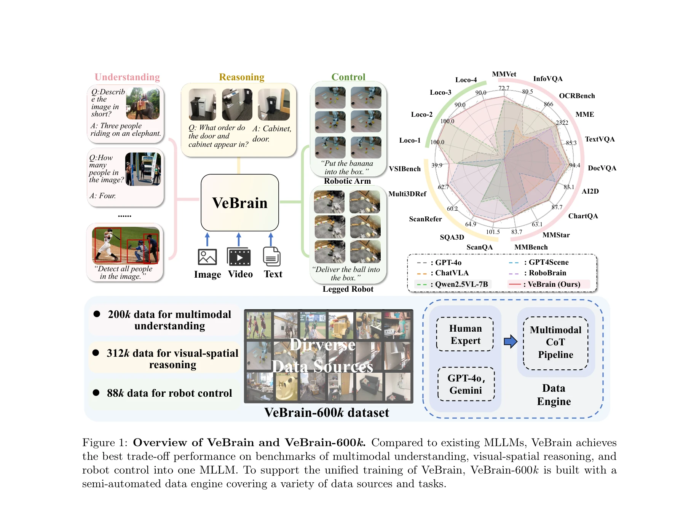
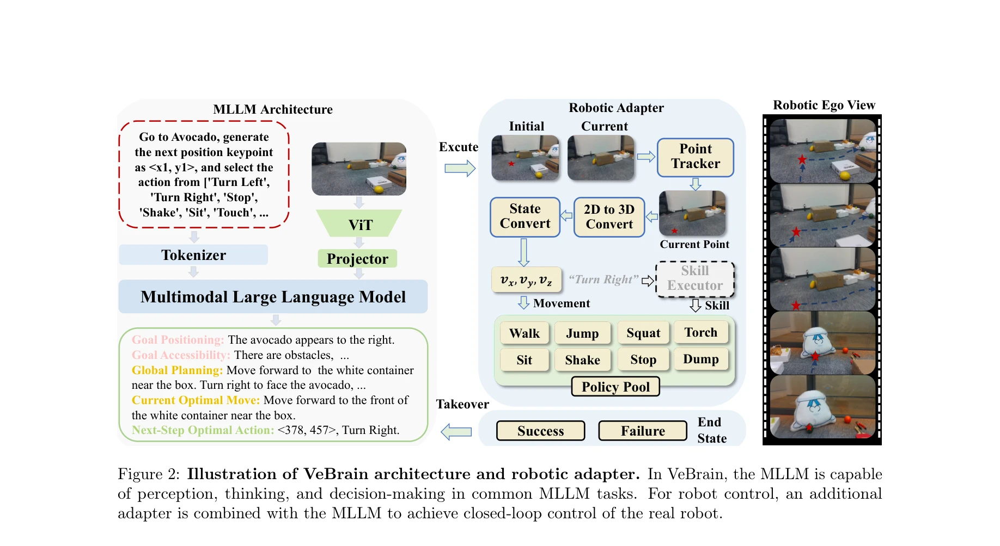

# Visual Embodied Brain: Let Multimodal Large Language Models See, Think, and Control in Spaces

> **저자**: Gen Luo, Ganlin Yang, Ziyang Gong, Guanzhou Chen, Haonan Duan, Erfei Cui, Ronglei Tong, Zhi Hou, Tianyi Zhang, Zhe Chen, Shenglong Ye, Lewei Lu, Jingbo Wang, Wenhai Wang, Jifeng Dai, Yu Qiao, Rongrong Ji, Xizhou Zhu | **날짜**: 2025-05-30 | **URL**: [https://arxiv.org/abs/2506.00123](https://arxiv.org/abs/2506.00123)

---

## Essence

*Figure 1: Overview of VeBrain and VeBrain-600k. Compared to existing MLLMs, VeBrain achieves*

VeBrain은 멀티모달 대형 언어 모델(MLLM)을 지각, 추론, 제어 기능으로 통합하는 프레임워크이며, 로봇 제어 작업을 2D 시각 공간의 텍스트 기반 MLLM 작업으로 재구성합니다.

## Motivation

- **Known**: MLLM은 비전-언어 이해에서 큰 진전을 이루었고, vision-language-action(VLA) 모델들은 로봇 제어 학습에 활용되고 있습니다.
- **Gap**: 기존 방법들은 멀티모달 이해, 시각-공간 추론, 물리적 상호작용을 하나의 통합된 모델로 효과적으로 통합하지 못하며, VLA 모델은 정확성 향상으로 인해 멀티모달 이해 능력을 손상시킵니다.
- **Why**: 로봇이 주변 세계를 인지하고 시각 공간에서 추론하며 환경과 능동적으로 상호작용해야 하는 현실 세계 응용에서 이 세 기능의 통합은 필수적입니다.
- **Approach**: 로봇 제어를 keypoint detection 및 embodied skill recognition의 MLLM 작업으로 재구성하여 학습 목표를 통일하고, novel robotic adapter를 통해 텍스트 제어 신호를 로봇의 운동 정책으로 변환합니다.

## Achievement

*Figure 1: Overview of VeBrain and VeBrain-600k. Compared to existing MLLMs, VeBrain achieves*

- **통합 프레임워크**: 멀티모달 이해, 시각-공간 추론, 로봇 제어를 2D 시각 공간에서 공통의 MLLM 작업으로 통합
- **고품질 데이터셋**: VeBrain-600k 데이터셋 구축으로 200k 멀티모달 이해, 312k 시각-공간 추론, 88k 로봇 제어 데이터 포함
- **벤치마크 성능**: 13개 멀티모달 벤치마크와 5개 공간 지능 벤치마크에서 기존 MLLM(Qwen2.5-VL) 대비 MMVet +5.6%, 다리 로봇 작업 +50% 평균 성능 향상
- **로봇 적응성**: 다리 로봇과 로봇 팔에 배포 시 기존 방법 대비 우수한 적응성, 유연성, 합성 능력 입증

## How

*Figure 2: Illustration of VeBrain architecture and robotic adapter. In VeBrain, the MLLM is capable*

- Keypoint detection과 embodied skill recognition 작업으로 로봇 제어를 2D 시각 공간의 MLLM 작업으로 재구성
- Point tracker를 통해 2D 키포인트를 추출하고 2D to 3D 변환기로 실제 로봇 제어 신호로 변환
- Skill executor에서 policy pool의 사전 정의된 기술(Walk, Jump, Shake, Sit 등)을 실행하고 동적 피드백 루프 구현
- 다중 데이터 소스(공개 데이터셋, 인간 전문가, GPT-4o, Gemini 등)로부터 multimodal chain-of-thought를 통해 VeBrain-600k 구축
- 반자동화 데이터 엔진을 통해 이미지/비디오 수집, 전문가 주석(키포인트 등), 멀티모달 CoT 임베딩

## Originality

- 로봇 제어를 2D 시각 공간의 keypoint detection 및 embodied skill recognition 작업으로 재구성하여 MLLM의 학습 목표 통일
- Point tracker 기반 robotic adapter를 통한 동적이고 견고한 2D-3D 제어 신호 변환 메커니즘
- 인간 전문가와 반자동화 엔진을 결합한 VeBrain-600k 구축으로 멀티모달 CoT를 통한 다양한 능력 통합
- 18개 벤치마크(멀티모달 및 공간)와 14개 로봇 작업에서 기존 MLLM 대비 평균 성능 우위를 달성한 첫 번째 시스템

## Limitation & Further Study

- 실시간 제어 성능 및 지연 시간에 대한 구체적인 분석 부족
- 복잡한 동적 환경이나 멀티 에이전트 시나리오에서의 성능 평가 미흡
- Policy pool의 사전 정의 기술 확장성과 새로운 기술 학습 메커니즘 제한
- 후속 연구: 보다 광범위한 로봇 플랫폼 및 작업 도메인에 대한 평가, 온라인 학습 및 적응 메커니즘 개발, 3D 환경 이해도 강화

## Evaluation

- Novelty: 4/5
- Technical Soundness: 4/5
- Significance: 4/5
- Clarity: 4/5
- Overall: 4/5

**총평**: VeBrain은 멀티모달 이해와 로봇 제어를 2D 시각 공간의 공통 MLLM 작업으로 통합하는 혁신적인 접근으로, 광범위한 벤치마크와 로봇 실험에서 우수한 성능을 입증하며 구체화된 AI의 중요한 진전을 나타냅니다.

## Related Papers

- 🔄 다른 접근: [[papers/1421_Genie_Sim_30__A_High-Fidelity_Comprehensive_Simulation_Platf/review]] — Visual Embodied Brain은 2D 시각 공간 기반 제어를, Helix는 3D world model 기반 제어를 통해 multimodal LLM의 embodied control을 구현하는 다른 방식
- 🔗 후속 연구: [[papers/1610_Visual_Embodied_Brain_Let_Multimodal_Large_Language_Models_S/review]] — VeBrain의 통합 프레임워크가 다른 VLA 모델들과 결합되어 더 포괄적인 vision-language-action 시스템을 구성할 수 있음
- 🏛 기반 연구: [[papers/1437_Hand-Eye_Autonomous_Delivery_Learning_Humanoid_Navigation_Lo/review]] — VeBrain의 multimodal integration이 InternVLA-A1의 unified understanding과 generation 능력을 embodied control에 적용하는 기반을 제공
- 🧪 응용 사례: [[papers/1464_Magma_A_Foundation_Model_for_Multimodal_AI_Agents/review]] — 체화된 시각 브레인 개념이 멀티모달 AI 에이전트의 시각-언어 능력을 실제 로봇에 적용하는 방법을 제시합니다.
