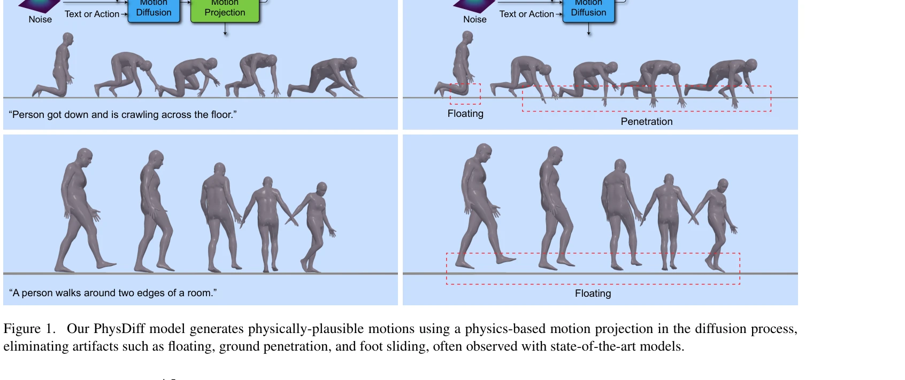
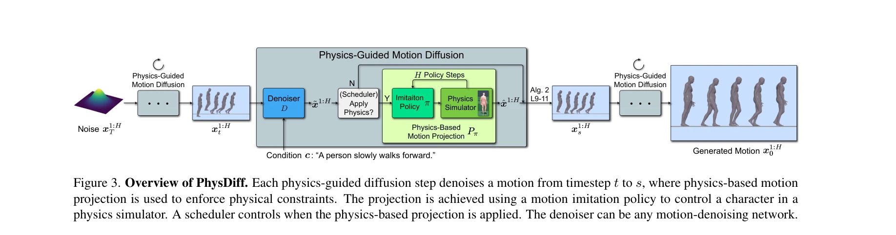

# PhysDiff: Physics-Guided Human Motion Diffusion Model

> **저자**: Ye Yuan, Jiaming Song, Umar Iqbal, Arash Vahdat, Jan Kautz | **날짜**: 2022-12-05 | **URL**: [https://arxiv.org/abs/2212.02500](https://arxiv.org/abs/2212.02500)

---

## Essence

*Figure 1. Our PhysDiff model generates physically-plausible motions using a physics-based motion projection in the diffu*

PhysDiff는 diffusion 과정에 physics 제약을 통합하여 physically-plausible human motion을 생성하는 모델이다. Physics-based motion projection 모듈을 iteratively 적용하여 floating, foot sliding, ground penetration 등의 artifacts를 제거한다.

## Motivation

- **Known**: Denoising diffusion models는 이미지 생성에서 뛰어난 성능을 보였으며, 최근 motion diffusion models (MDM, MotionDiffuse 등)도 human motion generation에서 SOTA 결과를 달성했다. 그러나 기존 모델들은 physics 제약을 명시적으로 고려하지 않아 physically-implausible motion을 생성한다.
- **Gap**: 기존 motion diffusion models는 physics laws를 diffusion 과정에서 무시하여 floating, foot sliding, ground penetration과 같은 물리적 artifacts를 생성한다. Physics를 post-processing으로만 적용하면 최종 kinematic motion이 너무 불가능해서 보정이 어렵고 data distribution에서 벗어난다.
- **Why**: VR, animation, gaming 등 실제 응용에서 인간은 사소한 물리적 부정확성에도 민감하게 반응하므로, physically-plausible motion generation은 실세계 적용을 위해 필수적이다.
- **Approach**: Motion imitation policy를 physics simulator에서 학습하여 physics-based motion projection 모듈을 구성하고, 이를 diffusion 과정의 각 step에 iteratively 적용하여 denoised motion을 physically-plausible space로 지속적으로 당겨준다.

## Achievement

*Figure 4. Visual comparison of PhysDiff against the SOTA, MDM [79], on HumanML3D, HumanAct12, and UESTC. PhysDiff reduce*

- **물리적 오류 감소**: HumanML3D에서 86% 이상 물리적 오류 감소, HumanAct12와 UESTC에서 각각 78%, 94% 물리적 오류 개선
- **Motion 품질 향상**: Frechet inception distance (FID)로 측정한 motion quality가 20% 이상 개선
- **일반성**: MDM, MotionDiffuse 등 다양한 diffusion 모델과 호환되는 plug-and-play 구조
- **Iterative physics 적용의 우월성**: Post-processing 기반 physics 적용 대비 물리적 타당성과 motion 자연스러움 모두에서 우수

## How

*Figure 3. Overview of PhysDiff. Each physics-guided diffusion step denoises a motion from timestep t to s, where physics*

- Large-scale motion capture data로 character agent를 제어하는 motion imitation policy 학습
- Diffusion의 각 step에서 denoised motion을 physics simulator에서 motion imitation으로 projection하여 physically-plausible motion 생성
- Projected motion을 다음 diffusion step의 입력으로 사용하여 iteratively physics constraint 적용
- Physics projection을 적용할 diffusion timestep schedule 결정 (early step보다 late step이 효과적)
- 조건부 생성을 위해 classifier-free guidance 기법 활용

## Originality

- Diffusion 과정의 각 step에 physics constraint를 iteratively 통합하는 novel approach (post-processing이 아닌 in-process 적용)
- Physics simulator에서의 motion imitation을 differentiable하지 않은 physics constraint를 적용하는 효과적인 방법으로 활용
- Physics projection의 computational cost 문제를 고려하여 selective timestep에만 적용하는 practical solution 제시
- Physics plausibility와 motion quality 사이의 trade-off 메커니즘을 체계적으로 분석하고 balanced scheduling 전략 개발

## Limitation & Further Study

- Motion imitation policy의 성능이 physics projection 효율성에 직접적으로 영향을 미치므로, simulator와 policy 학습에 큰 computational cost 필요
- 모든 type의 human motion에 대해 균등하게 효과적인지 불명확 (특정 motion category에서 성능 편차 가능성)
- Physics plausibility와 motion quality 간의 fundamental trade-off가 존재하므로 perfect solution 불가능
- 후속 연구: 더 효율적인 motion projection 방법 개발, 다양한 physics simulator와의 호환성 탐색, dynamic contact-rich motion에 대한 성능 개선

## Evaluation

- Novelty: 4/5
- Technical Soundness: 3/5
- Significance: 4/5
- Clarity: 4/5
- Overall: 4/5

**총평**: PhysDiff는 diffusion 기반 motion generation에서 physics 제약을 처음으로 효과적으로 통합하는 혁신적 접근을 제시하며, iterative physics 적용의 필요성을 명확히 입증했다. 실제 응용에서 요구되는 physically-plausible motion 생성 문제를 실질적으로 해결하며 SOTA 성능을 달성한 중요한 기여 논문이다.

## Related Papers

- 🏛 기반 연구: [[papers/1400_Flexible_Motion_In-betweening_with_Diffusion_Models/review]] — diffusion 기반 motion in-betweening 기술이 PhysDiff의 물리 제약 통합 방법론에 기반이 된다
- 🔗 후속 연구: [[papers/1431_Guided_Motion_Diffusion_for_Controllable_Human_Motion_Synthe/review]] — guided motion diffusion의 제어 가능한 생성 방법이 PhysDiff의 physics-guided 접근법을 확장한다
- 🔄 다른 접근: [[papers/1362_Diffusion_Policy_Visuomotor_Policy_Learning_via_Action_Diffu/review]] — visuomotor policy를 위한 diffusion 접근법이 PhysDiff의 human motion 중심 접근법과 다른 응용 영역을 보인다
- 🧪 응용 사례: [[papers/1502_It_Takes_Two_Learning_Interactive_Whole-Body_Control_Between/review]] — one-step diffusion policy의 빠른 생성이 PhysDiff의 물리 제약 방법과 결합되어 실시간 응용이 가능하다
- 🧪 응용 사례: [[papers/1468_ManipVQA_Injecting_Robotic_Affordance_and_Physically_Grounde/review]] — 시각적 지시 튜닝 방법론이 로봇 affordance와 물리적 개념을 MLLM에 효과적으로 주입하는 데 활용됩니다.
- 🧪 응용 사례: [[papers/1592_OmniControl_Control_Any_Joint_at_Any_Time_for_Human_Motion_G/review]] — PhysDiff의 물리 기반 diffusion이 OmniControl의 유연한 관절 제어와 결합하여 실제 적용 사례를 보여줌
