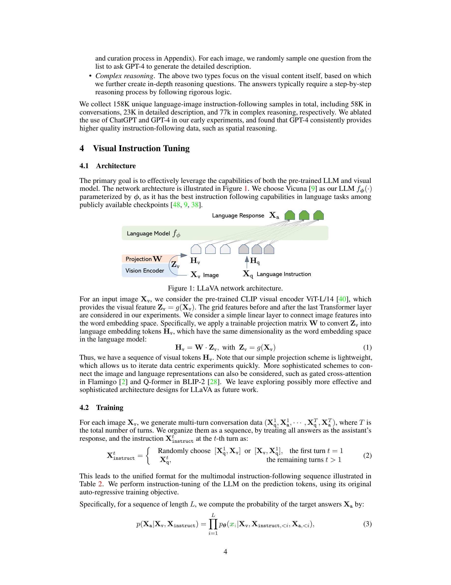

# Visual Instruction Tuning

> **저자**: Haotian Liu, Chunyuan Li, Qingyang Wu, Yong Jae Lee | **날짜**: 2023-04-17 | **URL**: [https://arxiv.org/abs/2304.08485](https://arxiv.org/abs/2304.08485)

---

## Essence

*Figure 1: LLaVA network architecture.*

언어 전용 GPT-4를 활용하여 다중모달 시각-언어 명령어 추종 데이터를 생성하고, 이를 통해 vision encoder와 LLM을 연결한 end-to-end 다중모달 모델 LLaVA를 제시한다.

## Motivation

- **Known**: 명령어 튜닝이 text-only LLM의 zero-shot 능력을 향상시키는 것으로 알려져 있으며, CLIP 기반 vision encoder와 LLM 연결 연구가 진행 중이다.
- **Gap**: 다중모달 영역에서 명령어 추종 데이터 부족 및 vision-language instruction-tuning이 충분히 탐구되지 않았으며, 일반 목적의 시각 어시스턴트 개발이 미흡하다.
- **Why**: 시각과 언어를 모두 이해하는 일반 목적 어시스턴트는 다양한 실제 작업에 필수적이며, 명령어 튜닝을 다중모달 도메인으로 확장하면 모델의 적응성과 상호작용성을 크게 향상시킬 수 있다.
- **Approach**: GPT-4를 사용하여 이미지 캡션과 바운딩 박스를 텍스트 프롬프트로 변환한 후 다양한 유형의 명령어-응답 쌍을 생성하고, 생성된 데이터로 CLIP vision encoder와 Vicuna LLM을 end-to-end 학습한다.

## Achievement

- **다중모달 명령어 추종 데이터 생성 파이프라인**: 기존 이미지-텍스트 쌍을 GPT-4를 이용해 명령어-응답 형식으로 변환하는 혁신적인 데이터 개혁 방법론 제시
- **강력한 성능**: 합성 다중모달 명령어 추종 데이터셋에서 GPT-4 대비 85.1% 상대 점수 달성
- **Science QA 최고 성능**: GPT-4와의 앙상블을 통해 Science QA에서 92.53% 정확도의 state-of-the-art 달성
- **다중모달 명령어 추종 벤치마크**: 다양한 응용 과제를 포함한 LLaVA-Bench 제시
- **오픈소스 공개**: 생성 데이터, 모델 체크포인트, 코드베이스 공개로 재현성과 추후 연구 활성화

## How

- CLIP의 vision encoder와 Vicuna LLM을 연결하는 network architecture 구성
- 이미지에서 캡션과 바운딩 박스를 추출하여 텍스트 심볼 표현으로 인코딩
- GPT-4에 symbolic representation을 입력으로 제공하여 3가지 유형(conversation, detailed description, complex reasoning)의 명령어-응답 데이터 생성
- 생성된 instruction-following 데이터로 multimodal model을 end-to-end fine-tuning
- LLaVA-Bench를 이용한 평가 및 GPT-4와의 앙상블 실험

## Originality

- **최초 시도**: 다중모달 영역에서 명령어 튜닝을 체계적으로 적용한 첫 연구
- **GPT 기반 데이터 생성**: text-only GPT-4를 활용하여 다중모달 데이터를 효율적으로 생성하는 혁신적 파이프라인
- **Symbolic representation**: 이미지를 캡션과 바운딩 박스 기반 텍스트 표현으로 인코딩하여 언어 모델이 이해 가능한 형식으로 변환
- **다양한 응답 유형**: conversation, detailed description, complex reasoning 등 다층적 명령어-응답 데이터 생성

## Limitation & Further Study

- **Symbolic representation의 제한**: 캡션과 바운딩 박스 기반 텍스트 표현은 시각 정보의 완전한 특징을 포착하지 못할 수 있음
- **데이터 생성 자동화의 품질**: GPT-4 생성 데이터의 정확성 및 다양성이 수동 주석과 비교하여 완벽하지 않을 수 있음
- **평가 벤치마크 규모**: 합성 데이터셋 기반 평가로 인해 실제 다중모달 추론 능력의 완전한 평가가 제한될 수 있음
- **후속 연구**: vision encoder와 LLM의 더 효과적인 연결 메커니즘 탐구, 더 정교한 visual instruction data 생성 방법 개발, 다양한 visual understanding 작업으로 확대 필요

## Evaluation

- Novelty: 4/5
- Technical Soundness: 3/5
- Significance: 4/5
- Clarity: 4/5
- Overall: 4/5

**총평**: 본 논문은 다중모달 명령어 튜닝이라는 미개척 영역에 처음으로 체계적으로 접근하였으며, GPT-4를 활용한 효율적인 데이터 생성 방법과 end-to-end 다중모달 모델 학습을 통해 뛰어난 성능을 달성했다. 오픈소스 공개와 함께 시각-언어 이해의 일반 목적 어시스턴트 개발에 중요한 기초를 마련한 영향력 있는 연구이다.

## Related Papers

- 🏛 기반 연구: [[papers/1454_Learning_Transferable_Visual_Models_From_Natural_Language_Su/review]] — CLIP의 vision-language pre-training이 Visual Instruction Tuning의 multimodal 정렬 학습 기반이 된다
- 🔗 후속 연구: [[papers/1510_OpenVLA_An_Open-Source_Vision-Language-Action_Model/review]] — LLaVA의 instruction tuning 방법론을 로봇 조작 도메인으로 확장하여 실용적 응용을 구현했다
- 🔄 다른 접근: [[papers/1437_InternVLA-A1_Unifying_Understanding_Generation_and_Action_fo/review]] — 둘 다 vision-language-action 통합이지만 LLaVA는 instruction following, InternVLA는 action generation에 특화됐다
- 🧪 응용 사례: [[papers/1281_Being-H0_Vision-Language-Action_Pretraining_from_Large-Scale/review]] — Being-H0가 LLaVA의 vision-language 이해 능력을 humanoid 로봇 제어에 적용한 구체적 사례를 보여준다
- 🏛 기반 연구: [[papers/1436_InstructVLA_Vision-Language-Action_Instruction_Tuning_from_U/review]] — Visual Instruction Tuning의 기본 방법론을 VLA 모델에 적용하여 multimodal reasoning과 action generation을 통합합니다.
- 🔄 다른 접근: [[papers/1511_PaLI-X_On_Scaling_up_a_Multilingual_Vision_and_Language_Mode/review]] — 시각 instruction tuning과 다국어 vision-language 확장에서 서로 다른 접근 방향을 제시하지만 상호 보완적이다
- 🏛 기반 연구: [[papers/1606_Vision-Language_Foundation_Models_as_Effective_Robot_Imitato/review]] — Visual Instruction Tuning의 vision-language 연결 기법을 로봇 정책 학습에 적용한 구체적 사례다
- 🧪 응용 사례: [[papers/1571_Sigmoid_Loss_for_Language_Image_Pre-Training/review]] — 비주얼 인스트럭션 튜닝에서 효율적인 언어-이미지 사전학습이 멀티모달 학습 성능을 향상시킨다.
