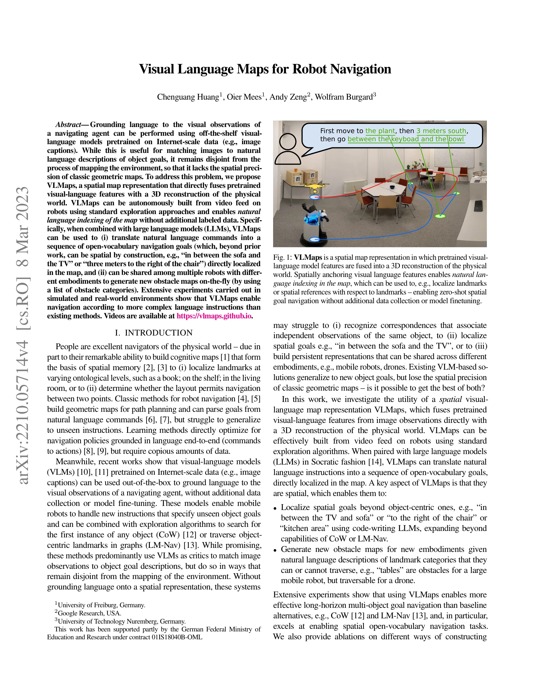
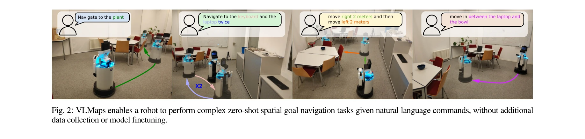
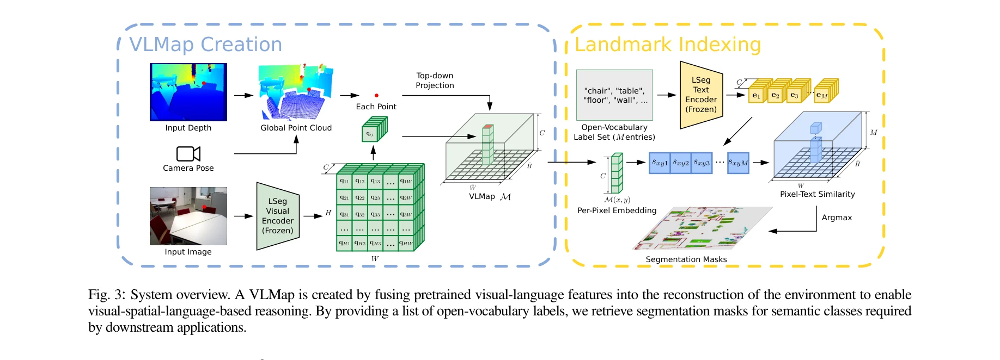

# Visual Language Maps for Robot Navigation

> **저자**: Chenguang Huang, Oier Mees, Andy Zeng, Wolfram Burgard | **날짜**: 2022-10-11 | **URL**: [https://arxiv.org/abs/2210.05714](https://arxiv.org/abs/2210.05714)

---

## Essence

*Fig. 1: VLMaps is a spatial map representation in which pretrained visual-*

시각-언어 모델의 특징을 3D 재구성과 융합하여 공간 정보를 갖춘 의미론적 지도(VLMaps)를 구축하고, 이를 통해 로봇이 자연어 명령으로 공간 관계를 포함한 복잡한 네비게이션 작업을 수행할 수 있게 한다.

## Motivation

- **Known**: 시각-언어 모델(CLIP 등)은 인터넷 규모 데이터로 사전훈련되어 자연어와 이미지 매칭에 효과적이며, 기하학적 지도는 경로 계획에 공간 정밀도를 제공한다.
- **Gap**: 기존 VLM 기반 네비게이션 방법(CoW, LM-Nav)은 객체 중심의 목표에만 제한되며 '소파와 TV 사이'와 같은 공간 관계 표현을 이해하지 못하고, 서로 다른 로봇 형태 간에 지도를 공유할 수 없다.
- **Why**: 자연어로 표현된 공간 관계를 이해하고 로현할 수 있는 로봇 네비게이션은 인간 수준의 지시 따르기를 가능하게 하며, 다양한 로봇 플랫폼 간 지도 공유는 효율성을 크게 높인다.
- **Approach**: LSeg 같은 사전훈련된 VLM으로 RGB-D 비디오에서 픽셀 단위 임베딩을 추출하고, 깊이 정보와 시각 운동 정보를 이용해 이를 3D 지도로 역투영하여 공간-의미론적 지도를 구축한 뒤, LLM과 결합하여 자연어 명령을 공간 목표 시퀀스로 변환한다.

## Achievement

*Fig. 2: VLMaps enables a robot to perform complex zero-shot spatial goal navigation tasks given natural language command*

- **VLMaps 구축**: 추가 라벨링 없이 사전훈련 VLM 특징과 3D 재구성을 융합한 공간 의미론적 지도 표현 개발
- **공간 관계 이해**: '소파와 TV 사이
- 의자 오른쪽 3미터' 같은 상대적 공간 표현을 자연어로 지역화 가능", '**다중 로봇 호환성**: 자연어 장애물 카테고리 목록으로 다양한 로봇 형태에 맞는 장애물 지도를 동적 생성
- **영점 학습 성능**: 추가 데이터 수집이나 모델 미세조정 없이 기존 방법보다 복잡한 자연어 지시를 따르는 능력 입증

## How

*Fig. 3: System overview. A VLMap is created by fusing pretrained visual-language features into the reconstruction of the*

- RGB-D 카메라로부터 각 프레임의 깊이 픽셀을 역투영하여 로컬 포인트 클라우드 생성: Pk = D(u)K⁻¹ũ
- 시각 운동(visual odometry)을 이용한 카메라 포즈 변환으로 로컬 포인트 클라우드를 월드 좌표계로 변환: PW = TWkPk
- LSeg 시각 인코더로 RGB 이미지의 각 픽셀에 대해 CLIP 특징 공간의 밀집 임베딩 계산
- 3D 포인트 좌표를 탑-다운 그리드 지도로 투영하고, 각 그리드 셀에 시각-언어 임베딩을 누적
- 쿼리 텍스트와 그리드 셀 임베딩 간의 코사인 유사도를 계산하여 자연어 장소나 객체 지역화
- LLM을 Socratic 방식으로 활용하여 자연어 명령을 단계적 공간 목표로 분해, VLMap에서 직접 지역화

## Originality

- VLM 특징과 3D 기하학적 지도를 직접 융합하는 새로운 공간 표현 제안 — 기존 의미론적 SLAM은 사전정의된 클래스에 제한되었음
- 개방 어휘(open-vocabulary) 지도에서 공간 관계 쿼리를 지원하는 첫 접근 — CoW와 LM-Nav는 객체 중심 목표만 처리
- LLM과의 결합으로 자연어 명령을 공간 좌표로 변환하는 파이프라인 구현 — 기존에는 이미지-텍스트 매칭에만 사용
- 다양한 로봇 형태를 위한 동적 장애물 지도 생성 메커니즘 개발

## Limitation & Further Study

- LSeg에 의존하므로, 시각적으로 분명하지 않은 공간 개념('입구 근처' 등)은 정확도가 떨어질 수 있음", 'RGB-D 센서와 정확한 시각 운동 추정이 필요하므로, 센서 오류나 장기간 드리프트 영향 분석 부족
- 실험이 제한된 실내 환경과 시뮬레이션 환경에서만 수행되어 대규모 실외 환경 적용성 미검증
- LLM 프롬프팅 방식에 민감할 수 있으며, 복잡한 다단계 공간 추론의 한계에 대한 논의 필요
- 후속 연구: 불확실성 정량화, 장기간 지도 유지보수, 동적 환경 처리, 다중 센서 모달리티 통합

## Evaluation

- Novelty: 4/5
- Technical Soundness: 3/5
- Significance: 4/5
- Clarity: 4/5
- Overall: 4/5

**총평**: VLMaps는 사전훈련 VLM과 3D 재구성을 창의적으로 통합하여 공간-의미론적 네비게이션이라는 중요한 문제를 해결하며, 광범위한 실험으로 기존 방법 대비 우월성을 입증한 우수한 연구이다. 다만 센서 정확도, 실외 환경, 동적 장애물 등에 대한 제약 논의가 추가되면 더욱 완성도 높을 것이다.

## Related Papers

- 🏛 기반 연구: [[papers/1607_Vision-Language_Navigation_A_Survey_and_Taxonomy/review]] — Visual Language Maps가 Vision-Language Navigation survey에서 다루는 spatial relationship navigation의 구체적인 구현 방법론을 제시
- 🔄 다른 접근: [[papers/1470_MapNav_A_Novel_Memory_Representation_via_Annotated_Semantic/review]] — Visual Language Maps는 3D semantic mapping을, MapNav는 annotated semantic map을 통해 언어 기반 로봇 네비게이션을 구현하는 다른 접근법
- 🔗 후속 연구: [[papers/1487_Multimodal_Spatial_Language_Maps_for_Robot_Navigation_and_Ma/review]] — Visual Language Maps의 2D 기반 접근법이 Multimodal Spatial Language Maps의 다중 모달 확장과 결합되어 더 풍부한 공간 이해를 달성할 수 있음
- 🏛 기반 연구: [[papers/1319_BeliefMapNav_3D_Voxel-Based_Belief_Map_for_Zero-Shot_Object/review]] — Visual Language Maps는 BeliefMapNav의 3D voxel belief map에 대한 시각-언어 맵핑의 이론적 기반을 제공한다
- 🔄 다른 접근: [[papers/1382_EmbodiedVSR_Dynamic_Scene_Graph-Guided_Chain-of-Thought_Reas/review]] — Visual Language Maps도 로봇의 공간 추론과 네비게이션을 위한 구조화된 표현을 제안한다.
- 🏛 기반 연구: [[papers/1461_LM-Nav_Robotic_Navigation_with_Large_Pre-Trained_Models_of_L/review]] — 시각 언어 맵의 기본 개념이 사전훈련된 모델들을 활용한 네비게이션의 공간적 표현 기반을 제공합니다.
- 🏛 기반 연구: [[papers/1470_MapNav_A_Novel_Memory_Representation_via_Annotated_Semantic/review]] — 시각 언어 맵의 기본 개념이 annotated semantic map 기반 메모리 표현의 이론적 토대가 됩니다.
- 🏛 기반 연구: [[papers/1441_JanusVLN_Decoupling_Semantics_and_Spatiality_with_Dual_Impli/review]] — 시각 언어 맵의 기본 개념이 공간-의미 정보 분리의 이론적 토대가 됩니다.
- 🔗 후속 연구: [[papers/1456_LERF_Language_Embedded_Radiance_Fields/review]] — Visual Language Maps의 2D 접근법을 3D NeRF로 확장하여 더 풍부한 spatial-semantic representation을 제공합니다.
- 🧪 응용 사례: [[papers/1486_Multimodal_Perception_for_Goal-oriented_Navigation_A_Survey/review]] — Visual Language Maps의 로봇 네비게이션 적용이 multimodal perception 기반 goal-oriented navigation의 실용적 구현을 보여준다.
- 🔗 후속 연구: [[papers/1487_Multimodal_Spatial_Language_Maps_for_Robot_Navigation_and_Ma/review]] — 기본적인 시각 언어 맵을 멀티모달(언어, 이미지, 오디오) 쿼리가 가능한 공간 맵으로 발전시킨 형태입니다.
- 🏛 기반 연구: [[papers/1505_Open-vocabulary_Queryable_Scene_Representations_for_Real_Wor/review]] — Visual Language Maps의 언어 기반 장면 표현이 NLMap의 개방형 어휘 쿼리 가능한 장면 표현의 기초 방법론을 제공한다.
- 🔗 후속 연구: [[papers/1589_TopV-Nav_Unlocking_the_Top-View_Spatial_Reasoning_Potential/review]] — 로봇 네비게이션을 위한 시각 언어 맵의 top-view 공간 표현을 MLLM 기반 추론으로 발전시킨다.
- 🏛 기반 연구: [[papers/1607_Vision-Language_Navigation_A_Survey_and_Taxonomy/review]] — VLN 분야 전반의 taxonomy가 Visual Language Maps의 특정 구현 방법이 전체 분야에서 차지하는 위치와 기여를 이해하는 기반
- 🔄 다른 접근: [[papers/1402_FocusNav_Spatial_Selective_Attention_with_Waypoint_Guidance/review]] — 둘 다 언어 기반 네비게이션을 다루지만 FocusNav는 공간 선택적 주의에, Visual Language Maps는 의미적 공간 매핑에 집중한다.
- 🧪 응용 사례: [[papers/1544_Learning_to_Look_Seeking_Information_for_Decision_Making_via/review]] — Visual Language Maps의 로봇 내비게이션 방법론을 DISaM의 능동적 환경 탐색에 적용하여 공간 정보 활용을 개선할 수 있다.
- 🏛 기반 연구: [[papers/1342_CorrectNav_Self-Correction_Flywheel_Empowers_Vision-Language/review]] — Visual Language Maps의 공간-언어 표현이 CorrectNav의 navigation error correction에 대한 기반 지식을 제공한다.
