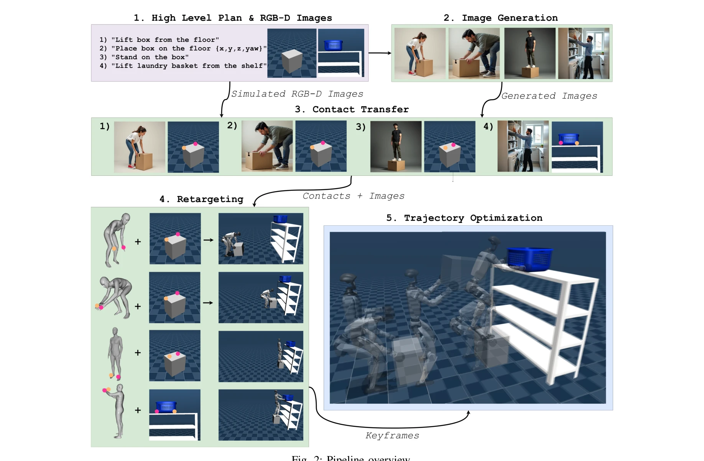
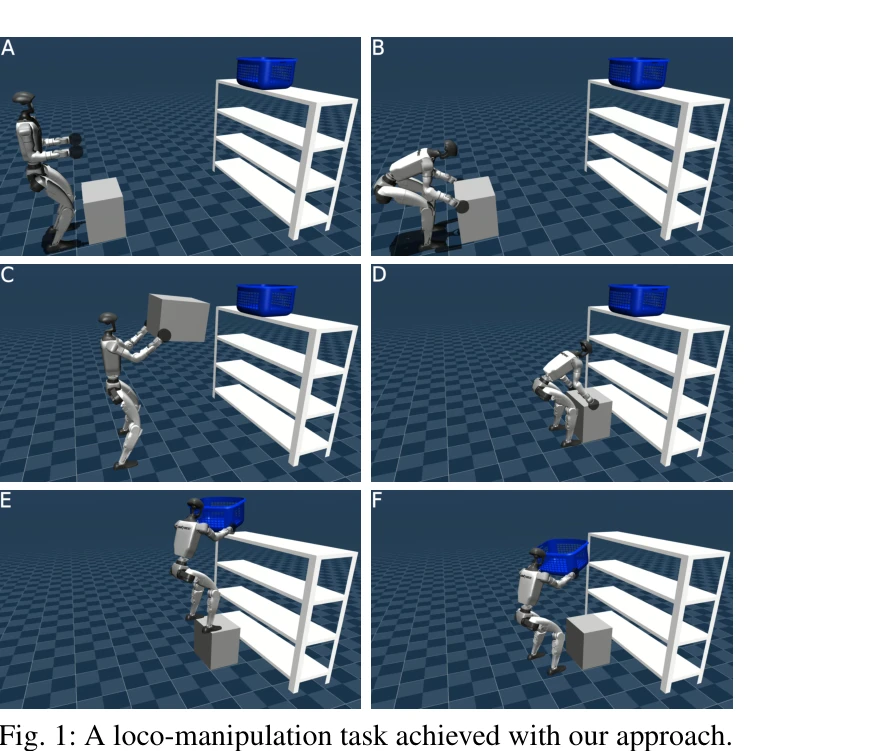
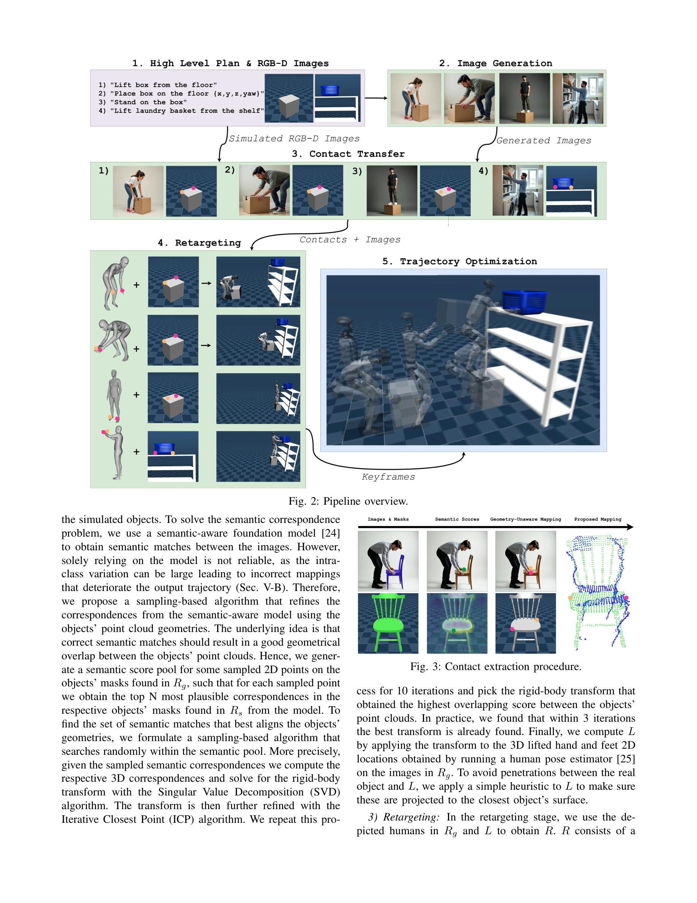

# Physically Consistent Humanoid Loco-Manipulation using Latent Diffusion Models

> **저자**: Ilyass Taouil, Haizhou Zhao, Angela Dai, Majid Khadiv | **날짜**: 2025-04-23 | **URL**: [https://arxiv.org/abs/2504.16843](https://arxiv.org/abs/2504.16843)

---

## Essence

*Fig. 2: Pipeline overview.*

본 논문은 Latent Diffusion Model(LDM)을 활용하여 인간-물체 상호작용 장면을 생성하고, 이로부터 추출한 접촉 위치와 로봇 구성을 whole-body trajectory optimization에 활용하여 인형로봇의 물리적으로 일관성 있는 장기 조작 계획을 수립한다.

## Motivation

- **Known**: 기존 인형로봇 로코-조작 연구는 국소적 최적화나 사전정의된 접촉 수열에 의존하거나 단순 과제만 다루었으며, 장기 추론이 필요한 복잡한 작업에 대한 신뢰성 있는 계획 방법이 부족하다.
- **Gap**: 인형로봇의 고차원 불안정 동역학에서 장기 추론이 필요한 로코-조작 작업을 위한 효율적 계획 방법이 없으며, 작업별 휴리스틱이나 3D 주석 데이터 없이 접촉과 로봇 구성을 자동으로 생성하는 방법이 부재하다.
- **Why**: 인형로봇이 실제 환경에서 반복적이고 위험한 작업을 수행하기 위해서는 인간의 운동 지식을 활용한 신뢰성 높은 계획이 필수적이며, generative model의 발전으로 이를 실현할 수 있는 기회가 생겼다.
- **Approach**: LDM으로부터 인간의 행동을 시각적으로 생성하고, Vision Language Model과 segmentation foundation model을 통해 2D 이미지에서 접촉 위치를 추출한 후, 이를 3D 공간으로 변환하여 whole-body trajectory optimization의 초기값으로 활용한다.

## Achievement

*Fig. 1: A loco-manipulation task achieved with our approach.*

- **최초의 LDM 기반 인형로봇 로코-조작 계획 파이프라인**: 접촉 위치와 로봇 구성을 동시에 계획하는 통합 파이프라인 제시
- **물리적 일관성 보장**: 추출된 정보를 whole-body trajectory optimization에 통합하여 물리적으로 타당한 궤적 생성
- **장기 작업 대응**: 여러 단계의 텍스트 프롬프트를 통해 장기 추론이 필요한 로코-조작 시나리오에 대응
- **광범위한 파이프라인 분석**: 접촉 및 로봇 구성 추출 모듈에 대한 상세한 분석 및 검증 수행

## How

*Fig. 3: Contact extraction procedure.*

- **이미지 생성**: 고수준 명령어를 정적 단어와 결합하여 LDM으로 전신 인간-물체 상호작용 이미지 생성
- **접촉 추출**: Vision Language Model로 객체 검출, segmentation foundation model로 정밀 마스킹, metric depth estimation으로 3D 포인트 클라우드 변환
- **의미론적 대응**: semantic-aware foundation model의 의미론적 매치를 기하학적 overlapping으로 검증하는 sampling-based 최적화를 통해 신뢰성 향상
- **키프레임 추출**: 생성 이미지에서 인간 포즈를 추출하여 로봇 구성으로 retargeting
- **궤적 최적화**: 추출된 접촉과 구성을 whole-body trajectory optimization 제약 조건으로 활용하여 물리적으로 타당한 궤적 생성

## Originality

- LDM의 생성 능력을 인형로봇 계획에 활용하는 새로운 패러다임 제시 (기존 작업은 DRL이나 고정 접촉 수열에 의존)
- 2D 이미지에서 3D 접촉 대응으로의 변환을 위한 기하학적 기반 sampling-based 최적화 방법 개발
- 작업별 휴리스틱이나 3D 주석 없이 자동으로 접촉 및 로봇 구성을 생성하는 일반화된 접근법
- 여러 foundation model(VLM, segmentation, depth estimation, semantic matching)을 효과적으로 통합한 파이프라인

## Limitation & Further Study

- **생성 이미지의 불완전성**: LDM이 완벽한 전신 이미지를 보장하지 않으므로 프롬프트 엔지니어링 필요
- **깊이 추정의 한계**: 생성 이미지의 카메라 내재성 부재로 인해 경험적 값 사용, 기하학적 왜곡 가능성
- **의미론적 대응의 불안정성**: 생성된 객체의 다양한 형태와 텍스처로 인한 의미 대응 오류 위험
- **시뮬레이션 중심 검증**: 실제 로봇에서의 검증 부재, 현실 적응성 미지수
- **계산 복잡도**: 반복적 ICP 및 SVD 기반 최적화의 computational cost 미분석
- **향후 연구**: (1) 실제 인형로봇에서의 검증, (2) 더 정확한 깊이 추정 모델 통합, (3) end-to-end 학습 기반 대응 방법, (4) 동적 환경과 불확실성 대응

## Evaluation

- Novelty: 4/5
- Technical Soundness: 3/5
- Significance: 4/5
- Clarity: 4/5
- Overall: 4/5

**총평**: 본 논문은 LDM과 foundation model을 창의적으로 결합하여 인형로봇의 장기 로코-조작 계획 문제를 새로운 방식으로 접근하며, 광범위한 실험과 분석을 통해 방법론의 유효성을 입증했다. 다만 실제 로봇 검증과 일부 모듈의 정확성 개선이 필요하다.