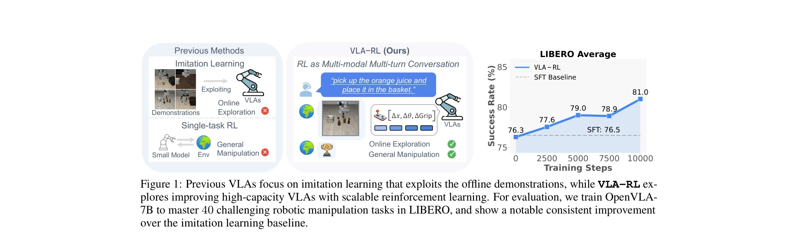
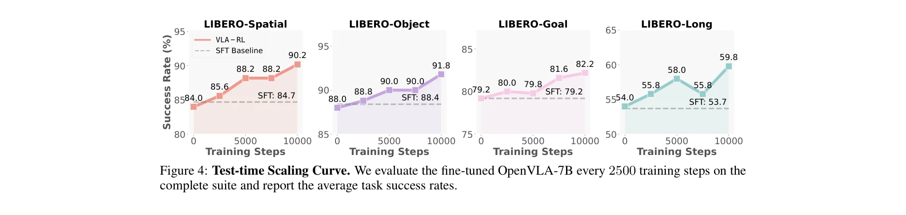
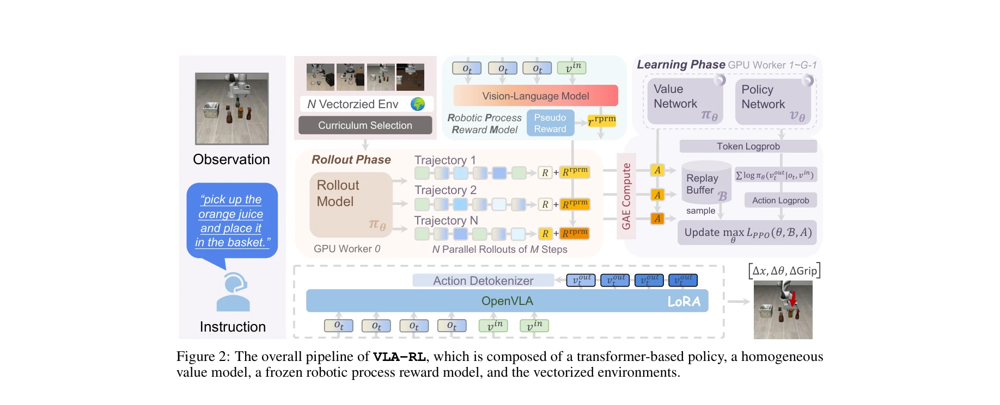

# VLA-RL: Towards Masterful and General Robotic Manipulation with Scalable Reinforcement Learning

> **저자**: Guanxing Lu, Wenkai Guo, Chubin Zhang, Yuheng Zhou, Haonan Jiang, Zifeng Gao, Yansong Tang, Ziwei Wang | **날짜**: 2025-05-24 | **URL**: [https://arxiv.org/abs/2505.18719](https://arxiv.org/abs/2505.18719)

---

## Essence

*Figure 1: Previous VLAs focus on imitation learning that exploits the offline demonstrations, while VLA-RL ex-*

본 논문은 사전학습된 Vision-Language-Action(VLA) 모델을 강화학습(RL)으로 개선하여 로봇 조작 작업의 분포 외(OOD) 시나리오 대응력을 향상시키는 VLA-RL 프레임워크를 제시한다. 궤적 수준의 RL 공식화와 robotic process reward model을 통해 LIBERO 벤치마크에서 OpenVLA-7B의 성능을 4.5% 향상시킨다.

## Motivation

- **Known**: 최근 대규모 VLA 모델들은 인간 시연 모방을 통해 다양한 로봇 조작 작업에서 우수한 성능을 보였으나, 오프라인 데이터의 제한된 상태 방문으로 인해 테스트 시 OOD 시나리오에서 실패한다. LLM에 RL을 적용하는 것이 추론 성능 향상에 효과적임이 증명되었다.
- **Gap**: 기존 로봇 RL은 처음부터 학습하거나 간단한 도메인에만 적용되었으며, 대규모 기초 모델을 활용한 궤적 수준의 온라인 RL과 일반적인 멀티태스크 로봇 조작의 결합이 충분히 탐구되지 않았다.
- **Why**: 로봇 조작의 일반화 능력 향상은 실제 로봇 배포의 핵심 과제이며, LLM의 RL 성공을 로봇 도메인으로 확장하면 테스트 타임 스케일링과 추론 계산 이점을 얻을 수 있다.
- **Approach**: VLA-RL은 로봇 조작 궤적을 다중모달 다중턴 대화로 모델링하고, 자동 추출된 작업 세그먼트에서 생성된 의사 보상 레이블로 학습된 robotic process reward model을 통해 희소 보상 문제를 해결하며, 커리큘럼 선택, GPU 균형 환경, 배치 디코딩, critic warmup 등 구현 최적화를 적용한다.

## Achievement

*Figure 4: Test-time Scaling Curve. We evaluate the fine-tuned OpenVLA-7B every 2500 training steps on the*

- **성능 향상**: OpenVLA-7B를 LIBERO의 40개 도전적인 로봇 조작 작업에서 76.3%에서 81.0%로 4.5% 개선하여 π0-FAST 같은 상용 모델 수준 달성
- **테스트 타임 스케일링**: 테스트 시 최적화 단계 증가에 따른 일관된 성능 향상(75%→85%)으로 로봇 도메인에서의 추론 스케일링 법칙 초기 증거 제시
- **일반화 프레임워크**: 다중모달 다중턴 대화 공식화를 통해 LLM RL 기법을 로봇 도메인에 체계적으로 적용하는 통일된 관점 제공
- **안정적 구현**: curriculum selection, GPU-balanced vectorized environments, batch decoding, critic warmup 등 실무적 개선사항으로 RL 훈련의 안정성 및 효율성 향상

## How

*Figure 2: The overall pipeline of VLA-RL, which is composed of a transformer-based policy, a homogeneous*

- auto-regressive VLA(OpenVLA-7B 기반)의 trajectory-level RL 공식화로 로봇 조작을 다중모달 다중턴 대화로 모델링
- vision-language model을 fine-tuning한 robotic process reward model(rPRM) 구축으로 자동 추출 작업 세그먼트의 의사 보상 라벨로 희소 보상 문제 해결
- PPO 기반 정책 최적화에 policy network와 value network를 LoRA 어댑터로 구현
- N개 병렬 환경에서 M 스텝 궤적 수집 후 GAE(Generalized Advantage Estimation)로 보상 계산
- curriculum selection 전략으로 훈련 데이터 선택 최적화
- GPU 워커 간 로드 밸런싱된 벡터화 환경으로 효율성 증대
- 배치 디코딩과 critic warmup으로 훈련 안정성 개선

## Originality

- 로봇 조작 궤적을 다중모달 다중턴 대화로 공식화한 혁신적 관점으로 LLM RL 기법의 로봇 적용 확장
- 일반적인 로봇 기초 모델의 온라인 RL fine-tuning 최초 체계적 탐구로 기존 단일 태스크나 단순 도메인 RL의 한계 돌파
- 자동 작업 세그먼트 추출 기반 의사 보상 라벨 생성 방식으로 비용이 많이 드는 보상 엔지니어링 회피
- 테스트 타임 계산 증가에 따른 성능 향상의 구체적 실증으로 로봇 도메인 추론 스케일링의 초기 증거 제시

## Limitation & Further Study

- LIBERO 시뮬레이션 환경에서만 평가되어 실물 로봇 환경으로의 일반화 가능성 미검증
- OpenVLA-7B에만 적용되어 다른 VLA 모델(Open X-Embodiment 등)에 대한 일반성 미확인
- rPRM의 의사 보상 라벨 자동 생성 과정의 정확도와 그에 따른 성능 상한에 대한 분석 부족
- 테스트 타임 스케일링의 계산 비용-성능 트레이드오프 분석 미흡
- 후속 연구: 실물 로봇 배포 실험, 다양한 VLA 모델 적용, rPRM 품질 개선 방법론 연구, 계산 효율성과 성능의 최적화 방안 탐색

## Evaluation

- Novelty: 4/5
- Technical Soundness: 3/5
- Significance: 4/5
- Clarity: 4/5
- Overall: 4/5

**총평**: 본 논문은 LLM RL의 성공 사례를 로봇 도메인으로 창의적으로 확장하여 대규모 VLA 모델의 온라인 학습을 가능하게 하는 체계적인 프레임워크를 제시한다. LIBERO에서의 의미 있는 성능 향상과 테스트 타임 스케일링 증거는 로봇 학습의 새로운 방향을 제시하지만, 실물 로봇 검증이 필요하다.

## Related Papers

- 🏛 기반 연구: [[papers/1444_Hierarchical_Planning_and_Control_for_Box_Loco-Manipulation/review]] — Language to Rewards의 언어 기반 보상 설계가 VLA-RL의 robotic process reward model 개발 기반이 된다
- 🔗 후속 연구: [[papers/1532_Learning_Motion_Skills_with_Adaptive_Assistive_Curriculum_Fo/review]] — RLinf-VLA의 통합 강화학습 프레임워크를 VLA 모델 특화하여 out-of-distribution 대응력을 향상시켰다
- 🧪 응용 사례: [[papers/1534_Learning_Sim-to-Real_Humanoid_Locomotion_in_15_Minutes/review]] — RoboAgent의 일반화 능력과 VLA-RL의 강화학습 개선을 결합하여 robust한 조작 정책 학습이 가능하다
- ⚖️ 반론/비판: [[papers/1583_No_More_Marching_Learning_Humanoid_Locomotion_for_Short-Rang/review]] — Text2Reward가 언어에서 보상으로, VLA-RL이 사전학습에서 강화학습으로의 서로 다른 방향의 개선 전략을 보여준다
- 🔗 후속 연구: [[papers/1411_Gallant_Voxel_Grid-based_Humanoid_Locomotion_and_Local-navig/review]] — VLA-RL의 masterful manipulation이 GR-RL의 고정밀 전문가 정책 학습을 더욱 일반화된 관점으로 확장한다.
- 🔗 후속 연구: [[papers/1532_RLinf-VLA_A_Unified_and_Efficient_Framework_for_Reinforcemen/review]] — VLA-RL의 마스터 수준 로봇 조작과 RLinf-VLA의 효율적 RL 훈련이 VLA 강화학습의 상호 보완적 측면을 제시한다.
- 🔄 다른 접근: [[papers/1619_VLA-RFT_Vision-Language-Action_Reinforcement_Fine-tuning_wit/review]] — 둘 다 VLA 강화학습이지만 VLA-RFT는 world model 기반, VLA-RL은 direct RL로 다른 학습 패러다임이다
