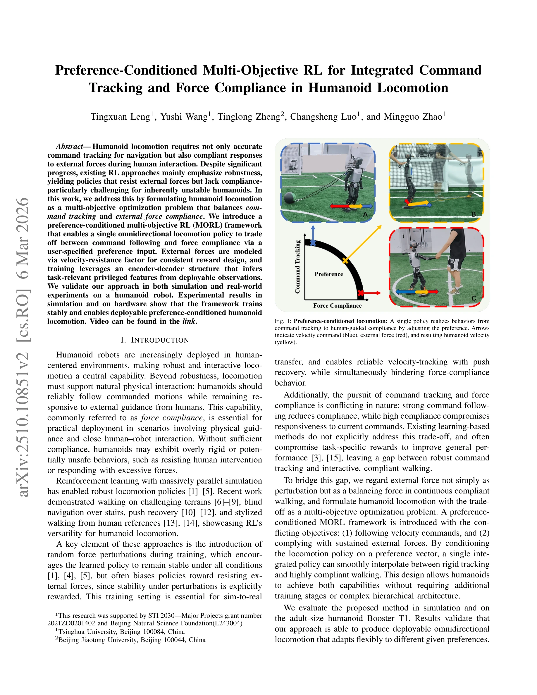
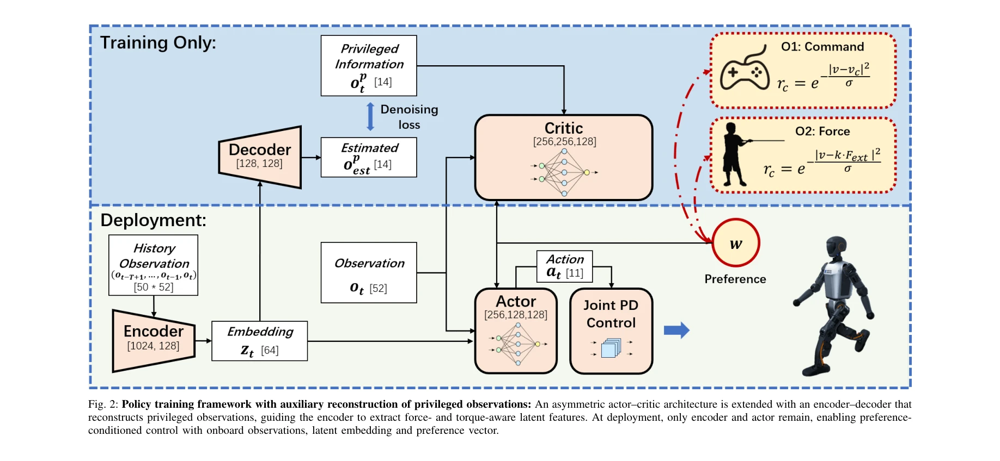

# Preference-Conditioned Multi-Objective RL for Integrated Command Tracking and Force Compliance in Humanoid Locomotion

> **저자**: Tingxuan Leng, Yushi Wang, Tinglong Zheng, Changsheng Luo, Mingguo Zhao | **날짜**: 2025-10-12 | **URL**: [https://arxiv.org/abs/2510.10851](https://arxiv.org/abs/2510.10851)

---

## Essence

*Fig. 1: Preference-conditioned locomotion: A single policy realizes behaviors from*

인간형 로봇의 명령 추적과 외력 순응을 동시에 달성하기 위해 선호도 조건부 MORL 프레임워크를 제안하며, 단일 정책으로 추적-순응 간의 연속적인 trade-off를 구현한다.

## Motivation

- **Known**: 기존 RL 기반 인간형 로봇 보행은 견고성을 강조하여 외력에 저항하는 정책을 학습하지만, 인간과의 상호작용에서 필요한 순응성(compliance)은 부족하다.
- **Gap**: 속도 명령 추적과 외력 순응은 본질적으로 충돌하는 목표이지만, 기존 학습 기반 방법은 이 trade-off를 명시적으로 다루지 않으며 단일 정책으로 두 목표를 동시에 달성하지 못한다.
- **Why**: 인간 중심 환경에 배치되는 인간형 로봇은 자율적 내비게이션과 인간의 물리적 안내에 모두 반응해야 하므로, 사용자 선호도에 따라 두 목표 간의 유연한 균형이 실제 배치에 필수적이다.
- **Approach**: Velocity-Resistance 모델을 통해 속도 명령과 외력을 일관된 물리적 공간에서 표현하고, preference 벡터를 통해 조건화된 MORL 프레임워크를 도입하여 단일 정책이 연속적인 trade-off를 학습하도록 한다.

## Achievement

*Fig. 2: Policy training framework with auxiliary reconstruction of privileged observations: An asymmetric actor–critic a*

- **Velocity-Resistance 모델**: 외력을 등가 속도로 매핑하여 명령 추적과 외력 순응을 통일된 보상 함수로 설계 가능
- **Preference-Conditioned MORL**: 단일 정책으로 경직된 추적에서 높은 순응성까지의 연속 스펙트럼을 커버하는 omnidirectional 보행 실현
- **Encoder-Decoder 구조**: 배포 가능한 관찰로부터 privilege 정보를 재구성하며 외력-토크 인식 잠재 특징 추출
- **실세계 검증**: 시뮬레이션 및 Booster T1 인간형 로봇에서 안정적 학습과 배포 가능한 선호도 조건부 보행 확인

## How

*Fig. 2: Policy training framework with auxiliary reconstruction of privileged observations: An asymmetric actor–critic a*

- Asymmetric actor-critic 아키텍처에 encoder-decoder 보조 모듈 추가하여 privilege observation 재구성
- 선형 속도와 각속도에 대응하는 외력과 토크를 velocity-resistance 모델로 통합 표현
- Preference 벡터 입력으로 다중 목표 간의 가중치를 동적으로 조정하는 정책 조건화
- Massively parallel simulation 환경(Booster Gym)에서 안정적 학습 파이프라인 구성
- 배포 시 encoder와 actor만 사용하여 onboard observation과 latent embedding, preference vector로 제어

## Originality

- 기존 MORL 적용이 간접적 충돌(속도 vs 에너지)에 집중한 반면, 본 논문은 명령 추적과 외력 순응 간의 **직접적 충돌**을 명시적으로 모델링
- Velocity-resistance 모델을 통해 물리적으로 이질한 명령과 외력을 **단일 공간에서 통합** 표현하는 혁신적 접근
- 단계적 학습이나 계층적 컨트롤러 없이 **단일 정책**으로 연속적 preference trade-off 달성
- 인간형 로봇의 omnidirectional locomotion에 특화된 force-compliant 제어를 처음 체계적으로 다룸

## Limitation & Further Study

- 수평 평면 운동만 고려하며, 수직 동역학 및 복잡한 지형 대응은 범위 외
- External force를 선형 velocity-resistance 모델로 모델링하므로, 비선형 복잡한 상호작용 및 동적 환경에서의 일반화 능력 미검증
- Privilege observation(contact force, torque) 접근 가능성이 요구되므로 이 정보가 없는 환경에서의 적용 제한
- 실세계 실험이 단일 로봇(Booster T1)에만 수행되어 다양한 인간형 로봇 플랫폼에서의 재현성 확인 필요
- 후속 연구: (1) 수직 동역학과 불규칙 지형 통합, (2) 완전 관찰 기반 정책으로 privilege information 완전 제거, (3) 동적 human-robot interaction 모델링 및 의도 예측 추가

## Evaluation

- Novelty: 4/5
- Technical Soundness: 3/5
- Significance: 4/5
- Clarity: 4/5
- Overall: 4/5

**총평**: 본 논문은 선호도 조건부 MORL을 통해 인간형 로봇 보행의 핵심 trade-off를 명시적으로 해결하는 창의적 접근법을 제시하며, velocity-resistance 모델링이라는 우아한 통합 기법과 실세계 검증을 통해 실제 배치 가능성을 입증한다. 다만 범위 제한(수평 평면, 선형 모델)과 단일 플랫폼 실험이 일반화 가능성에 대한 의문을 남긴다.
