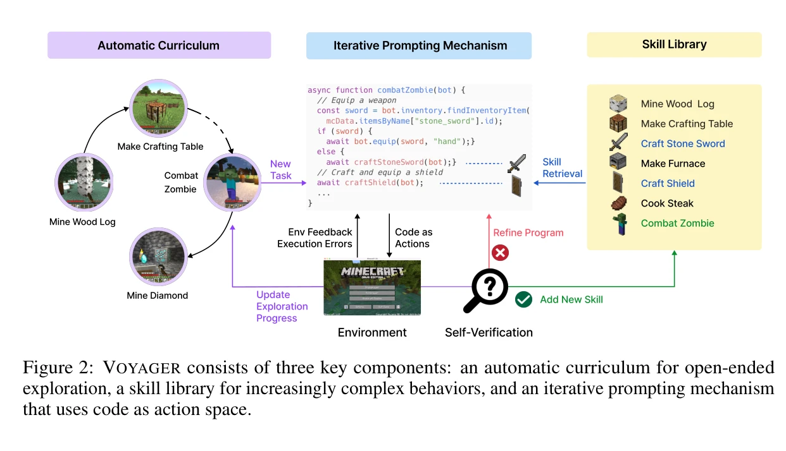
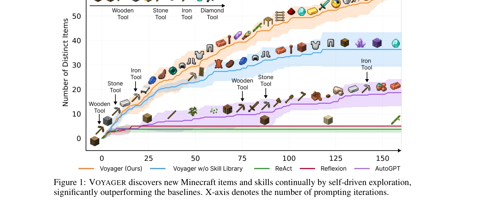

# Voyager: An Open-Ended Embodied Agent with Large Language Models

> **저자**: Guanzhi Wang, Yuqi Xie, Yunfan Jiang, Ajay Mandlekar, Chaowei Xiao, Yuke Zhu, Linxi Fan, Anima Anandkumar | **날짜**: 2023-05-25 | **URL**: [https://arxiv.org/abs/2305.16291](https://arxiv.org/abs/2305.16291)

---

## Essence

*Figure 2: VOYAGER consists of three key components: an automatic curriculum for open-ended*

Voyager는 GPT-4를 활용한 첫 번째 구체화된 평생 학습 에이전트로, Minecraft에서 자동 커리큘럼, 지속 가능한 스킬 라이브러리, 반복적 프롬프팅 메커니즘을 통해 인간의 개입 없이 지속적으로 탐험하고 새로운 기술을 획득한다.

## Motivation

- **Known**: LLM 기반 에이전트는 세계 지식을 활용하여 행동 계획을 생성할 수 있으나, 이러한 에이전트들은 시간에 걸쳐 지식을 누적하고 전이하는 평생 학습 능력이 부족하다.
- **Gap**: 기존 LLM 에이전트는 장시간에 걸친 지식의 누적, 점진적 기술 습득, 그리고 새로운 환경으로의 일반화에 실패한다. 특히 오픈엔드 환경에서 자율적으로 목표를 제안하고 실행 오류를 반복적으로 개선하는 메커니즘이 부재하다.
- **Why**: Minecraft 같은 오픈엔드 환경에서 인간의 개입 없이 지속적으로 탐험하고 학습할 수 있는 에이전트는 구체화된 AI 시스템의 일반화 능력과 적응성을 검증하는 데 중요하며, 로봇공학 등 실제 응용 분야로의 확장 가능성을 시사한다.
- **Approach**: Voyager는 blackbox GPT-4 쿼리를 통해 작동하며, 자동 커리큘럼으로 탐험 목표를 제시하고, 검증된 코드 프로그램을 벡터 데이터베이스에 저장한 후, 환경 피드백과 실행 오류를 포함하여 코드를 반복적으로 개선하는 방식으로 구성된다.

## Achievement

*Figure 1: VOYAGER discovers new Minecraft items and skills continually by self-driven exploration,*

- **탐험 성과**: 사전 SOTA 대비 3.3배 많은 고유 아이템 획득, 2.3배 더 긴 거리 이동, 주요 기술 트리 마일스톤을 15.3배 빠르게 달성
- **일반화 능력**: 학습한 스킬 라이브러리를 새로운 Minecraft 세계에서 재사용하여 처음부터 새로운 작업을 해결할 수 있는 반면 다른 기법은 실패
- **해석가능성과 구성성**: 생성된 스킬은 코드로 표현되어 해석 가능하며, 단순한 프로그램의 조합으로 복잡한 행동을 구성할 수 있어 능력의 급속한 향상 및 재앙적 망각 완화
- **인컨텍스트 학습**: 모델 파라미터 미세조정 없이 blackbox LLM 상호작용만으로 강한 평생 학습 능력 입증

## How

*Figure 2: VOYAGER consists of three key components: an automatic curriculum for open-ended*

- **자동 커리큘럼**: GPT-4에 현재 에이전트 상태(인벤토리, 생물군계, 가까운 엔티티 등)와 탐험 진행 상황을 제시하여 '가능한 한 많은 다양한 것들을 발견'이라는 목표 하에 점진적으로 어려워지는 작업 제안", '**스킬 라이브러리**: 검증된 코드 프로그램의 설명을 GPT-3.5로 임베딩하여 벡터 데이터베이스에 저장, 새 작업에 대해 상위 5개 관련 스킬 검색 후 프롬프트에 포함
- **반복적 프롬프팅 메커니즘**: 생성된 프로그램을 환경에서 실행하여 관찰(인벤토리, 주변 엔티티) 및 오류 추적 수집, 이를 GPT-4의 다음 라운드 프롬프트에 피드백으로 포함, 자체 검증 모듈이 작업 완료 확인 시 스킬 라이브러리에 추가
- **코드 액션 공간**: 저수준 모터 명령 대신 실행 가능한 코드를 액션으로 사용하여 시간적으로 확장된 행동과 조합성 표현 가능

## Originality

- **최초의 LLM 기반 구체화된 평생 학습 에이전트**: Minecraft에서 인간 개입 없이 지속적 탐험과 기술 축적을 수행하는 에이전트는 선례가 없음
- **반복적 프롬프팅 메커니즘의 혁신**: 환경 피드백, 실행 오류, 자체 검증을 통합한 코드 생성-개선 루프는 기존 LLM 에이전트의 일회성 코드 생성을 능가
- **벡터 데이터베이스 기반 스킬 라이브러리**: 프로그램 설명의 임베딩을 통한 의미 기반 스킬 검색과 재사용으로 조합성과 일반화를 동시에 달성
- **자동 커리큘럼의 상태 인식 적응성**: 에이전트의 현재 상태를 피드백으로 받아 맥락에 맞는 작업을 동적으로 제시하는 방식은 novelty search의 새로운 적용

## Limitation & Further Study

- **GPT-4 의존성**: 모든 의사결정이 blackbox GPT-4에 의존하므로 재현성과 비용 효율성 문제 가능성
- **Minecraft 환경 제한**: 다른 구체화 환경(예: 로봇공학, 실제 시뮬레이션)으로의 전이 학습 가능성 미검증
- **스킬 라이브러리 확장성**: 매우 많은 수의 스킬이 축적될 경우 검색 효율성 및 관련성 저하 가능성에 대한 분석 부재
- **세밀한 제어의 부재**: 코드 기반 액션으로 인해 픽셀 수준의 시각적 피드백이 제한적이며, 복잡한 기하학적 조작이 필요한 작업에서의 성능 미검증
- **후속 연구 방향**: (1) 다양한 구체화 환경으로의 확장, (2) 오픈소스 LLM으로의 대체 가능성 탐색, (3) 스킬 라이브러리의 최적화 및 확장성 개선, (4) 인간 피드백 통합을 통한 학습 가속화

## Evaluation

- Novelty: 4/5
- Technical Soundness: 4/5
- Significance: 4/5
- Clarity: 4/5
- Overall: 4/5

**총평**: Voyager는 LLM 기반 에이전트의 평생 학습 능력을 획기적으로 입증하는 첫 번째 시스템으로, 자동 커리큘럼, 벡터 기반 스킬 라이브러리, 반복적 프롬프팅의 조합을 통해 기존 기법을 대폭 능가하는 성과를 달성했으며, 오픈소스 공개로 커뮤니티 기여도 높다.

## Related Papers

- 🏛 기반 연구: [[papers/1534_RoboAgent_Generalization_and_Efficiency_in_Robot_Manipulatio/review]] — Voyager의 지속 가능한 스킬 라이브러리 구축과 평생 학습 메커니즘이 RoboAgent의 12개 조작 스킬 확장과 연속적 학습에 이론적 기반을 제공한다.
- 🔄 다른 접근: [[papers/1477_MineDojo_Building_Open-Ended_Embodied_Agents_with_Internet-S/review]] — 오픈엔드 구체화 에이전트에서 Voyager의 Minecraft 환경과 MineDojo의 인터넷 규모 데이터 활용 방식을 자동 커리큘럼과 평생 학습 측면에서 비교할 수 있다.
- 🔗 후속 연구: [[papers/1478_HumanoidBench_Simulated_Humanoid_Benchmark_for_Whole-Body_Lo/review]] — MineDreamer의 chain-of-imagination을 통한 명령 따르기 학습을 Voyager의 자동 커리큘럼과 반복적 프롬프팅에 통합하여 더 정교한 탐험 전략을 개발할 수 있다.
- 🧪 응용 사례: [[papers/1462_LOTUS_Continual_Imitation_Learning_for_Robot_Manipulation_Th/review]] — LOTUS의 연속 모방 학습 방법론을 Voyager의 평생 학습 스킬 획득에 적용하여 실제 로봇 환경에서의 지속적 기술 발전을 가능하게 한다.
- 🧪 응용 사례: [[papers/1482_MP5_A_Multi-modal_Open-ended_Embodied_System_in_Minecraft_vi/review]] — 개방형 체화 에이전트의 탐험과 학습 방법론이 Minecraft에서 능동적 인식을 구현하는 데 활용됩니다.
- 🔗 후속 연구: [[papers/1534_RoboAgent_Generalization_and_Efficiency_in_Robot_Manipulatio/review]] — Voyager의 평생 학습 스킬 라이브러리 구축 방법론을 RoboAgent의 12개 조작 스킬 학습에 적용하여 지속적 스킬 확장을 가능하게 한다.
- 🔗 후속 연구: [[papers/1353_Describe_Explain_Plan_and_Select_Interactive_Planning_with_L/review]] — Voyager는 DEPS의 개념을 열린 세계에서 대규모 언어 모델을 가진 열린 구체화 에이전트로 확장한다
