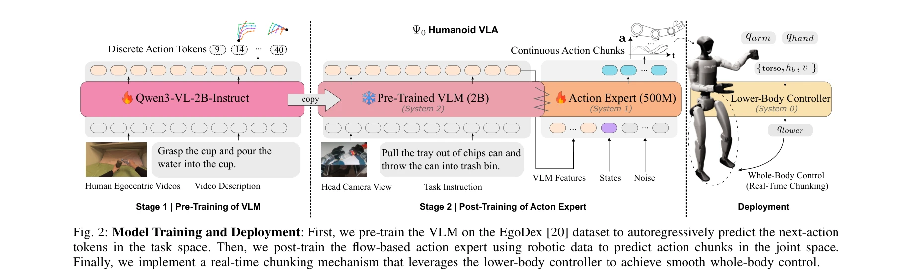
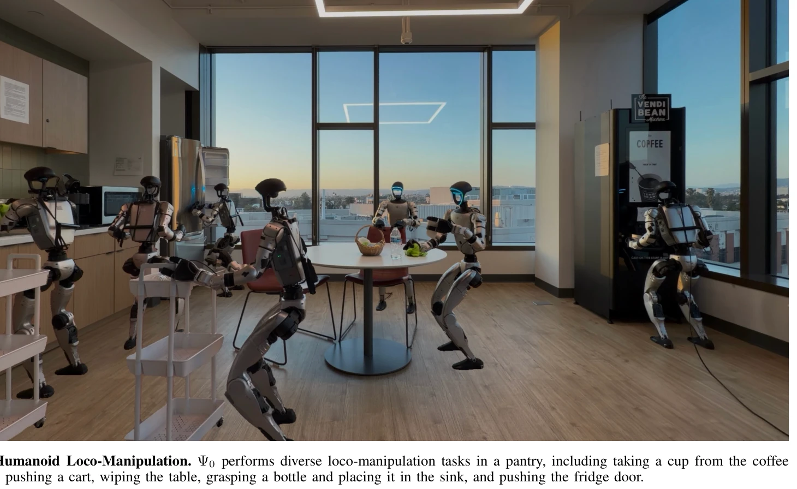

# Psi0: An Open Foundation Model Towards Universal Humanoid Loco-Manipulation

> **저자**: Songlin Wei, Hongyi Jing, Boqian Li, Zhenyu Zhao, Jiageng Mao, Zhenhao Ni, Sicheng He, Jie Liu, Xiawei Liu, Kaidi Kang, Sheng Zang, Weiduo Yuan, Marco Pavone, Di Huang, Yue Wang | **날짜**: 2026-03-12 | **URL**: [https://arxiv.org/abs/2603.12263](https://arxiv.org/abs/2603.12263)

---

## Essence

*Fig. 2: Model Training and Deployment: First, we pre-train the VLM on the EgoDex [20] dataset to autoregressively predic*

Ψ0는 인간 자기중심 비디오로 VLM을 사전학습한 후 실제 휴머노이드 데이터로 flow 기반 액션 전문가를 후학습하는 2단계 학습 패러다임을 통해 휴머노이드 전신 로코-조작 작업을 수행하는 오픈 파운데이션 모델이다.

## Motivation

- **Known**: 최근 VLA 모델들(RT1-2, OpenVLA, π0 등)이 대규모 로봇 데이터로 학습하여 조작 능력을 향상시켰으나, 휴머노이드 로코-조작용 텔레조작 데이터 수집은 비용이 매우 크다. 인간 비디오 학습 시도(EgoVLA, In-n-On)는 embodiment 간 차이로 인해 단일 정책의 suboptimal 학습 문제를 겪는다.
- **Gap**: 인간과 휴머노이드 간의 근본적인 운동학적·동역학적 차이로 인해 co-training 방식의 성능이 제한적이며, 데이터 효율성과 모델 성능이 여전히 불만족스럽다. 고품질 데이터의 올바른 구성이 대규모 이질적 데이터보다 효율적임을 체계적으로 입증하지 못했다.
- **Why**: 휴머노이드 로코-조작은 높은 자유도 제어와 장시간 작업이 필요하며 현실적 응용 잠재력이 크지만, 데이터 수집 비용 및 embodiment 차이로 인한 학습 난제가 존재한다. 데이터 효율적 학습 패러다임 개발은 휴머노이드 로봇의 실용화에 필수적이다.
- **Approach**: 2단계 분리 학습 전략을 채택하여: (1) 대규모 고품질 인간 자기중심 비디오(EgoDex)에서 VLM을 자기회귀적으로 사전학습해 시각-행동 표현 획득, (2) flow 기반 MM-DiT 액션 전문가를 실제 휴머노이드 데이터로 후학습하여 joint-space 제어를 정밀화한다.

## Achievement

*Fig. 1: Humanoid Loco-Manipulation. Ψ0 performs diverse loco-manipulation tasks in a pantry, including taking a cup from*

- **데이터 효율성**: 기존 방법 대비 10배 이상 적은 데이터(인간 비디오 800시간 + 로봇 데이터 30시간)로 학습
- **성능 우수성**: 여러 장시간 로코-조작 작업에서 기존 최신 방법 대비 40% 이상 성공률 향상 달성
- **실제 로봇 검증**: 다양한 복잡한 전신 조작 작업(음료잔 잡기, 카트 밀기, 테이블 닦기 등)을 실제 휴머노이드에서 성공적으로 수행
- **오픈 소스 생태계**: 데이터 처리·학습 파이프라인, 사전학습 모델 가중치, 실시간 추론 엔진 공개 예정

## How

*Fig. 2: Model Training and Deployment: First, we pre-train the VLM on the EgoDex [20] dataset to autoregressively predic*

- VLM 사전학습: EgoDex 인간 비디오 데이터셋에서 Qwen3-VL 2B 모델을 다음-행동 토큰 자기회귀 예측으로 학습
- 액션 전문가 후학습: MM-DiT 기반 flow 모델을 실제 휴머노이드 텔레조작 데이터로 학습하여 joint-space 행동 청크(action chunks) 직접 예측
- 다단계 후학습: 교차-작업 휴머노이드 데이터로 작업-불가지론적 학습 후 소량의 in-domain 텔레조작 시연으로 작업-특정 미세조정
- 실시간 청킹 메커니즘: 추론 지연 시간에 따른 움직임 떨림을 완화하기 위해 훈련 시점에 실시간 행동 청킹 도입
- 조작-지향 텔레조작 파이프라인: 전신 조작 중 하체 안정성 향상을 위한 최적화된 파이프라인 개발
- VLM 특성 기반 조건화: 시각-언어 특성을 MM-DiT 액션 전문가에 조건화하여 효율적 다중 행동 출력

## Originality

- **단계별 분리 학습 패러다임**: 인간과 휴머노이드 간 embodiment 차이를 직면하여 co-training 대신 명확히 분리된 2단계 학습(사전학습→후학습)을 제안
- **데이터 구성의 재평가**: 대규모 이질적 인터넷 클립이나 교차-embodiment 데이터 대신 고품질 인간 자기중심 비디오 + 고품질 실제 로봇 데이터 조합의 우수성 입증
- **MM-DiT 적용**: 다중모달 diffusion transformer를 휴머노이드 VLA 액션 예측에 적용하여 더 효율적 조건화 및 출력 가능
- **실시간 청킹 메커니즘**: 추론 지연 대응을 위한 훈련 시점 실시간 행동 청킹으로 배포 안정성 향상
- **포괄적 오픈소스 생태계**: 단순 모델 공개가 아닌 데이터 파이프라인, 텔레조작 최적화, 실시간 추론 엔진까지 완전한 시스템 공개

## Limitation & Further Study

- **데이터 품질 의존성**: 고품질 인간 자기중심 비디오 수집의 scalability 및 다양성 제약 미해결
- **단일 로봇 플랫폼**: 실험이 특정 휴머노이드 플랫폼 기준이므로 다른 humanoid 형태로의 일반화 능력 불명확
- **텔레조작 비용**: 30시간의 로봇 후학습 데이터 수집 여전히 인력 투입 필요하며, 비용 재량 분석 부족
- **작업 복잡도 제한**: 현재 실험이 상대적으로 제한된 범위의 로코-조작 작업에 초점, 극도로 복잡한 dexterous 조작의 한계 미분석
- **후속연구**: (1) 다양한 humanoid 형태에 대한 transfer learning 메커니즘 개발, (2) 자동화된 고품질 데이터 큐레이션 방법, (3) 더 적은 텔레조작 데이터로의 학습 최적화, (4) 동적 환경에서의 적응형 학습

## Evaluation

- Novelty: 4/5
- Technical Soundness: 3/5
- Significance: 4/5
- Clarity: 4/5
- Overall: 4/5

**총평**: Ψ0는 인간 비디오와 로봇 데이터의 embodiment 차이를 체계적으로 다루는 2단계 분리 학습 패러다임으로 휴머노이드 로코-조작의 데이터 효율성을 크게 향상시켰으며, 포괄적 오픈소스 생태계 공개를 통해 커뮤니티 기여도가 높은 의미 있는 연구이다.