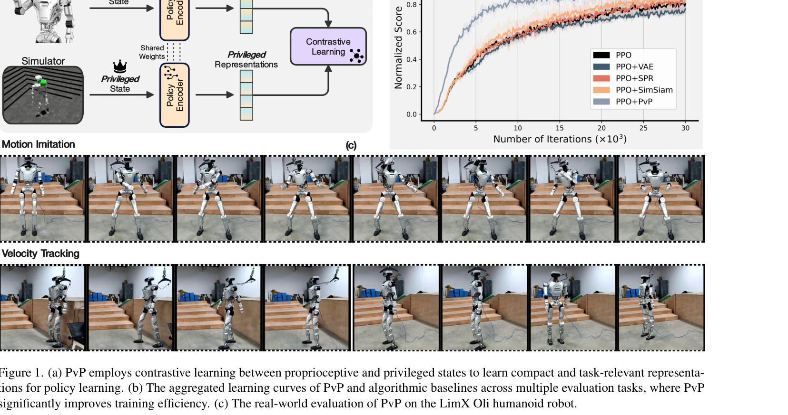
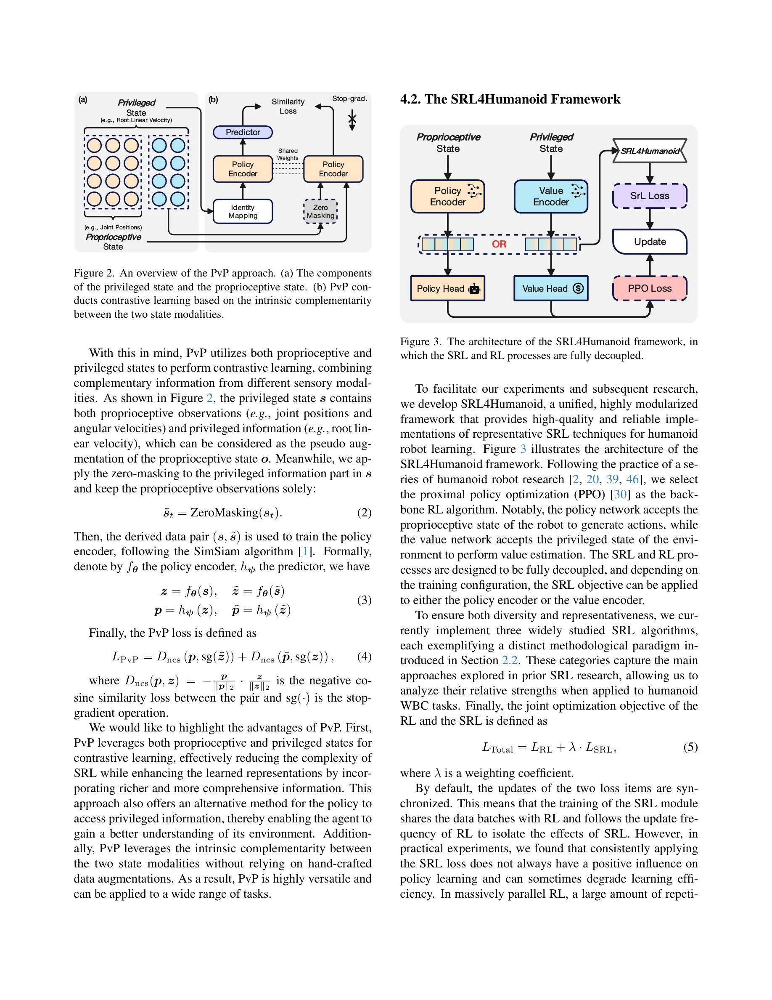

# PvP: Data-Efficient Humanoid Robot Learning with Proprioceptive-Privileged Contrastive Representations

> **저자**: Mingqi Yuan, Tao Yu, Haolin Song, Bo Li, Xin Jin, Hua Chen, Wenjun Zeng | **날짜**: 2026-03-11 | **DOI**: [10.48550/arXiv.2512.13093](https://doi.org/10.48550/arXiv.2512.13093)

---

## Essence

*Figure 1. (a) PvP employs contrastive learning between proprioceptive and privileged states to learn compact and task-re*

PvP는 고유 감각(proprioceptive)과 특권 상태(privileged state) 사이의 대조 학습을 활용하여 휴머노이드 로봇의 전신 제어(WBC) 학습의 샘플 효율성을 크게 향상시킨다.

## Motivation

- **Known**: RL은 휴머노이드 로봇 제어에서 유망한 접근법이지만 복잡한 동역학과 부분 관찰성으로 인해 샘플 비효율성이 심각한 문제다. SRL은 고차원 입력을 컴팩트한 표현으로 변환하여 학습 효율을 개선할 수 있다.
- **Gap**: 기존 SRL 기법들이 휴머노이드 WBC에 통합되지 않았으며, 다양한 SRL 방법의 체계적 비교 평가와 실제 로봇 배포를 고려한 통합 프레임워크가 부재하다.
- **Why**: 휴머노이드 로봇의 복잡한 동역학으로 인해 샘플 효율적인 학습이 필수이며, 실제 배포 비용을 고려할 때 데이터 효율성 향상은 상용화의 핵심이다.
- **Approach**: PvP는 시뮬레이터에서 접근 가능한 특권 상태와 실제 로봇에서 측정 가능한 고유 감각 상태 간의 대조 학습을 통해 정보적이고 컴팩트한 표현을 학습한다. 또한 SRL4Humanoid 프레임워크를 개발하여 다양한 SRL 방법을 체계적으로 평가한다.

## Achievement

*Figure 1. (a) PvP employs contrastive learning between proprioceptive and privileged states to learn compact and task-re*

- **PvP 프레임워크**: 손으로 제작한 데이터 증강(data augmentation) 없이 proprioceptive-privileged 대조 학습을 통해 안정적인 성능 향상을 달성
- **SRL4Humanoid 개발**: 휴머노이드 로봇 학습을 위한 대표적 SRL 방법들의 고품질 구현을 제공하는 첫 번째 통합 프레임워크
- **실제 로봇 검증**: LimX Oli 휴머노이드 로봇의 velocity tracking 및 motion imitation 태스크에서 baseline SRL 방법 대비 샘플 효율성과 최종 성능 향상 입증
- **체계적 연구**: SRL-RL 통합 방식에 대한 실용적 인사이트 제공으로 데이터 효율적 휴머노이드 로봇 학습의 지침 제시

## How

*Figure 2. An overview of the PvP approach. (a) The components*

- Proprioceptive 인코더와 privileged 인코더를 shared weights로 구성하여 두 상태 공간의 표현을 학습
- Contrastive learning 목적 함수로 proprioceptive와 privileged 상태 쌍 간의 유사성을 최대화하고 부정 쌍을 분리
- 정책 학습에는 proprioceptive 인코더만 사용하여 실제 로봇 배포 시 privileged 정보 불필요
- SRL4Humanoid에 reconstruction-based, dynamics modeling, contrastive learning 기반 SRL 방법들을 통합
- PPO 기반 정책 학습과 SRL 손실을 end-to-end로 결합하여 표현과 정책을 동시에 학습

## Originality

- 휴머노이드 WBC를 위한 SRL 적용에서 proprioceptive-privileged 대조 학습이라는 새로운 관점 제시
- 시뮬레이터의 특권 정보를 학습 신호로 활용하되 실배포에서는 사용하지 않는 실용적 설계
- 휴머노이드 로봇 학습을 위한 최초의 통합 SRL 프레임워크(SRL4Humanoid) 개발
- 다양한 SRL 기법의 체계적 비교 평가를 통한 휴머노이드 WBC에 최적화된 방법 탐색

## Limitation & Further Study

- LimX Oli 단일 로봇 플랫폼에서만 검증되어 다른 휴머노이드 로봇 구조에 대한 일반화 가능성 미확인
- 실제 환경의 노이즈와 동역학 불일치(sim-to-real gap)에 대한 강건성 분석 부족
- Privileged 상태의 구체적 정의와 선택이 성능에 미치는 영향에 대한 심층 분석 필요
- 계산 비용 분석 부재로 온디바이스 실시간 처리 가능성 미검토
- 후속연구: 다중 로봇 플랫폼 검증, transfer learning 가능성 탐색, 온라인 학습 시나리오 평가

## Evaluation

- Novelty: 4/5
- Technical Soundness: 3/5
- Significance: 4/5
- Clarity: 4/5
- Overall: 4/5

**총평**: PvP는 proprioceptive-privileged 대조 학습이라는 직관적이면서도 효과적인 방법으로 휴머노이드 로봇 학습의 샘플 효율성을 크게 향상시키며, SRL4Humanoid 프레임워크는 해당 분야의 표준 도구로서 상당한 기여를 한다.
