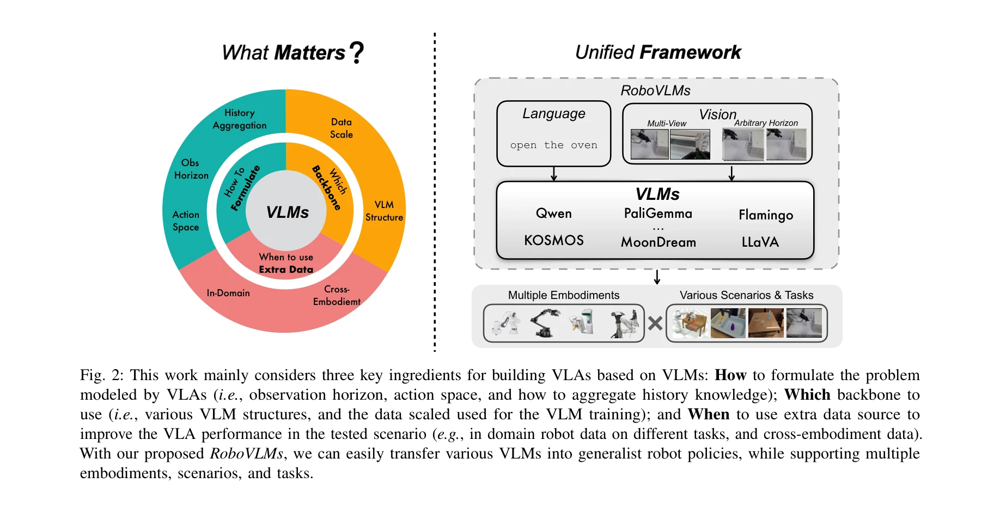
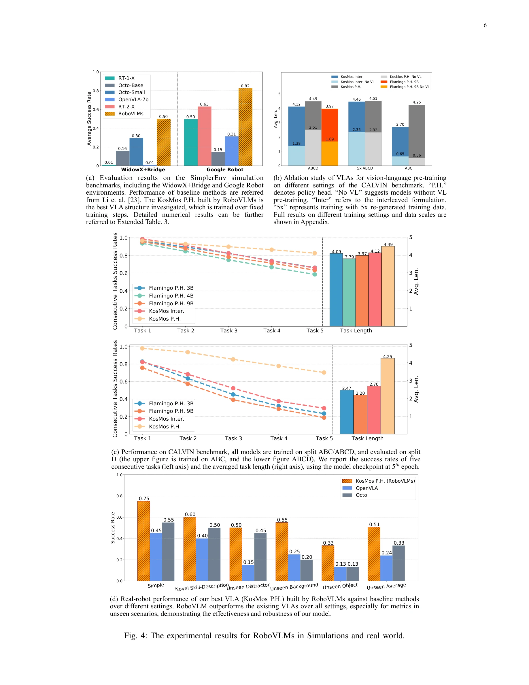

# What Matters in Building Vision-Language-Action Models for Generalist Robots

> **저자**: Xinghang Li, Peiyan Li, Long Qian, Minghuan Liu, Dong Wang, Jirong Liu, Bingyi Kang, Xiao Ma, Xinlong Wang, Di Guo, Tao Kong, Hanbo Zhang, Huaping Liu | **날짜**: 2024-12-18 | **URL**: [https://arxiv.org/abs/2412.14058](https://arxiv.org/abs/2412.14058)

---

## Essence

*Fig. 2: This work mainly considers three key ingredients for building VLAs based on VLMs: How to formulate the problem*

Vision-Language-Action (VLA) 모델 개발 시 VLM 백본 선택, 아키텍처 설계, 데이터 활용 시점이라는 세 가지 핵심 요소를 체계적으로 분석하고, 이를 통해 RoboVLMs 프레임워크를 제안하여 로봇 조작 작업에서 최고 성능을 달성한다.

## Motivation

- **Known**: VLM이 대규모 웹 데이터로 학습되어 강력한 멀티모달 표현 능력을 갖추고 있으며, 최근 여러 VLA 기반 로봇 정책들이 유망한 결과를 보이고 있다는 것이 알려져 있다.
- **Gap**: 기존 VLA 연구들이 다양한 VLM 백본, 아키텍처, 데이터 조합을 사용하지만, 이러한 설계 선택이 로봇 조작 성능에 미치는 영향을 종합적으로 분석한 연구가 부족하다.
- **Why**: VLA의 성능에 영향을 미치는 핵심 설계 요소를 체계적으로 파악하고 명확한 가이드라인을 제시함으로써 향후 일반화된 로봇 정책 개발을 효율적으로 진행할 수 있기 때문이다.
- **Approach**: 8개 이상의 VLM 백본, 4가지 정책 아키텍처, 600개 이상의 실험 설계를 통해 3가지 핵심 질문(어떤 백본, 어떤 아키텍처, 언제 cross-embodiment 데이터 추가)에 대한 답을 체계적으로 찾으며, 이를 바탕으로 유연한 RoboVLMs 프레임워크를 개발한다.

## Achievement

*Fig. 4: The experimental results for RoboVLMs in Simulations and real world.*

- **VLM 백본 분석**: Flamingo, LLaVA, MoonDream, PaliGemma, Qwen, KOSMOS 등 다양한 VLM 구조의 로봇 조작 작업에 대한 효과를 비교 분석
- **아키텍처 설계 가이드**: One-step 모델링, 히스토리 모델링(Interleaved vs Policy Head), 연속/이산 액션 스페이스의 장단점을 명확히 제시
- **데이터 활용 전략**: In-domain 데이터와 cross-embodiment 데이터의 최적 활용 시점과 방식을 규명
- **RoboVLMs 프레임워크**: 새로운 VLM을 쉽게 통합할 수 있고 다양한 설계 선택을 자유롭게 조합 가능한 확장 가능한 프레임워크 제시
- **최고 성능 달성**: 시뮬레이션 환경 3개 작업 및 실제 로봇 실험에서 state-of-the-art 성능 달성

## How

*Fig. 2: This work mainly considers three key ingredients for building VLAs based on VLMs: How to formulate the problem*

- 8개 이상의 서로 다른 구조와 크기의 VLM 백본(다양한 visual encoder, fusion mechanism, data scale)에 대한 체계적 비교
- VLA 아키텍처를 히스토리 정보 포함 여부(One-Step vs Historical)와 통합 방식(Interleaved vs Policy Head)으로 분류 후 성능 비교
- 액션 스페이스 설계(연속 vs 이산)에 따른 정책 성능 평가
- Cross-embodiment 데이터를 pre-training 단계와 post-training 단계에 각각 활용했을 때의 영향 분석
- In-domain 로봇 데이터와 다양한 임보디먼트로부터의 데이터를 혼합 활용할 때의 최적 비율과 시점 규명
- Open-source 프레임워크 제공으로 재현성 및 확장성 확보(코드, 모델, 데이터셋, 툴킷 공개)

## Originality

- 로봇 VLA 연구에서 처음으로 600개 이상의 대규모 체계적 실험을 통해 백본, 아키텍처, 데이터 선택의 상호작용을 종합 분석
- 기존 개별 작업 중심의 연구에서 벗어나 설계 선택의 일반화 가능한 가이드라인을 제시하는 메타 수준의 연구 수행
- VLM의 다양한 구조(visual encoder 종류, fusion mechanism 등)가 로봇 제어에 미치는 차별화된 영향을 최초로 실증적으로 규명
- Cross-embodiment 데이터와 in-domain 데이터의 최적 조합 전략을 정량적으로 규명한 첫 연구

## Limitation & Further Study

- 실험이 주로 탁상 조작(tabletop manipulation) 작업에 집중되어 있어 다른 로봇 도메인(이동 조작, 인휴먼 로봇 등)에 대한 일반화 검증 필요
- VLM 백본 분석이 특정 시점(논문 작성 시점)의 공개된 모델들로 제한되어 빠르게 진화하는 VLM 환경에서의 지속적 업데이트 필요
- 시뮬레이션과 실제 환경 간 성능 간격이 존재하며, 실제 환경에서의 더 광범위한 검증이 요구됨
- 계산 비용 분석이 부족하여 각 설계 선택의 효율성-성능 트레이드오프가 명확하지 않음
- 다양한 언어, 문화적 배경의 지시 이해도에 대한 평가 부재

## Evaluation

- Novelty: 4/5
- Technical Soundness: 3/5
- Significance: 4/5
- Clarity: 4/5
- Overall: 4/5

**총평**: VLA 개발의 핵심 설계 요소를 체계적으로 분석한 중요한 메타 연구로, 광범위한 실증 실험을 통해 실질적인 가이드라인을 제시하고 확장 가능한 프레임워크를 제공함으로써 로봇 기초 모델 연구 커뮤니티에 상당한 기여를 할 것으로 예상된다.

## Related Papers

- 🔗 후속 연구: [[papers/1437_Hand-Eye_Autonomous_Delivery_Learning_Humanoid_Navigation_Lo/review]] — InternVLA-A1이 RoboVLMs 프레임워크의 핵심 요소들을 통합하여 더 포괄적인 VLA 모델로 발전시킨 연구
- 🔄 다른 접근: [[papers/1288_3D_Diffusion_Policy_Generalizable_Visuomotor_Policy_Learning/review]] — BFM-Zero의 behavioral foundation model이 VLA와 다른 관점에서 generalist robot policy 문제에 접근
- 🏛 기반 연구: [[papers/1522_Learning_from_Massive_Human_Videos_for_Universal_Humanoid_Po/review]] — 대규모 인간 비디오 학습 방법론이 1627에서 제안한 데이터 활용 전략의 이론적 기반을 제공
- 🔗 후속 연구: [[papers/1320_BitVLA_1-bit_Vision-Language-Action_Models_for_Robotics_Mani/review]] — BitVLA의 1-bit 압축 기술이 RoboVLMs의 효율성을 크게 개선한 실용적 발전
- 🔗 후속 연구: [[papers/1286_π_05_a_Vision-Language-Action_Model_with_Open-World_Generali/review]] — 일반적 로봇 조작을 위한 Vision-Language-Action 모델 구축에 대한 핵심 요소들을 분석하여 π0.5의 설계 원리를 뒷받침한다
- 🧪 응용 사례: [[papers/1550_Robots_Enact_Malignant_Stereotypes/review]] — 범용 VLA 모델 구축 시 고려사항 연구에 로봇 편향 문제 해결 방안을 포함시켜 더 안전하고 공정한 로봇 시스템 개발에 기여한다.
- 🧪 응용 사례: [[papers/1615_VLA-0_Building_State-of-the-Art_VLAs_with_Zero_Modification/review]] — 범용 VLA 모델 구축 연구에 VLA-0의 구조 변경 없는 단순한 설계 방법론을 적용하여 더 접근하기 쉬운 로봇 시스템 개발을 가능하게 한다.
- 🏛 기반 연구: [[papers/1591_OmniClone_Engineering_a_Robust_All-Rounder_Whole-Body_Humano/review]] — OmniClone의 통합 정책 프레임워크가 범용 비전-언어-액션 모델 구축에서 중요한 요소들을 다루는 연구의 기반이 된다.
