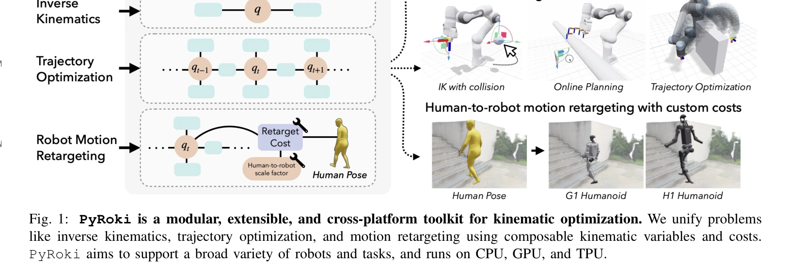
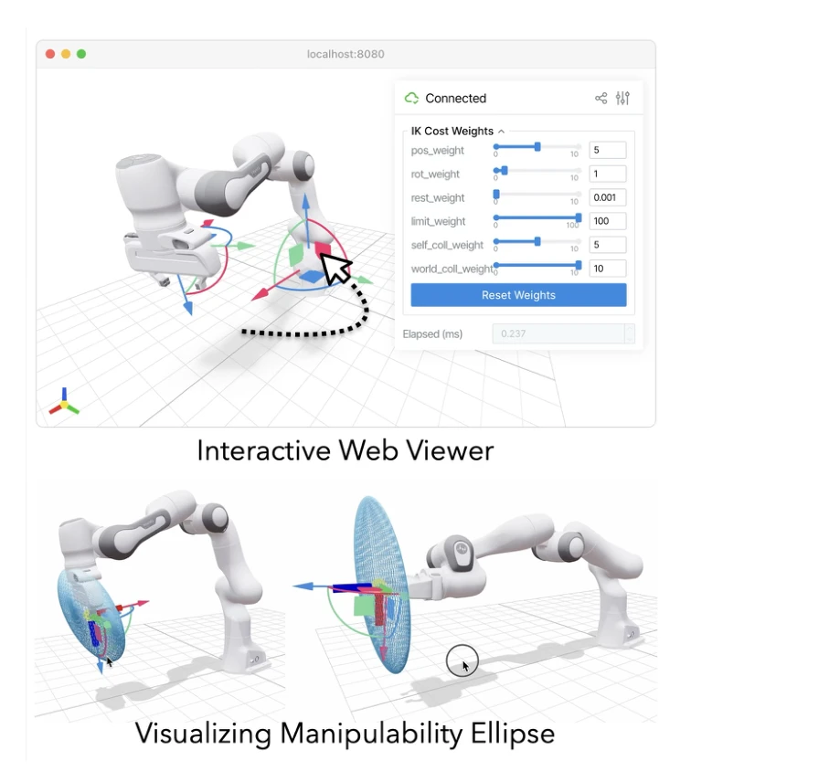

# PyRoki: A Modular Toolkit for Robot Kinematic Optimization

> **저자**: Chung Min Kim, Brent Yi, Hongsuk Choi, Yi Ma, Ken Goldberg, Angjoo Kanazawa | **날짜**: 2025-05-06 | **URL**: [https://arxiv.org/abs/2505.03728](https://arxiv.org/abs/2505.03728)

---

## Essence

*Fig. 1: PyRoki is a modular, extensible, and cross-platform toolkit for kinematic optimization. We unify problems*

PyRoki는 역기구학, 궤적 최적화, 모션 리타게팅 등 다양한 로봇 운동학 최적화 문제를 통합적으로 해결하는 모듈식, 확장 가능하며 CPU/GPU/TPU에서 실행되는 크로스 플랫폼 툴킷이다.

## Motivation

- **Known**: 로봇 운동학에서 수치 최적화는 표준적 해결책이며, 역기구학(IK), 궤적 최적화(trajectory optimization), 모션 리타게팅(motion retargeting) 등 다양한 작업에 사용되어왔다. 하지만 기존 도구들은 TracIK, pink, TrajOpt, cuRobo 등 작업별로 특화되어 있다.
- **Gap**: 기존 도구들은 작업별 C++ 루틴, CUDA 커널, 분석적 Jacobian에 의존하여 파편화되어 있으며, 새로운 목적함수 추가를 어렵게 하고 CPU 또는 GPU 중 하나만 지원한다. 다양한 로봇과 작업을 아우르면서도 크로스 플랫폼으로 실행되는 통합 프레임워크가 부재하다.
- **Why**: 로봇 응용에서 다양한 최적화 목표(자세 오류, 속도, 충돌 회피, 인간 시연 유사성)를 유연하게 지원하고, PyTorch처럼 사용자가 쉽게 새로운 목적함수를 정의하고 실험할 수 있는 통합 프레임워크는 연구와 실제 적용 모두를 가속화할 수 있다.
- **Approach**: PyRoki는 Levenberg-Marquardt 최적화기, 모듈식 변수 추상화(joint configuration, SE(3), SO(3) Lie group), 조합 가능한 목적함수를 설계하여 동일한 최적화 인터페이스로 다양한 작업을 통합한다. JAX 기반으로 CPU/GPU/TPU에서 자동 미분과 효율적 병렬 처리를 지원한다.

## Achievement

*Fig. 2: Interactive Web-based Robot Viewer. Users can*

**모듈식 툴킷**: 운동학 변수와 목적함수를 분리하여 역기구학, 궤적 최적화, 모션 리타게팅에서 재사용 가능한 컴포넌트로 설계했다. **크로스 플랫폼 지원**: CPU, GPU, TPU에서 네이티브 실행이 가능하며 배치 처리 병렬화를 지원한다. **성능**: 배치 역기구학에서 기존 GPU 가속 라이브러리 cuRobo 대비 1.4-1.7배 빠르고 더 낮은 오류로 수렴한다. **확장성**: 자동 미분을 통한 사용자 정의 목적함수 정의를 쉽게 하면서 분석적 Jacobian도 지원한다. **시각화**: 웹 기반 인터랙티브 뷰어로 비용 가중치를 실시간 조정 가능하다.

## How

*Fig. 2: Interactive Web-based Robot Viewer. Users can*

- Levenberg-Marquardt 최적화기를 JAX 기반으로 구현하여 자동 미분과 block-sparse Jacobian 계산 지원
- Joint configuration 변수 추상화로 고정, 회전, 직동 관절 및 mimic joints 지원
- SE(3), SO(3) Lie group 변수로 기하학적 구조를 유지하며 보간, 합성, 자세 오류 계산 수행
- 사전 구현된 목적함수(joint pose cost, collision cost 등) 제공 및 사용자 정의 비용함수 조합 가능
- JAX의 자동 미분으로 Jacobian 자동 계산하며 필요시 분석적 Jacobian 교체 가능
- 웹 기반 시각화 도구(viser 기반)로 비용 가중치 실시간 조정 및 조작성 타원체 표시

## Originality

- 역기구학, 궤적 최적화, 모션 리타게팅을 통합된 목적함수 프레임워크로 재정의하여 문제의 공통 구조를 드러냄
- PyTorch 스타일의 모듈형 API 설계로 로봇 운동학 최적화를 민주화하는 새로운 접근
- Lie group 변수 추상화로 기하학적 구조를 존중하면서도 사용 편의성 제공
- 단일 프레임워크에서 CPU/GPU/TPU 크로스 플랫폼 지원으로 기존 도구들의 제약 극복
- 인터랙티브 웹 기반 시각화로 cost weight tuning을 직관적으로 지원하는 독창적 설계

## Limitation & Further Study

- 하드 제약(joint limits, 접촉 회피)을 직접 처리하지 않고 미분 가능한 페널티로 표현하므로 엄격한 제약이 필요한 경우 부족할 수 있음
- Levenberg-Marquardt 최적화기만 지원하므로 다른 최적화 알고리즘(BFGS, trust region 등) 선택 불가
- 논문에서 분석적 Jacobian 작성의 복잡도나 자동 미분 성능 오버헤드에 대한 상세한 비교 분석 부족
- 실제 로봇 하드웨어 제약(actuator limits, friction 등)을 명시적으로 모델링하는 기능 정보 부재
- 후속 연구로 다양한 최적화 알고리즘 지원, 학습 기반 초기값 제공, 실시간 제약 처리 개선이 필요함

## Evaluation

- Novelty: 4/5
- Technical Soundness: 3/5
- Significance: 4/5
- Clarity: 4/5
- Overall: 4/5

**총평**: PyRoki는 로봇 운동학 최적화를 위한 통합된 모듈식 프레임워크로서 파편화된 기존 도구들의 문제를 효과적으로 해결하고, CPU/GPU/TPU 크로스 플랫폼 지원과 cuRobo 대비 1.4-1.7배 성능 향상을 달성하였다. 인터랙티브 시각화와 사용 편의성을 갖춘 실용적인 오픈소스 도구로서 높은 연구 및 산업 가치가 있다.
