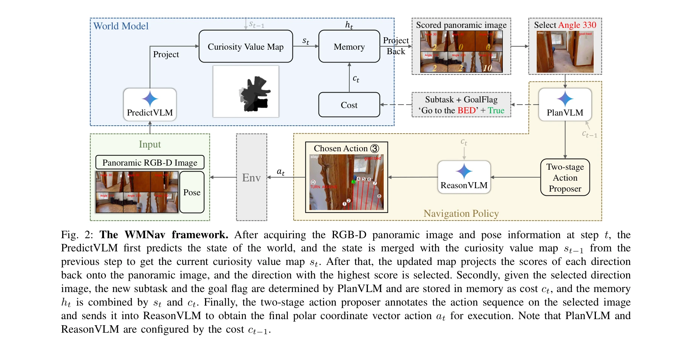

# WMNav: Integrating Vision-Language Models into World Models for Object Goal Navigation

> **저자**: Dujun Nie, Xianda Guo, Yiqun Duan, Ruijun Zhang, Long Chen | **날짜**: 2025-03-04 | **URL**: [https://arxiv.org/abs/2503.02247](https://arxiv.org/abs/2503.02247)

---

## Essence

*Fig. 2: The WMNav framework. After acquiring the RGB-D panoramic image and pose information at step t, the*

Vision-Language Model을 기반으로 한 world model을 설계하여 Object Goal Navigation 작업에서 미래 상태를 예측하고 메모리를 통해 정책을 개선하는 WMNav 프레임워크를 제안한다. Curiosity Value Map이라는 온라인 유지 메모리 구조와 두 단계 행동 제안 전략으로 VLM의 hallucination을 완화하면서 탐색 효율성을 향상시킨다.

## Motivation

- **Known**: VLM 기반 navigation 방법들이 우수한 지각 및 의사결정 능력을 보여주고 있으며, map-based 방법들은 의미론적 정보 보존을 위해 맵 구성을 활용한다. 그러나 기존 방법들은 실제 환경과의 상호작용을 필요로 하고 미래 상태 예측을 충분히 활용하지 못한다.
- **Gap**: VLM 기반 navigation은 제한된 시야각의 egocentric 이미지만 활용하며, 미래 행동 결과에 대한 예측 정보를 체계적으로 활용하지 못한다. World model을 통한 환경 상태 예측과 VLM의 통합이 확립되지 않았다.
- **Why**: Object Goal Navigation에서 안전하고 효율적인 탐색을 위해서는 환경과의 실제 상호작용을 줄이면서 미래 결과를 예측할 수 있는 능력이 필수적이며, 이는 가정용 로봇의 실용성을 대폭 향상시킨다.
- **Approach**: VLM의 광범위한 실내 배치 및 공간 관계 지식을 활용하여 world model로 구성하고, Curiosity Value Map을 통해 목표 객체 존재 가능성을 정량적으로 예측한다. 두 단계 행동 제안 전략(광범위 탐색 → 정밀 위치 파악)으로 탐색 효율성을 극대화한다.

## Achievement

*Fig. 2: The WMNav framework. After acquiring the RGB-D panoramic image and pose information at step t, the*

- **World Model 기반 Navigation**: VLM을 활용한 최초의 world model 기반 object navigation 프레임워크 제안으로 새로운 연구 방향 제시
- **Curiosity Value Map**: 예측된 환경 상태를 온라인으로 유지하면서 목표 객체 존재 가능성을 동적으로 구성하는 혁신적 메모리 전략 설계
- **Hallucination 완화**: Subtask 분해와 feedback 기반 의사결정으로 VLM의 hallucination 영향을 효과적으로 감소
- **성능 향상**: HM3D에서 SR +3.2%, SPL +3.2% 개선, MP3D에서 SR +13.5%, SPL +1.1% 개선으로 zero-shot 벤치마크 초과 달성

## How

*Fig. 2: The WMNav framework. After acquiring the RGB-D panoramic image and pose information at step t, the*

- PredictVLM이 panoramic 이미지에서 각 방향 및 지역의 목표 객체 존재 가능성을 정량적으로 예측
- 이전 단계의 Curiosity Value Map과 현재 예측을 병합하여 online 유지되는 메모리 구조 구성
- 예측된 점수를 panoramic 이미지의 각 방향에 역투영(project back)하여 최적 방향 선택
- PlanVLM이 선택된 방향에 대해 경로 계획 및 중간 subtask 생성
- ReasonVLM이 world model 계획과 실제 관찰 간의 feedback 차이를 기반으로 행동 선택
- 두 단계 행동 제안 전략: 초기 광범위 탐색 후 발견된 목표에 대해 정밀 localization 수행

## Originality

- VLM을 world model로 구현하여 환경 상태 예측과 navigation을 통합한 최초의 접근
- Curiosity Value Map이라는 새로운 메모리 구조로 예측된 상태를 체계적으로 유지 및 활용
- Human-like 사고 프로세스를 기반으로 한 subtask 분해와 feedback 차이 기반 의사결정 메커니즘
- Panoramic RGB-D 이미지를 활용한 확장된 시야각 기반 navigation으로 egocentric 이미지의 제약 극복

## Limitation & Further Study

- VLM의 hallucination이 완전히 제거되지 않으며, feedback mechanism이 hallucination 완화만 제공함
- Panoramic 이미지 획득의 비용 및 실시간 처리 효율성에 대한 상세 분석 부재
- 두 개의 VLM (PredictVLM, PlanVLM, ReasonVLM) 호출로 인한 계산 비용 분석 미흡
- HM3D와 MP3D에만 평가되어 다양한 환경(야외, 대규모 건물 등)에서의 일반화 가능성 미검증
- 후속연구: 경량 world model 설계, 다중 환경에서의 일반화, VLM 호출 횟수 최소화 등

## Evaluation

- Novelty: 4/5
- Technical Soundness: 3/5
- Significance: 4/5
- Clarity: 4/5
- Overall: 4/5

**총평**: 본 논문은 VLM을 world model로 활용하는 혁신적인 접근으로 zero-shot object navigation에서 새로운 방향을 제시하며, Curiosity Value Map 및 두 단계 행동 제안 전략이 효과적으로 탐색 효율성을 높인다. 체계적인 설계와 강력한 실험 결과로 embodied AI 분야에 중요한 기여를 한다.

## Related Papers

- 🔄 다른 접근: [[papers/1614_VL-Nav_A_Neuro-Symbolic_Approach_for_Reasoning-based_Vision-/review]] — WMNav는 VLM 기반 world model을, VL-Nav는 neuro-symbolic reasoning을 통해 복잡한 object goal navigation을 해결하는 다른 접근법
- 🔗 후속 연구: [[papers/1311_Cognition_to_Control_-_Multi-Agent_Learning_for_Human-Humano/review]] — WMNav의 world model 기반 예측이 ApexNav의 adaptive exploration과 결합되어 더 효율적인 object goal navigation을 달성할 수 있음
- 🏛 기반 연구: [[papers/1419_Generative_World_Modelling_for_Humanoids_1X_World_Model_Chal/review]] — WMNav의 VLM 기반 world model이 Generative World Modelling for Humanoids의 세계 모델 원리를 navigation 작업에 특화하여 구현
- 🔄 다른 접근: [[papers/1549_RoboTron-Nav_A_Unified_Framework_for_Embodied_Navigation_Int/review]] — WMNav의 world models 통합과 RoboTron-Nav의 multitask collaboration은 모두 네비게이션 성능 향상을 위한 서로 다른 접근법이다.
- 🔄 다른 접근: [[papers/1614_VL-Nav_A_Neuro-Symbolic_Approach_for_Reasoning-based_Vision-/review]] — VL-Nav는 neuro-symbolic approach를, WMNav는 world model 기반 접근법을 사용하여 복잡한 navigation reasoning을 구현하는 다른 방식
