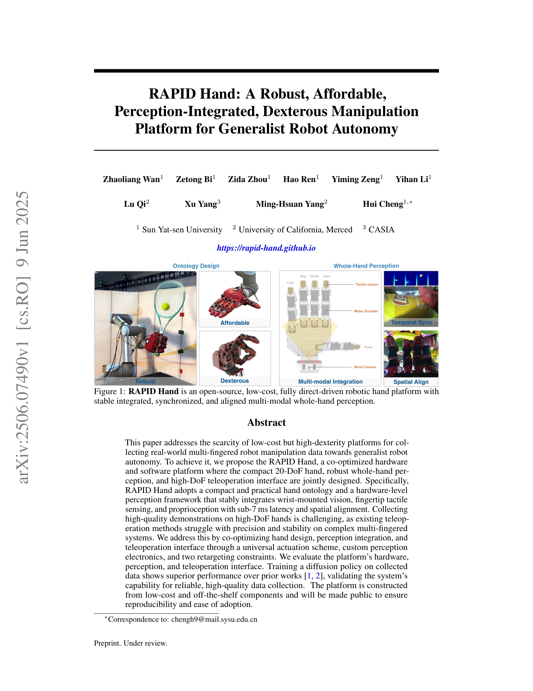
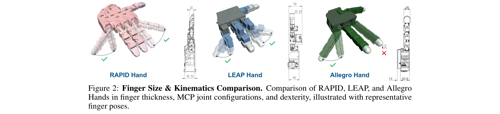
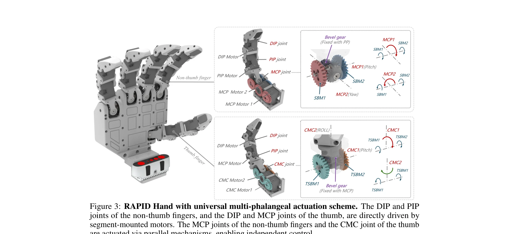

# RAPID Hand: A Robust, Affordable, Perception-Integrated, Dexterous Manipulation Platform for Generalist Robot Autonomy

> **저자**: Zhaoliang Wan, Zetong Bi, Zida Zhou, Hao Ren, Yiming Zeng, Yihan Li, Lu Qi, Xu Yang, Ming-Hsuan Yang, Hui Cheng | **날짜**: 2025-06-09 | **URL**: [https://arxiv.org/abs/2506.07490](https://arxiv.org/abs/2506.07490)

---

## Essence

*Figure 1: RAPID Hand is an open-source, low-cost, fully direct-driven robotic hand platform with*

RAPID Hand는 저비용의 20-DoF 다지형 로봇 손으로, 시각, 촉각, 고유감각을 통합한 멀티모달 인지 시스템과 고-DoF 원격조종 인터페이스를 함께 설계하여 로봇 자율성을 위한 고품질 조작 데이터 수집을 가능하게 한다.

## Motivation

- **Known**: 기존 멀티핑거 로봇 손 플랫폼들(Shadow Hand, Allegro Hand, LEAP Hand 등)은 높은 비용, 유지보수 어려움, 멀티센서 통합의 불안정성 등으로 인해 광범위한 배포가 제한되어 있다.
- **Gap**: 저비용이면서도 높은 기술성을 갖춘 다지형 조작 플랫폼의 부족과 기존 원격조종 방법들이 복잡한 멀티핑거 시스템에서 정밀도와 안정성 측면에서 어려움을 겪고 있다.
- **Why**: 일반화된 로봇 자율성 달성을 위해서는 VLM 기반 학습에 필요한 고품질의 다지형 조작 데이터가 필수적이며, 접근 가능한 고-DoF 플랫폼이 재현성 있는 연구를 촉진할 수 있다.
- **Approach**: 손의 온톨로지 설계(20-DoF, 병렬 MCP 관절, 20mm 핑거 두께), 하드웨어 수준의 멀티모달 인지 프레임워크(sub-7ms 지연시간과 공간 정렬), 그리고 고-DoF 원격조종 인터페이스를 공동 최적화하여 통합된 플랫폼을 구현한다.

## Achievement

*Figure 2: Finger Size & Kinematics Comparison. Comparison of RAPID, LEAP, and Allegro*

- **컴팩트한 손 온톨로지**: 20mm 핑거 두께로 LEAP(59mm) 대비 획기적으로 슬림화하면서 자연스러운 인간형 운동학을 유지한 20-DoF 완전 구동 손 설계
- **안정적인 멀티센서 통합**: wrist-mounted vision, fingertip tactile sensing, proprioception을 sub-7ms 지연시간과 공간 정렬 조건에서 안정적으로 통합하여 센서 간섭과 드롭아웃 제거
- **고품질 데이터 수집**: 맞춤형 고-DoF 원격조종 인터페이스를 통해 in-hand translation, rolling 등 복잡한 접촉 기반 조작 작업의 다양한 시연 데이터 수집
- **우수한 정책 성능**: diffusion policy로 학습한 결과 기존 방법들(TILDE, concurrent work)에 비해 멀티핑거 retrieval 및 조작 안정성에서 유의미한 성능 향상 달성
- **오픈소스 접근성**: 저비용 표준 부품과 3D-프린팅된 모듈 설계로 구성된 완전 공개 플랫폼으로 재현성과 광범위한 채택 가능성 제공

## How

*Figure 3: RAPID Hand with universal multi-phalangeal actuation scheme. The DIP and PIP*

- universal multi-phalangeal actuation scheme 적용: 원위 관절(DIP, PIP)은 직접 구동, 근위 관절(MCP, CMC)은 병렬 메커니즘으로 구동하여 효율적인 독립 제어 달성
- segment-mounted motors의 최적화된 레이아웃으로 핑거 두께 최소화
- 하드웨어 수준 인지 프레임워크: 커스텀 인지 전자장비를 통해 멀티모달 센서의 시간 동기화와 공간 정렬을 정밀하게 구현
- 멀티모달 인지 활용: vision, touch, proprioception 정보를 결합하여 접촉 기반 조작 학습
- 두 가지 retargeting constraints를 적용한 고-DoF 원격조종 인터페이스 설계로 복잡한 손 운동 제어 간소화
- diffusion policy 학습: 수집된 고품질 시연 데이터로 조건부 확산 모델 훈련

## Originality

- 기존 손 설계와 달리 손 온톨로지, 인지 통합, 원격조종 인터페이스를 공동 최적화한 통합 설계 철학 도입
- 하드웨어 수준에서 멀티모달 센서를 시간과 공간적으로 정밀하게 동기화하는 프레임워크의 혁신적 제시로 기존 15-100ms 지연시간을 sub-7ms로 단축
- 20mm 핑거 두께 달성의 설계적 우수성과 병렬 MCP 메커니즘의 robust하면서도 자연스러운 구현
- 멀티핑거 원격조종의 고질적인 정밀도·안정성 문제를 두 가지 retargeting constraints로 체계적으로 해결

## Limitation & Further Study

- 현재 세 가지 in-hand manipulation 작업에만 검증되었으므로 다른 조작 카테고리(도구 사용, 물건 조립 등)에 대한 일반화 가능성이 불명확함
- diffusion policy 기반 학습 외 다른 학습 알고리즘의 적용 가능성과 성능 비교가 부재함
- 대규모 멀티로봇 시스템에서의 실시간 성능, 강화학습 기반 자체 개선 능력 등이 평가되지 않음
- 후속 연구로는 더 다양한 조작 작업에 대한 대규모 데이터셋 수집, 다른 고급 정책 학습 방식의 통합, 그리고 실제 산업 응용 환경에서의 장기 내구성 평가 필요

## Evaluation

- Novelty: 4/5
- Technical Soundness: 4/5
- Significance: 4/5
- Clarity: 4/5
- Overall: 4/5

**총평**: RAPID Hand는 저비용 다지형 로봇 손 설계, 고정밀 멀티모달 인지 통합, 그리고 효과적인 원격조종 인터페이스를 혁신적으로 통합한 오픈소스 플랫폼으로, 일반화된 로봇 자율성 연구에 필요한 고품질 데이터 수집을 가능하게 하는 중요한 기여이다.