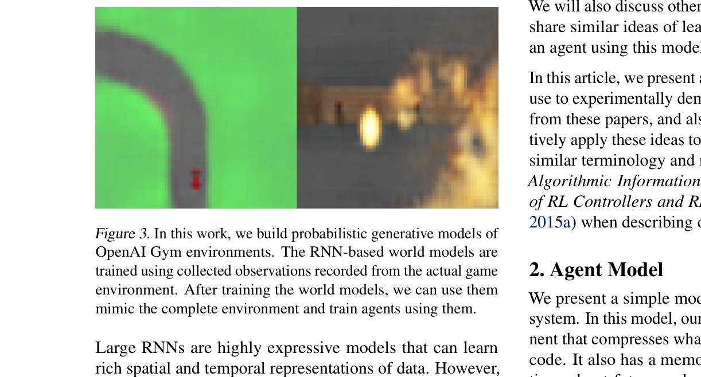
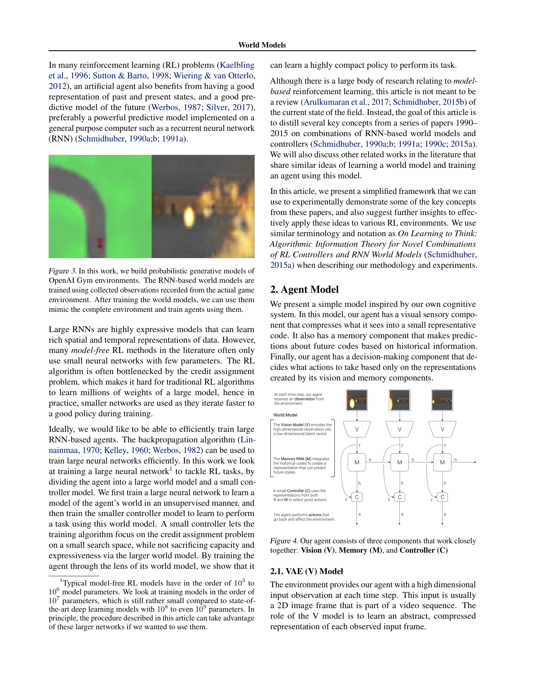
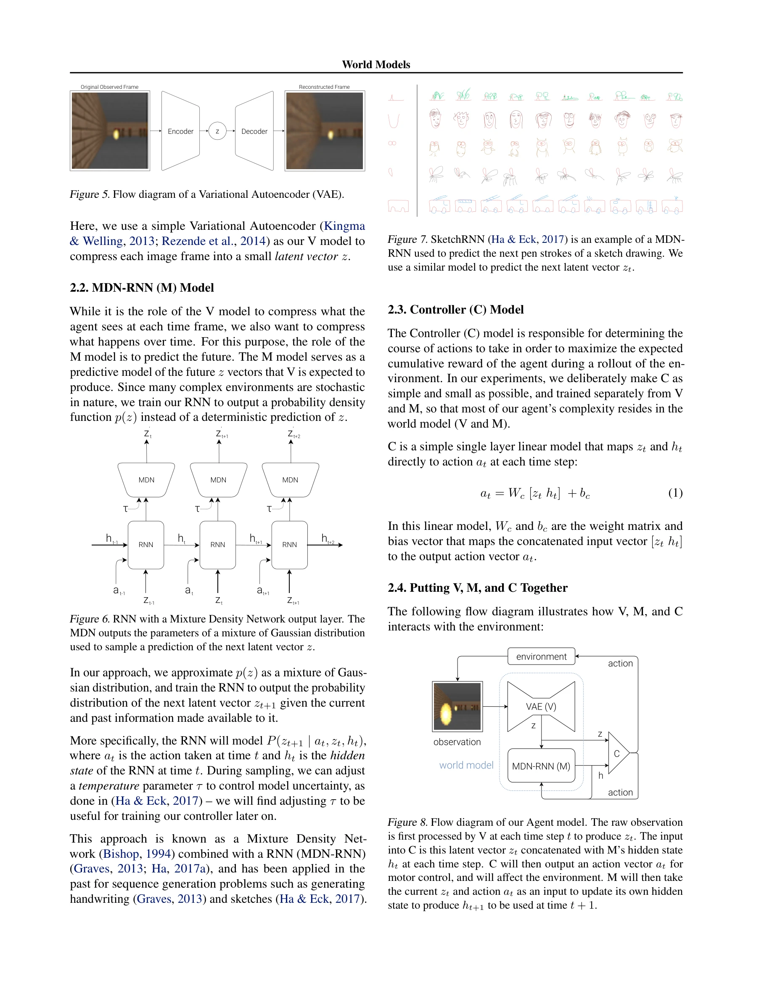

# World Models

> **저자**: David Ha, Jürgen Schmidhuber | **날짜**: 2018-03-27 | **URL**: [https://arxiv.org/abs/1803.10122](https://arxiv.org/abs/1803.10122)

---

## Essence

*Figure 3. In this work, we build probabilistic generative models of*

환경의 생성형 신경망 world model을 비지도학습으로 학습한 후, 추출된 특징으로 간단한 policy를 훈련하여 강화학습 문제를 해결하는 방법을 제시한다. 심지어 world model이 생성한 상상의 환경에서 훈련한 policy를 실제 환경에 전이 가능함을 보인다.

## Motivation

- **Known**: 강화학습에서 좋은 상태 표현과 미래 예측 모델이 도움이 된다는 것은 알려져 있으며, RNN 기반 world model과 controller의 조합도 이전 연구들(1990-2015)에서 다루어졌다.
- **Gap**: 기존 model-free RL은 작은 네트워크만 사용했는데, 큰 RNN을 효율적으로 훈련하면서도 credit assignment 문제를 해결하는 방법이 부족했다. 또한 이러한 개념들을 실제 RL 환경에서 단순하고 체계적으로 실증하는 연구가 필요했다.
- **Why**: 인간의 뇌는 제한된 감각 정보로부터 내부 모델을 구축하여 빠른 의사결정을 수행하는데, 인공 에이전트도 이를 모방하면 더 효율적이고 해석 가능한 정책을 학습할 수 있기 때문이다.
- **Approach**: 에이전트를 VAE 기반 비전 모듈(V), MDN-RNN 기반 메모리 모듈(M), 선형 컨트롤러(C) 세 부분으로 분해하여, V와 M은 비지도학습으로 world model을 학습하고 C는 이 표현을 이용해 간단하게 훈련한다.

## Achievement

*Figure 4. Our agent consists of three components that work closely*

- **모듈화된 아키텍처**: VAE로 공간 정보를, MDN-RNN으로 시간 정보를 각각 압축하여 효율적인 표현 학습
- **확장 가능한 모델**: 전체 1천만 개 파라미터 규모로 확장하면서도 credit assignment 문제를 선형 컨트롤러로 단순화
- **꿈 훈련**: learned world model 내에서 완전히 훈련한 policy를 실제 환경에 성공적으로 전이 가능
- **간단한 policy**: 비지도 학습된 world model 특징만으로도 복잡한 task를 해결하는 최소한의 linear controller로 충분

## How

*Figure 5. Flow diagram of a Variational Autoencoder (VAE).*

- VAE encoder로 각 프레임을 잠재 벡터 z로 압축
- MDN-RNN으로 P(z_{t+1} | a_t, z_t, h_t) 형태로 다음 상태의 확률 분포 모델링
- Temperature 파라미터 τ로 모델의 불확실성 제어
- 선형 모델 a_t = W_c [z_t h_t] + b_c로 컨트롤러 구성
- 비지도학습으로 V, M을 먼저 훈련한 후, 선형 컨트롤러 C만 별도로 훈련
- Learned world model 상에서 직접 policy 최적화 가능

## Originality

- 세 가지 컴포넌트(V, M, C)의 명확한 분리와 단계적 훈련 전략이 실용적이고 체계적
- MDN-RNN을 통한 확률적 world model 학습으로 stochastic 환경 처리
- World model 내 할루시네이션 환경에서 훈련한 정책을 실제 환경으로 전이하는 개념 실증
- 비지도학습 world model로 model-free RL의 credit assignment 문제 우회

## Limitation & Further Study

- 선형 컨트롤러는 simple하지만 복잡한 제어 문제에는 제한적일 수 있음
- World model의 오차가 누적되면 long-horizon 훈련에서 성능 저하 가능
- 현재 실험이 OpenAI Gym의 특정 환경에만 한정되어 일반화 가능성 검증 필요
- VAE의 reconstruction loss와 MDN-RNN의 예측 오차가 최종 policy 성능에 미치는 영향 분석 부족
- 후속 연구에서 더 큰 규모(10^8-10^9 파라미터)의 world model 적용 가능성 탐색 제안

## Evaluation

- Novelty: 4/5
- Technical Soundness: 3/5
- Significance: 4/5
- Clarity: 4/5
- Overall: 4/5

**총평**: 이 논문은 reinforcement learning과 생성 모델을 우아하게 결합하여 효율적인 policy 학습을 달성했으며, world model 기반 접근법의 실용성을 명확히 입증한 영향력 있는 작업이다. 모듈화된 설계와 dream training 개념은 이후 연구에 큰 영감을 주었다.

## Related Papers

- 🔗 후속 연구: [[papers/1579_Statler_State-Maintaining_Language_Models_for_Embodied_Reaso/review]] — World Models의 환경 생성 모델링이 Statler의 명시적 상태 유지 메커니즘의 이론적 기반을 제공하며 함께 읽으면 상태 기반 계획의 전체 스펙트럼을 이해할 수 있음
- 🏛 기반 연구: [[papers/1596_TriVLA_A_Triple-System-Based_Unified_Vision-Language-Action/review]] — World Models의 생성형 환경 모델이 TriVLA의 episodic world model 설계에 핵심적인 이론적 기반을 제공
- 🔗 후속 연구: [[papers/1407_FRoM-W1_Towards_General_Humanoid_Whole-Body_Control_with_Lan/review]] — World Models의 imagination-based learning이 Genie의 generative interactive environment와 결합되어 더 포괄적인 시뮬레이션 환경을 구축할 수 있음
- 🔗 후속 연구: [[papers/1292_A_Comprehensive_Survey_on_World_Models_for_Embodied_AI/review]] — 일반적인 world model 개념을 embodied AI의 구체적 요구사항에 맞게 발전시킨다
- 🏛 기반 연구: [[papers/1366_Ego-Vision_World_Model_for_Humanoid_Contact_Planning/review]] — World Models의 기본 개념과 구조가 Ego-Vision World Model의 접촉 계획을 위한 환경 모델링의 이론적 토대가 된다.
- 🏛 기반 연구: [[papers/1452_Learning_Interactive_Real-World_Simulators/review]] — 월드 모델의 기본 개념이 실제 세계 상호작용을 시뮬레이션하는 범용 시뮬레이터의 이론적 토대가 됩니다.
- 🔗 후속 연구: [[papers/1517_PointWorld_Scaling_3D_World_Models_for_In-The-Wild_Robotic_M/review]] — World Models의 일반적 프레임워크가 PointWorld의 3D 월드 모델을 더 광범위한 embodied AI 영역으로 확장한다.
- 🏛 기반 연구: [[papers/1579_Statler_State-Maintaining_Language_Models_for_Embodied_Reaso/review]] — Statler의 상태 추적 메커니즘이 World Models의 환경 상태 모델링 아이디어에서 발전된 형태로 볼 수 있음
- 🏛 기반 연구: [[papers/1626_WHALE_Towards_Generalizable_and_Scalable_World_Models_for_Em/review]] — 월드 모델의 기본 개념이 WHALE의 임바디드 환경을 위한 일반화 가능한 월드 모델 학습의 이론적 기초를 제공합니다.
- 🏛 기반 연구: [[papers/1632_World_Simulation_with_Video_Foundation_Models_for_Physical_A/review]] — World Models의 환경 모델링 개념을 비디오 생성 기반으로 발전시켜 물리 AI용 세계 시뮬레이션을 구현했다
