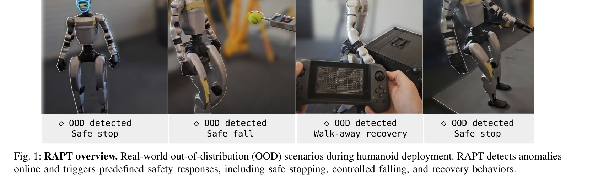
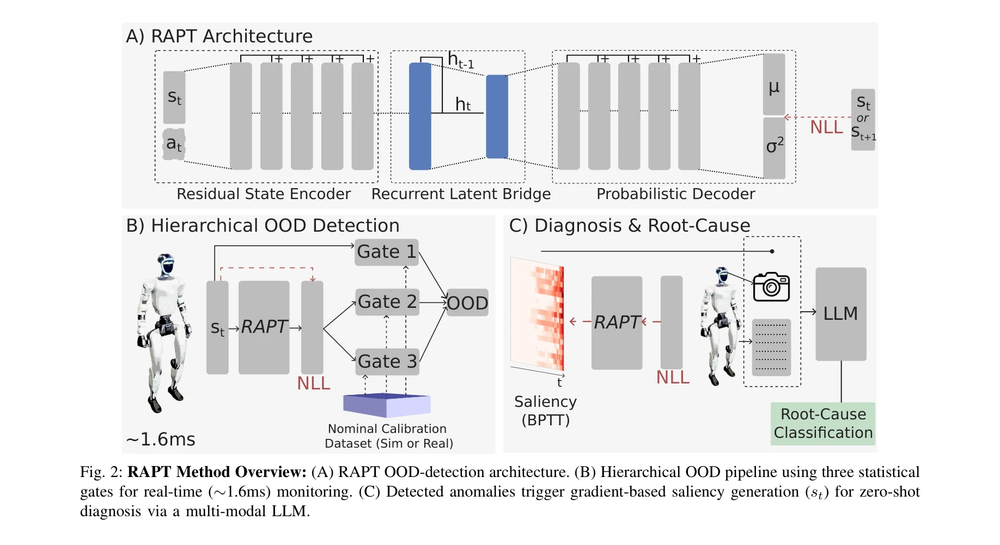

# RAPT: Model-Predictive Out-of-Distribution Detection and Failure Diagnosis for Sim-to-Real Humanoid Robots

> **저자**: Humphrey Munn, Brendan Tidd, Peter Bohm, Marcus Gallagher, David Howard | **날짜**: 2026-02-02 | **URL**: [https://arxiv.org/abs/2602.01515](https://arxiv.org/abs/2602.01515)

---

## Essence

*Fig. 1: RAPT overview. Real-world out-of-distribution (OOD) scenarios during humanoid deployment. RAPT detects anomalies*

RAPT는 시뮬레이션 환경에서 학습한 인간형 로봇 제어 정책의 현실 배포 시 out-of-distribution(OOD) 상태를 감지하고 실패 원인을 진단하는 경량의 자기감독 모니터링 시스템이다.

## Motivation

- **Known**: Deep Reinforcement Learning 정책은 시뮬레이션에서는 강건해 보이지만 현실 배포 시 모델링되지 않은 dynamics, 센서 노이즈, 환경 변화로 인한 OOD 상태에서 조용한 실패(silent failure)를 보인다.
- **Gap**: 기존 anomaly detection 방법들은 고주파 제어(50Hz)와 호환되지 않거나, 실제 배포에 필요한 극히 낮은 false-positive rate에서 보정이 잘못되었으며, OOD 감지 이유를 설명하지 못하는 black box로 동작한다.
- **Why**: 인간형 로봇의 안전한 배포를 위해서는 단순한 이진 정지 신호가 아닌 배포 시점의 continuous monitoring과 semantic failure diagnosis가 필수적이며, 이는 hardware damage 위험을 줄이고 Sim-to-Real gap을 체계적으로 분석할 수 있게 한다.
- **Approach**: RAPT는 simulation에서 nominal execution의 probabilistic spatio-temporal manifold를 학습한 후, 배포 시 execution-time predictive deviation을 calibrated per-dimension signal로 평가하고, gradient-based temporal saliency와 LLM 기반 reasoning을 결합하여 zero-shot failure diagnosis를 수행한다.

## Achievement

*Fig. 1: RAPT overview. Real-world out-of-distribution (OOD) scenarios during humanoid deployment. RAPT detects anomalies*

- **신뢰할 수 있는 OOD 감지**: 고정된 episode-level false positive rate(0.5%)에서 baseline 대비 37% TPR 향상을 달성하며, 실제 배포에서 12.5% TPR 개선을 보임
- **해석 가능한 Sim-to-Real gap 측정**: reconstruction likelihood를 continuous measure로 재구성하여 배포 중 domain shift를 시간에 따라 추적할 수 있음
- **자동화된 근본 원인 분석**: 16개의 실제 로봇 실패에 대해 proprioceptive data만으로 75% root-cause classification accuracy를 달성하는 post-hoc diagnostic pipeline 제시

## How

*Fig. 2: RAPT Method Overview: (A) RAPT OOD-detection architecture. (B) Hierarchical OOD pipeline using three statistical*

- Recurrent probabilistic model을 사용하여 nominal spatio-temporal behavior를 모델링하고 predictive deviation을 평가
- Per-dimension reconstruction error를 개별적으로 calibrate하여 rigid-body constraints를 고려한 coupling 정보 활용
- RAPT의 reconstruction objective로부터 gradient-based temporal saliency를 추출하여 어느 joint가 언제 anomaly를 유발했는지 파악
- Saliency pattern과 joint kinematics를 multi-modal language model에 입력하여 semantic failure description 생성
- Unitree G1 humanoid 로봇의 4개 복잡한 tasks(locomotion, manipulation, mimicry)에서 NVIDIA Isaac Lab 시뮬레이션과 실제 hardware 배포로 검증

## Originality

- 기존의 단순한 likelihood threshold 기반 방식을 벗어나 per-dimension calibration을 통해 input complexity bias 문제 해결
- Reconstruction error를 binary stop signal이 아닌 continuous time-series signal로 활용하여 Sim-to-Real gap을 정량적으로 측정
- Gradient-based saliency와 LLM을 결합한 zero-shot failure diagnosis는 기존 black-box anomaly detector의 해석 불가능성 문제를 독창적으로 해결
- High-frequency humanoid control(50Hz)에 최적화된 lightweight architecture로 기존 방법들의 computational overhead 문제 극복

## Limitation & Further Study

- 16개의 실제 실패 데이터셋이 상대적으로 작으며, LLM 기반 진단의 75% accuracy가 production-level deployment에 충분한지 검증 필요
- LSTM-based probabilistic model의 calibration 과정이 task-specific하거나 hyperparameter-sensitive할 가능성에 대한 분석 부족
- 현재 evaluation은 Unitree G1 단일 플랫폼에만 제한되어 있으며, 다양한 humanoid architecture와 task에 대한 generalization 능력 미검증
- 후속 연구로 larger-scale real-world failure dataset 구축과 다중 robot platform에서의 transfer learning 가능성 탐색 필요
- Saliency-based diagnosis의 신뢰성을 높이기 위해 domain expert와의 validation study 추가 필요

## Evaluation

- Novelty: 4/5
- Technical Soundness: 3/5
- Significance: 4/5
- Clarity: 4/5
- Overall: 4/5

**총평**: RAPT는 humanoid robot 배포의 실제적 난제인 silent failure 감지와 근본 원인 분석을 동시에 해결하는 실용적이고 혁신적인 방법으로, 50Hz 고주파 제어 호환성과 interpretable diagnosis를 통해 Sim-to-Real gap 문제의 새로운 패러다임을 제시한다.
