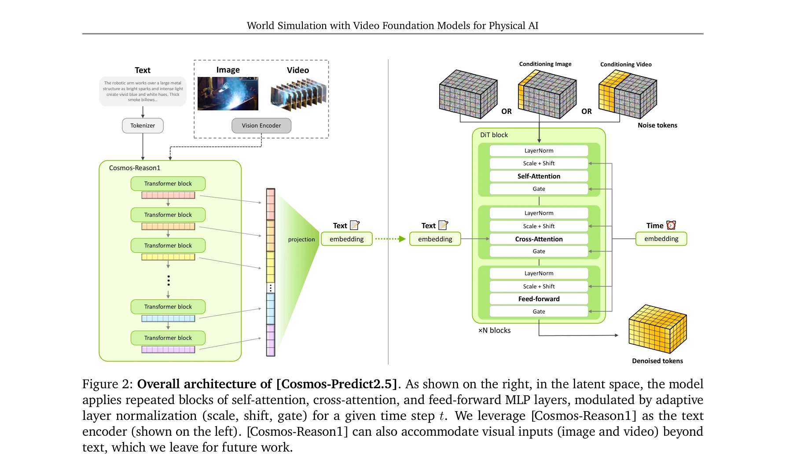
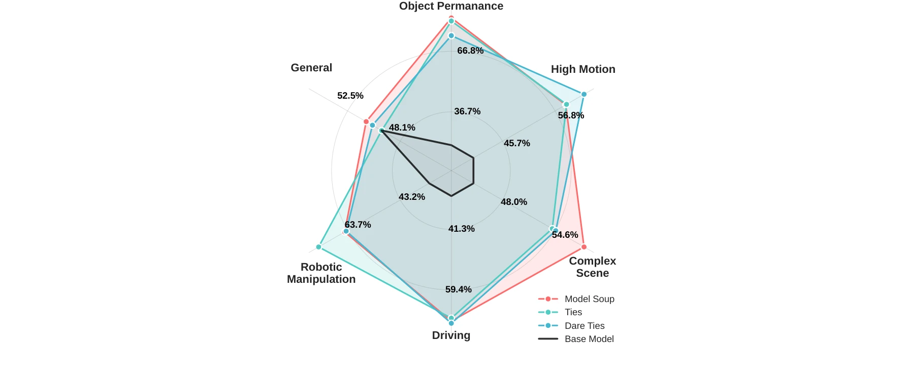
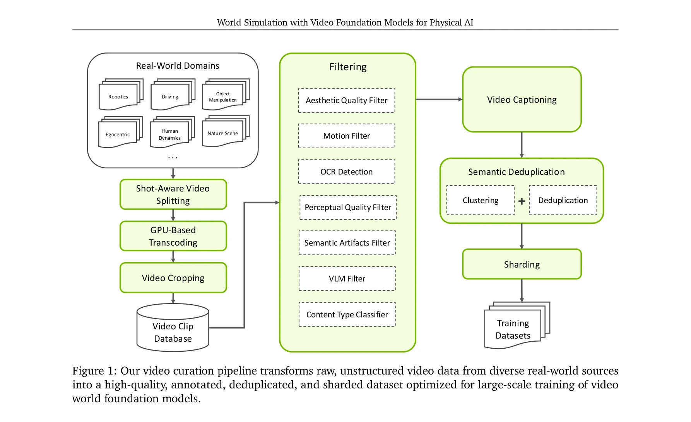

# World Simulation with Video Foundation Models for Physical AI

> **저자**: , , Arslan Ali, Junjie Bai, Maciej Bala, Yogesh Balaji, Aaron Blakeman, Tiffany Cai, Jiaxin Cao, Tianshi Cao, Elizabeth Cha, Yu-Wei Chao, Prithvijit Chattopadhyay, Mike Chen, Yongxin Chen, Yu Chen, Shuai Cheng, Yin Cui, Jenna Diamond, Yifan Ding, Jiaojiao Fan, Linxi Fan, Liang Feng, Francesco Ferroni, Sanja Fidler, Xiao Fu, Ruiyuan Gao, Yunhao Ge, Jinwei Gu, Aryaman Gupta, Siddharth Gururani, Imad El Hanafi, Ali Hassani, Zekun Hao, Jacob Huffman, Joel Jang, Pooya Jannaty, Jan Kautz, Grace Lam, Xuan Li, Zhaoshuo Li, Maosheng Liao, Chen-Hsuan Lin, Tsung-Yi Lin, Yen-Chen Lin, Huan Ling, Ming-Yu Liu, Xian Liu, Yifan Lu, Alice Luo, Qianli Ma, Hanzi Mao, Kaichun Mo, Seungjun Nah, Yashraj Narang, Abhijeet Panaskar, Lindsey Pavao, Trung Pham, Morteza Ramezanali, Fitsum Reda, Scott Reed, Xuanchi Ren, Haonan Shao, Yue Shen, Stella Shi, Shuran Song, Bartosz Stefaniak, Shangkun Sun, Shitao Tang, Sameena Tasmeen, Lyne Tchapmi, Wei-Cheng Tseng, Jibin Varghese, Andrew Z. Wang, Hao Wang, Haoxiang Wang, Heng Wang, Ting-Chun Wang, Fangyin Wei, Jiashu Xu, Dinghao Yang, Xiaodong Yang, Haotian Ye, Seonghyeon Ye, Xiaohui Zeng, Jing Zhang, Qinsheng Zhang, Kaiwen Zheng, Andrew Zhu, Yuke Zhu | **날짜**: 2025-10-28 | **URL**: [https://arxiv.org/abs/2511.00062](https://arxiv.org/abs/2511.00062)

---

## Essence

*Figure 2: Overall architecture of [Cosmos-Predict2.5]. As shown on the right, in the latent space, the model*

Cosmos-Predict2.5는 flow-based architecture 기반의 세계 시뮬레이션 기초 모델로, Text2World, Image2World, Video2World 생성을 단일 모델에 통합하여 로보틱스와 자율주행 시스템을 위한 합성 데이터 생성과 폐루프 시뮬레이션을 가능하게 한다.

## Motivation

- **Known**: Physical AI 시스템의 안전한 훈련을 위해서는 고품질의 시각적 세계 시뮬레이터가 필요하며, 이전 세대인 Cosmos-Predict1은 diffusion 기반 비디오 세계 모델을 제시했다.
- **Gap**: 기존 모델은 아키텍처 복잡성, 텍스트 표현 제한, 그리고 물리 AI 도메인에 대한 특화 부족으로 인해 시뮬레이션 충실도와 지시 정렬에서 개선 여지가 있다.
- **Why**: 고품질의 합성 데이터와 시뮬레이션은 실제 환경에서의 위험성과 비용을 줄이면서 embodied intelligence를 대규모로 확장하는 핵심이다.
- **Approach**: 200M 큐레이션된 비디오 클립으로 사전 훈련하고, supervised fine-tuning과 reinforcement learning 기반 post-training으로 정제하며, Cosmos-Reason1 VLM과 통합하여 더 풍부한 텍스트 기반 제어를 제공한다.

## Achievement

*Figure 3: Domain-specific SFT training improves the performance of the pretrained model on each domain.*

- **통합 아키텍처**: Text2World, Image2World, Video2World 생성을 단일 flow-based 모델에 통합
- **성능 향상**: Cosmos-Predict1 대비 비디오 품질과 지시 정렬에서 상당한 개선
- **모델 규모**: 2B와 14B 두 가지 규모의 모델 제공
- **Cosmos-Transfer2.5**: 3.5배 더 작으면서 더 높은 충실도의 Sim2Real/Real2Real 변환 프레임워크
- **장시간 생성**: 강건한 long-horizon 비디오 생성 능력
- **다중 응용**: 로봇 정책 학습, 자율주행 시뮬레이션, VLA 훈련용 합성 데이터, action-conditioned 세계 생성 지원

## How

*Figure 1: Our video curation pipeline transforms raw, unstructured video data from diverse real-world sources*

- 7단계 비디오 큐레이션 파이프라인: shot 분할, transcoding, 크로핑, 필터링, 캡셔닝, 의미론적 중복 제거, sharding
- 로보틱스, 자율주행, 스마트 공간, 인간 동역학, 물리 등 도메인별 특화 데이터 수집 및 처리
- Flow matching 기반 architecture로 diffusion 모델 대체
- Cosmos-Reason1 VLM과의 통합으로 향상된 텍스트 표현
- Model merging 기법을 활용한 사전 훈련
- Supervised fine-tuning (SFT)과 reinforcement learning 기반 post-training
- Timestep distillation으로 모델 효율화
- Control-net 스타일 Cosmos-Transfer2.5 프레임워크로 세계 변환 작업 처리

## Originality

- Flow matching으로 diffusion 모델의 계산 복잡성 개선
- 단일 모델에 Text2World, Image2World, Video2World를 통합한 설계
- Physical AI 특화 VLM (Cosmos-Reason1)과의 통합으로 향상된 제어성
- RL 기반 post-training으로 모델 정렬 개선
- Domain-specific 큐레이션과 200M 규모 데이터셋 구성
- Control-net 기반 Cosmos-Transfer2.5로 Sim2Real 변환 확장
- Closed-loop 시뮬레이션을 위한 architecture 설계

## Limitation & Further Study

- 장시간(long-horizon) 비디오 생성의 누적 오류에 대한 상세한 분석 부족
- 물리 정확도에 대한 정량적 평가 지표 제시 제한
- 실제 로봇 배포 결과에 대한 광범위한 시연 부족
- 생성된 합성 데이터의 domain gap이 실제 정책 성능에 미치는 영향에 대한 심층 분석 필요
- 계산 자원 요구사항 및 추론 속도에 대한 상세 공개 정보 부족
- 후속 연구: 더 긴 시간 범위의 안정적인 생성, 물리 시뮬레이터와의 더 깊은 통합, 추가 도메인(의료, 산업용) 확장

## Evaluation

- Novelty: 4/5
- Technical Soundness: 4/5
- Significance: 4/5
- Clarity: 4/5
- Overall: 4/5

**총평**: 본 논문은 Physical AI 시뮬레이션을 위한 통합된 flow-based 기초 모델을 제시하며, 대규모 데이터, 개선된 아키텍처, 정교한 post-training을 통해 실질적인 성능 향상을 달성했다. 오픈소스 공개로 embodied intelligence 연구의 접근성을 크게 높일 것으로 예상된다.

## Related Papers

- 🔄 다른 접근: [[papers/1407_FRoM-W1_Towards_General_Humanoid_Whole-Body_Control_with_Lan/review]] — 둘 다 생성형 환경 모델이지만 Genie는 게임 환경, Cosmos는 물리 AI용 실세계 시뮬레이션에 특화됐다
- 🔗 후속 연구: [[papers/1360_Diffusion_Models_Are_Real-Time_Game_Engines/review]] — Diffusion Models as Game Engines의 실시간 생성을 물리 AI 도메인으로 확장하여 로봇 시뮬레이션을 구현했다
- 🏛 기반 연구: [[papers/1631_World_Models/review]] — World Models의 환경 모델링 개념을 비디오 생성 기반으로 발전시켜 물리 AI용 세계 시뮬레이션을 구현했다
- 🧪 응용 사례: [[papers/1452_HMC_Learning_Heterogeneous_Meta-Control_for_Contact-Rich_Loc/review]] — Learning Interactive Real-World Simulators와 함께 실세계-시뮬레이션 간 상호작용하는 통합 학습 환경을 제공한다
- 🏛 기반 연구: [[papers/1355_DreamDojo_A_Generalist_Robot_World_Model_from_Large-Scale_Hu/review]] — Video foundation model 기반의 물리적 AI 시뮬레이션 기술이 DreamDojo의 world model 생성 방법론에 이론적 기반을 제공한다.
- 🏛 기반 연구: [[papers/1406_Genie_Envisioner_A_Unified_World_Foundation_Platform_for_Rob/review]] — Video foundation model을 통한 세계 시뮬레이션이 Genie Envisioner의 video diffusion 기반 통합 플랫폼 구축에 기반을 제공한다.
- 🔗 후속 연구: [[papers/1419_H3DP_Triply-Hierarchical_Diffusion_Policy_for_Visuomotor_Lea/review]] — video foundation model을 활용한 world simulation 기법을 humanoid control에 실제 적용한 발전된 형태입니다.
- 🏛 기반 연구: [[papers/1489_NaVid_Video-based_VLM_Plans_the_Next_Step_for_Vision-and-Lan/review]] — 비디오 기초 모델을 활용한 세계 시뮬레이션이 VLN에서 미래 상태 예측의 이론적 기반을 제공합니다.
- 🔗 후속 연구: [[papers/1581_Structured_World_Models_from_Human_Videos/review]] — 비디오 기반 world model을 물리적 AI를 위한 세계 시뮬레이션으로 확장한다.
- 🔗 후속 연구: [[papers/1598_Unified_Video_Action_Model/review]] — 비디오 기반 world model을 통합된 비디오-액션 모델링으로 확장한다.
- 🏛 기반 연구: [[papers/1602_Unleashing_Large-Scale_Video_Generative_Pre-training_for_Vis/review]] — 물리적 AI를 위한 비디오 기반 world 시뮬레이션의 기반이 되는 비디오 생성 사전학습 방법론을 제공한다.
- 🔄 다른 접근: [[papers/1603_V-JEPA_2_Self-Supervised_Video_Models_Enable_Understanding_P/review]] — 둘 다 비디오 기반 세계 모델이지만 V-JEPA 2는 자기지도학습, Cosmos는 생성 모델링에 중점을 둔다
- 🏛 기반 연구: [[papers/1291_3D-VLA_A_3D_Vision-Language-Action_Generative_World_Model/review]] — World Simulation with Video Foundation Models의 비디오 기반 월드 시뮬레이션이 3D-VLA의 생성형 월드 모델 구축의 이론적 기반을 제공한다.
- 🏛 기반 연구: [[papers/1371_DreamDojo_A_Generalist_Robot_World_Model_from_Large-Scale_Hu/review]] — Video foundation model을 통한 세계 시뮬레이션이 DreamDojo의 human video 기반 world model 구축에 기반을 제공한다.
