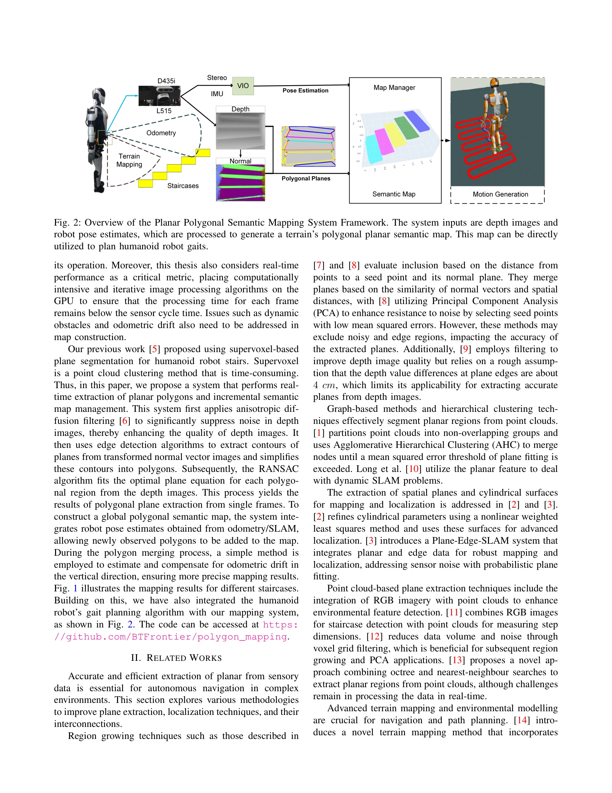
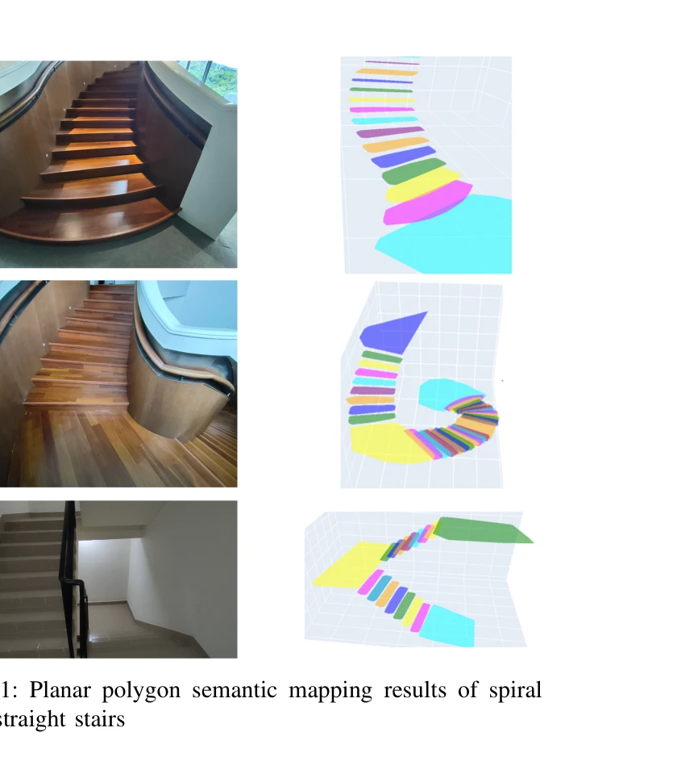
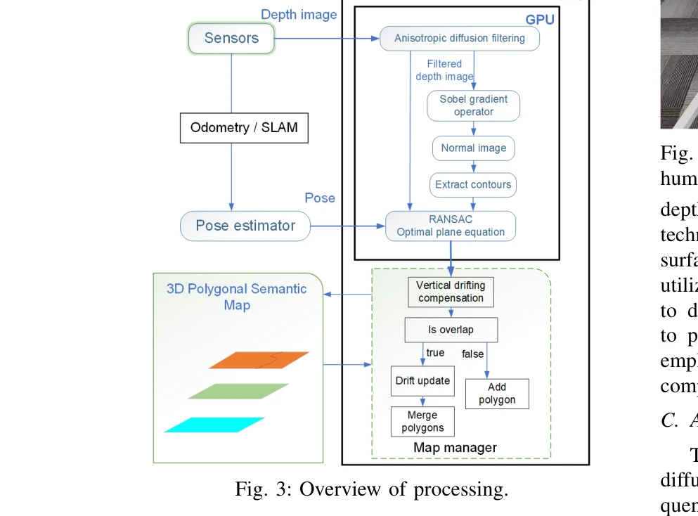

# Real-Time Polygonal Semantic Mapping for Humanoid Robot Stair Climbing

> **저자**: Teng Bin, Jianming Yao, Tin Lun Lam, Tianwei Zhang | **날짜**: 2024-11-04 | **URL**: [https://arxiv.org/abs/2411.01919](https://arxiv.org/abs/2411.01919)

---

## Essence

*Fig. 2: Overview of the Planar Polygonal Semantic Mapping System Framework. The system inputs are depth images and*

인형로봇의 계단 등반을 위해 GPU 가속 anisotropic diffusion 필터링과 RANSAC 기반 평면 추출을 활용한 실시간 다각형 의미 맵핑 알고리즘을 제시한다.

## Motivation

- **Known**: 컴퓨터 비전과 SLAM 분야에서 순서화된 깊이 이미지로부터의 평면 추출이 순서 없는 포인트 클라우드 방식보다 실시간 성능과 정확도 면에서 우수하다는 것이 알려져 있다.
- **Gap**: 현존 방법들은 필터링 기법이 평면 추출에 미치는 영향을 간과하여 시뮬레이션과 실제 센서 데이터 간 성능 차이가 발생하며, 인형로봇의 안정적 지지면 요구 사항을 충족시키지 못한다.
- **Why**: 인형로봇은 계단 등반 같은 복잡한 작업 수행 시 정확한 환경 인식과 신뢰성 있는 의미 맵이 필수적이며, 추출된 평면의 정규 벡터와 높이 정확도는 로봇의 안전성을 직접적으로 좌우한다.
- **Approach**: Anisotropic diffusion을 통해 깊이 이미지 노이즈를 감소시키면서 에지를 보존하고, GPU 병렬 처리로 RANSAC 기반 평면 추출을 가속화하여 30 Hz 이상의 실시간 처리를 달성한다.

## Achievement

*Fig. 1: Planar polygon semantic mapping results of spiral*

- **실시간 성능**: 30 Hz 이상의 프레임 처리율로 각 프레임을 센서 사이클 시간 내에 처리
- **노이즈 감소**: Anisotropic diffusion 필터링으로 그래디언트 점프로 인한 노이즈를 최소화하면서 에지 세부사항 보존
- **GPU 가속화**: Anisotropic diffusion과 RANSAC 기반 평면 추출 과정을 GPU 병렬 처리로 최적화
- **전역 일관성 맵**: 로봇 자세 추정을 활용한 다각형 병합 및 수직 방향 오도메트리 드리프트 보정
- **실제 센서 적용**: 시뮬레이션 대비 실제 깊이 카메라 데이터에서 성능 향상 입증

## How

*Fig. 3: Overview of processing.*

- 깊이 이미지를 GPU 메모리로 전송 후 anisotropic diffusion 필터링 적용
- Sobel 연산자를 이용해 정규 벡터 이미지 계산
- Canny 엣지 검출로 평면 윤곽 추출 및 다각형으로 간단히 표현
- RANSAC 알고리즘으로 각 다각형 영역에 최적의 평면 방정식 적합
- 오도메트리/SLAM 자세 추정을 활용하여 새로운 다각형을 기존 의미 맵에 병합
- 다각형 병합 시 수직 방향 오도메트리 드리프트 추정 및 보정

## Originality

- 기존 supervoxel 기반 평면 분할의 비효율성을 극복하기 위해 GPU 기반 anisotropic diffusion 필터링을 깊이 이미지에 직접 적용
- 실시간 처리 조건에서 정규 벡터 품질과 에지 보존의 균형을 맞추는 새로운 접근법
- 인형로봇의 가트 계획과 의미 맵을 통합한 시스템 구현
- 평면 추출 정확도 향상을 위한 수직 방향 드리프트 보정 메커니즘

## Limitation & Further Study

- Light-absorbing 표면에서 LiDAR 기반 Realsense L515 센서의 성능 저하
- Anisotropic diffusion의 반복 횟수와 확산 계수 선택에 대한 자동화된 파라미터 최적화 부재
- 수직 방향 드리프트 보정이 간단한 방식으로 구현되어 장시간 누적 오차 처리 미흡
- 동적 장애물과 빠르게 변화하는 환경에서의 맵 업데이트 전략 상세 설명 부족
- 다양한 지형과 계단 구조에 대한 광범위한 실험 데이터 제시 필요

## Evaluation

- Novelty: 4/5
- Technical Soundness: 4/5
- Significance: 4/5
- Clarity: 4/5
- Overall: 4/5

**총평**: 본 논문은 GPU 가속을 활용한 anisotropic diffusion 필터링과 RANSAC 기반 다각형 추출을 결합하여 인형로봇의 복잡한 지형 네비게이션을 위한 실시간 의미 맵핑 문제를 효과적으로 해결했다. 시뮬레이션과 실제 센서 데이터 간의 성능 격차를 줄이고 로봇의 안전한 보행 계획을 지원하는 실용적인 시스템으로서의 가치가 크다.
