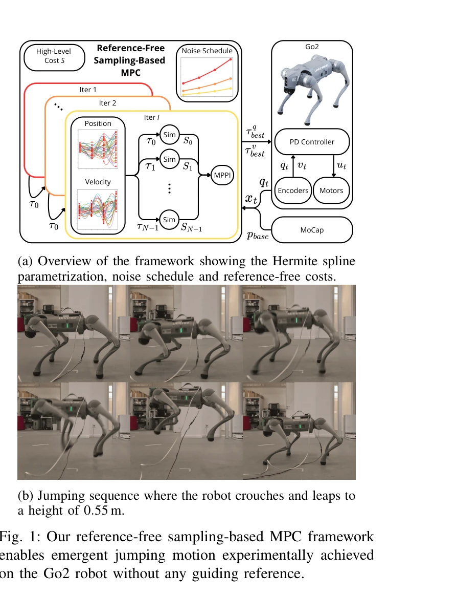
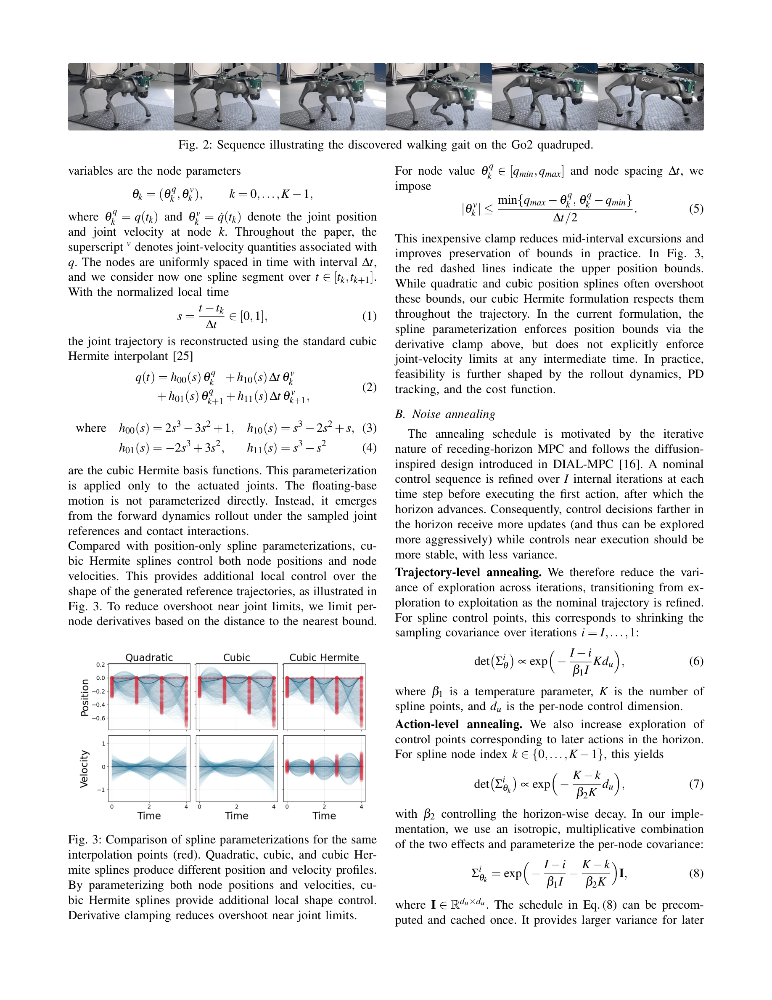

# Reference-Free Sampling-Based Model Predictive Control

> **저자**: Fabian Schramm, Pierre Fabre, Nicolas Perrin-Gilbert, Justin Carpentier | **날짜**: 2025-11-24 | **URL**: [https://arxiv.org/abs/2511.19204](https://arxiv.org/abs/2511.19204)

---

## Essence

*Fig. 1: Our reference-free sampling-based MPC framework*

본 논문은 사전정의된 보행 패턴이나 접촉 시퀀스 없이 MPPI 기반의 샘플링 기반 MPC 프레임워크를 제안하여 emergent locomotion을 실현한다. Cubic Hermite spline 파라미터화를 통해 위치와 속도 제어점을 동시에 최적화하여 실시간 CPU 기반 제어를 가능하게 한다.

## Motivation

- **Known**: MPPI는 비미분 최적화로 접촉이 많은 시나리오에 적합하며, 최근 DIAL-MPC와 같은 diffusion 기반 annealing 전략이 제안되었다. 하지만 기존 샘플링 기반 MPC 방법들은 Raibert heuristics나 사전정의된 보행 참조에 의존한다.
- **Gap**: 기존 방법들은 참조 보행 패턴이나 사전학습 없이 emergent locomotion을 발견하지 못하며, GPU 가속을 필요로 하거나 샘플 효율이 낮다. 또한 위치만 샘플링하는 기존 접근법은 동적 일관성이 부족하다.
- **Why**: 참조 없는 제어는 새로운 환경이나 작업에 대한 적응성과 일반화 가능성을 향상시키며, CPU 기반 실시간 제어는 로봇 하드웨어 접근성을 높이고 실제 적용 가능성을 증대시킨다.
- **Approach**: 본 논문은 cubic Hermite spline을 사용하여 위치와 속도 제어점을 동시에 샘플링하고, diffusion 기반 noise annealing 스케줄을 적용하며, PD 컨트롤러를 통해 추적한다. 고수준 목표에 기반한 참조 없는 비용 함수로 emergent 움직임을 발현시킨다.

## Achievement

*Fig. 2: Sequence illustrating the discovered walking gait on the Go2 quadruped.*

- **실시간 CPU 기반 제어**: 30개 샘플만으로 50 Hz 제어 주기를 달성하여 GPU 가속 제거
- **Emergent locomotion 발현**: 트로팅, 갤로핑, 수직 자세 유지, 점프 등 다양한 보행 패턴을 참조 없이 자동 발견
- **복잡한 행동 생성**: 백플립, 동적 악수(handstand) 밸런싱, 휴머노이드 보행 등 오프라인 사전학습 없이 시뮬레이션에서 구현
- **실제 로봇 검증**: Go2 사족보행 로봇에서 점프 0.55m 높이 달성 및 다양한 보행 패턴 실증

## How

*Fig. 3: Comparison of spline parameterizations for the same*

- Cubic Hermite spline 파라미터화: 각 노드에서 위치 θ^q_k와 속도 θ^v_k를 제어 변수로 설정하여 동적 일관성 강화
- MPPI 프레임워크: 현재 시퀀스에 Gaussian noise를 가하고 비용 평가 후 importance-weighted 평균으로 업데이트
- Diffusion 기반 annealing: 초기 반복에서 광범위 탐색을 수행하고 후기로 갈수록 세밀한 정제를 진행
- PD 컨트롤러 추적: 샘플링된 위치와 속도 참조를 PD 컨트롤러로 추적하여 토크 명령 생성
- 참조 없는 비용 함수: 위상 시계나 에어타임 페널티 대신 고수준 목표(속도, 높이 등)만을 비용에 반영
- 상태 예측 및 warm-starting: 최적화 단계 간 시간 일관성 유지로 안정성과 수렴성 향상
- Joint limit 제약: 노드 미분을 경계까지의 거리에 따라 제한하여 overshoot 방지

## Originality

- 위치와 속도 제어점을 동시에 샘플링하는 cubic Hermite spline 도입으로 기존 위치 전용 파라미터화 대비 탐색 공간 확장
- 참조 보행이나 사전정의된 접촉 시퀀스 완전 제거로 순수 고수준 목표 기반 emergent 행동 발현
- 30개 샘플로 실시간 CPU 기반 제어 달성하는 극도의 샘플 효율성 (기존 DIAL-MPC: 2048-4096 샘플)
- Contact-making/breaking 전략의 자동 적응으로 hand-crafted 접촉 규칙 제거

## Limitation & Further Study

- 현실 로봇에서는 점프만 검증되고 트로팅/갤로핑 등은 주로 시뮬레이션 결과이므로 sim-to-real 갭 존재
- 고수준 비용 함수 설계 여전히 필요하며, 비용 함수 변경에 따른 민감도 분석 부재
- 모든 실험이 정도 높은 물리 시뮬레이터(MuJoCo)에 의존하므로 실제 접촉 역학 오차의 영향 평가 필요
- 더 복잡한 형태(사족보행 이상의 자유도)에 대한 샘플 수 증가 추세 명확화 필요
- 불규칙한 지형이나 동적 장애물이 있는 환경에 대한 성능 평가 부재
- **후속 연구**: 온라인 모델 학습을 통한 동역학 불확실성 처리, 더 긴 수평선에 대한 계산 복잡도 최적화, 다양한 terrain에서의 강건성 평가

## Evaluation

- Novelty: 4/5
- Technical Soundness: 3/5
- Significance: 4/5
- Clarity: 4/5
- Overall: 4/5

**총평**: 본 논문은 참조 없는 emergent locomotion 발현, 극도의 샘플 효율성, 그리고 실시간 CPU 제어라는 세 가지 측면에서 우수한 기여를 제시한다. Cubic Hermite spline 파라미터화와 diffusion annealing의 조합은 창의적이며, Go2 로봇의 실제 검증은 신뢰성을 높인다. 다만 현실 로봇 검증의 범위 확대와 sim-to-real 갭 분석이 필요하다.