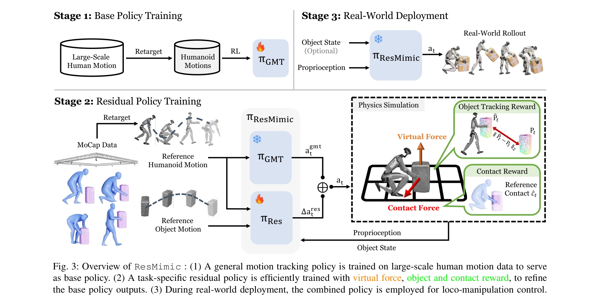
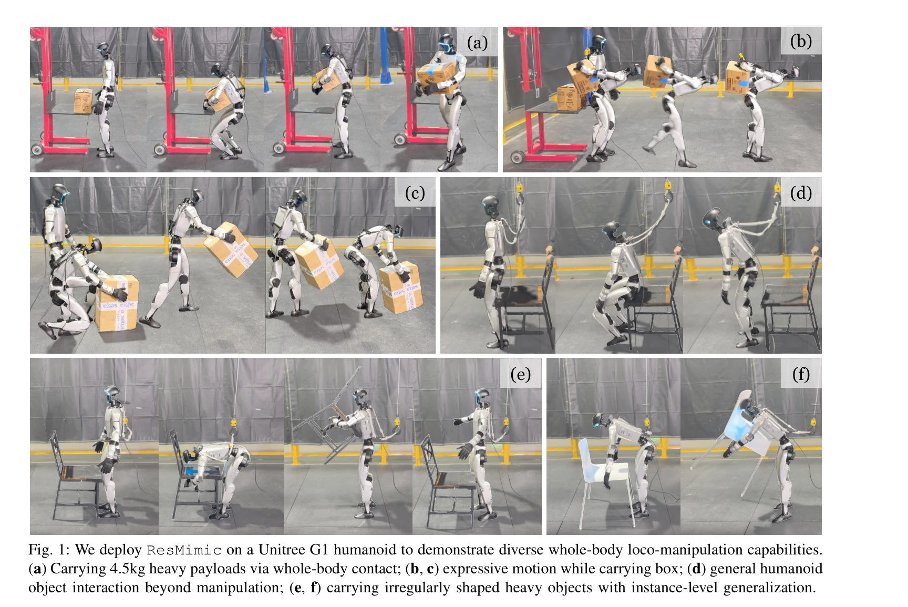

# ResMimic: From General Motion Tracking to Humanoid Whole-body Loco-Manipulation via Residual Learning

> **저자**: Siheng Zhao, Yanjie Ze, Yue Wang, C. Karen Liu, Pieter Abbeel, Guanya Shi, Rocky Duan | **날짜**: 2025-10-08 | **DOI**: [10.48550/arXiv.2510.05070](https://doi.org/10.48550/arXiv.2510.05070)

---

## Essence

*Fig. 3: Overview of ResMimic : (1) A general motion tracking policy is trained on large-scale human motion data to serve*

ResMimic는 일반 모션 추적(GMT) 정책을 기반으로 효율적인 잔차 정책(residual policy)을 학습하여 인간형 로봇의 정밀한 전신 이동-조작 능력을 실현하는 이단계 잔차학습 프레임워크이다.

## Motivation

- **Known**: 일반 모션 추적(GMT) 정책들은 대규모 인간 모션 데이터로 훈련되어 다양한 인간 동작을 재현할 수 있으나, 대상 객체에 대한 인식이 부족하여 조작 정밀도가 낮다.
- **Gap**: 기존 인간형 이동-조작 연구들은 모두 작업별 보상 설계에 의존하거나 단계별 제어로 제한되어 통합된 효율적 프레임워크가 없다.
- **Why**: 인간형 로봇의 전신 이동-조작 능력은 일상 서비스 및 창고 자동화 등 실제 응용에서 핵심이 되며, 기존 로봇(사족 또는 바퀴 매니퓰레이터)로는 달성할 수 없는 표현력을 제공한다.
- **Approach**: 대규모 인간 모션 데이터로 훈련한 GMT 정책을 견고한 기초로 사용하고, 이 위에 작업별 잔차 정책을 학습하여 객체 추적 및 상호작용 정밀도를 개선한다.

## Achievement

*Fig. 1: We deploy ResMimic on a Unitree G1 humanoid to demonstrate diverse whole-body loco-manipulation capabilities.*

- **이단계 잔차학습 프레임워크**: 사전훈련된 GMT 정책과 작업별 정밀 잔차 정책의 결합으로 효율적이고 정확한 이동-조작을 실현
- **맞춤형 보상 설계**: point-cloud 기반 객체 추적 보상, 신체-객체 접촉 보상, curriculum 기반 가상 객체 제어기로 훈련 효율성 및 sim-to-real 전이 향상
- **광범위한 평가**: 시뮬레이션과 실제 Unitree G1 인간형 로봇에서 모션 추적, 객체 추적, 작업 성공률, 훈련 효율성, 견고성 및 일반화 측면의 실질적 개선 입증
- **연구 가속 자산 공개**: GPU 가속 시뮬레이션 인프라, sim-to-sim 평가 프로토타입, 모션 데이터 공개 예정

## How

*Fig. 3: Overview of ResMimic : (1) A general motion tracking policy is trained on large-scale human motion data to serve*

- Stage I: 대규모 인간-전용 모션 캡처 데이터로 GMT 정책(πGMT)을 훈련하여 인간형 전신 행동의 견고한 기초 확보
- Stage II: 훈련된 GMT 정책의 출력을 개선하는 작업별 잔차 정책(πRes)을 학습하여 로봇 상태(sr_t), 객체 상태(so_t), 참조 모션(ŝr_t), 객체 목표 상태(ŝo_t)를 조건으로 미세 조정
- 최종 행동은 a_t = agmt_t + Δares_t로 계산되어 기본 모션에 보정 신호를 더함
- Point-cloud 기반 객체 추적 보상으로 부드러운 최적화 달성
- Contact reward로 인간형-객체 상호작용의 정확성 명시적 유도
- Curriculum 기반 가상 객체 제어기로 초기 훈련 안정화

## Originality

- 기존 잔차학습이 손으로 설계한 정책이나 MPC를 개선하던 반면, 대규모 사전훈련된 GMT 정책을 기초로 하는 새로운 잔차학습 패러다임 제시
- 인간형 로봇 제어에서 기초 모델 사전훈련-미세조정 패러다임을 처음 체계적으로 탐구
- 전신 이동-조작에 특화된 point-cloud 기반 보상, contact 기반 보상, curriculum 제어기의 혁신적 설계
- 단순 조작을 넘어 4.5kg 무거운 하중 운반, 비규칙 형상 객체 다루기 등 다양한 전신 접촉을 포함한 복합 이동-조작 시연

## Limitation & Further Study

- GMT 정책의 사전훈련 데이터 규모 및 다양성에 의존적이므로, 훈련 데이터의 품질이 최종 성능을 제약할 수 있음
- 객체 추적 보상이 point-cloud 기반이어서 센서 노이즈나 폐색(occlusion) 상황에서의 강건성이 검증되지 않음
- 현재 평가는 Unitree G1 단일 플랫폼에서만 수행되어 다른 인간형 로봇 구조로의 일반화 미검증
- 후속 연구: 센서 노이즈 및 폐색에 대한 강건성 개선, 다양한 인간형 로봇 플랫폼으로의 확장, 더욱 복잡한 다중-객체 조작 시나리오로의 확대

## Evaluation

- Novelty: 4/5
- Technical Soundness: 3/5
- Significance: 4/5
- Clarity: 4/5
- Overall: 4/5

**총평**: ResMimic는 대규모 사전훈련 GMT 정책과 효율적 잔차 정책의 결합으로 인간형 로봇의 정밀한 전신 이동-조작을 실현한 혁신적 프레임워크이며, 맞춤형 보상 설계와 광범위한 실증으로 인간형 로봇 제어 분야에 중요한 기여를 한다.