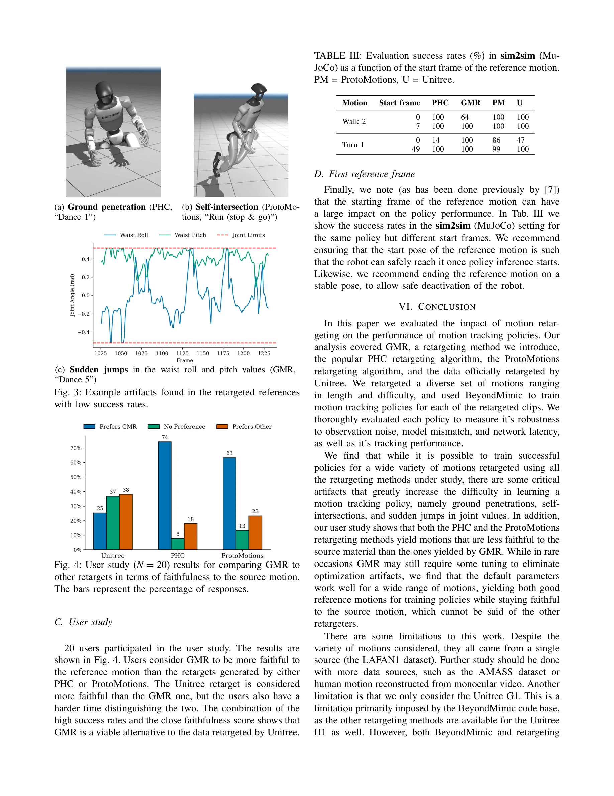

# Retargeting Matters: General Motion Retargeting for Humanoid Motion Tracking

> **저자**: Joao Pedro Araujo, Yanjie Ze, Pei Xu, Jiajun Wu, C. Karen Liu | **날짜**: 2025-10-02 | **DOI**: [10.48550/arXiv.2510.02252](https://doi.org/10.48550/arXiv.2510.02252)

---

## Essence

*Fig. 2: General Motion Retargeting (GMR) Pipeline.*

본 논문은 휴머노이드 로봇의 모션 추적 성능에 미치는 리타겟팅 품질의 영향을 체계적으로 평가하고, 기존 리타겟팅 방법의 문제점을 해결하는 General Motion Retargeting (GMR)을 제안한다.

## Motivation

- **Known**: 인간 모션 데이터를 휴머노이드 로봇에 적용하기 위해 리타겟팅이 필수적이며, PHC와 ProtoMotions 등의 기존 방법들이 널리 사용되고 있다. 현재 접근법은 광범위한 보상 함수 엔지니어링과 도메인 랜더마이제이션을 통해 리타겟팅 아티팩트를 보정한다.
- **Gap**: 기존 연구들은 리타겟팅 품질이 정책 성능에 미치는 영향을 체계적으로 평가하지 않았으며, 과도한 보상 튜닝 없이 리타겟팅 아티팩트(발 미끄러짐, 자기 관통, 물리적으로 부가능한 모션)가 정책 학습에 어떻게 영향을 미치는지 명확히 규명되지 않았다.
- **Why**: 휴머노이드 로봇의 실제 배치 성능과 안정성은 리타겟팅된 참조 궤적의 품질에 크게 의존하므로, 리타겟팅 방법의 체계적 비교 평가와 개선은 텔레오퍼레이션 및 계층적 제어 시스템 구축에 필수적이다.
- **Approach**: BeyondMimic을 사용한 공정한 정책 학습 환경에서 GMR, PHC, ProtoMotions 및 Unitree 폐쇄형 데이터셋을 LAFAN1 데이터에 대해 비교 평가하고, 사용자 연구를 통해 지각적 충실도를 검증한다. GMR은 비균일 국소 스케일링과 2단계 최적화를 통해 기존 방법의 스케일링 문제를 해결한다.

## Achievement

*Fig. 4: User study (N = 20) results for comparing GMR to*

- **General Motion Retargeting (GMR) 방법 제안**: 비균일 국소 스케일링 및 2단계 최적화를 통해 발 관통, 자기 교차, 속도 스파이크 등의 아티팩트를 효과적으로 제거
- **포괄적 평가 연구**: 센서 노이즈, 모델 파라미터 오차, 네트워크 지연을 포함한 실제 조건에서 리타겟팅 품질의 영향을 정량적으로 입증
- **성능 개선**: GMR이 기존 오픈소스 방법들을 추적 성능과 원본 모션 충실도 모두에서 능가하며, 폐쇄형 기준선과 유사한 수준의 성공률 달성
- **초기 프레임 민감도 발견**: 참조 모션의 초기 프레임이 리타겟팅 방법과 무관하게 정책의 성공 여부에 큰 영향을 미침을 규명

## How

*Fig. 2: General Motion Retargeting (GMR) Pipeline.*

- LAFAN1 데이터셋에서 발 접촉만 포함하는 21개의 다양한 모션 시퀀스(5초~2분) 선정
- GMR: 인간 신체를 SMPL 모델로 표현하고 비균일 국소 스케일링을 적용한 후, 2단계 최적화(위치 + 방향 매칭)로 휴머노이드 모션 계산
- BeyondMimic 프레임워크를 사용하여 보상 함수 튜닝 없이 단일 궤적 정책 학습
- 각 정책을 다중 조건(센서 노이즈, 모델 파라미터 불확실성, 네트워크 지연)에서 반복 평가
- 엄격한 성공 기준(전체 모션 완료)을 적용하여 성공률 측정
- 20명의 참여자를 통해 리타겟팅된 모션의 지각적 충실도 사용자 연구 실시

## Originality

- 리타겟팅 품질이 RL 정책 성능에 미치는 영향을 체계적으로 분리 평가한 최초의 연구
- 과도한 보상 엔지니어링 없이 리타겟팅 아티팩트의 실제 영향을 정량화
- 센서 노이즈, 모델 불확실성, 네트워크 지연 등 실제 배치 조건을 종합적으로 고려한 평가 환경 구축
- 비균일 국소 스케일링을 통한 간단하면서도 효과적인 GMR 방법론 제시

## Limitation & Further Study

- 발 접촉 이외의 손 제약 조건을 포함하는 모션에 대한 평가 미실시
- 단일 휴머노이드 플랫폼(Unitree H1)에 대해서만 평가되어 다양한 로봇 형태로의 일반화 가능성 불명확
- GMR 방법이 스케일링 문제를 해결하지만, 근본적인 토폴로지 불일치 문제에 대한 완전한 해결책은 제시하지 못함
- **후속 연구**: 손 제약, 환경 상호작용을 포함하는 복잡한 모션으로의 확장; 다양한 로봇 형태에 대한 일반화 방법론 개발; 실제 로봇 실험을 통한 시뮬레이션-현실 갭 검증

## Evaluation

- Novelty: 4/5
- Technical Soundness: 3/5
- Significance: 4/5
- Clarity: 4/5
- Overall: 4/5

**총평**: 본 논문은 휴머노이드 모션 추적에서 간과되어온 리타겟팅 품질의 중요성을 실증적으로 규명하고, 체계적인 평가 방법론과 개선된 GMR 방법을 제시함으로써 휴머노이드 제어 분야에 중요한 기여를 한다.