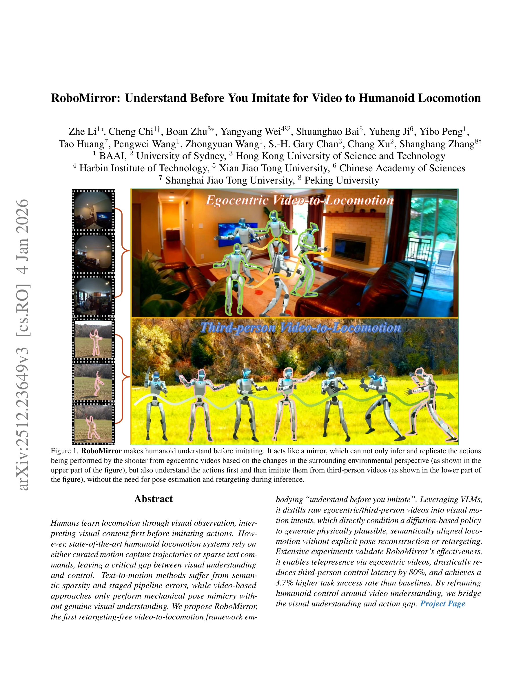
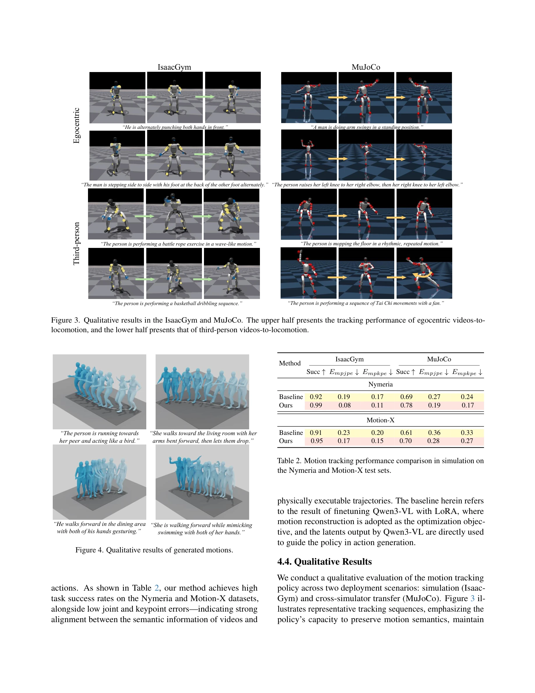
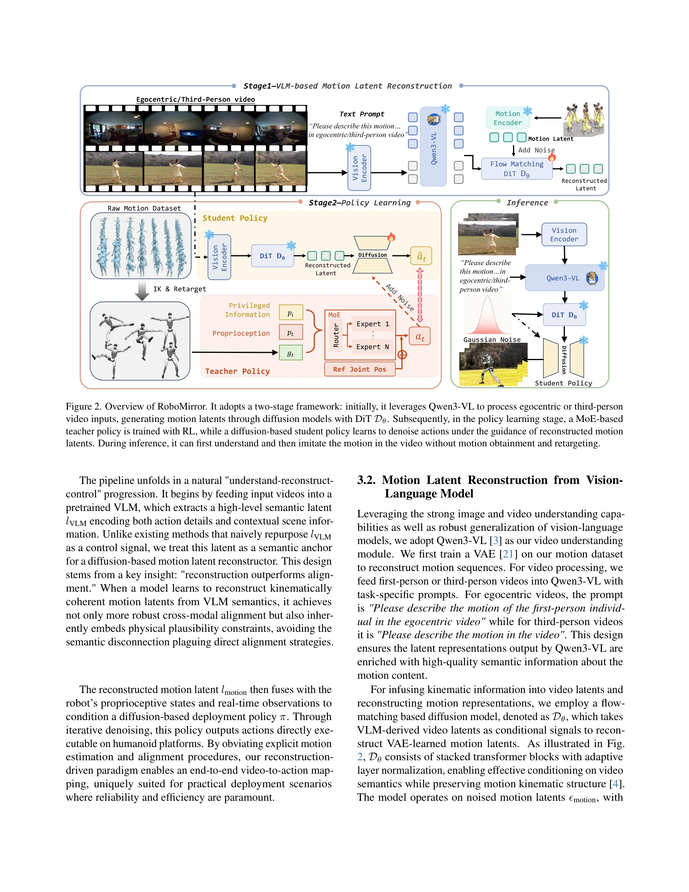

# RoboMirror: Understand Before You Imitate for Video to Humanoid Locomotion

> **저자**: Zhe Li, Cheng Chi, Boan Zhu, Yangyang Wei, Shuanghao Bai, Yuheng Ji, Yibo Peng, Tao Huang, Pengwei Wang, Zhongyuan Wang, S. -H. Gary Chan, Chang Xu, Shanghang Zhang | **날짜**: 2025-12-29 | **URL**: [https://arxiv.org/abs/2512.23649](https://arxiv.org/abs/2512.23649)

---

## Essence

*Figure 1. RoboMirror makes humanoid understand before imitating. It acts like a mirror, which can not only infer and rep*

RoboMirror는 VLM을 활용하여 비디오에서 visual motion intent를 추출하고 diffusion-based policy로 직접 인간형 로봇의 보행을 제어하는 retargeting-free 프레임워크이다. 기존의 pose estimation-retargeting 파이프라인을 우회하고 egocentric/third-person 비디오로부터 시맨틱하게 정렬된 보행을 생성한다.

## Motivation

- **Known**: 기존 인간형 로봇 보행 제어는 MoCap 데이터, 텍스트 명령, 또는 pose estimation 기반 접근법에 의존한다. 이들은 각각 시각적 인식을 우회하거나 시맨틱 희소성 또는 kinematic mimicry의 취약성 문제를 가진다.
- **Gap**: 현재 비디오 기반 방법들은 저수준 운동학 추적에만 집중하여 고수준의 시각적 의도 이해를 달성하지 못한다. 비디오의 풍부한 정보를 활용하면서도 물리적 타당성과 시맨틱 정렬을 동시에 보장하는 end-to-end 방식이 부재하다.
- **Why**: 인간은 시각 관찰을 통해 먼저 이해한 후 행동을 모방하는데, 이 자연스러운 패러다임을 로봇에 구현하면 텔레프레젠스, 낮은 지연시간, 높은 성공률을 달성할 수 있다. 비디오는 text나 pose보다 훨씬 정보량이 많아 더 정확한 제어가 가능하다.
- **Approach**: VLM을 사용하여 raw 비디오로부터 visual latent를 추출하고, 이를 motion latent로 매핑하는 연결층을 학습한다. 학습된 motion latent가 diffusion-based locomotion policy의 유일한 조건 신호로 작용하여 pose reconstruction 없이 직접 행동을 생성한다.

## Achievement

*Figure 3. Qualitative results in the IsaacGym and MuJoCo. The upper half presents the tracking performance of egocentric*

- **Retargeting-free 아키텍처**: pose estimation과 retargeting 파이프라인을 완전히 제거하여 inference 지연시간을 9.22초에서 1.84초로 80% 단축
- **향상된 제어 성능**: 기존 baseline 대비 3.7% 절대값 task success rate 향상 및 낮은 tracking error 달성
- **Egocentric 비디오 지원**: 명시적 pose 감시 없이 first-person 비디오로부터 강건한 보행 생성 (기존 파이프라인 실패 영역)
- **VLM 통합**: humanoid 제어 루프에 VLM을 성공적으로 도입하여 hand manipulation, low-friction teleoperation 등 확장 가능성 제시
- **시맨틱 정렬**: visual understanding을 기반으로 물리적으로 타당하면서도 의미론적으로 정렬된 보행 합성

## How

*Figure 2. Overview of RoboMirror. It adopts a two-stage framework: initially, it leverages Qwen3-VL to process egocentri*

- VLM (예: vision transformer 기반)으로 egocentric/third-person 비디오에서 visual latent representation 추출
- visual latent를 motion latent space로 매핑하는 재구성(reconstruction) 모듈 학습 (두 latent space 사이의 semantic bridging)
- 학습된 motion latent를 diffusion-based policy의 조건 신호로 사용하여 물리적으로 타당한 행동 생성
- IsaacGym과 MuJoCo 환경에서 multi-skill 보행 정책 훈련
- Egocentric 비디오: 환경 관점 변화로 first-person action 추론 (pose 감시 불필요)
- Third-person 비디오: 명시적 이해 후 retargeting 없이 직접 모방

## Originality

- **"이해 후 모방(understand-then-act)" 패러다임**: 기존 kinematic mimicry를 semantic understanding으로 전환하는 근본적 관점 전환
- **VLM-motion latent 매핑**: visual 및 motion 도메인을 latent space에서 직접 연결하는 novel 아키텍처
- **Retargeting-free 프레임워크**: pose estimation 단계를 완전히 우회하는 end-to-end 학습 방식 (기존 연구들은 retargeting 개선에만 집중)
- **Egocentric 비디오 처리**: pose 감시 없이 first-person 관점에서 보행을 생성하는 새로운 능력
- **단일 diffusion policy**: 여러 조건 신호(egocentric/third-person, 다양한 보행 스타일)를 통합 처리

## Limitation & Further Study

- **VLM 의존성**: visual understanding이 VLM 성능에 전적으로 의존하므로, VLM의 오류나 hallucination이 직접 제어 오류로 전파될 수 있음
- **Sim-to-real 갭**: 실제 로봇 환경에서의 성능 검증 부재, 모의 환경 내 results만 제시
- **Latent space 학습**: visual-to-motion latent 매핑의 수렴성, 안정성, 일반화 능력에 대한 상세 분석 부족
- **비디오 품질 의존성**: 손상되거나 저품질 비디오에 대한 강건성 평가 미흡
- **후속 연구 방향**: (1) 실제 로봇 플랫폼에서의 검증, (2) dynamic environment에서의 적응 학습, (3) multi-modal 조건화(텍스트+비디오) 통합, (4) fine-grained manipulation 확장 시 latent 표현력 검증

## Evaluation

- Novelty: 4/5
- Technical Soundness: 3/5
- Significance: 4/5
- Clarity: 4/5
- Overall: 4/5

**총평**: RoboMirror는 인간형 로봇 제어에 시각적 이해라는 자연스러운 패러다임을 도입하고, retargeting-free 아키텍처로 지연시간을 획기적으로 단축하면서 성능을 향상시킨 의미 있는 기여이다. 다만 sim-to-real 검증 부재와 VLM 의존성 문제는 실용화를 위해 추가 연구가 필요함을 시사한다.
