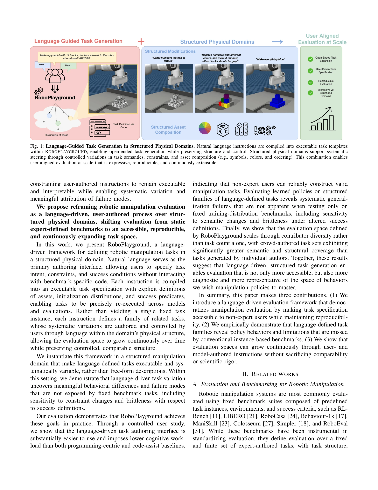
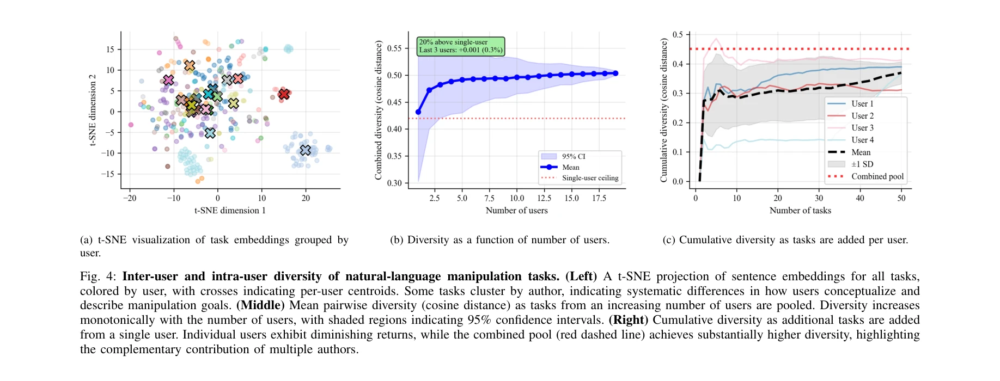
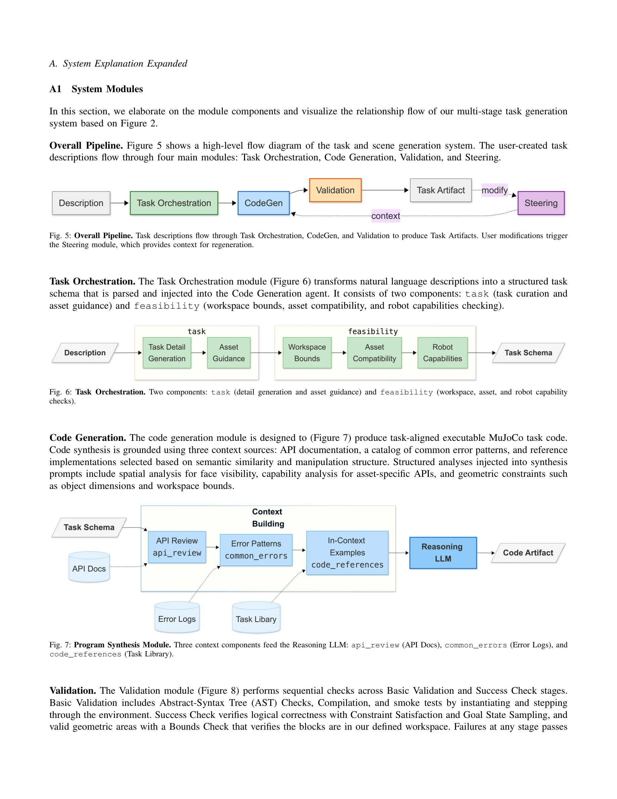

# RoboPlayground: 구조화된 물리 도메인을 통한 로봇 평가 민주화

> **저자**:  | **날짜**: 2026-04-06 | **URL**: [https://arxiv.org/abs/2604.05226](https://arxiv.org/abs/2604.05226)

---

## Essence

*Fig. 1: Language-Guided Task Generation in Structured Physical Domains. Natural language instructions are compiled into *

자연어로 로봇 조작 작업을 정의하고 재현 가능한 작업 명세로 컴파일하는 RoboPlayground 프레임워크를 제안하며, 고정 벤치마크에서 드러나지 않는 일반화 실패를 언어 기반 작업 변형을 통해 발견한다.

## Motivation

- **Known**: 로봇 조작 시스템은 소수의 전문가가 설계한 고정 벤치마크(RLBench, LIBERO, RoboCasa 등)로 평가되어 왔으나, 이는 평가 권한을 집중화하고 사용자가 작업을 정의하거나 수정할 수 없는 한계가 있다.
- **Gap**: 기존 벤치마크는 자연어를 문서화나 정책 입력으로만 사용하며, 사용자가 작업 의도, 제약, 성공 기준을 재현 가능하게 변형하고 탐색할 수 없다. 또한 고정된 작업 인스턴스로는 정책의 일반화 실패를 체계적으로 드러낼 수 없다.
- **Why**: 평가 민주화와 접근성 향상으로 더 많은 사용자가 로봇 평가에 참여할 수 있으며, 구조화된 작업 변형을 통해 정책의 실제 약점을 발견할 수 있기 때문이다.
- **Approach**: 구조화된 물리 도메인 내에서 자연어 명령어를 명시적인 자산 정의, 초기화 분포, 성공 술어를 갖는 실행 가능한 작업 명세로 컴파일한다. 각 명령어는 의미적·행동적 변형을 제어하면서도 실행 가능성을 유지하는 관련 작업 family를 정의한다.

## Achievement

*Fig. 4: Inter-user and intra-user diversity of natural-language manipulation tasks. (Left) A t-SNE projection of sentenc*

- **프레임워크 개발**: 자연어 기반 작업 저작이 프로그래밍 기반 및 code-assist 기반 접근법보다 인지 부하가 낮고 사용하기 쉬움을 사용자 연구로 입증
- **일반화 실패 발견**: 언어 정의 작업 family에 대한 평가로 제약 변화와 성공 정의 변경에 대한 민감성을 포함하여 고정 벤치마크에서 드러나지 않는 정책의 brittleness 발견
- **확장성 검증**: 기여자 다양성이 작업 개수보다 평가 공간의 규모를 결정하므로, crowd-authored 작업이 개별 저자의 작업보다 의미적·구조적 커버리지가 높음을 입증

## How

*Fig. 5: Overall Pipeline. Task descriptions flow through Task Orchestration, CodeGen, and Validation to produce Task Art*

- 구조화된 블록 조작 도메인 구현으로 언어 정의 작업의 실행 가능성과 체계적 변동성 보장
- 자연어 명령어를 파싱하여 asset definitions, initialization distributions, success predicates로 구성된 task specification으로 컴파일
- 사용자 연구를 통해 언어 기반 인터페이스의 사용성과 인지 부하 평가
- 학습된 정책을 구조화된 작업 family에 대해 평가하여 generalization failure 분석
- crowd-sourced 기여를 통해 작업 다양성의 확장 양식 조사

## Originality

- 기존 벤치마크와 달리 자연언어를 executable task specification의 핵심 요소로 통합하여 평가의 민주화 달성
- CLEVR(structured generation)의 제어된 작업 생성과 Dynabench(dynamic benchmarking)의 참여형 메커니즘을 로봇 평가에 결합
- task family 개념 도입으로 의미적 및 행동적 변형을 체계적으로 제어하면서도 비교 가능성 유지
- 평가 확장이 기여자 다양성에 의존한다는 발견으로 crowdsourced evaluation의 새로운 관점 제시

## Limitation & Further Study

- 현재 structured block manipulation 도메인으로만 구현되어 복잡한 다객체 상호작용, 연속 제어, 실제 로봇 환경으로의 일반화 미검증
- 자연언어 컴파일 과정에서 ambiguity 또는 불일치한 명령어 처리 방식 미상세
- 큰 규모 crowd-sourced 평가에서의 품질 제어, task 검증, 중복 제거 메커니즘 부재
- LLM 기반 task generation과의 상호작용 미검토 (GenSim, RoboGen 등과의 비교 부족)
- 후속 연구로 실물 로봇에 적용, 다양한 도메인 확장, 자동 품질 검증 메커니즘 개발 필요

## Evaluation

- Novelty: 4/5
- Technical Soundness: 3/5
- Significance: 4/5
- Clarity: 4/5
- Overall: 4/5

**총평**: RoboPlayground는 로봇 평가의 민주화와 접근성을 크게 향상시키는 혁신적 접근법으로, 언어 기반 구조화된 작업 변형을 통해 고정 벤치마크가 놓치는 정책의 실제 약점을 드러낸다는 점에서 중요한 기여다. 다만 도메인 제한과 대규모 crowd-sourced 평가의 품질 관리가 실무 적용의 과제다.
